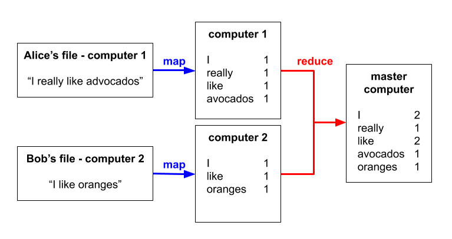
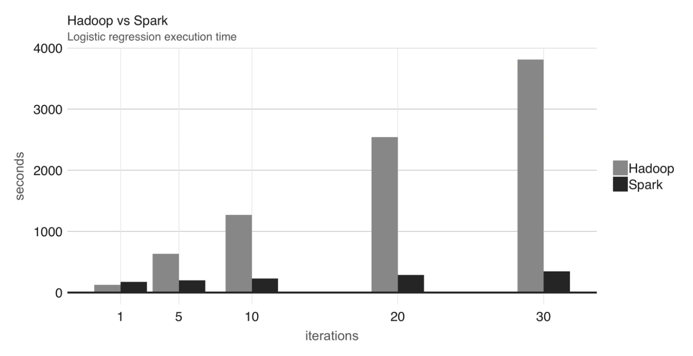
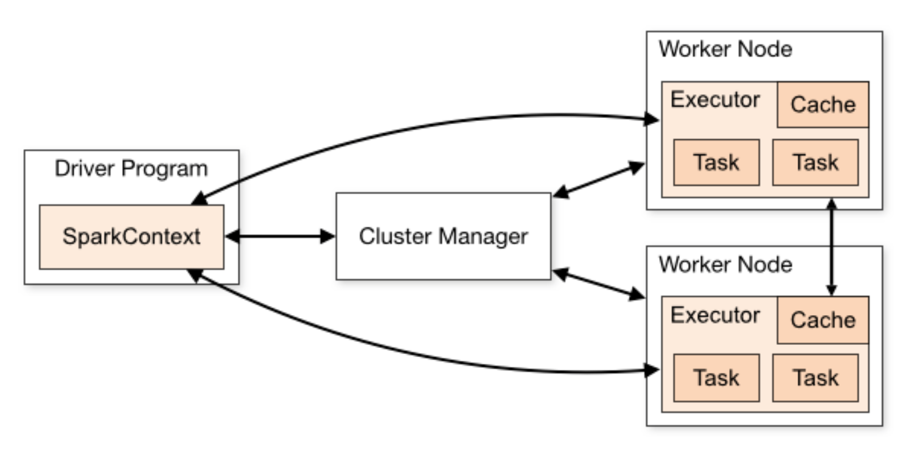
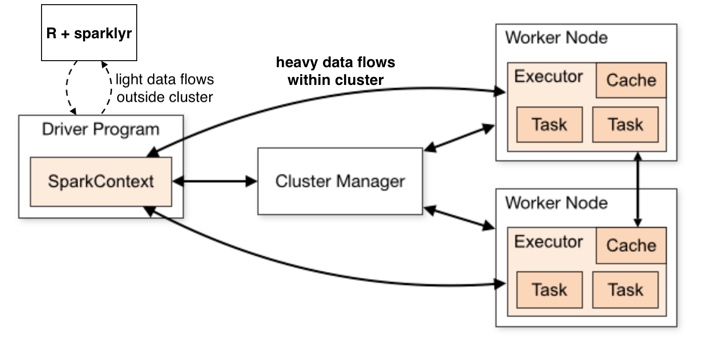

# Learning Objectives

* Understand key developments in the history of distributed computing for data analysis
* Know the main components, interactions and architecture of `Spark`
* Understand the `Spark` - `R` workflow

**Lesson Duration: 45 mins**

# History

* *Google file system* (2003) - data required to facilitate web searching could not be held on a single computer, and so a system was developed to split the data into multiple files and spread over a number of computers.

* *MapReduce* (2004) - a follow-up paper described the technology for performing operations across the Google file system. This technology came to be known as 'MapReduce', and an example is shown below of how it operates for a word counting problem in which text files are distributed over numerous computers. Google used this system to implement their 'PageRank' algorithm in which a site is ranked by the number of other sites linking to it and the rank of each of those linking sites.

```{r, echo=FALSE, fig.align="center", fig.cap="**Fig. 1.** MapReduce for a word counting problem", out.width = '80%'}

```

* *Hadoop* (2006) - a Yahoo team combined the Google file system and MapReduce into a single open-source project called '`Hadoop`'. The Google file system was renamed the *Hadoop Distributed File System* (HDFS) and now `Hadoop` MapReduce started to be used for numerous applications beyond data analysis in support of web searching.

* *Hive* (2008) - writing MapReduce code proved to be a tedious affair, so a Facebook team developed 'Hive', which brought a SQL-based interface to performing operations on `Hadoop`. This further opened Hadoop applications to data analysts fluent in SQL. Hive is properly viewed as a *data warehouse*, as it can consolidate and integrate multiple different sources of data.

* *`Spark`* (2009) - `Spark` originally started as an academic research project at The University of California Berkeley with the aim of improving MapReduce in two ways:
  - adding extra operations to make working with MapReduce easier
  - holding as much data as possible in memory, as opposed to Hadoop's normal practice where data is held on-disk. This can greatly improve `Spark`'s performance relative to `Hadoop`, for example, see the plot below comparing logistic regression performance in `Hadoop` and `Spark`
  
```{r, echo=FALSE, fig.align="center", fig.cap="**Fig. 2.** Hadoop and Spark performance for multiple iterations of logistic regression ('Mastering Spark with R', Luraschi et al. 2019)", out.width = '80%'}

```

`Spark` code is also much more concise than the comparable code in MapReduce (e.g. the word counting problem above requires approximately 50 lines of MapReduce code and 2 lines of `Spark` code). `Spark` was open-sourced in 2010 and donated to the Apache Foundation in 2013 under the `Apache 2.0 licence`, which enables free distribution, free use and free modification.

`Spark` is written in `Scala`, which is a general purpose programming language designed to fix many of the criticisms of `Java`, upon which it is based. `Scala` runs on top of the `Java` runtime environment, and so `Java` must be installed to use `Scala`. Specifically for `Spark 2.4.5` which is the current stable version (May 2020), you must have `Java 8` installed on any machine (master or slave) that will be running `Spark`.

# Characteristics of ``Spark``

`Spark` is described as a *'unified analytics engine for large-scale data processing'* on `spark.apache.org`, which is a reasonable and broad definition. The 'Analytics' part is clear enough from the course so far. 'Unified' means it supports many cluster communication technologies and can connect to multiple types of data source. 'Engine' for the reason that it runs generic code: you can write whatever you want in `Spark`, and also for the reason that it is efficient. 'Large-scale' indicates a *parallel computing* approach (also known as *distributed computing*), where data and computations are spread out over multiple computers. 

'Big data' really represents at least two problems rolled into one: the data is big enough that it cannot fit on a single computer (this is a true 'big data' problem), or the data can fit on a single computer, but processing it takes too long (this we can call a 'big compute') problem. `Spark` can help you solve both these problems, and can also deal with data arriving at high speed and requiring quick processing ('velocity') and data of different types from multiple different sources ('variety'). 

Here is the overall structure of `Spark`:

```{r, echo=FALSE, fig.align="center", fig.cap="**Fig. 3.** Spark components and technologies it interacts with", out.width = '80%'}
knitr::include_graphics("images/Spark_components.png")
```

<br>
<blockquote class='task'>
**Task - 15 mins**

Split into small groups or tackle this individually, depending on class size. Look at the `Spark` components and technologies it interacts with above, choose one, research it for 10 mins and write a few sentences on what it is/does. Afterward, share your findings with the rest of the class 

</blockquote>
<br>

# How `Spark` works

The diagram below (from the `Spark 2.4.5` documentation) shows the basic setup of `Spark` running in cluster mode.

```{r, echo=FALSE, fig.align="center", fig.cap="**Fig. 4.** Spark architecture (from spark.apache.org)", out.width = '80%'}

```

* The `Driver Program` runs on one computer in the cluster, often the 'master node' (we often call computers in clusters 'nodes'), and is responsible for figuring out which jobs need to be run by the cluster and in which order. It passes instructions to...
* The `Cluster Manager`, which is a process again often running on the master node, that receives incoming jobs from the `Driver Program` and decides how to split these up to...
* Each `Worker Node` (also sometimes called a `Slave Node`), which typically runs a `Spark Executor` program and has its own share of any data held in `Spark` (remember that HDFS is a *distributed* file system). Each `Worker Node` runs any jobs it's told to by the `Cluster Manager`. There may be some communication between different `Worker Node`s, but such communication is minimised as it is typically slow. On job completion, the worker node passes results back up to the `Cluster Manager`, which assembles them and passes them back to the `Driver Program`.

The `Cluster Manager` can be any one of a variety of cluster management software (e.g. YARN, Mesos, Kubernetes), or `Spark` can use its own cluster manager software if no other option is available (this is called *'standalone mode'*, which makes it sound like there is only one computer and not a cluster, but the name is a bit misleading, standalone mode involves parallel computing).

# `R` and `sparklyr` and `Python` and `pyspark`, oh my...

How does `R` fit into this picture? Well, if we wanted to, we could write our analysis code in `Scala` and run it directly via the `Driver Program`, but few data analysts or data scientists are fluent in `Scala` (although some data engineers are). 

Enter `sparklyr` (and `pyspark`)! These are `R` (and `Python`) **interfaces** to `Spark`. You can think of these packages as translating `R` or `Python` code into `Scala` code to run in the `Driver Program`, letting you stick to using `R` or `Python` as far as possible to analyse your data, but using the power of `Spark` in the background. I like to think of this situation as akin to a huge powerful ship (`Spark`) that is controlled from a tiny bridge (`R` or `Python`).

In the case of `R`, `sparklyr` is the interface of choice - it can convert standard `tidyverse` workflows into the `Spark` equivalents, converting `dplyr`-style operations into `Spark SQL` statements. It also has nice features to get `Spark` up and running on your system, that we are going to be using shortly! We can either work from `RStudio` on our own machine, which will involve transferring data back and forth from the cluster's master node to our machine (this may have a performance penalty), or run `RStudio Server` on the cluster master, and remote connect into it (typically in a web browser).

The typical workflow is to **push all heavy computations to `Spark`**. When `R` receives data from `Spark`, ideally we would like this to be as small as possible (e.g. summarised data), rather than trying to handle transfers of potentially huge amounts of data between the cluster and our machine. Remember this constant refrain: **'let `Spark` handle the big data'**. Adding `sparklyr` into the picture above, our ideal situation would be


```{r, echo=FALSE, fig.align="center", fig.cap="**Fig. 5.** Spark architecture with sparklyr (from spark.apache.org)", out.width = '80%'}

```


# Installing `Java 8`, `sparklyr` and `Spark 2.4.5`

The `sparklyr` package makes installing `Spark` and `Scala` really easy, but first we need to make sure that `Java 8` is installed on your machine.

To be honest, `Java` versioning is a bit of a mess, and if you install multiple `Java` versions on your computer it can be difficult to select the version to use. So we recommend removing `Java 11` if you find it on your system.

* **Check `Java` version**. In the `RStudio` console, run the command `system("java -version")`. 
  - If you see nothing, an error, or a prompt to 'install a JDK', that's fine as it means no `Java` is currently installed - skip to the **Install `Java 8`** point. 
  - If you see a `Java` version that starts with '1.8', that's fine too, as it means `Java 8` is installed - skip to the **Install `sparklyr`** point. 
  - If you see a `Java` version higher than '1.8' you need to uninstall the later version of `Java` - skip to the **Removing later `Java` versions** point.


* **Removing later `Java` versions**. In the `Terminal` `cd /Library/Java/JavaVirtualMachines` and have a look at the directories there (`ls`). These are the various versions of `Java` installed on your machine. You should remove any directories for `Java` versions after '1.8'. For example, if I found a directory `adoptopenjdk-11.jdk`, I would remove it with the command `sudo rm -rf adoptopenjdk-11.jdk` (be careful typing this command). 


* **Install `Java 8`** In the `Terminal`, change to your home directory (`cd ~`) and then execute `brew cask install adoptopenjdk/openjdk/adoptopenjdk8` (it will update Homebrew and may ask for your password). Afterwards, back in the `RStudio` console, try `system("java -version")` again: hopefully you will now see a version starting '1.8'. Try restarting your `R` session and trying again if you see any other output. 


* **Install `sparklyr`** Install the `R` `sparklyr` package in the normal way [e.g. in the `RStudio` console, run `install.packages("sparklyr")`].


* **Use `sparklyr` to install `Spark`** Next we'll use `sparklyr` to install the current stable version of `Spark` (2.4.5). So, in a code block, execute

```{r, eval=FALSE}
library(sparklyr)
spark_install(version = "2.4.5") # this is quite a large download
```

Once that's done, test your `Spark` installation with this code block

```{r, eval=FALSE}
sc <- spark_connect(master = "local")
spark_cars <- copy_to(sc, mtcars)
```

If these run fine you're good to go! **Any problems, we can help you fix them, don't worry!**

