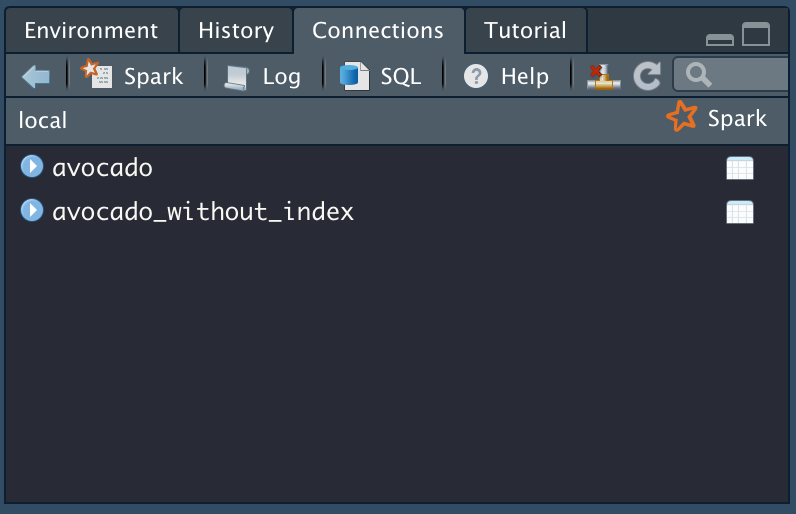
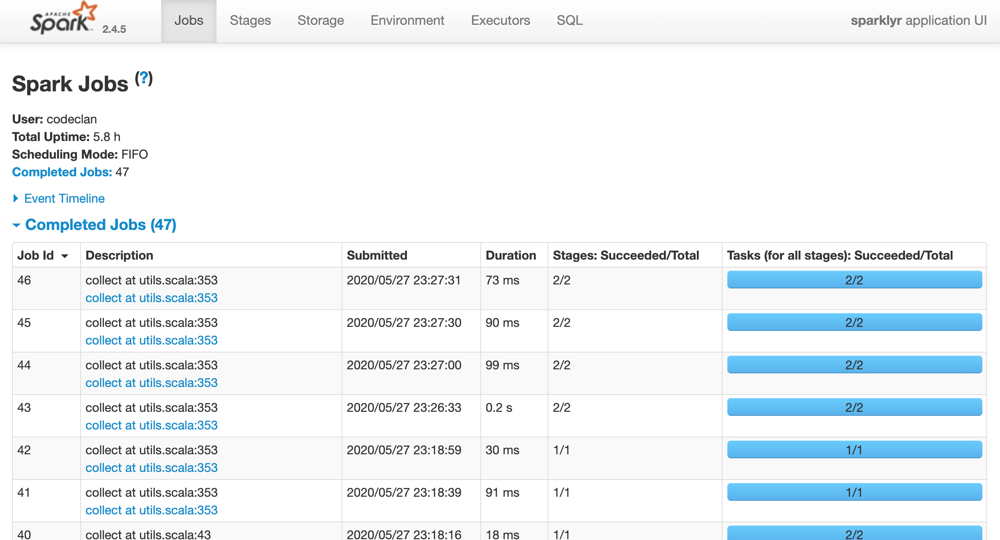
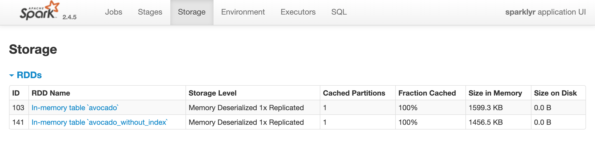

# Learning Objectives

* Understand `Spark` installation
* Be able to import data into `Spark`
* Understand the need to push heavy computation to `Spark` and how to do this using `sparklyr`
* See examples of some simple analyses and `Spark Streaming`

**Lesson Duration: 60 mins**

# Introduction

We've seen that `Spark` offers a truly scaleable solution for big data, big compute or high data speed problems, and that the `sparklyr` package for `R` offers an excellent compromise between the power of `Spark` and the expressiveness and ease-of-use of the `R` language and the `tidyverse` (with `pyspark` doing something similar in `Python`). 

In this lesson we're going to learn more about `sparklyr` and the nuances of data analysis in `Spark`. Before we proceed, however, a word of caution: the `sparklyr` package is very new, which means that its interface is still subject to frequent changes. So, if you start work in earnest with `Spark` via `sparklyr`, be prepared for significant changes as new versions appear. Onwards!  

# `Spark` installations and connections

In the last lesson we used `sparklyr` to install `Spark 2.4.5`, but let's see which other versions of `Spark` are available for installation.

```{r}
library("sparklyr")
spark_available_versions(show_minor = TRUE)
```

Next, let's see which versions of `Spark` we have installed locally:

```{r}
spark_installed_versions()
```

Now we will connect to the `Spark` you just installed. To do this, we use the `spark_connect()` function, passing in an argument `master = "local"` to let `sparklyr` know that our **local** machine (i.e. your laptop) is being used as the **master** (or **driver node**) of a Spark 'cluster' (in this case, just the master node itself, so not a particularly impressive cluster, but it will do for learning purposes).

```{r}
sc <- spark_connect(master = "local", version = "2.4.5")
```

We could have omitted the argument `version = 2.4.5`, as we have just one version of `Spark` installed locally. The function starts `Spark` on our machine and returns a connection object which we've called `sc`. Let's have a closer look at this connection object:

```{r}
sc
```

Note that `Spark` running locally on your machine is not going to be very impressive: in fact, the performance may be slightly worse than running the same operations in `R`. To really see the potential of `Spark` we would need to start up a cluster with multiple workers nodes and install `Spark` on it. There are a number of providers of cloud computing technology that we could use to provide such a cluster: 

* For large scale data operations we might opt for AWS or Microsoft Azure, but these are true enterprise-level platforms that unfortunately present steep learning curves for beginners. 
* We might also choose to create 'Droplets' (i.e. nodes) on DigitalOcean, install `Spark` on them, and set up intracluster communications, but we would need to arrange all of this manually ourselves. An alternative would be to use `Docker` to set up a cluster for us, which is much quicker and easier but relies on a knowledge of `Docker`. DigitalOcean tends to be used more by solo developers and SMEs. 
* A good compromise is offered by Databricks, who provide a free access tier for education and community service. Databricks essentially sets up and runs instances (an 'instance' is one node of a cluster) for you on Azure or AWS, but they levy an additional service fee beyond those charged by AWS or Azure for your instances. Nevertheless, the free tier of Databricks is an excellent way to learn the basics of cloud computing. They also offer their own notebook format that makes working with `Spark` very easy.   

# Copying data into `Spark`

Now, let's copy some data into `Spark`. We're going to resurrect the `avocado` data from earlier in the course (yep, that one again!), read it into `R` and then copy it into `Spark` using the `copy_to()` function. We need to pass our connection object `sc` into this function, along with a reference to the tibble to be copied: 

```{r}
library(tidyverse)
library(janitor)
avocado<- read_csv("data/avocado.csv")
avocado <- avocado %>%
  clean_names()
avocado_spark <- copy_to(sc, avocado)
```

If `avocado` already exists as a table in your `Spark` session, you can overwrite it by setting argument `overwrite = TRUE` above. Note, however, that this would be a really inefficient way to load a big data set into `Spark`, as *it funnels all of the data through your local machine*. To avoid having to read all of the data into memory on your machine, you could use the `spark_read_csv()` function to load it directly

```{r, eval=FALSE}
avocado_spark <- spark_read_csv(sc, path = "data/avocado.csv")
```

or, if the data were stored in an AWS S3 'bucket' (this is a common way to store large amounts of data: S3 is the Amazon 'Simple Storage Service'), `Spark` and `sparklyr` also offer efficient S3 loading methods that don't involve your local machine (see examples [here](https://spark.rstudio.com/guides/aws-s3/)). 

If we had lost the reference to `avocados` locally, we can get a new one using the `tbl()` function in this way:

```{r}
avocados_spark <- tbl(sc, "avocado")
```

And we can see the tables available in our connected `Spark` session using the `src_tbls()` function

```{r}
src_tbls(sc)
```

# Where's my data?! `collect()` and `compute()`  

But what exactly is this `avocado_spark` object? Does it somehow contain the data? Let's find out more:

```{r}
class(avocado_spark)
```

We see that it's a `tbl_spark`, and it's also marked as being `tbl_lazy`. If we look inside `avocado_spark` we would find that it doesn't actually contain any data; instead, it points to a data source, i.e. to `Spark` in this case. In this way, we avoid ever having to deal with all of the data loaded into `Spark` in the memory of the local machine. This is an example of 'lazy evaluation' - don't actually acquire and deal with the data until the processing need arises, e.g. we actually request to see the processed data

Our data is held in `Spark` in a `DataFrame` (SDF) format. This format is essentially tabular in nature, it has the concepts of rows and columns, in common with `R` `tibble`s and `data.frame`s, and `pandas` `DataFrame`s, so it should be very familiar to you!

We can use `str()` to see what `avocado_spark` contains:

```{r}
str(avocado_spark)
```

As expected, there is no data stored, just details of connections and data operations. To reaffirm this point, using the `object_size()` function from the `pryr` package, we see that the `avocado_spark` object is much smaller than the original `avocado` tibble: 

```{r}
library(pryr)
object_size(avocado)
object_size(avocado_spark)
```

But, again, it's worth pointing out that the `avocado` data isn't really a large data set at all, it's just over $2$MB in size! Does a `select()` operation bring the data over into `R`?

```{r}
selected_avocado_spark <- avocado_spark %>% 
  select(average_price)
object_size(selected_avocado_spark)
```

No it doesn't, the data is still held in `Spark`. In fact, we have to `collect()` to force the data to come from `Spark` to `R`, or pass the data into other functions (e.g. `ggplot()`). Essentially, if we request an operation that `Spark` cannot fulfill, or we explicity `collect()`, the data is sent from `Spark` to `R`. **Needless to say, we should be careful to only do this when our analysis has produced a result that can comfortably be handled on our local machine!** Typically, this will be the result of some sort of summarisation of the data, or another reducing operation. 

```{r}
collected_avocado_spark <- avocado_spark %>%
  collect()
  
object_size(collected_avocado_spark)
```

We can also use the `compute()` function to force `Spark` to run all the operations we have requested on a `tbl_spark` object up to that point and to store the resulting data in either an existing or new `Spark DataFrame`. Let's see an example

```{r}
avocado_without_index <- avocado_spark %>%
  select(-x1) %>%
  compute("avocado_without_index")

src_tbls(sc)
```

This can be very useful to store intermediate results in an analysis, without bringing large data sets back into `R`!

# `Spark SQL` and `show_query()`

It's important to understand that most of the `dplyr` style operations you call upon a `tbl_spark` are converted to `Spark SQL` commands to be run on the `Spark DataFrame`. The `show_query()` function lets us see this explicitly: 

```{r}
avocado_without_index %>%
  select(average_price) %>%
  show_query()
```

What this means is that we can, if we wish, run `SQL` commands directly upon a `Spark DataFrame` like so:

```{r}
library(DBI)
dbGetQuery(conn = sc, statement = "SELECT COUNT(*) FROM avocado")
```

In practice, though, it's more common to stick to using `dplyr` syntax, as it is generally more readable and expressive. Here's another example:

```{r}
avocado_without_index <-  avocado_without_index %>%
  mutate(high_average = average_price > 1.40) %>%
  show_query()
```

And the proof that it worked:

```{r}
avocado_without_index %>%
  select(high_average) %>%
  glimpse()
```

<br>
<blockquote class='task'>
**Task - 5 mins**

* Try performing some sort of `summarise()` operation on your `tbl_spark` object, and examine the `SQL` query it generates. 
* Store the result of your summarise operation in a variable `result`. What is the `class()` of `result`?
* Now `collect()` your `result`, storing it in a variable `collected_result`. What is the `class()` of `collected_result`? 

<details>
<summary>**Solution**</summary>
```{r}
result <- avocado_without_index %>%
  summarise(mean_total_volume = mean(total_volume)) %>%
  show_query()

result

class(result)

collected_result <- result %>%
  collect()

class(collected_result)
```
</details>
</blockquote>
<br>

# `sparklyr` helper functions and `RStudio`

`Spark` comes equipped with a dashboard (or user interface - UI) to tell you the current status of the service. You can access it either via the `spark_web()` function, or by clicking on the `Spark` button in the `Connections` pane in `RStudio`

```{r}
spark_web(sc)
```

```{r, echo=FALSE, fig.align="center", fig.cap="**Fig. 1.** Connections pane in RStudio", out.width = '80%'}

```

The front page `Jobs` shows details of active and completed `Spark` jobs

```{r, echo=FALSE, fig.align="center", fig.cap="**Fig. 2.** Jobs page in the Spark UI", out.width = '80%'}

```

`Storage` is another useful page, showing details of the datasets loaded into `Spark`. Note that these are referred to here as **`RDD`s** ('Resilient Distributed Datasets'), a core concept that has been in `Spark` from its earliest days. The `Spark DataFrame` type is built on-top of and extends the `RDD` definition. Importantly, we see here the 'Fraction Cached', which tells us how much of each dataset is being held in memory (remember, much of the speed of `Spark` comes from trying to hold data in memory).

```{r, echo=FALSE, fig.align="center", fig.cap="**Fig. 3.** Storage page in the Spark UI", out.width = '80%'}

```

We can also gain access to the `Spark` logs using the `spark_log()` function (or by clicking the `Log` button in the `Connections` pane in `RStudio`)

```{r}
spark_log(sc, filter = "sparklyr")
```

The logs can be helpful in diagnosing any problems you run across.

# Examples of simple analysis operations

We are going to look at analysis and modeling in `Spark` in more detail in the next few lessons, but here are a few examples of how easy `sparklyr` makes it to interact with `Spark` data!

## Plotting

We can straightforwardly plot `tbl_spark` objects in the usual way:

```{r}
avocado_spark %>%
  ggplot(aes(x = type)) +
  geom_bar()
```
But there is a hidden danger in what we just did: in order to create this plot, it was necessary to bring the whole dataset over to `R`! A better way would be to push the heavy computation to `Spark` and slightly change our plotting strategy:

```{r}
avocado_spark %>%
  count(type) %>%
  collect() %>%
  ggplot(aes(x = type, y = n)) +
  geom_col()
```
Placing `collect()` after the summarising `count()` operation in this way, means that `R` only ever receives the following data from `Spark`

```{r}
avocado_spark %>%
  count(type) %>%
  collect()
```
which is much easier to handle than the full data set. An alternative workflow involves the `dbplot` package, which tries to automate this idea of pushing the heavy computations involved in creating a plot to a 'database' (`Spark` in this case); more on this package soon!

## Simple modeling

Modeling in `Spark` can be very similar to what you've experienced in `R`. Here is an example of a simple linear regression in `Spark`:

```{r}
fit <- avocado_spark %>% 
  ml_linear_regression(average_price ~ total_volume)

class(fit)
```

Note that we're using the `ml_linear_regression()` function from `sparklyr` (which in turn calls a function in `Spark MLlib`, the machine learning library) rather than the conventional `R` `lm()` function. When we use the `ml_linear_regression()` function, we are *pushing the task of fitting the linear model to `Spark`*, which is exactly what we want to achieve! 

The `fit` object returned works with other functions in the `tidyverse`: let's use `tidy()` and `glance()` from `modelr` on it:

```{r}
library(modelr)
tidy(fit)
glance(fit)
```

along with the `augment()` function from `broom`:

```{r}
library(broom)
augment(fit)
```
Here's a slightly more complex interplay of `sparklyr` and `tidyverse` functions

```{r}
fit %>%
  ml_predict(copy_to(sc, data.frame(total_volume = seq(3e7, 6e7, 1e6)))) %>%
  transmute(total_volume = total_volume, average_price = prediction) %>%
  mutate(source = "predict") %>%
  sdf_bind_rows(
    select(avocado_spark, total_volume, average_price) %>%
      mutate(source = "train")
  ) %>%
  collect() %>%
  ggplot(aes(x = total_volume, y = average_price, col = source)) +
  geom_point(alpha = 0.5)
```
Again, though, this would be unwise for truly big data sets, as a scatter plot requires that *all the data* be pulled from `Spark` to `R`. We'll see a better alternative shortly.

## Correlations

As you know, examining correlation plots between numerical variables is an important part of data exploration. Here's an example of how to obtain a correlation matrix by pushing the computation to `Spark`, using the `rplot()` function from the `corrr` package to plot the collected data:

```{r}
library(corrr)

corr_mat <- avocado_spark %>%
  select(-c("x1", "date", "type", "region")) %>%
  ml_corr() %>%
  collect() 

corr_mat <- corr_mat %>%
  mutate(rowname = names(corr_mat)) %>%
  column_to_rownames(var = "rowname")

corr_mat

corr_mat %>%
  rplot(print_cor = TRUE)
```

# `Spark` streaming

Just to end this lesson, here's a fun example of the sorts of data processing that are possible with the `Spark Streaming` library. Imagine we are dealing with some sort of data pipeline that periodically dumps output to a directory, e.g. it processes say user inputs and dumps them into an `input` directory. We don't know ahead of time when user input will arrive, but we would like to set up a `Spark` process that monitors the `input` directory for changes and then further processes them.

First let's create the `input` directory, sample `avocado` 100 times to represent processed avocado sales, and write them as a `csv` to this directory:

```{r}
dir.create("input")

avocado %>%
  sample_n(100) %>%
  write_csv("input/avocados_1.csv")
```

Now we set up a `Spark Stream` to monitor this directory for changes. When it detects any new file, it processes it according to the steps we define in the stream:

```{r}
stream <- stream_read_csv(sc, "input/") %>%
    select(total_volume, average_price) %>%
    stream_write_csv("output/")
```

Let's see if we have anything in the `output` directory.

```{r}
Sys.sleep(20) # add this just to give time for stream to run while knitting to html
dir("output", pattern = ".csv")
```

Yay, we do! `Spark` has processed the incoming `csv` and written an output `csv`. Let's write some more data to `input`

```{r}
avocado %>%
  sample_n(100) %>%
  write_csv("input/avocados_2.csv")
```

Checking, we see `Spark` has produced another `output` `csv`!

```{r}
Sys.sleep(20) # add this just to give time for stream to run while knitting to html
dir("output", pattern = ".csv")
```

We can stop the stream like so:

```{r}
stream_stop(stream)
```

This sort of interaction between data processes remains very common, data engineers often write processes that take the data periodically dumped by one process and use it as the input to another, so it's useful to see how to handle this in `Spark`. We have only scratched the surface here, there is much more to explore in the `Spark Streaming` library!

# Disconnecting from `Spark`

Finally, once we are finished with our `Spark` session, we can disconnect from it like so:

```{r}
spark_disconnect(sc)
```

Or we can disconnect all open connections in this way:

```{r}
spark_disconnect_all()
```


