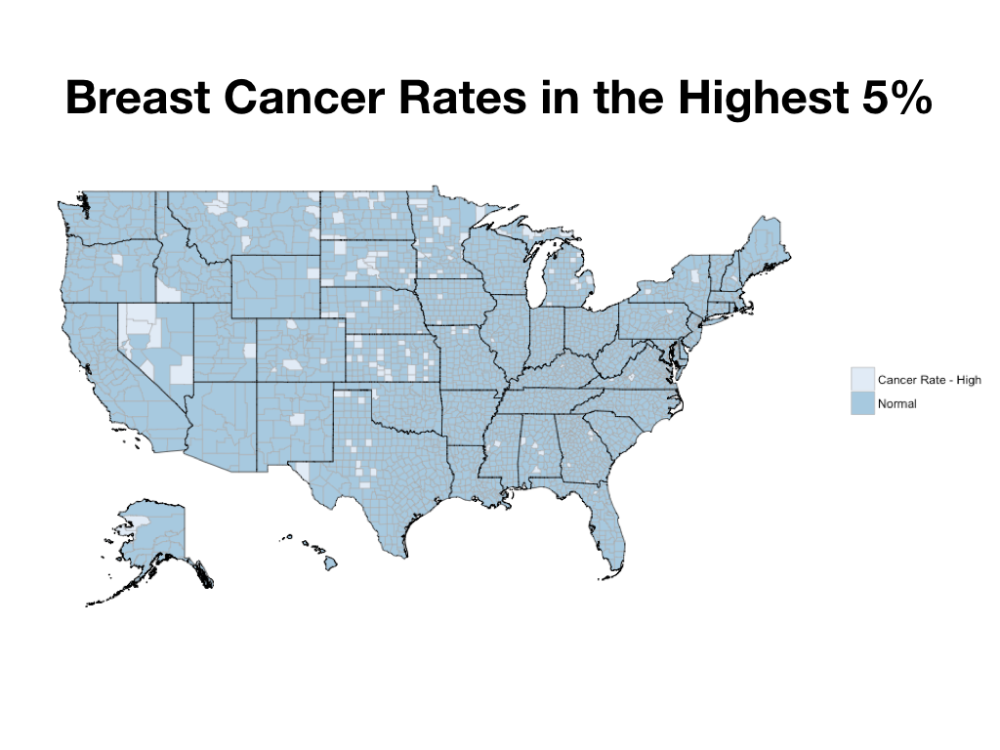
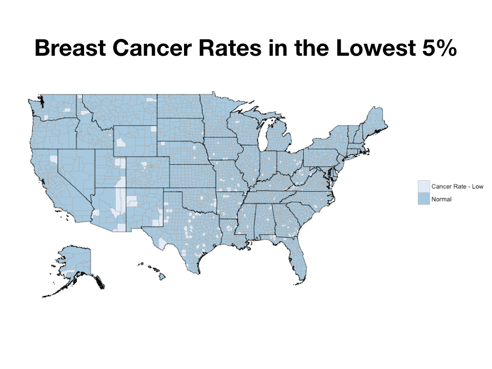
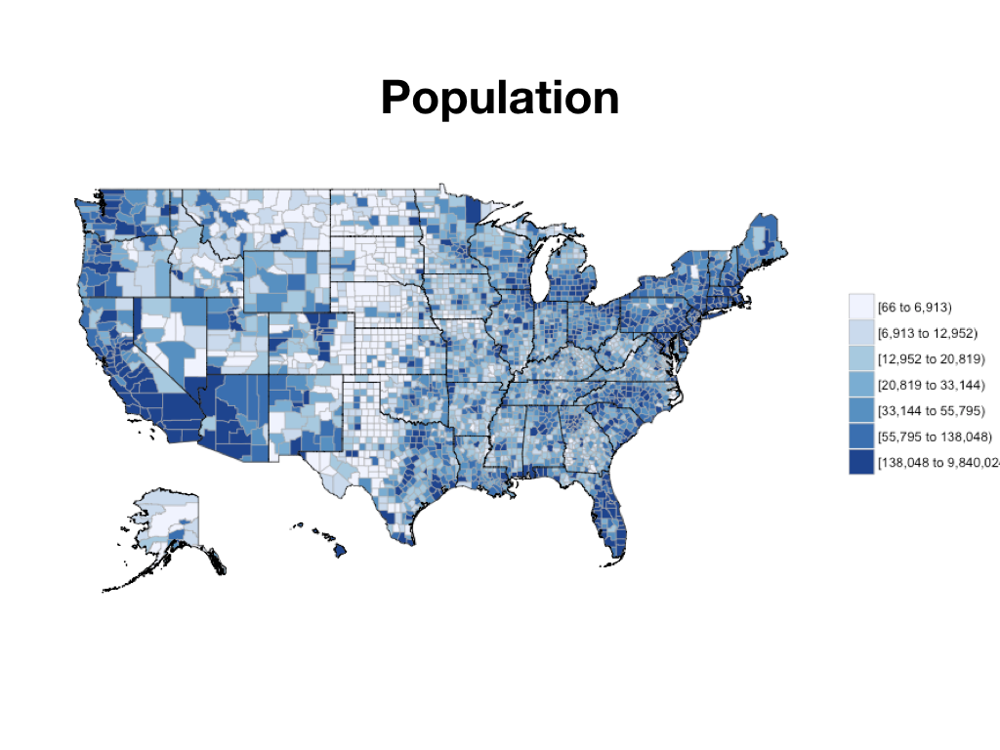
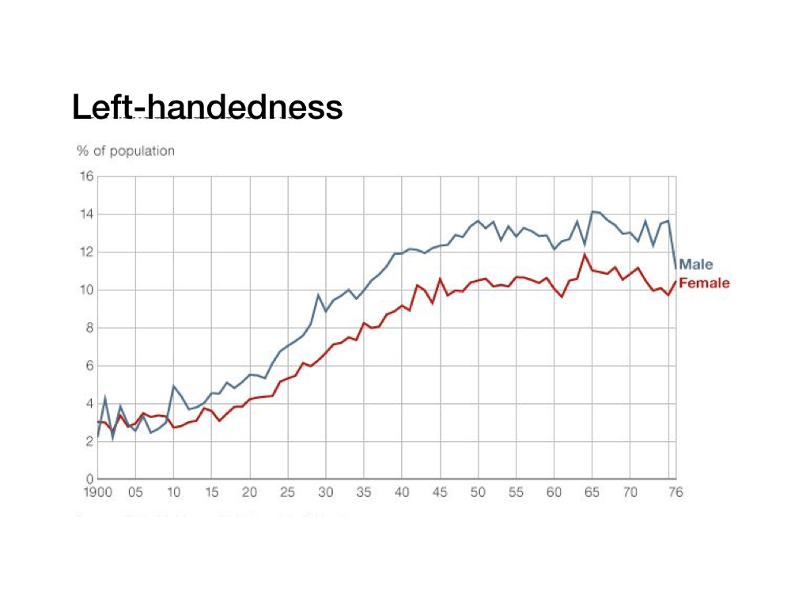
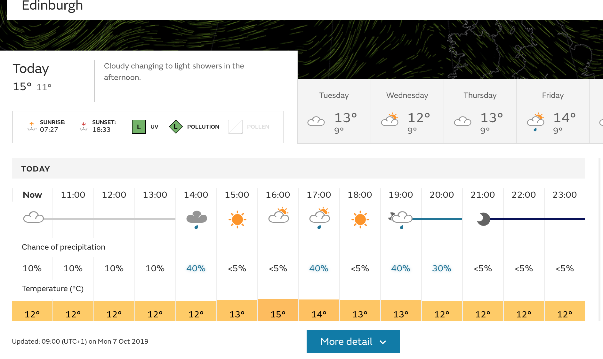
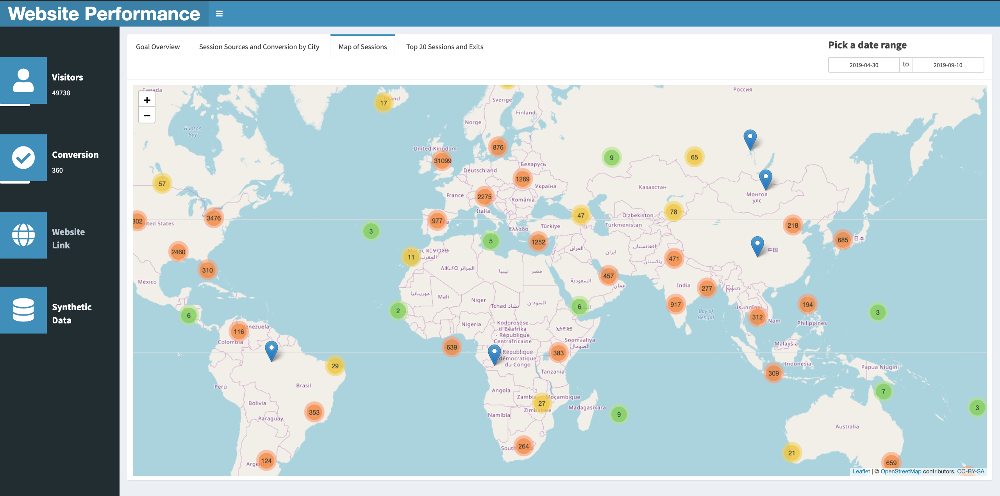

```{r setup, include=FALSE}
knitr::opts_chunk$set(echo = TRUE)
```

# Learning Objectives

* Understand the different definitions of data science
* Understand the importance of data in today's society
* Know the kinds of questions that can be answered by data science
* Develop familiarity with some real world applications of data science

**Duration - 1 hour**

***


# What is data science?
<br>

<center>

</center>

<br>

This is a surprisingly difficult question to answer!

> "an interdisciplinary field about processes and systems to extract knowledge or insights from data in various forms, either structured or unstructured, which is a continuation of some of the data analysis fields such as statistics, data mining, and predictive analytics, similar to Knowledge Discovery in Databases."

<br>

1.	**interdisciplinary field”** - Data science is inherently broad, with elements of statistics, programming and business. 

2.	**about processes and systems** - This makes data science different from statistics. It's not just about results - it's about processes and systems.

3.	**to extract knowledge or insights from data** – This is what makes data science different from software engineering. It's not just about systems, it's about learning something. 

4.	**in various forms, either structured or unstructured** – Again, statisticians don't traditionally work with all the forms of data that data scientists use.

5.	**which is a continuation of some of the data analysis fields such as statistics, data mining, and predictive analytics, similar to Knowledge Discovery in Databases** – Reiterating that data science is interdisciplinary. One of the key distinctions of data science is that is uses skills from programming and statistics.

<br>

In summary, a good, short definition of data science might be:

> The art of processing and learning things from data


# Why is data science important?

Data science is a huge field, and within each field there will be a different focus relating to how the data is gathered and used. However, there are three broad areas of importance that tend to cross different domains.


## Data for Decision Making 

When you are making decisions it’s essential to have the data to back them up. Thinking about data is intrinsically very tricky, and our instincts can often be wrong. This is why it's important to have trained and skilled analysts that are able to translate the data you see into the right story. Let's see some examples of this.

### Breast Cancer in the US

Have a look at the map below. It shows the 5% of US counties with the highest breast cancer rates.



<blockquote class = 'task'>

**Task - Class Discussion - 2 minutes**

What patterns do you see? Can you think of an explanation for these?

</blockquote>

Now look at this map. This shows the 5% of US counties with the lowest breast cancer rates.



<blockquote class = 'task'>

 **Task - Class Discussion - 2 minutes**

 What do you notice about this?

</blockquote>

The pattern is quite similar! How can similar places have both the highest and lowest rates?

Here's a final map that might help answer this question.



<blockquote class = 'task'>

 **Task - Class Discussion - 2 minutes**

 Why does this map explain the pattern seen in the other two maps?


<details>
<summary>**Answer**</summary>


The highest and the lowest breast cancer rates tended to happen in counties with low populations. 

That's because it's hard to estimate an average when you don't have a lot of data. Many of these counties would only expect to have 1 or 2 breast cancer cases in a year. If they happen to have a year with 0, then they will have a very low rate. If they happen to have a year with 3, then they will have a very high rate. So we see a pattern, even when there's no underlying cause.

This is a really easy mistake to make. There has been a great effort to reduce class sizes in schools, since the smallest classes tend to have the best exam results. However, the smallest classes also tend to have the worst exam results... It's quite possible that reducing class sizes does improve exam results, but if you want to test that, you need to be careful about affects like this.

These maps illustrate how important to understand your data well, and how important it can be for businesses and public bodies to employ skilled analysts. 

Let's look at another example.   
</details>

</blockquote>


### Left-handedness

Below is a fact that is completely true, but seems very strange.

> "Right-handed people live on average 9 years longer than left-handed people"

<blockquote class = 'task'>

 **Task - Class Discussion - 2 minutes**

 Why do you think that is?

</blockquote>




<blockquote class = 'task'>

 **Task - Class Discussion - 2 minutes**

 Now look at this plot. How does that explain the fact above?
 
 
<details>
<summary>**Answer**</summary>

Historically, left-handed people were discouraged from using their left hand to write. As a result, many of them became right-handed.

This means that there's a much lower rate of left-handedness among older people than young people.

So, that means the average age of a left-handed person is substantially younger than the average age of a right-handed person. 

Which in turn means that the average age at death is much lower for left-handed people than right-handed people!

While the chance of a young person dying is low, since there's so many more young people in the left-handed group, they bring the average age of people dying down. 

So, good news if you are left-handed. Even though the average age at death is 9 years lower for left-handed people, your individual chance of dying is no different than for a right-handed person.

</details> 
</blockquote>


## Dealing with unstructured and messy data 

Traditionally, the data businesses encountered were structured and small in size, and could be analysed relatively easily. Today, most of the data out in the wild is unstructured. 

<br>
<center>

</center>

<br>
<center>

</center>


Dealing with unstructured, messy and big datasets is a key skill, and finding trained analysts who are able to deal with such data is a major business problem. As an analyst you'll spend most of your time data cleaning, and so being trained in how to do this is a key skill. 

<br>
<center>

</center>


## Predictive Analytics 

The third major important factor of data science is the ability to predict the future, using the data you have. Let’s take weather forecasting as an example. Data from ships, aircrafts, radars, satellites can be collected and analyzed to build models. These models will not only forecast the weather but also help in predicting the occurrence of any natural calamities. It will help you to take appropriate measures beforehand and save many precious lives.

<center>

</center>

<br>

There are various ways in which data science can predict the future, all of which you'll learn about in this course. 

<center>


</center>

# What will we cover in this course?


## Programming 

You cannot easily analyse data without learning to code. Some of you may have analysed data in Excel or other GUI based systems, which is fine up to a point, but ultimately isn't reproducible and is time consuming. Hence for the first couple of weeks, we will really focus on learning to code. Don't worry if you haven't coded before: the first section of this course is designed to get your programming up to scratch. 

The main programming language of this course is R. We focus on R as the main one for several reasons:

<br>
<center>

</center>

<br>
However you will also learn some SQL and Python as you go, as these are the other dominant languages in data science. 

<br>
<center>

</center>


## Data Wrangling 

Data wrangling is the process of transforming and mapping data from one "raw" data form into another format with the intent of making it more appropriate and valuable for a variety of downstream purposes such as analytics.

<br>
<center>

</center>

In order to effectively wrangle data, you'll learn how to do various things such as:
- Read in different types of files
- Reshape data
- Deal with missing values and outliers 
- Rename variables 
- Get data into a workable format for analysis 


## Data Visualisation 

Data visualizations make big and small data easier for the human brain to understand, and visualization also makes it easier to detect patterns, trends, and outliers in groups of data. Good data visualizations should place meaning into complicated datasets so that their message is clear and concise. 

<br>
<center>

</center>


In this course you will learn how to:
- Visualise data using ggplot 
- Learn about how to pick the appropriate visulisation
- Know how to draw meaning from your visulisations and turn them into actionable items for businesses
- Create interactive dashboards with Shiny 

<center>

</center>


## Statistics 

As a data scientist you do not need to be a professional statistician, but you should have a very good understanding of the basics; you can at least fully appreciate what you do not know.

As a data scientist you do not need to be a professional statistician, but you should have a very good understanding of the basics; you can at least fully appreciate what you do not know.

Statistics can be very roughly divided into three sub-fields, which each answer a different type of question: 

- Descriptive statistics: At it's most basic, statistics can tell you how to *describe* data. Descriptive statistics includes finding counts, finding means, medians and measures of spread.

- Inferential statistics: inferential statistics tell you whether observations in your data are statistically meaniningful. Inferential statistics answers question like this. Is the pattern we think we see just noise? Is the effect we are expecting actually there?  

- Predictive statistics: predictive statistics let you model the future. This type of predictive modelling is useful in a huge range of situations. For example, imagine we want to show adverts only to those people who are likely to buy pizza. What would be the best way of doing that?


In this course you'll learn about each of these in more detail. 


# Recap

* In this lesson you've learnt that data is very important.
* What data scientists do is often ill defined - but it definitely involves data, and it definitely involves computers!
* Data is now bigger than it’s ever been, and this gives rise to challenges, but also to possibilities. 

# Additional Resources

* "Doing Data Science: Straight Talk from the Frontline" by Cathy O'Neil and Rachel Schutt. This book is an excellent and sceptical look at data science as a field. 

* "Bad Science" by Ben Goldacre. Has more on Archie Cochrane and evidence based medicine.


