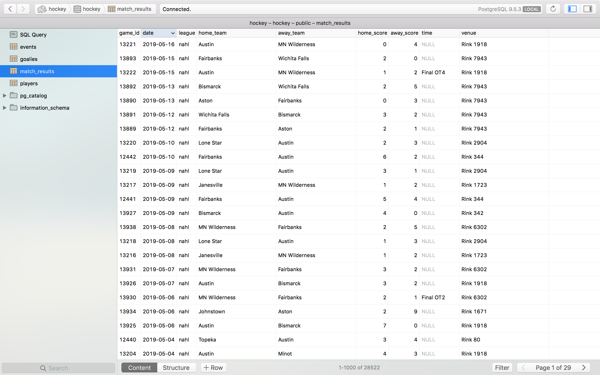
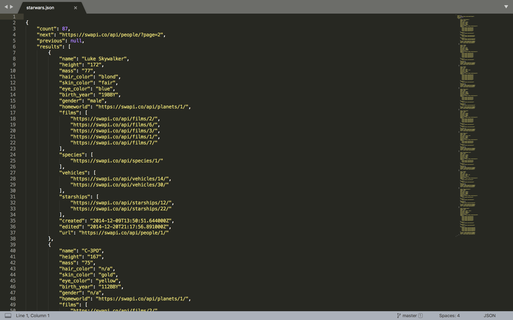
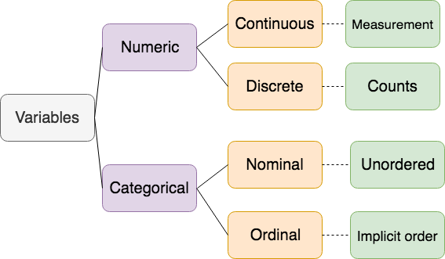

```{r setup, include=FALSE}
knitr::opts_chunk$set(echo = TRUE)
```

# Learning Objectives

* Know what the different types of data are
* Be able to identify different data types
* Be able to distinguish between quantitative and categorical variables
* Understand the different levels of measurement - nominal, ordinal


<br> 

**Duration - 1 hour**

In this lesson we're going to discuss several ways of categorising data. 


# Primary vs. Secondary

Data can either be from a primary course, or a secondary source.

1. Primary data is data you've collected yourself for a specific purpose.

2. Secondary data is data collected by someone else. It might have been collected to answer the question you are interested in, or it might have been collected for some other purpose.

Most of the data you'll work with, and all of the data in this course will be secondary data.

<blockquote class = 'task'>

**Task - 2 minutes**


For each of these situations, is the data primary data or secondary data?

1. We decided to analyse the accounts of Edinburgh council

2. We download a dataset about dog attacks in the UK

3. We do a survey around CodeClan to find out everyone's favourite colour


<details>
<summary>**Solution**</summary>

1. Secondary

2. Secondary

3. Primary

</details>

</blockquote>


# Structured vs. Unstructured

## Structured data 

Structured data is data that resides in relational databases, or looks very like data that lives in relational databases.

Structured data comes in rectangular tables. These tables can be related to each other. Structured data often has constraints on its variables, for example: text can only be of a certain length, or numbers are only given to a certain precision.



## Semi-structured data

Semi-structured data is any data that has some type of structure, but doesn't necessary fit the strict definition of structured data. 

Examples of semi-structured data:

- JSON data
- noSQL databases
- Emails that have meta-data attached



## Unstructured data

Unstructured data is everything else! 

Examples of unstructured data:

* A word document
* Satellite imagery
* A website
* Audio recordings
* Videos

<blockquote class = 'task'>

**Task- 5 minutes**

For each of these pieces of data, are they structured, semi-structured or unstructured?

1. Your Instagram page  

2. Data from your Twitter feed that you download using the Twitter API  

3. A set of end of year accounts given to you from a database   

4. The mtcars dataset below   

```{r}
mtcars
```

<br>
<details>
<summary>**Solution**</summary>

1. Unstructured

2. Semi-structured

3. Structured

4. Structured

</details>
</blockquote>


# Continuous vs. Discrete Data

The categories we have seen so far categorise the data as a whole. However, we can also categorise the individual parts or *variables* in the data. 

Have a look at the dataset below, that comes from a survey of students.

```{r echo=FALSE, message=FALSE, warning=FALSE}

library(readr)
library(dplyr)

students <- read_csv('data/students_data.csv')

students %>%
  na.omit() %>%
  select(
    age_years = Ageyears,
    reaction_time = Reaction_time,
    text_messages_sent_yesterday = Text_Messages_Sent_Yesterday,
    favorite_school_subject = Favorite_School_Subject,
    vegetarian = Vegetarian,
    school_year = ClassGrade) %>%
  mutate(school_year = paste('Year', school_year)) %>%
  knitr::kable()

```

## Numeric

The first and most obvious way of categorising the variables is into those which are numbers and those which are text. Any data which comes in the form of numbers is numeric. 

But we can split numeric data up further into *discrete* numeric data and *continuous* numeric data. 

## Discrete

Data which is discrete can only take whole number values. Discrete data is often counts.

## Continuous 

Continuous data can take any value at all, including decimal values. Continuous data is often measurements.

In our students data age_years, reaction_time and text_messages_sent_yesterday are all numeric data. But only age_years and text_messages_sent_yesterday are discrete. reaction_time is continous - you can see this because it takes decimal values.

## Categorical

Any data which isn't numeric has to be categorical. Categorical data is often represented by text.

## Nominal 

Most categorical data is nominal. This is data that has no particular ordering to it.

## Ordinal

But ordinal data is also common. This is categorical data that has an implicit order to it. Ordinal data can often be represented as numbers, as well as text.

In our dataset the other variables are categorical. Only one is ordinal - school_year. Clearly school year has an ordering; year 1 is less than year 5. The other type of ordinal data you often see is measures like 'Always', 'Sometimes', 'Never'. Or ranges: 'Between 0 and 10', 'Between 11 and 20' etc. 

favorite_school_subject and vegetarian are both nominal variables. Since vegetarian can only take two values (Yes and No) then vegetarian is special type of categorical data; binary data. 

These cateogries are summarised below:



<blockquote class = 'task'>

**Task - 10 minutes**

Look at these extra variables from the student survey dataset. Categorise each into discrete, continuous, ordinal and nominal.

```{r}
students %>%
  na.omit() %>%
  select(
    height_cm = Height_cm,
    sleep_hours_schoolnight = Sleep_Hours_Schoolnight,
    superpower = Superpower,
    languages_spoken = Languages_spoken,
    planned_education_level = Planned_Education_Level
  )
```

<details>
<summary>**Solution**</summary>

1. height_cm: Numeric continuous.

2. sleep_hours_schoolnight: Numeric continuous (almost discrete though!)

3. superpower: Categorical nominal.

4. languages_spoken: Should really be numeric discrete, but someone says they speak '1.5' languages, so numeric continuous. Sometimes you expect data to take one form, but it actually ends of being another.

5. planned_education_level: categorical ordinal.

</details>  


</blockquote>

<blockquote class = 'task'>

**Task - 15 minutes**

Data and descriptions for this task comes from the Data is Plural newsletter.  (https://tinyletter.com/data-is-plural/archive).

Together categorise each dataset and it's contents across the three categories we have seen. You don't need to categorise every variable for large datasets. Each dataset should either open as a text file or in Excel.

Split the class into groups. 

**Dataset 1 - Global Populism Database**

http://populism.byu.edu/Pages/Data

"Team Populism is an initiative that “brings together renowned scholars from Europe and the Americas to study the causes and consequences” of the titular political style. The collaboration has published several datasets, including one that scores the populist rhetoric of 40 countries’ leaders between 2000 and 2018 — a project commissioned by The Guardian, which has visualized the findings and described the methodology. [h/t Erik Gahner Larsen]"

**Dataset 2 - Enron Emails**

http://www.cs.cmu.edu/~enron/

This dataset contains 100 randomly selected emails from the Enron data dump. Enron was an American energy and commodities company that collpased in 2001 after a massive accounting fraud scandal. As part of the investigation more 600,000 emails from 158 employees were collected and later published. 
 
**Dataset 3 - Uber for X**

https://docs.google.com/spreadsheets/d/1qPcpQ9rk08JhEApPSr2jSfJtSWa8RH0ANPibtWuRnh0/edit#gid=0

"Uber for X. From Alexis C. Madrigal, writing at The Atlantic: “Now, a decade since Uber blazed the trail, and half that since the craze faded, we built a spreadsheet of 105 Uber-for-X companies founded in the United States, representing $7.4 billion in venture-capital investment. We culled from lists, dug in Crunchbase, and pulled from old news coverage. It’s not a comprehensive list, but it is a large sample of the hopes and dreams of the entrepreneurs of the time.”

**Dataset 4 - Star Wars API Data**

https://swapi.co/

A dataset extracted from the Star Wars API (SWAPI).

“All the Star Wars data you've ever wanted:

Planets, Spaceships, Vehicles, People, Films and Species

From all SEVEN Star Wars films"

</blockquote>

# Recap

We've seen two ways of categorising a dataset

1. Primary vs. secondary source

2. Structured vs. semi-structured and unstructured


