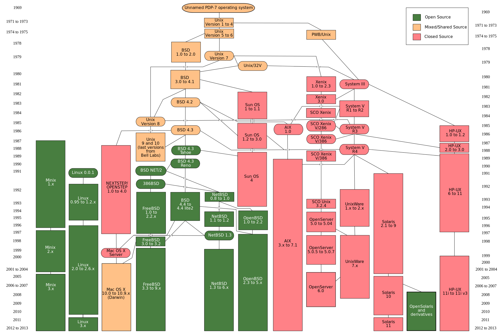
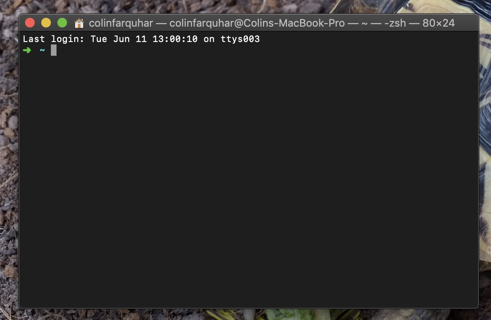
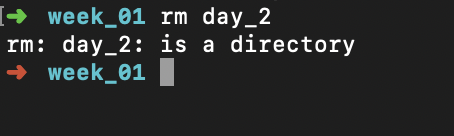
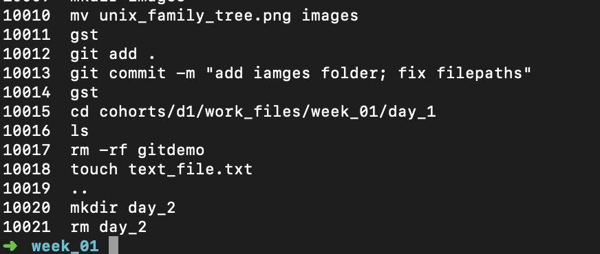
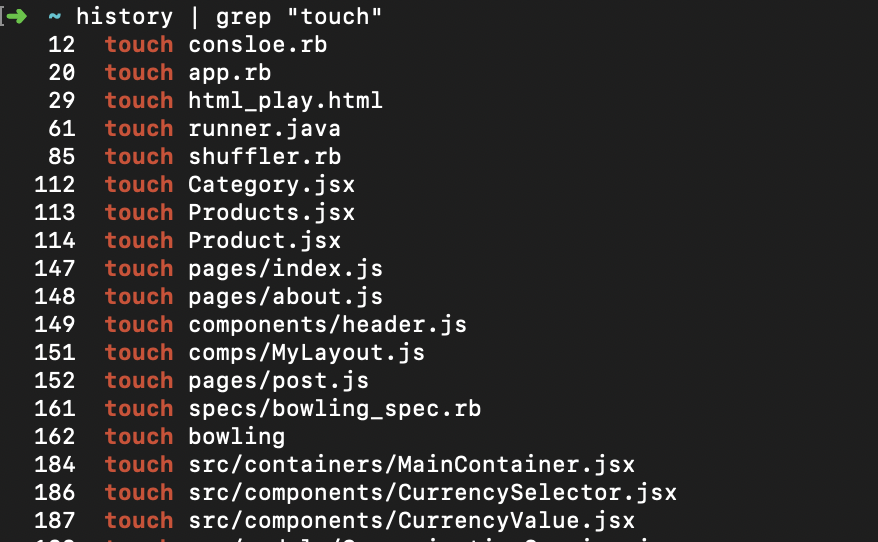

```{r setup, include=FALSE}
knitr::opts_chunk$set(echo = TRUE, fig.align = 'center')
```

**Lesson Duration: 60 minutes**

# Learning Objectives
 
* Know that `~`, `..` and `.` are shortcuts for the home directory, parent directory and current directory
* Know that, with practice, the command line is faster and more efficient than using a GUI
* Understand why using the command line is popular for coders
* Be able to access the command line using Terminal
* Be able to create and delete directories using `mkdir` and `rm -r`
* Be able to create, rename, and delete files using `touch`, `mv`, and `rm`
* Be able to check the current directory using `pwd`
 
 
# UNIX – Quick Intro

Unix is a family of related operating systems. Many web-servers run on Unix-like / Unix-based operating systems. Apple's macOS is also based on a version of Unix. As a coder using a Mac we can have a very similar set of commands and tools available to us in the command line as we will have when hosting our site on a server.

<br>

```{r, echo=FALSE, fig.cap="The UNIX Family Tree", out.width = '100%'}

```


# The Command Line

The command line "shell" is a program that accepts text commands and tells the OS to carry out your commands.

Before we had a GUI (Graphical User Interface - mouse pointers, touch screens) all computers used CLIs (Command Line Interface). Many programmers still prefer using a CLI, as once you learn it well you can get things done much faster. There are also many helpful tools for coders which use CLIs rather than GUIs, so it's a very useful thing to learn.


# The UNIX Filesystem

All of the files on your computer are organised into directories (or folders). Directories within directories give us a branching structure which we can imagine kind of like an upside-down "tree"

We can use the command line to navigate through this tree of directories to find to the files and directories we need.


## Code Along

The Mac Application we use to access the command line is called "Terminal".
Let's open it up, if it's not in your Dock, you can find it by using Spotlight Search (cmd + space) and typing "terminal"

```{r, echo=FALSE, fig.cap="The Terminal", out.width = '50%'}

```

When the terminal opens, we're at our personal "home" directory. The "tilde" symbol: `~` is a shorthand for your "home" directory.

You can check where you are at any time with the `pwd` command. (Stands for "Print Working Directory")

```
pwd
```
We expect to get back `/Users/user` as this is the full path of our home directory (aka `~`)

To see what we have in a directory, we use the "list" command: `ls`

```
ls
```
This should display a list of the various files and directories within your home directory, Applications, Desktop, Documents, etc.

We can change how a command works by passing a "flag" or "option" to it.

```
ls -l
```
The `-l` flag (l for "long" version) gives us extra info like the the access permissions, the size of the files etc.

```
ls -a
```
The `-a` flag (a for "all" files) displays hidden files and directories as well as normal ones. The name of hidden files starts with a `.`

You can also combine these flags to get a long version of the list of all files

```
ls -al
```

Let's make a new directory for our classwork

```
mkdir codeclan_work
```

Then we can move into that new directory using `cd` (Change Directory)

```
cd codeclan_work
```

We can make another couple of directories and organise our work by week and day.

```
mkdir week_01
```

As we `cd` into this new directory, instead of typing the full directory name and that pesky underscore, we can use the `TAB` key to auto-complete the directory name once we start typing it.

```
cd we-[TAB]
cd week_01
```
Now make a day_1 directory and cd into that.

```
mkdir day_1
cd day_1
```

We can use the `touch` command to create new files.

```
touch text_file.txt
```

We can also create multiple files at once by giving the touch command multiple filenames.

```
touch an_r_file.R another_file
```
Notice we choose our file extensions explicitly, and can even create files without any file extension.

```
ls
```

So we've got an .R file in this day_1 directory. I want to move that into a day_2 directory.

```
mv an_r_file.R ..
```
The `mv` command moves a file from the first location to the second location.
`..`, the location we told `mv` to move the file to, is a shorthand for the directory one level above where we are right now.

Now let's make a day_2 directory to put the .R file in

```
cd ..
mkdir day_2
```

When we move the file into the new directory, we can optionally rename the file at the same time as moving it.

```
mv an_r_file.R day_2/r_stuff.R
```

If we want to copy something rather than move it, we can use `cp`, which works just as the `mv` command does, but leaves the original file alone.

```
cp day_2/r_stuff.R ./copied_r_stuff.R
```
I've decided I want to wait til tomorrow to make my day2 directory so I'm going to delete it for now.

To remove a file or directory we use the `rm` command

```
rm day_2
```
```{r, echo=FALSE, fig.cap="`rm` Failure", out.width = '50%'}

```

Ah, it won't let us delete a directory. This error isn't very informative, but if we look up the rm command, (`man rm`) we can see all the "options" or "flags" that the command can use to modify its behaviour.

To delete a directory, we add the `-r` flag, to "recursively" delete the directory and all its contents and subdirectories. You'll often see this combined with the `-f` flag, which tells the `rm` command that we're really sure of what we're doing, and we don't want to be asked to confirm before it deletes files.

<div class="emphasis">
**BE CAREFUL TYPING THIS** <br>
`rm -rf` **will not ask for confirmation**
</div>

<br>

```
rm -rf day2
```

Be careful when using the `rm` and especially `rm -rf` commands, make sure you know what you're deleting. If you accidentally `rm -rf` your home directory, it will just do it, it will delete everything.

That was scary. But let's head back into our day_1 directory and take at look at our files, which we hopefully haven't accidentally deleted with `rm -rf`.

```
cd day_1
```

If we want to open these files to edit them, your computers have a handy shortcut to open the atom editor.

```
atom .
```
The `atom` command opens the Atom Text editor. The `.` is a shorthand for "this current directory that I'm in". So our command is I want to open Atom, and what I want to open is this directory, our week01/day_1 directory (AKA `.`)

So we've covered most of the commands we'll use every day. The command line can do more advanced stuff as well.

If you forget how to use a command, you can use the `history` command to see what commands you've used in the past.

```
history
```

```{r, echo=FALSE, fig.cap="History", out.width = '50%'}

```
That's loads of information, and if we want to look back a while into our history, it might be quite hard to find what we're looking for.

This is an example of where we might want to use the `grep` command. It's basically a search function.
It takes a search term and a piece of text to search through. Since we don't have a piece of text in a file, we can pass the `grep` command the output from another command, like `history`

```
history | grep "touch"
```

```{r, echo=FALSE, fig.cap="History of using `touch`", out.width = '50%'}

```
`grep` has filtered our history for us because we're only interested in where we used the `touch` command.

The "pipe" symbol `|` is the magic that lets us combine two commands like this.

It "pipes" the output of the first command `history` into the second command, `grep`.

You won't really need to use pipes very much, but it's cool to see how powerful the command line can be.

# Recap

* What does the acronym CLI stand for?
<details>
<summary>**Answer**</summary>
Command Line Interface
</details>
* How do we find out which directory we're currently in?
<details>
<summary>**Answer**</summary>
`pwd`
</details>
* How do we create a new file?
<details>
<summary>**Answer**</summary>
`touch my_file.ext`
</details>
* How do we delete a directory without asking for confirmation?
<details>
<summary>**Answer**</summary>
`rm -rf my_directory`
</details>

# Additional Resources
[Command Line A-Z](http://ss64.com/osx/)
