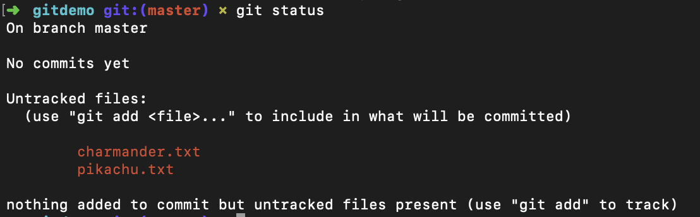
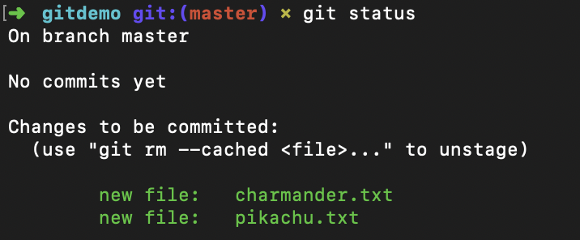
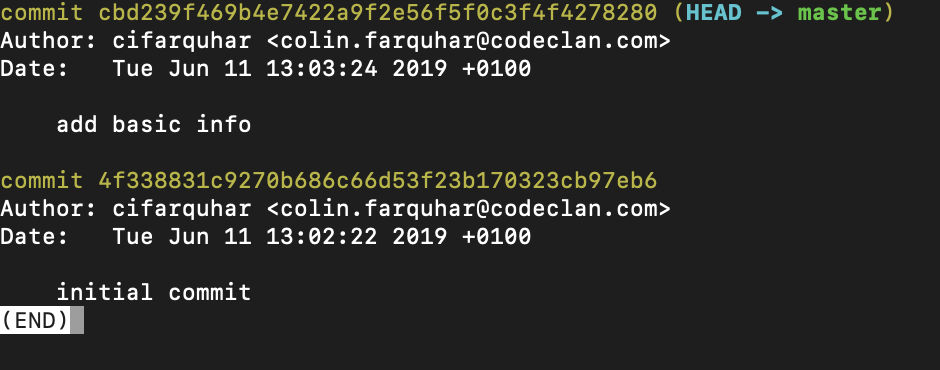
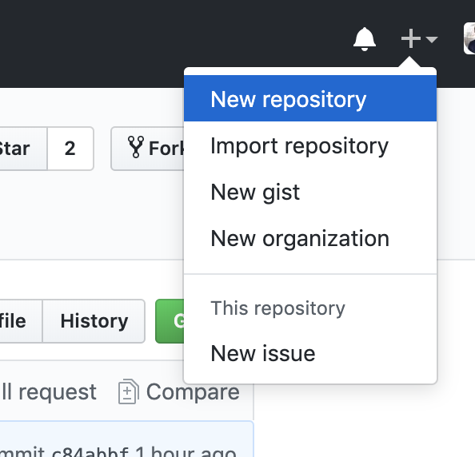

```{r setup, include=FALSE}
knitr::opts_chunk$set(echo = TRUE, fig.align = 'center')
```

# Learning Objectives

* Understand the purpose of source control
* Be able to use Git for source control
  * Stage and commit changes
  * Inspect history and view previous versions of the code
* Be able to integrate local repositories with remotes for off-machine backups

**Duration - 60 minutes**

# What Is Git?

Let's imagine we live in a sad world with no sunshine, no kittens, no sweets and certainly no source control.

If you created any code in this sad world you might have a few things you'd like to do:

1. Back up our code
2. Keep versions of our code as "milestones" to rollback to
3. View a history of what we have done
4. Share our code with other coders (beware working on the same file!)

How would we achieve this without git?

Git allows us to solve these problems.

Git is a version control system. This means it lets us control changes to documents, or in our case, source code. "Source code" being the files that make up your computer programs.

In a nutshell, tools like Git simplify and facilitate sharing files, and changes to files, between multiple developers.

## Git Alternatives

Before we go into detail with Git, it's worth noting that Git isn't the first or only source code control choice.

Historically, source code control was centralised -- a central server would store the files for the repository. In such a system, each developer has a snapshot of the most recent version of the codebase, and would "check out" the files they wanted to edit. While they were working on them, no-one else could make any changes.

The administrators of the server have complete control over the code -- no-one can access it unless they can access the server. This has the side-effect of locking developers to the office, where there is connectivity to their servers.

# Distributed Source Code Control

Git's major difference is that every developer has a complete copy of the code base, and all its history. Although there may still be a "central" repository for all the developers to get and share updates between each other, there is no reason for the developers to be connected to any servers to do their work.

Git simplifies the merging of changes between these distributed repositories, and encourages frequent small changes to files to get rapid development.

# Some Jargon

We call the collection of code stored in git the **repository**.

When we flag a file's changes to be saved to git, we say that the changes are **staged**.

When we save files to git, we say they have been **commited**.

When we roll-back changes we say they have been **reverted**.

When we combine the changes that two or more people have made to a file we call this a **merge**. If people have made different changes to the same line(s) we need to decide which version to use before we complete the merge -- this is called a **merge conflict**.

# Git Lifecycle

1. Initialize a Git **repository** -- this can be done in any directory
2. Add a file and **commit** it to Git
3. Editing the file for Git to consider it modified
4. Stage the file to let Git know you want to record the changes in history
5. Commit the staged changes, and Git logs the changes in history and considers the file unmodified again

Similarly we might edit a file, git will see it has been modified but we can then tell git we are not happy with the changes and to roll it back.

# Typical Workflow

* In Terminal, create a folder. For this lesson start in your `week_01/day_1` folder.

```
  mkdir gitdemo
```
<br>

* Move into this folder

```
  cd gitdemo
```
<br>

* Initialize an empty repository

```
  git init
```
<br>

You will notice that it now says _master_ next to the directory name. This is what is known as a **branch** - do not worry about this too much for now, we'll revist it later.  All you need to rememeber is that code commited to this "master" branch should reflect a current stable version of the code.

* Add a couple of files to the directory
```
  touch pikachu.txt charmander.txt
```
<br>

* Now lets see what the current situation is. We can ask git to show us the current status of our repository.

```
  git status
```
```{r, echo=FALSE, fig.cap="Git Status - Untracked Changes", out.width = '50%'}

```
<br>

Git is telling us that we have "untracked" files. That means that if we make any changes to our files, Git won't notice. If we want to make full use of our version control we need to add our files to the repo, a process called _staging_.

<br>

* Stage the file using Git's `add` command (we can also type out the full file name, but the `.` does all files)
```
git add .
```
<br>

* See the status of the files
```
git status
```
```{r, echo=FALSE, fig.cap="Git Status - Staged Changes", out.width = '50%'}

```
<br>

If we have "changes to be committed" then the files listed are staged and ready to go! We can add them to our repository by _committing_ them.

* Commit the changes
```
  git commit -m "Initial commit"
```
<br>

The `-m` flag indicates that what follows is the _commit message_. These messages describe what has been added to the repo by this commit.

Open the files in atom using `atom .` and add a brief description to each pokemon. Before we add our changes to git, we'll check git's status. We don't want to add files that have been changed accidently do we?

```
  git status
```
<br>

Look -- it now shows that there are files that were modified (If it doesn't, make sure you saved your changes in atom). That's what we want, so let's stage those changes.

```
  git add .
```
<div class="emphasis">
NOTE: We are staging CHANGES to the files, not the files themselves.
</div>

<br>

* Commit the changes
```
  git commit -m "add basic information"
```

<br>

We've made a couple of commits now. If we ever want to look back at our previous messages we can check git's handy log:
```
  git log
```
```{r, echo=FALSE, fig.cap="Git Log", out.width = '50%'}

```

**Git hygiene** is important. Both your colleagues and your future self will appreciate small, descriptive commit messages. When writing a commit message, try to think of it as completing the sentence "This commit will...", eg. "This commit will... add another pokemon file".

# Distributing Our Code

It's important to understand that with Git, we have a local copy of code (like we just made) but there is also remote copies of code that we can "pull" down or "push up" to.

There are many ways to host remote Git repositories; but one of the most common ways is to use [GitHub](http://github.com).

This is a place to store repositorites remotely, acting as a "central" copy of the source code where all participating developers can "push" their code.

This means that we an pull down a copy of open source code and contribute to it.

The great thing about this is that if our laptop blows up, we can pull down a clean working version of our code at any time.

# Adding our Repository to GitHub

If we want to add a remote for our repository, our first step is to log into GitHub, and [create a new, empty repository](https://github.com/new).

```{r, echo=FALSE, fig.cap="New Repository Button", out.width = '50%'}

```

Name your repository, and (optionally) give it a description. For now don't initialize the repository with a README. If you accidentally do - no need to panic; just delete the new repository on GitHub and create one again (skipping the README this time!). A README would typically contain setup instructions, a list of required packages or other configuration details which aren't necessary for us right now. As the contents of your repositories get more complex, you may want to consider adding a README. It's also not necessary to add one when the repo is created; we can add a README to the repo at any time.

<div class="emphasis">
Always choose meaningful names for your repos that accurately describes their content (rather than "My First Repository", for example.) Future employers may want to see your Github account, plus you'll probably want to refer back to them at some point, so well-named repos are really helpful!
</div>

<br>

Copy the SSH path to your clipboard, and then use it to add a new remote to your Git repository:

<br>

<div class="emphasis">
NOTE: Make sure you use the SSH key (not HTTPS) otherwise you will be prompted for your password every time you push/pull
</div>

<br>

```
  git remote add origin git@github.com:USERNAME/REPOSITORYNAME.git
```

<br>


Note that "origin" is just a name - we could call it anything. Origin is just a convention.

When you want to send your local code to GitHub, push it with `git push origin master`. This will push all the committed code in the local master branch (we'll cover branches later) to the remote called '[origin](http://stackoverflow.com/questions/9529497/what-is-origin-in-git)'

# Updating Remote Repositories

When we make changes to files, these alterations are not automatically saved. We need to "push" our changes to our remote branch when we are ready.

Lets add another move to Pikachu.

```
  atom .
```

```
  git push origin master
```

There may be times we commit locally, but not to the remote straight away. This means we can roll-back to a point in our local history if we are not happy with our changes.

Also we are quite lazy, we don't want to always have to say git push origin master do we? We are not paid per character so lets make our job easier.

* To do this we can set the "upstream" so we dont have to say where we want to push to every time.

```
  git push -u origin master
```

Now we can just type

```
  git push
```

And our lives are that much easier. 

Note: You will have to do this for each new repository you create.

Similarly we can pull down other people's changes with the "pull command"

```
  git pull origin master
```

## Creating a local copy of an existing GitHub repository

If you want to make a local copy of a repository that is already on GitHub, you will use the "clone" command.

Open the repository you want to clone in GitHub, and copy the SSH path to your clipboard, and then use it to clone the remote to a new directory on your computer:

```
  git clone git@github.com:USERNAME/REPOSITORYNAME.git
```

<div class="emphasis">
Make sure you don't clone a repository into a directory already tracked by Git. Having repositories inside other repositories can lead to some nasty conflicts down the line.
</div>


# Recap

* How do we initialise a Git repository?
<details>
<summary>**Answer**</summary>
`git init` inside the directory where we wnat the repository
</details>
* How do we add and commit files?
<details>
<summary>**Answer**</summary>
`git add .`
`git commit -m "commit message"`
</details>
* Assuming we have a repository set up on github, how do we push our code to it?
<details>
<summary>**Answer**</summary>
`git push origin master`
</details>

# Additional Resources
* [Git Docs](http://git-scm.com/docs/)
* [Ignoring Files](https://git-scm.com/docs/gitignore)
* [Interactive Tutorial](https://try.github.io/)
* [Git Guide](http://rogerdudler.github.io/git-guide/)
* [Some More Git Features](https://www.youtube.com/watch?v=w3jLJU7DT5E)
* [GitHub Desktop](https://desktop.github.com/)