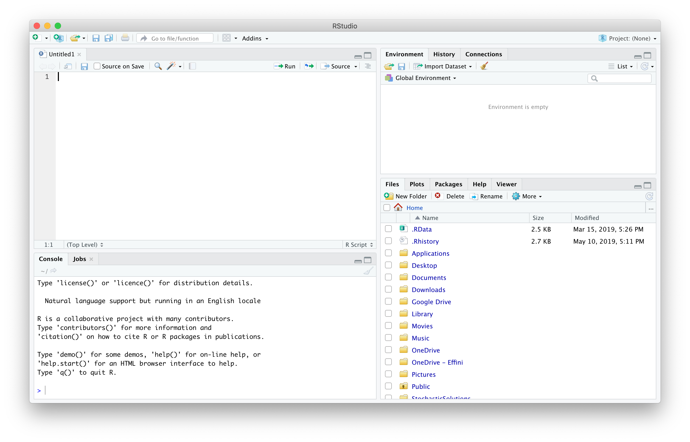
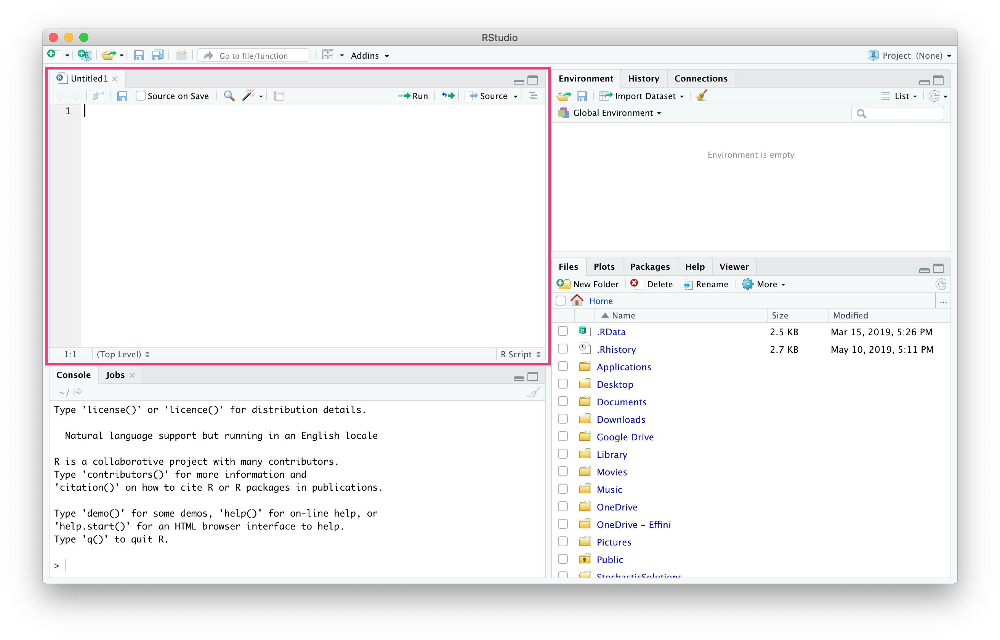
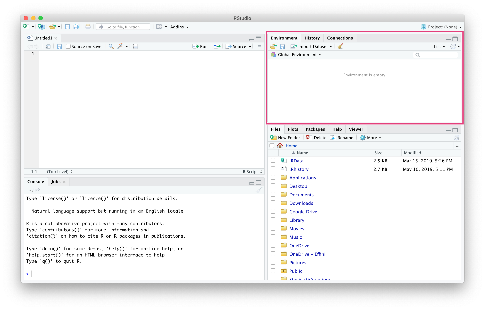
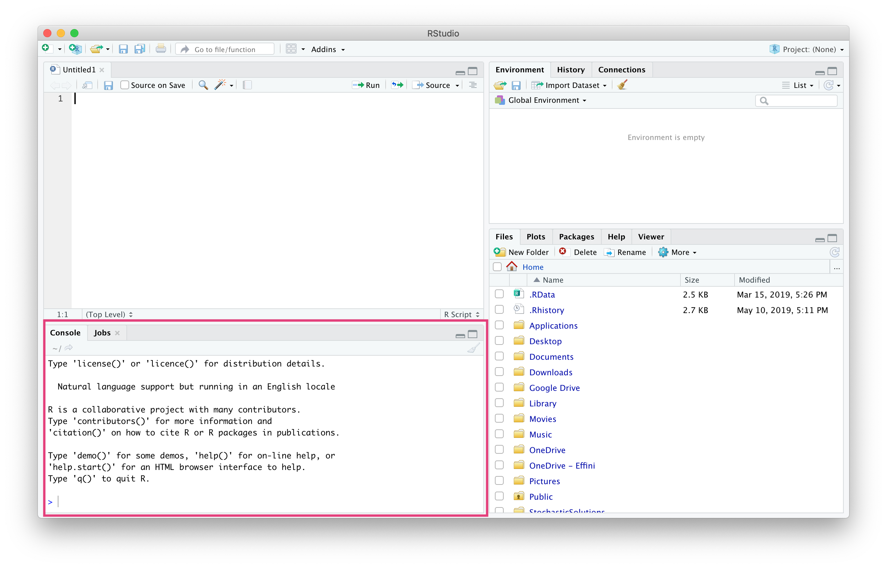
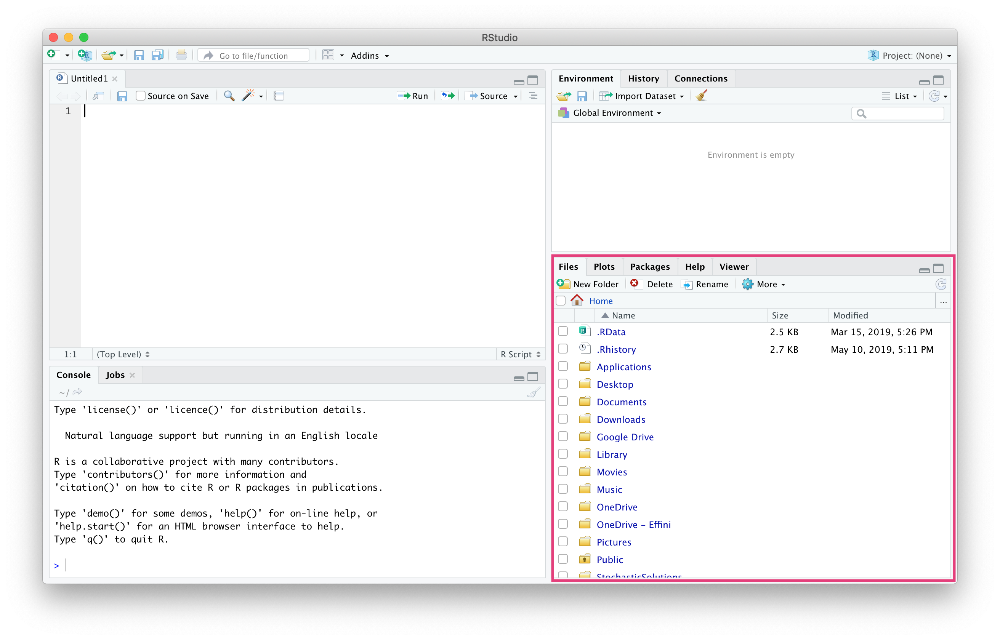

# Learning Objectives

* Know that R and Python are languages for data science
* Understand the difference between R and RStudio
* Be able to use the features of the RStudio IDE
* Be able to work with projects, notebooks and scripts
* Getting version control and git working for an RStudio project

**Lesson Duration: 1 hour**

# R vs. Python

You might have heard of the 'R vs. Python' debate for data science. Both are open-source languages that can be used to do data analysis.

In this course we will be using R. You will already have encountered the basics in the pre-course work.

## The history

The best way to understand the difference between R and Python is to know a bit about their history.

- R was created by Ross Ihaka and Robert Gentleman in 1995 at the University of Auckland. Both authors of R worked as statisticians, and were designing R to help to with statistical analysis. R is based on a language called S, which was also a statistical computing language.

- Python was created by Guido van Rossum in 1991. Python is a general purpose language, that can be used for data analysis, but can also be used for building websites, writing scripts and building applications. Python is a very popular language for learning to code.

## The differences

R was designed for statistics. Python was designed primarily as a programming language. 

- Historically, R had a wider range of statistical analysis and visualisation tools. 

- Python was better designed as a programming language, making it easier to use.

However, the gap between the two languages is closing. Modern R libraries are very well designed and easy to use. The number of Python packages to do data analysis is growing all the time.

Currently, we think that the main libraries for working with data and visualising data are easier to use in R, so we will mainly be using R. However, Python is still an excellent data analysis language. We will be introducing you to Python at the end of the course, so you will be able to compare and contrast. 

## Open source

Both R and Python are open source languages. This means that:

- They are free to use
- Anyone can see the source code for them
- Anyone can expand on them

Obviously being free to use is a big advantage. But the ability to expand is another huge advantage. Both R and Python have numerous external libraries that let you do things outside of the main language. We will be learning about several R libraries (often called R packages) in this course. 

# What is RStudio?

We are going to use an IDE (interactive development environment) called RStudio. While you don't need it to write R code, RStudio makes it easy to do things like:

1. Write longer pieces of code and get R to run it piece by piece
2. Keep track of what data R knows about
3. Preview your data
4. Organise all your R code files
5. See plots and tables you've created in R
6. Make special types of R files e.g. reports, dashboards etc
7. Access R's in-built help
8. Manage and update which R packages (extensions to R) you have installed 

R is free and open source. It is written by volunteers and all the all packages you'll use were also written by volunteers.

RStudio is also free and open source, but is made by a profit making company. They make their money by selling a professional version of RStudio that runs on a sever and has support.

# Installing R and RStudio

First you will need to install the latest version of R, which is available here: https://cloud.r-project.org/

And then you install RStudio: https://www.rstudio.com/products/rstudio/download/

You want to select RStudio desktop open source edition, which is free.

# Using the RStudio IDE

- Open up RStudio
- Open an R Script (File -> New File -> R Script)
- Now you should see 4 windows 

Your RStudio should look like this



## Top left window (Script)

This is your R script - this is where you write the code you want to keep. Most of the time you will be typing here.




## Top right window (Environment, History, Connections)

There are several tabs here. The most important one is the environment tab. This shows you the objects you have created from writing code.



## Bottom left window (Console)

This is the console. This is where R code you write in the top left window gets run. You also might write code directly in here if you know you don't want to keep it.




## Bottom right window (Files, Plots, Packages, Help, Viewer)

Again, there are several tabs here. The most important ones are

- Files: see all the files in your project (more on projects later)
- Plots: see plots that you've created
- Help: view R's help files



# Global Options

Before we start using RStudio we're going to set some options that will make working in RStudio easier.

## Reproducibility

The first and most important option to change is under the Workspace heading. 

- Go to Tools > Global Options
- Set: “Save workspace to .RData on exit” to "Never"

This means that every time you start RStudio, only the code you have written will be saved. You won't be saving the objects made and the libraries loaded. 

This is important because it makes your code *reproducible*, this means if you send your code to someone else they should be able to run it and get the same results as you.

## Changing the theme

Now for something more fun. 

- Go to Tools > Global Options
- Go to the appearance tab on the left hand side.
- Change the theme

From here you can change how RStudio looks. Play around with the colours, text size and font until you find a theme you enjoy. Remember you can change the theme at any time. 

# Projects

## Your first project

When working in RStudio you always want to work inside a project. A project is a special folder that let's RStudio know that all your code, data and other files are in the same place.

Projects also help with reproducibility. Everything you need to replicate your work should be inside the project folder.


* Go to File > New Project 

Here you have two options

1. New Directory: make a new folder on your computer, where a project will live.

2. Existing Directory: change a folder into a project folder.

* For just now we will select New Directory. 

However, later when you are working on new projects you might already have a directory that has the files you need, then you can use existing directory.

* Select New Project

We'll learn about R packages and Shiny Web Applications later.

* Give the project a name

Something like 'FirstProject' will do for just now

* Choose where to put the project

* Click 'Create New Project'

You can tell when you are inside a project because the top left hand corner will show the name of the project. 

## Having multiple projects open at the same time

If you want to have multiple R projects open at the same time then can either:

* right click the R Studio icon on your computer dock and select 'New RStudio Window'
* if you are in an R project you can do 'File -> Open Project in New Session'. If you go 'File -> Open Project' then it will close the current project you are in. 

## Larger projects

At first your projects might only have one notebook and one dataset in them. However, later in the course you will be making big, complicated projects that use many notebooks, R scripts, datasets and produce a range of outputs including PDFs, graphics and new data. 

You may want to introduce a folder structure that looks something like this.

```
notebooks
scripts
raw_data
clean_data
outputs
```

Where you keep all your notebooks in the notebook folder, all your R scripts in the scripts folder etc.

# Writing R Code

Now we are going to write some R code in a *notebook*.

Notebooks are files that have a mixture of code and text. A notebook file has the extension '.Rmd', we will be mostly writing in notebook files throughout this course.

The other option to write code in a script. You will be doing this later. Scripts are special text files that contain only code. Any file that has R code in it will have the extension '.R'.

- File -> New File -> R Notebook
 
When you make a new notebook it's very important to remember to save it.

- File -> Save

Give your notebook a name like 'FirstNotebook.Rmd'

You can also save by pressing cmd+s.

The notebook you've created should tell you a little about notebooks.

- Try running the first chunk using both the run button and the keyboard shortcut.

We would strongly recommend that you get used to the keyboard shortcuts. You will be writing a lot of code in the next weeks - the shortcuts will save you a lot of time!

Read about how to make a new chunk. 

- Now make a new chunk in the notebook and type any basic maths expression.

```{r}
10 + 10
```

- Now try this

```{r}
mtcars
```

Both the **cars** dataset and **mtcars** are *inbuilt datasets*. Most of the time we will be working with data from external sources that you will need to read in. 

- Now try previewing the notebook

## Short cuts

You are going to be writing a whole bunch of code over the next weeks! To save time you should be using the keyboard as much as possible.

```{r}
10 + 10
3 + 3
5 + 10
```

* Press `cmd` and arrows to skip to the end of a row 
* Press `alt` and arrows to skip in "chunks"
* You can combine both of these actions with `shift` to highlight. 

For more RStudio specific shortcuts see: Tools → Keyboard Shortcuts Help.

## Multiple cursors

Another useful shortcut is being able to use multiple cursors. This is particularly useful when you are editing several similar lines at once.

* Press `alt + cmd` and click to place another cursor.
* If you make a mistake placing a cursor, press `alt + cmd + shift` to move the cursor.
* Press `alt` and drag to place multiple cursors in a line.

# Recap

And that's your introduction to RStudio!

* Remember to use a new project every time - it takes a little bit of getting used to, but soon you'll have no problem.

* Try to learn the keyboard shortcuts. They make life easier in the long run. 

# Additional Resources

https://happygitwithr.com/

