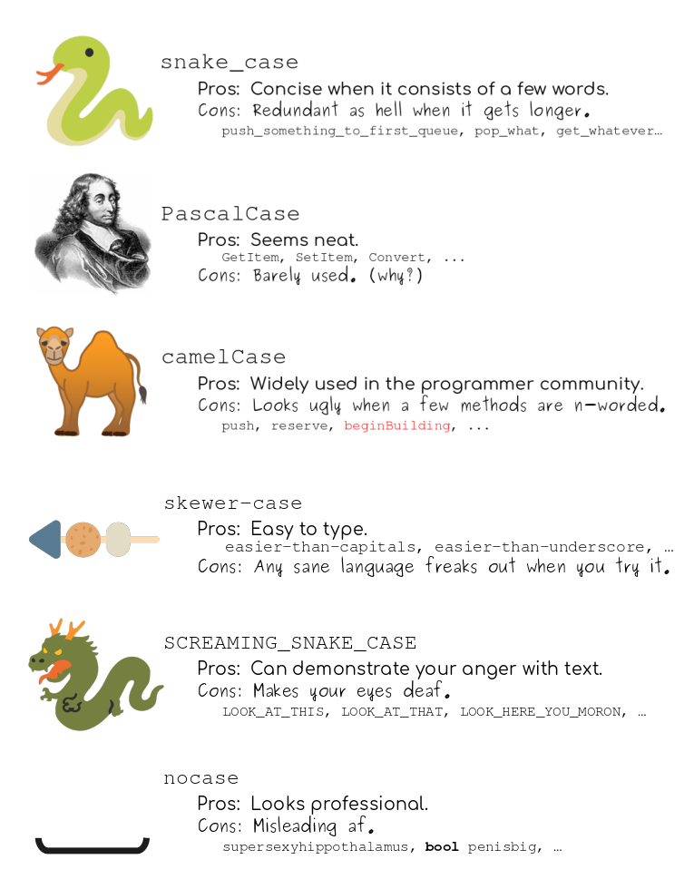

```{r setup, include=FALSE}
knitr::opts_chunk$set(echo = TRUE)
```

# Learning Objectives

* Know what is best practice for coding
* Understand how and why to comment code
* Be able to interpret others code from comments
* Know the different naming conventions for variables
* Understand the rules for writing quality code

**Duration - 1 hour 30 minutes**

In this unit we'll learn about the best practices for writing code. Here you'll learn about writing code that not only works, but is clear to read and perhaps even beautiful.

*** 

# Why do we need to follow best practices?

When you first start learning to program it can be difficult enough to write code that actually works. Why should you also spend time making your code look good? Well, code style is about much more than looking good. 

<br>
<center>

</center>
<br>


The primary audience for the code you write isn't your computer; it's other people. You need to write code in a way that makes it easy for other people to understand. Very few projects of much importance can be done by a single person. If you want to do anything useful and interesting you'll need to work as part of a team, and that team will need to be able to understand the code you've written.

Even if you truly are working individually, you still need to write code that can be understood by yourself! Writing well structured code makes it easier to follow what you are doing. Furthermore, if you come back to a project after several months you might as well be a different person! It's difficult to understate how confusing code that makes sense now can become in a relatively short amount of time. 

*** 

# Our style guide


In this course we will use the tidyverse style guide. For full details of the style guide see this link: https://style.tidyverse.org/

Some of the rules below have very good reasoning behind them. However, others are just arbitrary choices. It's a good idea to follow even the arbitrary rules because it makes working with other people much easier. It will also make writing code easier - when faced with a choice with how to write something, you should know exactly how to do it!

We've summarised the important parts of the the style guide that apply to you just now.

*** 

# Object names

<br>

* Variable and function names should use only lower-case letters, numbers and underscores. This is known as `snake_case`. There is no best method of combining words. The main thing is to be consistent with the convention used, and, if you’re in a team, to come to an agreement on the convention together.

<br>
<center>

</center>
<br>


* When naming data frames, avoid using arbitrary names such as `df`, `test`, `data` or `data1`; give a descriptive name instead. 
* Generally, objects should be nouns and functions should be verbs (more on functions soon!) 
* But beware: avoid overwriting functions and objects already in R

<br>

**Good**

```{r, eval=FALSE}
dates
file_one
file_1
miles <- read_csv("mile_run_times.csv")
convert_miles_to_km <- function(..)
```

**Bad**

```{r, eval=FALSE}
Dates
FileOne
file.one
df <- read_csv("mile_run_times.csv")
MeasurementConvertor <- function(..)
mean
```


<blockquote class = 'task'>
**Task - 5 minutes**

Which of these are bad or good names for a data-frame according to our style guide?

1. BabyWeightData
2. data
3. baby_weight_data
4. babies
5. weighting_babies

<br>
<details>
<summary>**Solution**</summary>

1. Bad - no upper-case letters
2. Bad - bad, don't choose data or df
3. Good
4. Good.
5. Bad - a verb, not a noun.

</details>
</blockquote>

*** 

# Internal structure

<br>

* Always start with your library calls and then reading in data.
* Use empty space to split code into sections.
* Use commented lines of `-` to show larger sections.


**Good**

```{r, eval=FALSE}
library(RXKCD)
library(beepr)

# Showing XKCD images --------------------------

searchXKCD('code')
getXKCD(117)

searchXKCD('stats')
getXKCD(563)

# Making a beep ------------------------------

beep()
```


***

# Spacing and assignment 

* Put a space after a comma
* Do not put spaces inside outside parentheses
* Use `<-` for assignment, and put spaces on either size of it.
* Also use spaces on either side of `=` and `==`.
* Extra spaces are okay if the help align `<-` or `=`.

**Good**

```{r, eval=FALSE}
height[, 5]
mean(height, na.rm = TRUE)
height <- c(1, 3, 4)
height[height == 4]
list(
  total = a + b + c,
  mean  = (a + b + c) / n
)
```

**Bad**

```{r, eval = FALSE}
height[,5]
height[ ,5]
height[ , 5]
mean (height, na.rm = TRUE)
mean( height, na.rm = TRUE )
height = c(1, 3, 4)
height[height==4]
list(
  total=a + b + c,
  mean=(a + b + c) / n
)
```


These rules might seem hard to remember, but these are actually some of the easier rules. Once you see a lot of well-formatted R code, anything breaking these rules looks very wrong!


<blockquote class = 'task'>

**Task - 5 minutes**

Which bits of code break our style guide?

```{r, eval=FALSE}
# 1
age_matrix[3,4]

# 2
subset(babies, weight == 4)

# 3
subset( babies, weight == 4 )

# 4 
data.frame(
  name=name,
  weight=weight,
)

# 5
babies = 
data.frame(
  name   = name,
  weight = weight,
)
```

<br>
<details>
<summary>**Solution**</summary>

1. Bad - No space after a comma
2. Good
3. Spaces before parenthesis
4. Bad - no spaces before `=`
5. Bad - uses `=` for assignment

</details>


</blockquote>

*** 

# Line Length

* Code shouldn't be more than 80 characters per line.
* You can split function calls across multiple files (we saw this above with `list` and `data.frame`). 
* Multiple line function calls should have the function name and opening bracket on one line, arguments on the next lines one tab length in, and finish with the closing bracket on a single line.
* If writing in a notebook your code with wrap at the end of the line, but it's best to avoid this happening.

**Good**

```{r, eval=FALSE}
big_function(
  something = "that",
  requires = many,
  arguments = "some of which may be long"
)
```

**Bad**

```{r, eval=FALSE}
big_function("that", requires, many, arguments, "some of which may be long")
```


*** 

# Quotes

* Use double (") rather than single (') quotes.

*Good*

```{r, eval=FALSE}
"Text example"
```

*Bad*

```{r, eval=FALSE}
'Text example'
```


Why do we do this, if the two are interchangeable? In R there is no character data type, there are only character strings. For consistency with other languages it helps if character strings are delimited by double quotes. The single quote version in R is for convenience.


*** 

# Comments

Commenting code is probably the most important part of best practice. Comments are pieces of text that you can insert in code above chunks that explain why you are doing what you are doing. For example you might have the following piece of code:

```{r, eval = FALSE}
demographics_data <- (mydata, select, name, age, gender)
```

Sure, this might make sense while you're doing it, but what if you come back to this code next year and can't figure out why you're only selecting three variables? This is where commenting would come in:

```{r, eval = FALSE}
# select only these variables as business question is about name, age and gender
demographics_data <- (mydata, select, name, age, gender)

```

So, what are some best practice guidelines for commenting (other than just simply, doing it)? 
Code should have comments to explain what you are doing. However, you don't need comments for every line! Mostly, it should be obvious what your code is doing.

<br>
<center>


</center>
<br>

Places to include comments:

* Explaining why you've done things a certain way
* Explaining the results of an analysis in a script
* Explaining a particularly confusing line of code

However, if you can rewrite your code to be less confusing, that's always a better option than commenting.

Don't use a comment:

* To explain every step
* When a written section of a notebook would be better


*** 

# What should make it into the final code?

In general your final code should have the minimum amount of code that gets you to where you want to go. Don't show failed attempts to do something and don't show calls to functions like `View` or `str` which you use to understand data. 

Sometimes it can be worth keeping code that shows a failed attempt to analyse the data - it's important for other people to know what didn't work. However, for minor problems like trying to rename bits of data only leave the working code.


<blockquote class = 'task'>

**Task - 20 minutes**

Take the code below and rewrite it so it follows all our rules above.

```{r, eval=FALSE}
AmountSpent=c(9.1,8.55,14.32,14.17,14.34,7.97,9.79,11.47,12.44)
Category=c('Lunch'
              , 'Dinner'
              , 'Lunch'
              , 'Lunch'
              , 'Cinema'
              , 'Drinks'
              , 'Lunch'
              , 'Lunch'
              , 'Dinner')
my.week.of.spending=data.frame(AmountSpent=AmountSpent, SpendingCategory=Category)
str(my.week.of.spending)
View(my.week.of.spending)
my.week.of.spending
sum(my.week.of.spending$AmountSpent)
sum(subset(my.week.of.spending,SpendingCategory=='Lunch')$AmountSpent)
```

<br>
<details>
<summary>**Solution**</summary>

Something like this. Your solution might not exactly match; code best practices are more of an art than a science.

```{r, eval=FALSE}
# Defining the data -------------------------------------------
amount_spent <- c(
  9.1,
  8.55,
  14.32,
  14.17,
  14.34,
  7.97,
  9.79,
  11.47,
  12.44
)

category <- c(
  "Lunch",
  "Dinner",
  "Lunch",
  "Lunch",
  "Cinema",
  "Drinks",
  "Lunch",
  "Lunch",
  "Dinner"
)

spending <- data.frame(
  amount_spent = amount_spent, 
  category = category
)

# Finding sums -------------------------------------------

# Overall amount spent
sum(spending$amount_spent)

# Amount spent of lunch
lunch_spending <- subset(spending, category == "Lunch")
sum(lunch_spending$amount_spent)
```
</details>

</blockquote>

*** 

# Styler

Lots of these rules can be applied automatically using the `styler` package: http://styler.r-lib.org/

Install by using `install.packages`.

```{r, eval=FALSE}
install.packages("styler") 
```

Now in RStudio you should have a button called 'Addins' at the top of your screen. 

* Highlight the code you want to style.

* Click Addins and choose 'Style Selection'.

<blockquote class = 'task'>

**Task - 5 minutes**

Use `styler`to style our messy code from the task before (pasted below). What does it do for you and what still needs to be done?

```{r, eval = FALSE}

AmountSpent <- c(9.1, 8.55, 14.32, 14.17, 14.34, 7.97, 9.79, 11.47, 12.44)
Category <- c(
  "Lunch",
  "Dinner",
  "Lunch",
  "Lunch",
  "Cinema",
  "Drinks",
  "Lunch",
  "Lunch",
  "Dinner"
)
my.week.of.spending <- data.frame(AmountSpent = AmountSpent, SpendingCategory = Category)
str(my.week.of.spending)
View(my.week.of.spending)
my.week.of.spending
sum(my.week.of.spending$AmountSpent)
sum(subset(my.week.of.spending, SpendingCategory == "Lunch")$AmountSpent)
```

</blockquote>

*** 

# Other best practices 

Code best practice is about more than spaces and new lines. It's also about writing code which is as readable and useful as possible. 

Becoming a better programmer is a life-long task. You should always be looking to improve the quality of the code you write. These short tips should get you started.

## Be reproducible

Reproducibility will be discussed in more detail later this week, but the short version of it is: reproducible code means that other people can understand and check what you've done. There's lots you can do to make your project completely reproducible. For now, with our simple projects, just make sure you use RStudio's project functionality and include all your library calls at the top of the file.

## Short is better than long

In general code that does the same thing in less lines of code is better. The less code you have to read through, the easier it is to understand what the code is doing. 

## But clarity is far better than conciseness

However, if you ever have the choice between making something shorter, but less clear always choose the clearer option. Short is only good if it makes code easier to understand. Longer code can often be more explicit about what it is doing.

## Fast is better than slow

You want to write analysis code that runs fast. When you start working with large data, where every operation you perform takes a long time, you'll see how important fast code is. Being able see results close to instantaneously makes it much easier to change your code and get the best results. As you become more familiar with different programming techniques and functions, you'll be able to write code that runs a bit faster.

## But avoid premature optimisation

There're two mistakes to avoid when speeding up code. Firstly, speeding up code often makes the code less clear, so only speed up code if you defiantly need to. The second mistake is to assume you understand what is making the code slow. Take the time to measure exactly what is taking the time with your code. There is tools in RStudio to help you measure the speed of parts of your code. Measuring code speed is also called *profiling*.

## Don't be afraid to rewrite

If you are doing anything complicated, you will rarely right code perfectly the first time round. Don't be afraid to go back and rewrite code to make it clearer or faster. Simultaneously, don't be afraid to write imperfect code! It's generally much easier to rewrite something that works than to get it perfect the first time round. 

<blockquote class = 'task'>

**Task - 30 minutes**

Rewrite your homework from last night homework so that it 

1. Follows our style guide
2. Follows the other best practices as best as you can

Now pair up with someone and read each others code. Can you understand what they've done? Is there anything they could have done better?

</blockquote>

***

# Recap

* When writing any code you want to follow a style guide. Use whatever style guide the organisation you are part of follows.
* We are using the tidyverse style guide. This can be automatically implemented using the `styler` library.
* Writing good code is about more than style. Try to make your code clear, reproducible and as fast as it needs to be.

# Additional Resources

http://styler.r-lib.org/

https://style.tidyverse.org/

The Pragmatic Programmer by Andrew Hunt and David Thomas - A classic book about how to write quality code. 
