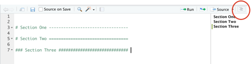

```{r setup, include=FALSE}
knitr::opts_chunk$set(echo = TRUE)
```

# Learning Objectives

* What is reproducibility and why it is important 
* Different ways you can make your work as clear, organised and reproducible as possible

**Duration - 1 hour**


This week we have learnt about best practices in coding and how to write beautiful looking code that is easy to read and review. But the code is only one part of a data project and there are good practices that apply to other aspects of a project, which all help with a common issue - **reproducibility**. 

# Reproducibility vs. replicability?

<center>
{width=70%}
</center>

The American Statistical Association definitions of the two terms are as follows: 

**Reproducibility:** *A study is reproducible if you can take the original data and the computer code used to analyse the data and reproduce all of the numerical findings from the study. This may initially sound like a trivial task but experience has shown that it’s not always easy to achieve this seemingly minimal standard.*

**Replicability:** *This is the act of repeating an entire study, independently of the original investigator without the use of original data (but generally using the same methods).*

Although the definitions are geared towards research settings these can hold in commercial settings too. Have you ever been asked to update a figure or graph in a presentation that someone else did and you can’t work out how they produced it? Or you’ve been asked to investigate a figure and you can’t replicate it? Or, even worse, you did it but can’t remember how or where you produced it from! 

Reproducible analysis is the practice of recording each and every step in a data analysis. There are lots of tips and tricks of how to make sure you make your work as organised, structured and reproducible as possible. 

<center>

</center>

# Organise your project 

As discussed earlier in the week, using a project in R (rather than stand alone files) is the first step towards reproducible work. And the second step would be to keep everything organised in your project so it's easy to find. The following folder structure within a project is clear:

```
notebooks
scripts
raw_data
clean_data
outputs
```

A big thing here is **not to make any changes to the raw data files**. If they are excel/csv file can put read-only settings on it so no one is able to change them. 

## File Names

* Try think of meaningful names for your files, that describe what you are doing.
* Separate words with underscores. Don't use spaces or other special characters and keep lowercase.
* Use git for version control to avoid having different versions of the same file.
* If you have multiple files that need to be run in a certain order, prefix them with a number.

<blockquote class = 'task'>
**Task - 2 minutes**  

```
clean_data.R
0_download.R
1_explore.R
clean data.R
clean_data_8_final.R
2_clean_data.R
plots.R
stuff.R
3_visualise.R
Plots.R
```


<details>
<summary>**Solution**</summary>

**Good**

```
clean_data.R
plots.R

0_download.R
1_explore.R
2_clean_data.R
3_visualise.R
```

**Bad**

```
clean data.R
stuff.R
clean_data_8_final.R
Plots.R
```


</details>

</blockquote>


# Automated updating analysis & output 
 

## Flexible code

We want to make code flexible. By flexible we mean if your data is refreshed, and you have new rows or columns of data (potentially with new categories of data) then where possible your code will still work as expected, even with this new data. 

Of course, if it is a quick one off task it may not be worth it but often flexible code, although may take a bit longer at the beginning, it will likely pay-off later (and help reduce mistakes on refreshes). Not to mention if it’s flexible you may be able to reuse for other tasks. 

For example - in the ‘Getting started in R’ lesson we had an task to select a single column from the exam_results dataset. 

```{r}
# Dataset creation
student <- c("Abigail", "Bjorn", "Caitlin", "Dave", "Elly", "Francis")
question_1 <- c(10, 3, 1, 5, 5, 8)
question_2 <- c(2, 5, 5, 4, 5, 6)
question_3 <- c(4, 5, 9, 7, 6, 8)
exam_results <- data.frame(student, question_1, question_2, question_3)
```

```{r}
# Subsetting column by column number
exam_results[, 1] # method 1

# Subsetting column by column name
exam_results[, "student"] # method 2
```

Both of these methods do the same thing. But in the second one is easier to understand what the code is doing from first glance (without going back to the table and understanding what is in column 1). It also protects against new columns being added to the table or our column being removed - which with indexing (method 1) our code may still run, but not as we expected. 

There's aren't many flexible examples by end of week 1, but you will come across a few this weekend/Monday of next week and so can come back to here next week for reference.

<details>
<summary>**Flexible code examples**</summary>

**Week 2 Day 1 homework:** for loading in data will be looping through many excel tabs to pull data into R. Because we won't be hard coding pulling each tab in one by one, but rather looping through the tabs, even if extra tabs are added our code will still pull through all the tabs in the file.  

**Extra programming tasks:** you are asked to remove any trailing rows in a dataframe that are just rows full of NAs. Rather than hard coding that we want to subset the dataframe up to from looking by eye what the last non-NA row is, say the 25th row (e.g. dataframe[1:25, ]) we would want to write code to identify which is the last non-NA row and use that to subset. By doing this if the data was to change and the last non-NA row is no longer row 25 our code would still act as expected. 
</details>
<br>

Automating checks are also useful. For example if you have a variable and expect the values to be within a certain threshold (e.g. 0 to 1) then creating a check with code to run it across your data means even if the underlying data is refreshed the check can be rerun. 

```{r}
# vector of some random numbers i.e. our data
x <- c(0.1, 1, 0.55, 1.2)

# if a number is less than 0 or more than 1 then returns a 1, else returns a 0. Because we want all numbers to be between (inclusive) 0 and 1 we would want every entry in the check vector to be 0. 
check <- ifelse(x<0 | x>1, 1, 0)

# if sum the check across the data is more than 1 then means at least 1 of the entries does not meet the check and so return a message to flag this.
if (sum(check) > 0) {
  print("check") 
  } else {
  print("ok")
}

```


## Automated output
Making reports/slides in R Markdown (which is what we use to create the classnotes) is ideal because then when data refreshes the report refreshes. This avoids human error of copy and pasting the wrong table/graph/figure into reports or presentations, or it not being the most up to date version of the output etc. It also majorly reduces the time spent when there are any changes/updates to be made. 

We will be covering using R Markdown in week 3. 

# Organised & easy to read code 

## Functions & modular code

* If you find yourself reusing the same functionality chunk of code then **turn it into a function** that can be reused. 

<center>
{width=70%}
</center>

Some of the reasons to make functions for reproducibility are:

* consistency of calculations
* easier to maintain - fix once rather than amending each time have used in different scripts
* easier to test/debug functions than a long, unstructured script
* reusability
* easier to review and understand
* easier to share your function with others

If these functions are quite long it can be useful to store these functions in separate scripts within your project and then use the source() function to run the function prior to running your main R script. 

For example, if you created a function, say to only return first 5 entries of a vector, and saved that into a script called 'subset_function.R' 

```{r}
# save this to a script called subset_function.R

subset_function <- function(x) {
  
  subset <- x[1:5]
  
  print(subset)
  
}
```

You can then call upon this script from another script (do this at the top of your file) using the source function  e.g. ("path/tofile/here.R"). 

So if we then wanted to use this subset function in another script would do something like:

```{r, eval=FALSE}
source("subset_function.R")

numbers <- c(1, 3, 6, 8, 9, 10, 11)

subset_function(numbers)

```

If the script of the function is saved in the same folder as the other script then do not require any filepath. But say you had a folder within your project called 'functions' and had saved all your function scripts in there then would source it via

```{r, eval=FALSE}
source("functions/subset_function.R")
```


<blockquote class = 'task'>
**Task - 2 minutes**  

Create a new project. Take the following 2 functions and save them into two separate files in your project called '01_multiply_function.R' and '02_add_function.R' and 

```{r}
multiply_by_n <- function(x, n){
  x*n
}

add_two <- function(x){
  x + 2
}
```

Create a final script (can be either an R Script i.e. .R or a notebook i.e. .Rmd) called 'main_script.Rmd' and use the source() function to call on both these functions and then use the functions in your main script to calculate what 2*4 + 2 is.  

<details>
<summary>**Solution**</summary>

Open the project in your classnotes folder for this class is named 'source_test'.

</details>

</blockquote>

You can also modularise your script in a similar way, even if not creating your own functions. This is quite common for data cleaning i.e. have a separate data cleaning script which run first and then save the clean data to a file (perhaps an csv), which will then call this file in for the analysis in the 'main' script.

Again you can use the source() function to do this. The difference with it not being stand alone functions is you need to write the output of these modular scripts to a file (which uses memory) and read these outputs into your main file. 

## Code sections

* As previously mentioned **code sections** allow you to break a larger file into subsections for easy navigation between them. Click the button on top left of source and it allows easy navigation between sections. 

<center>

</center>


Or you can use keyboard shortcuts for creating and navigation to sections. 

  * Insert Section — Cmd+Shift+R 
  * Jump To — Shift+Cmd+Optn+J

<blockquote class = 'task'>
**Task - 2 minutes**  

Take a few minutes to create sections in a blank R script (not notebook) and navigate between these using both the menu and the shortcuts. 

</blockquote>


## Documentation

Documentation is very important for projects and reproducibility. It gives:

* An outline of the purpose and objectives of the project. 
* Instructions for someone to follow if they are to enter/return the project at a later date.
* Evidence of all decisions, assumptions and logic used. 
* Dates and versions of outputs used for reporting and presenting. 

A couple of tips for documentation:

* Assume no prior knowledge - you may have been heavily involved in a project for a while and may well take for granted everything you have learnt (and what you didn't know at the start!). It is better to 'overexplain' than leave people unable to follow. 
* Providing worked examples can often help with explanations. 
* If using any open data then document any URL links used, and the date the data was extracted (as these can move/be updated)
* The time period any data used covers and the date the code was run.  
* Save any emails into the folder where any decisions or assumptions were evidenced. 
* Ensure any assumptions made that would affect the analysis if this code was to be used again (or elsewhere) 
e.g. You're working on a financial services project and you're doing analysis on types of bank accounts customers can have. An assumption you have made during the process of the project (perhaps after speaking to credit card product owners) is that a customer requires a current account with a bank to be able to have a credit card, and that this assumption is used somewhere in the code. 


### README 
A README is a documentation file that introduces and explains a project. It contains information that is commonly required to understand what the project is about. Often people create these when posting projects onto Github. They are usually written in Markdown, so can include links, images and formatting (such as headers, bullet points etc.) to make it easier to read/navigate.

If have an open project, in that you may be looking/open to people contributing to it, you want to make it easy for people to be involved and to understand the motivation behind the project. 

You may want to include information such as:

* Background/intro to project - purpose of the project and output. 
* Languages/technology used - R, SQL etc. 
* How to run the project 
* Screenshots - particularly if it is a dashboard that is not running on a server and so user would need to run the code to view it.
* Data used - if open data, where it is sourced (and dates etc), if an API or synthetic data then information on this. 
* Features/packages used (particularly if need to credit them). 
* Versions of packages used

<blockquote class = 'task'>
**Task - 5 minutes**  

Take a few minutes to browse some README files on Github. 

Can type 'language:R' into the search bar in Github and will return projects using the language R.

</blockquote>

## Version control 

Git! No more ‘final FINAL.ppt’ and ‘I REALLY MEAN FINAL.ppt’ and uncertainty over which version was actually used. 

## Computing environment - version of R, version of packages

An environment consists of all the dependencies required to enable your code to run correctly/as you expect. This includes R itself, R packages, and system dependencies. As with many programming languages, it can be challenging to manage reproducible R environments.

R packages have complex dependency relationships - each R library is tied to a specific version of R and a library must have a consistent set of packages that work together.

If multiple people are working on the same project but on local versions of R Studio it means they each may have different versions of R and different versions of packages. Additionally, if you come back to a project you had been working on a while ago you can have issues if in that time R and it's packages have been updated to new versions. There is a chance your script may no longer work as expected. 

It's not something you will have to worry about on this course, but it is good to have an awareness of for the future. Below are two possible solutions to reproducing the computing environment - **R Studio Server** and **Snapshot and Restore** (for R Studio Desktop). 

### R Studio Server

If you work in an organisation with many people working with R you may be working on an **R Studio Server**. RStudio Desktop, that you are using now, is an application on your computer and so works with whatever version of R (and the loaded packages) you have installed onto your computer. But R Studio Server is hosted on a remote server and you access it via a webpage (but the interface looks the same as the desktop version). 

{width=40%}{width=40%}

There are many benefits to using R Studio Server (such as larger computing power) but one of the key things is it's usability for multiple people working on the same data and projects (whether that be at the same time or into the future). Data can be held one place and accessed by everyone logging into the server, and for reproducibility, there is the ability to ensure the R package versions are standardised. 

### 'Snapshot and Restore' strategy - for R Studio Desktop 

If working on R Studio Desktop there are steps you can take to create a frozen environment of libraries, which is specific to a project, and save it. This environment of libraries can then be reloaded when you want to run this specific project in the future.

Again, this is not something you need to worry about on this course but if you want to learn more (or need in the future) the below are some useful resources:

* A handy explanation from R Studio about the snapshot and restore strategy: https://environments.rstudio.com/snapshot.html 
* `renv` package allows you to create these snapshots of library versions: https://rstudio.github.io/renv/articles/renv.html
* `checkpoint` package ensures that all of the necessary R packages are installed with the correct version: https://cran.r-project.org/web/packages/checkpoint/vignettes/checkpoint.html

Another thing you may see is people stating the versions of packages that they have used for a project in the comments of their code/in their documentation (as an alternative to this 'Snapshot and Restore'). If you want to list the versions of libraries you have loaded in a project you can use the `sessionInfo()` function in base R. 

```{r}
# test by loading a library - say lubridate (which we installed on day 2)
library(lubridate)

# code to return loaded libraries (not those included in base R) and their versions
installed.packages()[names(sessionInfo()$otherPkgs), c("Package", "Version")]
```


## Workspace
The workspace is all of the objects and functions you have created (or loaded into) your current session. 
If you wanted to save/store your workspace (or just specific objects from it) you can save them to .RData files (which are files specific to R). RDS file stores a single R object and RData can store multiple objects ((or your whole workspace). You're then able to load these files into later sessions, preserving the data types etc. This can be useful when your analysis takes a long time to run and you want to save interim results. 

More more information on RData files this is a useful link: http://www.sthda.com/english/wiki/saving-data-into-r-data-format-rds-and-rdata

<blockquote class = 'task'>
**Task - 2 minutes**  

Create a new object, animals, a vector of types of animals.  

```{r}
animals <- c("dog", "otter" , "fish")
```

Use the function saveRDS() to save this object to a file on your computer. Use the command remove() to remove the object from your environment and then use the function readRDS() to load it back into your environment (again assigning it to the name 'animals').

You will need to read the help files for saveRDS(), remove() and loadRDS() to know how to use these. You access a help file by entering '?function_name()' into your console. 

<details>
<summary>**Solution**</summary>

```{r}
animals <- c("dog", "otter" , "fish")

saveRDS(animals, file = "animals.RDS")

remove(animals)

animals <- readRDS(file = "animals.RDS")

```


</details>

</blockquote>


# Work arounds 

Technologies such as Git and R Markdown are great at setting up for reproducibility. But  what happens if not in an environment where can use Git? Or are expected to have all outputs in Office365 not Markdown?

Hopefully you can be part of the change and make a case for using these tools but sometimes the reality of legacy systems won't allow it yet. Here are some tips to minimise risk of errors if you find yourself in this situation:

## Audit trail

<blockquote class='task'>
**Task** 

Open the example file excel_dashboard_example.xls

</blockquote>


* Make sure have a clear audit trail i.e. begin your project folder with a document with instructions for the project - e.g. what code to run, in what order and then where to paste data to produce graphs etc. in Excel. 

* Colour code your excel file - e.g. 
  * Purple: pasted data
  * Author input: green
  * Formula: light yellow
  * Linked cell (linked to dropdown etc.): bright yellow
  * Key output: blue


* Any checks in Excel should be done via formulas (again so auto update). e.g. IF((E12>5), “ok”, “CHECK”)

* Formulas should be based on columns (i.e. SUM(A:A)), not areas (i.e. SUM(A1:A5)), in case data is updated and the number of rows is extended.

* Following this practice there should only be a single activity in each column (not stacked in a single column) so can easily read from left to right. This should allow autorefresh of any analysis, checks or graphs if new data pasted in. 

* When doing anything in Excel use formulas wherever possible. Using clickable shortcuts (e.g. sorting columns) means that there is no audit trail of the steps taken during workflow and makes reproducibility/updates difficult.  


## Version control

### File names 
If in organisation where don’t have version control such as Git, then make sure have naming conventions (date, name, version) 

*e.g. 20191018_end_of_year_sales_v0.1*

For version numbers start at v0.1 and then work up to v1, which is the ‘final’ one (perhaps the version that gets presented at a meeting). If any changes are then made after this can start at v1.1 and so on.

### Code header
At the top of code have information about this version of the code such as title, author, version, assumptions, peer review and small description of changes to past versions can be good practice.  

```{r}
  # ---------------------------------------------------------------------
  # ======================================================================
  #  ----- File Name:
  #  ----- Description: 
  #  ----- Output:
  #  ----- Created Date:
  #  ----- Created By:
  # ======================================================================
  #  ----- Assumptions:
  # ======================================================================
  #  ----- Version History:
  # ======================================================================
  #  ----- Peer reviewer:
  #  ----- Peer review date:
  # ======================================================================
  # ------------------------------------------------------------------------
```


## Output 
* Any graphs or figures in a presentation or report reference the Excel file name and location where they are from (and date the data used was extracted) in the presentation file. 

# Citation
Some of the high level areas for reproducibility were covered in Mine Cetinkaya-Rundel's talk 'The results in Table 1 don’t seem to correspond to those in Figure 2' at DataTech 2019. 

# Additional resources
Good enough practices in scientific computing: https://journals.plos.org/ploscompbiol/article?id=10.1371/journal.pcbi.1005510#sec001  
A Guide to
Reproducible Code
in Ecology and
Evolution (but pretty much all of it is useful in general) https://www.britishecologicalsociety.org/wp-content/uploads/2017/12/guide-to-reproducible-code.pdf

