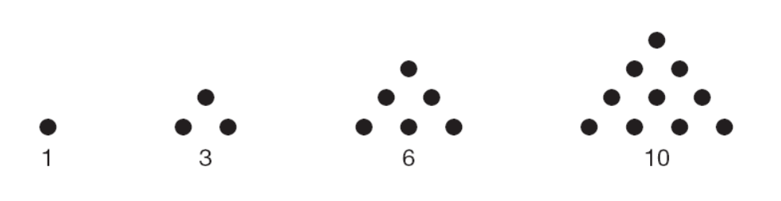

```{r setup, include=FALSE}
knitr::opts_chunk$set(echo = TRUE)
```

# Learning Objectives

* Be able to demonstrate all the concepts from the pre-course
* Be able to demonstrate best practice coding
* Be able to demonstrate competent use of the RStudio IDE

**Duration - 4 hours**

Answer these questions in notebook

* Remember to make a project.
* Remember to use your best coding practices

# Vectors

## Making Vectors

Go find the weather forecast in Edinburgh over the next 5 days. Assign three vectors that contain weather forecasts for

1. The temperature
2. The chance of rain
3. The cloud cover

It's up to you how to represent the data and how to name the vectors.

What is the type of each vector you have created?

```{r}
temperature <- c(15L, 13L, 8L, 7L, 17L)
chance_of_rain <- c(0.03, 0.1, 0.63, 0.72, 0.05)
cloud_cover <- c("Sunny", "Sun/Clouds", "Cloudy", "Cloudy", "Sunny")
```

```{r}
class(temperature)
class(chance_of_rain)
class(cloud_cover)
```

## Naming Vectors

Make another vector with the days of the week for the next 5 days. Name the three vectors you have created with days of the week.

```{r}
days_of_week <- c("Thursday", "Friday", "Saturday", "Sunday", "Monday")
names(temperature) <- days_of_week
names(chance_of_rain) <- days_of_week
names(cloud_cover) <- days_of_week
```


## Means

Find the average temperature and chance of rain over the next 5 days.

(Hint: you might need to change how you created the vectors if mean won't work on them)

```{r}
mean(temperature)
```
```{r}
mean(chance_of_rain)
```


## Selecting vectors

1. Select only the temperatures that are higher than average.

2. Select only the the temperatures when the chance of rain is lower than or equal to the average. 

3. Select only the cloud covers from the weekend.

```{r}
temperature[temperature > mean(temperature)]
```
```{r}
temperature[chance_of_rain <= mean(chance_of_rain)]
```
```{r}
cloud_cover[c('Saturday', 'Sunday')]
```

## Putting it together - spelling test

The vector below contains marks out of 10 in a spelling test:

```{r, echo = TRUE}
test_results <- c(6, 7, 9, 7, 9, 3, 9, 7, 3, 8, 10, 5, 5, 9, 7, 5, 9, 8, 9, 5)
```

Write R code to answer each of these questions

1. How many marks do we have?

2. What was the average mark?

3. What was the highest and lowest result?

4. How many people scored each mark?

5. Express each mark as a percentage out of 100

6. How many people scored eight or higher?


```{r}
# 1
length(test_results)

# 2
mean(test_results)

# 3
sort(test_results) # lowest was 3, highest was 10

# 4
table(test_results)

# 5
test_results*10

# 6 - a few ways of answering this one.
length(test_results[test_results >= 8])
# another alternative
sum(test_results >= 8)
```
# Matrices

## Creating a matrix

Find a 14 day forecast and create a matrix of the forecasts for temperature, where each week is one row.

You will want to assign the matrix to a name. You should also give the matrix row names and column names. 

```{r}
forecast_14_days_vector <- c(14L, 20L, 14L, 11L, 14L, 15L, 16L, 18L, 17L, 13L, 16L, 16L, 
18L, 16L)

forecast_14_days <- matrix(
  forecast_14_days_vector,
  nrow = 2,
  ncol = 7, 
  byrow = TRUE
)

rownames(forecast_14_days) <- c("Week 1", "Week 2")
colnames(forecast_14_days) <- c("Thursday", "Friday", "Saturday", "Sunday", "Monday", "Tuesday", "Wednesday")

forecast_14_days
```

## Averages

Find the average temperature each week.

Find the average temperature on each day of the week (i.e the average temperature on the two Mondays, the two Tuesdays etc.)

```{r}
rowMeans(forecast_14_days)
colMeans(forecast_14_days)
```


## Selecting

Select:

1. The third day of the second week
2. The whole second week
3. All Wednesdays

```{r}
forecast_14_days[2, 3]
forecast_14_days[2, ]
forecast_14_days[, "Wednesday"]
```


## Matrix arithmetic

Convert your temperatures from Celsius to Fahrenheit by multiplying all elements of your matrix by 1.8, then adding 32.

```{r}
forecast_14_days * 1.8 + 32
```

# Factors

Now we will go back to our 5 day forecast.

Make the vector with the days of the week into an ordered factor, where the order correspond to the order of days in a week, starting Monday.

Now select only the temperatures after Tuesday.

```{r}
days_in_order <- c(
  "Monday",
  "Tuesday",
  "Wednesday",
  "Thursday",
  "Friday",
  "Saturday",
  "Sunday"
)

days_of_week_factor <- factor(
  days_of_week,
  levels = days_in_order,
  ordered = TRUE
)

temperature[days_of_week_factor > "Tuesday"]
```


# Data Frames

## Creating data frames

Again, we will use our 5 day forecast. Create a data frame with the vectors you have already made for

1. The temperature
2. The chance of rain
3. The cloud cover
4. Day of the week (use to ordered factor version)

Assign a name to the data frame and give the columns of your data frame appropriate names.

After you have made the data frame, remove the original vectors by using `rm`. This will avoid naming conflicts when working with the data frame. 

```{r}
forecast_5_days <- data.frame(
  temperature = temperature,
  chance_of_rain = chance_of_rain,
  cloud_cover = cloud_cover,
  days_of_week = days_of_week_factor
)
```

```{r}
rm(temperature)
rm(chance_of_rain)
rm(cloud_cover)
rm(days_of_week)
rm(days_of_week_factor)
```


## Selecting data frames

1. Select only the rows where the temperatures are higher than average.

2. Select the rows when the chance of rain is lower than or equal to the average. 
3. Select only the rows that happen after Tuesday.

```{r}
subset(forecast_5_days, temperature > mean(temperature))
```

```{r}
subset(forecast_5_days, chance_of_rain <= mean(chance_of_rain))
```

```{r}
subset(forecast_5_days, days_of_week > "Tuesday")
```


## Sorting data frames

Sort the data frame so that the highest temperatures come first.

```{r}
positions <- rev(order(forecast_5_days$temperature))

forecast_5_days[positions, ]
```

# Lists

## Creating lists

Create a nested named list with 5 elements, one for each day in your forecast.

Each list element should have the name of the day of the week. Inside each element should be another named list that tells you the temperature, chance of rain and cloud cover.

```{r}
# This is a slightly shorter way to do it, using the data frame we already have
forecast_5_days_list <- list(
  "Thursday" = as.list(forecast_5_days[1, 1:3]),
  "Friday"   = as.list(forecast_5_days[2, 1:3]),  
  "Saturday" = as.list(forecast_5_days[3, 1:3]),
  "Sunday"   = as.list(forecast_5_days[4, 1:3]),
  "Monday"   = as.list(forecast_5_days[5, 1:3])
)
```

## Selecting from lists

Using the list you've just made find:

1. The chance of rain on Sunday
2. The cloud cover on Friday
3. The temperature on Thursday

```{r}
forecast_5_days_list$Sunday$chance_of_rain
forecast_5_days_list$Friday$cloud_cover
forecast_5_days_list$Thursday$temperature
```

Was it easier to create a list or a data frame? Was it easier to select the elements from the list or from the data frame?

# Harder Questions 

## Harder Question 1

The sequence below shows the triangle numbers.



You can calculate the the nth triangle number with the formula

$$
T_n = \frac{n(n + 1)}{2}
$$

So the 5th triangle number is

$$
\frac{5(5 + 1)}{2} = 15
$$

Find the sum of the first 1000 triangle numbers.

```{r}
n <- 1:1000
triangle_numbers <- n*(n + 1)*0.5
sum(triangle_numbers)
```


## Harder Question 2

If we list all the natural numbers below 10 that are multiples of 3 or 5, we get 3, 5, 6 and 9. The sum of these multiples is 23.

Find the sum of all the multiples of 3 or 5 below 1000.

From Project Euler (Problem 1) (https://projecteuler.net/)

```{r}
all_numbers <- 1:999
multiples <- all_numbers[all_numbers %% 3 == 0 | all_numbers %% 5 == 0] 
sum(multiples)
```

## Harder Question 3

Here's a secret message in a very simple code. The number 1 corresponds to the letter a, the number 2 corresponds to the letter b etc. The number 27 corresponds to a space.

Use R to decode this message:

23, 18, 9, 20, 9, 14, 7, 27, 18, 27, 3, 15, 4, 5, 27, 9, 19, 27, 6, 21, 14

<details>
<summary>**Hint**</summary>

You can use the built in constant `letters`. 

</details>

```{r}
convertor <- c(letters, ' ')
number_code <- c(23, 18, 9, 20, 9, 14, 7, 27, 18, 27, 3, 15, 4, 5, 27, 9, 19, 27, 6, 21, 14)

convertor[number_code]
```

```{r}
# We can make it a little easier to see the answer
paste(convertor[number_code], collapse = '')
```


