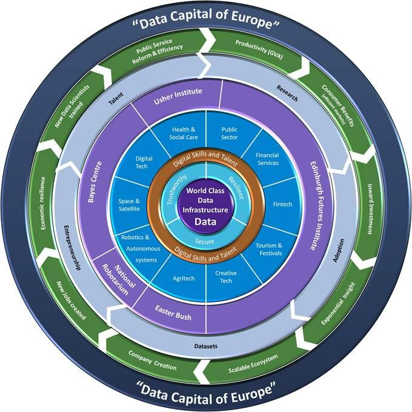
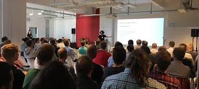
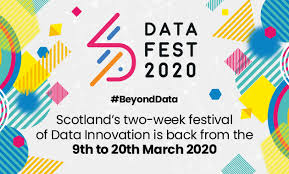
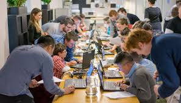
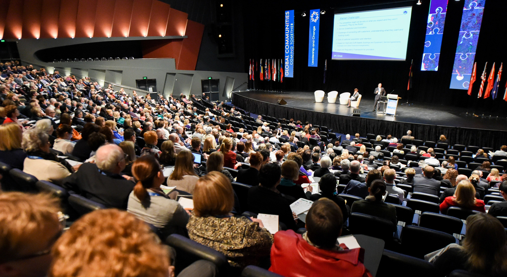

This document is a bit of a work in progress so if you know of any good resources/meet ups then please say and can add them!

# Data industry in Scotland
We are so lucky to live in Scotland when it comes to data:

## Investment

It is estimated that the data industry will be a £20 billion opportunity for Scotland’s economy by 2020 (https://www.scottish-enterprise.com/support-for-businesses/develop-products-and-services/data-driven-innovation). There is an ambition for Edinburgh to be the data capital of Europe, and it can be seen in terms of government funding and investment. For example in the 2017 City Region Deal £60 million was given towards a Data Driven Innovation programme (https://ddi.ac.uk/) and in 2018 the Data Lab secured £13.5m of Scottish Government funding (2018) to run for another 5 years (https://www.thedatalab.com/news/the-data-lab-secures-13-5m-scottish-government-funding/). 

{width=300px}

 

## Opportunities & network 

All this investment means a lot of potential opportunities and connections. The beauty of Scotland is that it’s big enough that there are lots of opportunities from many different sectors but small enough that connections made can really have an impact. 

There are loads of great tech/data events for a range of languages and interests and are great for getting to meet people in the sector and hear about companies and what kind of work they are doing. Don’t underestimate what a small conversation or connection made at a meetup or event can make - I’ve got both my data jobs through meeting people at meetups (both of which are listed below). 

# Meetups

Below are a list of potential meet ups in Scotland. Most of the meetups below are on the Meetup site/app (https://www.meetup.com/) but there are quite a few data events on Eventbite (https://www.eventbrite.co.uk/) too. Eventbrite tends to be more one-off talks or hackathons rather than regular events.

We've written a bit of information about some different ones which I've been along to so perhaps these might not of interest to you but would give Meetup a search to see if anything that is

 {width=57%}

## R meetups
Edinburgh (edinbR): https://www.meetup.com/EdinbR/  
Glasgow (R Glasgow): https://www.meetup.com/RGlasgow/

* **Who for?** Interested/work in R.
* **Where?** Once a month on a Wednesday
* **When?** EdinbR at Edinburgh Uni and Glasgow at Reinfield Street
* **Typical event?** Usually 2 talks a meeting, usually on commercial or academic projects people have worked on in R or highlighting particular packages people may not be aware of.

**Personal highlights**  

* Someone tracked tweets relating to Edinburgh Fringe via Twitter API in R to analyse the most popular shows over the month of August
* Social networking analysis of Scottish farmers
* Scottish school teacher using R & R markdown to report on school results (rather than the usual word reporting his department were using, saving them lots of time!)
* Whole session on debugging in R
* Hadley Wickham did a session a few years ago: https://www.youtube.com/watch?v=rz3_FDVt9eg

## PyData Edinburgh
https://www.meetup.com/PyData-Edinburgh/

* **Who for?** Interested/work in Python, specifically for data.
* **Where?** Once a month, usually on a Thursday.
* **When?** Various hosting companies around Edinburgh
* **Typical event?** Usually 1 or 2 talks and some lightening talks (doesn’t need to be specific to Python and they are always looking for newbies to do these!).

**Personal highlights**

* Python coding for wearable health devices to predict right before people have a serious health indecent 
* Language processing of words (highlight was showing code which would emojis on a 2D graph with ‘similar meaning’ emojis close together, all from NLP!) https://twitter.com/PyDataEdinburgh/status/959145849438777346?s=20

## Scotland Data Science & Technology 
https://www.meetup.com/Scotland-Data-Science-Technology-Meetup/

* **Who for?** Interested in data and technology and what different companies are doing in this space.
* **Where?** Alternate months being hosted in Glasgow and Edinburgh (and they have ones in Aberdeen too). Sometimes these are live streamed (link posted in the meet up group if so). 
* **When?** Once a month
* **Typical event?** Range of data and technology centred talks run by MBN Solutions who are a recruitment company who specialise in data careers. Less code-y talks, and more about companies work or projects, so particularly good for meeting others in the industry.

**Personal highlights**  
Haven’t made it along in a while but there have been talks by Data Scientists at the BBC, FanDuel, H2O.ai, Deloitte, Mudano. 

## Digital For Good 
https://www.meetup.com/Digital-For-Good/events/262805479/

* **Who for?** Anyone in the charity sector interested in tech and anyone in the tech industry interested in using their skills to help third sector organisations. 
* **Where?** Various locations
* **When?** Once a month, usually on a Thursday.
* **Typical event?** Can differ a lot - sometimes more talk focused and sometimes more network focused. Have also run a weekend hackathon session.

**Personal highlights**
From the first meet up connetced with a contact through which got involved in 2 charity data projects - one of which I still am involved with. Also went along to another meet up with a CodeClan student and they connected with a mental health charity in Glasgow and have signed up to help with some of their Power BI reporting. 

## DataKind Data Ethics Bookclub
https://www.eventbrite.co.uk/o/datakind-uk-4112514489

* **Who for?** Interested in data ethics
* **Where?** CodeClan (but may be in different venues in the future)
* **When?** Usually once every 6 weeks
* **Typical event?** In small group discuss a set of blogs/articles/a book, with some ethical prompt questions.   

**Personal highlights**
Past ethical topics have been autonomous vehicles and the impact of automation on financial inclusion. 

## Edinburgh Data Visualisation 
https://www.meetup.com/meetup-group-vBHbCmgh/

* **Who for?** Interested in data visualisation
* **Where?** Edinburgh Uni
* **When?** Usually once a month on a Thursday. 
* **Typical event?** Usually 2 talks about different data visualisation projects or tools. 

## Royal Statistical Society 
Have a mailing list rather than a Meetup site:  
Edinburgh: https://www.rss.org.uk/RSS/Get_involved/Local_groups_folder/Edinburgh_Local_Group.aspx?WebsiteKey=bc86df55-c2ae-4d73-8450-66ecc8988ded&hkey=e8b0d89e-bbdb-4b43-b30a-7ecdad5c4fed  
Glasgow: https://www.rss.org.uk/RSS/Get_involved/Local_groups_folder/Glasgow_Local_Group.aspx?WebsiteKey=bc86df55-c2ae-4d73-8450-66ecc8988ded&hkey=b7a3349a-086e-4878-921a-64487354e12d

* **Who for?** Interested in statistics
* **Where?** Edinburgh and Glasgow groups
* **When?** More adhoc but regular. 
* **Typical event?** Talk by someone on a project or area of statistics they are interested in. 

**Personal highlights**  
Been to a few good ones on work by Scottish Government, 'Strictly come visualising' (data viz), National Records and predicting disease spread. 

## Others

### Promoting gender diversity

**Girl Geek Scotland** http://www.girlgeekscotland.com/  
Do a great programme of events on networking, CV, personal branding, negotiation skills. Meet ups are ticketed via Eventbrite. 

**R-Ladies Edinburgh** https://www.meetup.com/rladies-edinburgh/  

**Women Who Code** https://www.meetup.com/Women-Who-Code-Edinburgh/  
Sometimes more geared towards software devopler topics but been to a few great ones including Gillian Wright who is working on the new James Webb Space Telescope and intro to Raspberry Pi - and how to turn it into a retro games console.

### Academic - data in the social sciences 
**Edinburgh Futures Institute** https://www.eventbrite.co.uk/o/efi-16502944589  
Tackling the world’s biggest challenges within the economy, education and societies.  
Went to an interesting talk about big data in politcal campaigning, including microtargeting and analysis of Twitter data during the EU referendum. 

**Edinburgh Centre for Data, Culture & Society** https://www.eventbrite.co.uk/o/edinburgh-centre-for-data-culture-amp-society-19809042401  
Aims to create an environment in which data-driven research can grow and thrive for those working/researching in Arts, Humanities and Social Sciences. 

### Others
**IBM Code Edinburgh** https://www.meetup.com/IBM-Code-Edinburgh/  
Series of hands-on workshops on a variety of technologies

**Protectors of Data Scotland (PODs)** https://www.meetup.com/Protectors-of-Data-Scotland-PODs/  
Group of data protection and privacy professionals interested in information rights and the practical aspects of good data protection practice.

**ORG Glasgow** https://www.meetup.com/ORG-Glasgow/  
Group for discussion, debate and action around digital rights issues like electronic privacy, censorship of the Internet, open data, open government and copyright.

**Glasgow SQL User Group** https://www.meetup.com/Glasgow-SQL-User-Group/  
Group focuses on data professionals who work with Microsoft’s data platform & related products and technologies. E.g. Azure, SSRS, SSIS, SSAS, MDS, PowerBI, T-SQL, PowerShell etc.

**Amazon Web Services User Group Edinburgh** https://www.meetup.com/Amazon-Web-Services-User-Group-Scotland/  
Talks will primarily cover the technical aspects of AWS services, featuring real-world use cases.

**Python Edinburgh** https://www.meetup.com/Python-Edinburgh/  
For anyone who is interested in Python, from beginner to advanced. Usually once a month in a pub for a relaxed networking and learning environment. 

# DataFest
https://www.datafest.global/  
2 week data festival in Scotland made up of different parts.

 

## Data Summit
2 day conference *‘presenting compelling stories on data driven innovation with keynotes, panels, pitches and lots of inspiration’*.

Past speakers include:

* Cathy O’Neil (mathematician and author of ‘Weapons of Maths Destruction’)
* Nicola Sturgeon (First Minister of Scotland)
* Christopher Wylie (Cambridge Analytica whistleblower)
* Hilary Mason (founder of Fast Forward Labs) 
* Hannah Fry (professor of mathematics, author of ‘Hello World: How to be human in the age of the machine’ and BBC presenter).

## DataTech
1 day event that *‘brings together members of industry, the public sector, and academia for technical presentations and discussions of salient topics in data science, to share technical expertise, and engage in networking and collaboration’*.

## Data Talent
1 day event that *‘brings together aspiring data science and engineering students with employers from across the country’*.

## Fringe events
A series of events run across Scotland across the 2 week festival. *'Run by external partners under the DataFest umbrella. This can include hackathons, debates, meetups, and any innovative activities focused on data innovation and collaboration'*. Vast majority, if not all of these, are free to attend. 

# Volunteering

 

## DataKirk
https://twitter.com/TDatakirk  
Mentors for weekly data club empowering young people and adults with data literacy and analytics skills for the jobs of tomorrow 

## DataKind
https://www.datakind.org/  
Can get involved with volunteering in a number of ways:

* **DataCorps**: brings together teams of pro bono analysts with social change organizations on long-term projects (6 months) that use data science to transform their work and their sector. 
* **DataDives**: 48 hour high energy, marathon-style events where mission-driven organizations work alongside teams of volunteer data scientists, developers, and designers to use data to gain insight into their programs, the communities they serve and more. 
* **Office hours**: 2 hours every month charities can sign up to come along and ask their data questions to a team of pro bono analysts. 

## CoderDoJo
https://coderdojo.com/

Coding club for anyone aged 7-17 who can come along and have a go at making their own game, website, stories and much more. You do not need to be a programmer to mentor at a Dojo! A lot of mentors are attendees' parents who have no technical experience at all when they start. 

# Twitter

 

Most (if not all) of meetup organisations listed above will have a twitter account. 

## General
* DataLab: https://twitter.com/DataLabScotland
* JD Long: https://twitter.com/CMastication

## SQL
* Julia Evans: https://twitter.com/b0rk

## Data visualisation 
* Information is Beautiful: https://twitter.com/infobeautiful

## Ethics/society 
* datacontroversies@UoE : https://twitter.com/datacontrovers1
* UN Centre for Humanitarian Data: https://twitter.com/humdata
* Centre for Data Ethics & Innovation: https://twitter.com/CDEIUK
* C4 News FactCheck: https://twitter.com/FactCheck
* Urban Big Data Centre: https://twitter.com/UrbanBigData

## Government 
* ScotStat: https://twitter.com/ScotStat
* Office of National Statistics: https://twitter.com/ONS
* Data Science Campus: https://twitter.com/DataSciCampus

## R
* rstats hashtag
* tidytuesday hashtag
* R4DS online learning community: https://twitter.com/R4DScommunity
* Hadley Wickham: https://twitter.com/hadleywickham
* R Studio Tips: https://twitter.com/rstudiotips
* One R Tip a Day: https://twitter.com/RLangTip
* Mongo Solutions: https://twitter.com/MangoTheCat
* Mine CetinkayaRundel: https://twitter.com/minebocek
* Alison Haunted Hill: https://twitter.com/apreshill
* Mara Averick: https://twitter.com/dataandme

# Podcasts

 

**More or Less: Behind the Stats**: try to make sense of the statistics which surround us.
https://www.bbc.co.uk/programmes/p02nrss1/episodes/downloads

**Becoming a Data Scientist**: interviews with data scientists or someone on their way to becoming a data scientist, to learn about their path to get to where they are today.
https://podcasts.apple.com/gb/podcast/becoming-a-data-scientist-podcast/id1076448558

**Women in Data Science**: leading women in data science share their work, advice, and lessons learned along the way. Learn about how data science is being applied and having impact across a wide range of domains, from healthcare to finance to cosmology to human rights and more.
https://www.widsconference.org/podcast.html

**DataLab**: a series of conversations with some of the top members of the data science community. Run by organisors of DataFest.
https://www.thedatalab.com/podcasts/

**Not So Standard Deviations**: latest in data science and data analysis in academia and industry
http://nssdeviations.com/

**The Science of Everything (Basic Concepts in Statistics)**  
https://fods12.podbean.com/e/episode-79-basic-concepts-in-statistics/

# Conferences 
Conferences are also a great way to meet people and learn about different companies and the work they are doing. Many conferences have scholarships/cheaper tickets for people new to data and also underrepresented groups. If you are interested in going but not through a company sponsorship don’t be afraid to email and say you are paying as an individual and new to the industry - worth an ask!

{width=50%}

 

**DataFest (Edinburgh)**  
See above!

**O’Reilly Strata Data Conference (San Jose, London, New York)** https://conferences.oreilly.com/strata  
Strata is the largest data conference series in the world, run by O'Reilly (publishers of many data and programming books) and Cloudera (large US software platform company). Attended by a mix of business leaders interested in doing things with their data and people with data skills and tools/platforms. 

**Women in Data Science (Stanford)** https://www.widsconference.org/  
Steams online and has videos from past conferences on the website. Can also take part in Datathon leading up to conference. 

**EARL (London)** https://earlconf.com/  
The Enterprise Applications of the R Language Conference (EARL) is a cross-sector conference focusing on the commercial use of the R programming language. The conference is dedicated to the real-world usage of R with some of the world’s leading practitioners.

**Open Data Science Conference (London, San Fran, Boston, Bangalore, Sao Paulo)** https://odsc.com/london/  
One of the largest applied data science conferences in Europe. Our speakers include some of the core contributors to many open source tools, libraries, and languages.

**Women in Data UK (London)** https://womenindata.co.uk/  
Provides a platform for female and gender diverse data professionals to share their technical knowledge and experiences, and to encourage more diverse representation in the industry.

**Demystifying Data Science (Free & online)** https://www.thisismetis.com/demystifying-data-science  
Conference for Aspiring Data Scientists, Data-Focused Business Leaders and Practitioners.

# Books/Resources
Below is a list of books about focusing on different data topics.

{width=250px}

 

**R resources** https://paulvanderlaken.com/2017/08/10/r-resources-cheatsheets-tutorials-books/  
Free courses, books, tutorials, & cheat sheets

**What I Wish I Knew Before Learning to Code**
 https://ebook.welearncode.com/

**Information is Beautiful**
Data visualisation book
https://informationisbeautiful.net/books/

**Weapons of Math Destruction** https://weaponsofmathdestructionbook.com/  
Data ethics - ‘How Big Data Increases Inequality and Threatens Democracy’

**Hello World: How to be Human in the Age of the Machine** http://www.hannahfry.co.uk/helloworldhttp://www.hannahfry.co.uk/helloworld  
Data ethics 

**Factfulnes** https://www.gapminder.org/factfulness-book/  
Instincts that distort our perspective and how often informed by unconscious and predictable biases - useful when thinking about how people perceive statistics. 

**The Art of Statistics: How to Learn from Data** https://www.goodreads.com/book/show/43722897-the-art-of-statistics  

