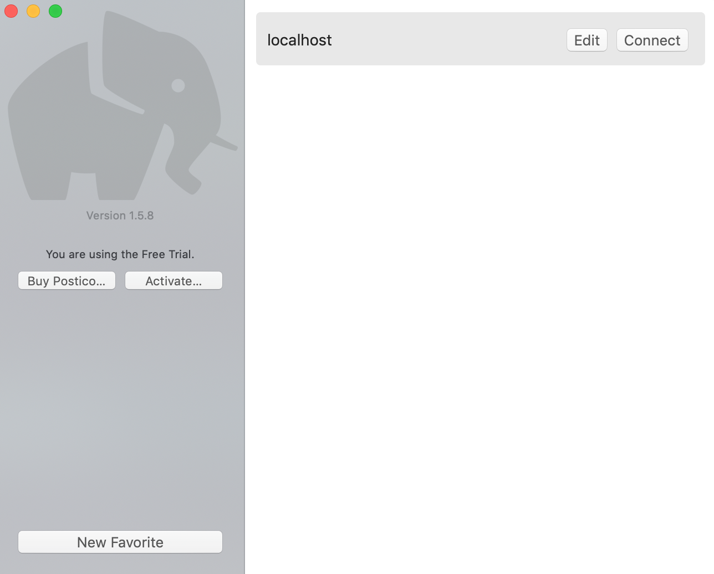
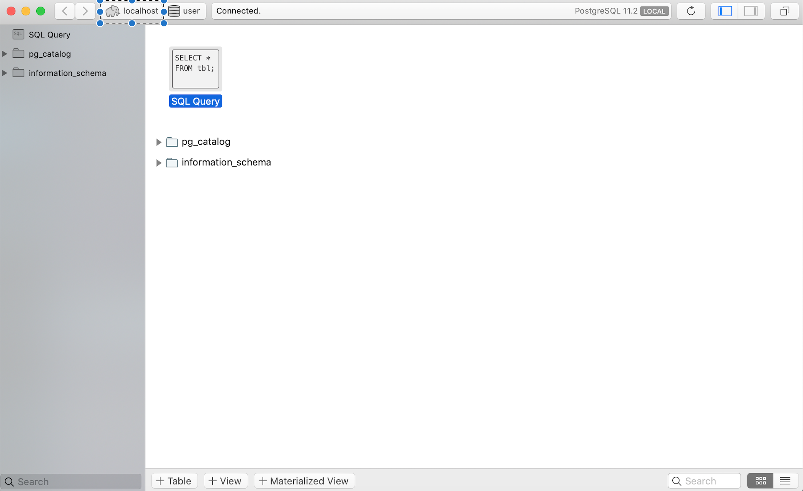
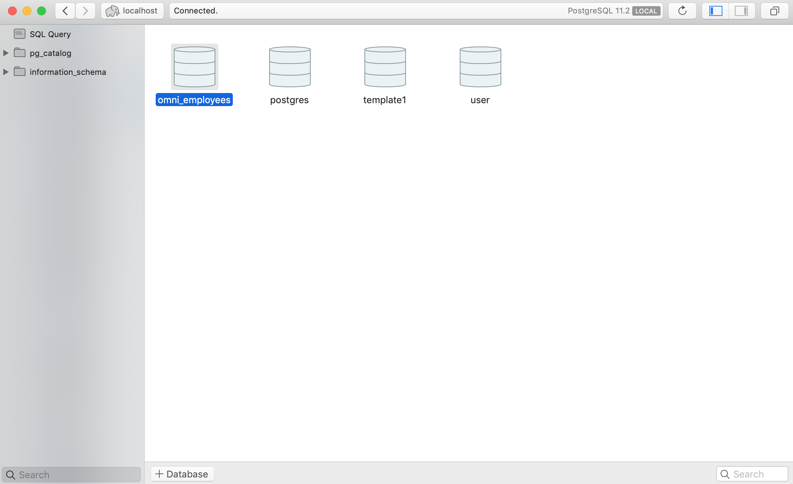
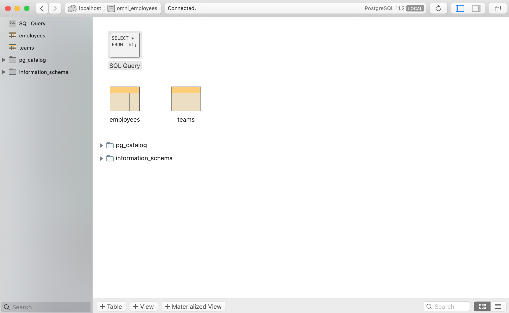
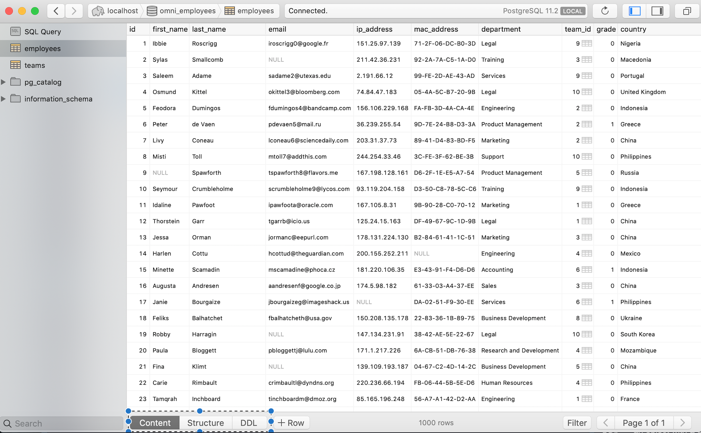
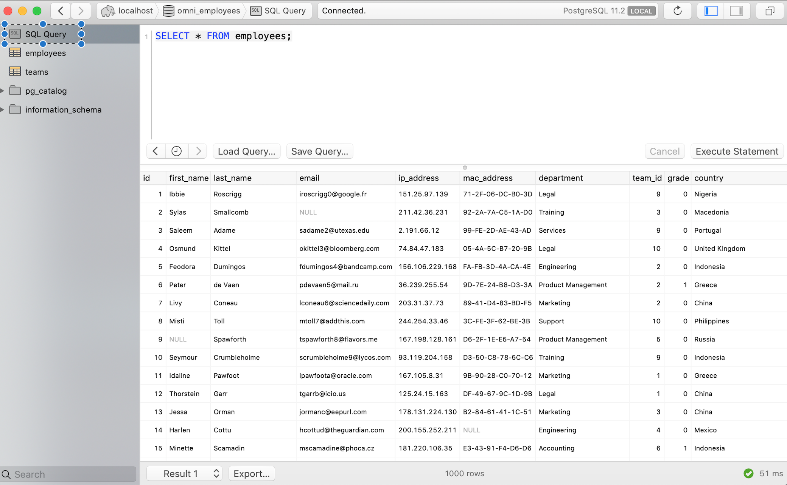

<div class="blame">
author: "Del Middlemiss"<br>
date: "12th June 2019"
</div>


```{r setup, include=FALSE}
knitr::opts_chunk$set(echo = TRUE, fig.align = 'center')
```
# Learning Objectives<br>

* Starting the Postico PostgreSQL graphical client
* Connecting to a database
* Exploring tables
* Running SQL commands

**Duration - 10 minutes**<br>

Some users prefer a graphical user interface (GUI) over a command line interface (CLI) to work with applications. So far we've been using the `psql` CLI (as well as R) to interface with PostgreSQL, but we can also use the Postico GUI. It's down to personal preference: use whichever tool you are most comfortable with!<br><br> 

Here's a whirlwind tour of the Postico GUI for PostgreSQL databases.

<hr>

# Start up the client

Look for the Postico app in Launchpad (this should have been installed by our script at Meet Your Cohort)

```{r, echo=FALSE, fig.cap="Figure 1. The Postico icon", out.width = '25%'}

```
<br>

We get the startup screen. You can either connect to `localhost`, which is set up by default, or create a connection to a remote host using the `New Favorite` button at the bottom left.

```{r, echo=FALSE, fig.cap="Figure 2. The startup screen", out.width = '60%'}

```

Go ahead and click 'Connect' on `localhost`. This will connect to the PostgreSQL server on your **own** machine.

<hr>

# Connecting to a database

On connecting to a host, Postico often opens the `user` database by default. This is likely not what we want. Click the `localhost` chevron in the top left corner to see all the databases on the server.

```{r, echo=FALSE, fig.cap="Figure 3. Select localhost", out.width = '90%'}

```

Here's the screen showing all the databases available. Let's double-click on the `omni_employees` database.

```{r, echo=FALSE, fig.cap="Figure 4. All available databases", out.width = '90%'}

```

Now we see a view showing the `omni_employees` database in detail: in particular, the two tables `employees` and `teams`.

```{r, echo=FALSE, fig.cap="Figure 5. The omni_employees database", out.width = '90%'}

```
<br>

<hr>

# Exploring tables

Double click on `employees` to explore that table in more detail. This takes us to a view of the table something like

```{r, echo=FALSE, fig.cap="Figure 6. The employees table", out.width = '90%'}

```

Down at the bottom left of this screen, we have three ways in which to view the table: 

* the raw **Content**, showing the data in tabular form
* the **Structure**, which shows the name, data type and other parameters of the fields (columns)
* the **DDL** or 'data definition language', which contains the specification of the table in SQL syntax

In the Content tab, you can alter the contents of cells directly by double-clicking on them.

<hr>

# Running SQL commands

You can run SQL commands on the database by using the 'SQL Query' button in the top left of the screen

```{r, echo=FALSE, fig.cap="Figure 7. The SQL Query view", out.width = '90%'}

```

Enter the query, hit 'Execute Statement', and the results will be shown in the pane below.


