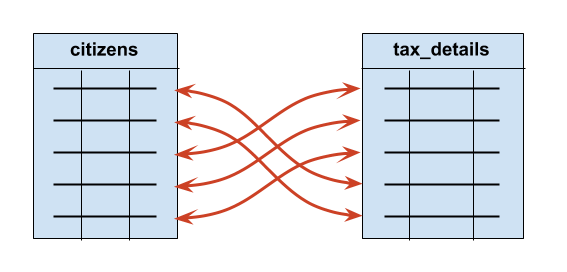
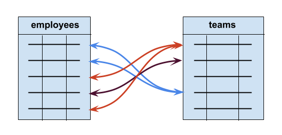

<div class="blame">
author: "Del Middlemiss"<br>
date: "13th June 2019"
</div>


```{r setup, include=FALSE}
knitr::opts_chunk$set(echo = TRUE, fig.align = 'center')
```
# Learning Objectives<br>

* Be familiar with the different types of table relationships
* Understand how keys create relationships

**Duration - 30 minutes**<br>

So far we have been extracting, manipulating and returning data from **single tables** in the database (in fact, just the `employees` table so far). But we know from our discussion yesterday that **relationships** between tables are important in SQL. After all, we are learning about **relational databases** in general.

Three questions arise:<br>

<center>**"What sort of relationships can we have between tables?"**</center><br>
<center>**"Will we ever need to simultaneously access data from multiple tables to solve a problem?"**</center><br>
<center>**"If so, how do we write a single SQL query to do this?"**</center><br>

This lesson will answer the first question via a short section of theory. The next lesson covers the last two questions!

<hr>

# Table relationships

Two tables can be related to each other in three ways:

* One-to-one
* One-to-many
* Many-to-many

where 'one' and 'many' refer to records (i.e. rows) in each of the tables. So the phrase 'one-to-one' should be read in full as 'one row in table A is linked to one row in table B', and so on. We'll discuss these relationships one at a time with examples of their use, but first we need to talk about **foreign keys**!

## Foreign keys

Relationships between tables are set up by adding **foreign key columns**. We've already seen the `PRIMARY KEY` column of a table: this establishes a **unique identifier** (usually an `INT`) for each row that cannot be `NULL`.<br><br>

<center>*A foreign key is a column in a table that contains values corresponding to the primary keys of **another** table*</center><br>

Recall the `zoo` example from yesterday. We ended up with two tables: `animals` and `diets`. <br><br>

**animals**

| `id` | `name` | `age` | `species` | `diet_id` |
| --- | --- | --- | --- | --- |
| 1 | Leo | 12 | Lion | 2 |
| 2 | Tony | 8 | Tiger | 2 |
| 3 | Matilda | 6 | Cow | 1 |
| 4 | Bernice | 12 | Bear | 3 |

<br>

**diets**

| `id` | `diet_type` |
| --- | --- |
| 1 | herbivore |
| 2 | carnivore |
| 3 | omnivore |

<br>

<blockquote class='task'>
**Task - 2 mins** Look at the tables above again. Which of the columns in each table are `PRIMARY KEY`s. Do either of the tables contain `FOREIGN KEY` column(s)? If so, which column(s)?

<details>
<summary>**Solution**</summary>
The `id` columns of both tables are `PRIMARY KEY`s: these contain the unique identifiers for each row. The `diet_id` column of table `animals` is a `FOREIGN KEY`: it contains values corresponding to the `PRIMARY KEY`s of the `diets` table.
</details>
</blockquote>

The three table relationships we mentioned above come down to **how** we insert foreign keys into tables, and what **constraints** we put upon them! 

## One-to-one

Consider a government tax database containing two tables: `citizens` and `tax_details`. We expect that **one** row in `citizens` will be linked to **one** row in `tax_details`, and vice-versa. So **each** citizen has **one** set of tax details, and **one** set of tax details will belong to **one** citizen.  

```{r, echo=FALSE, fig.cap="Figure 1. A one-to-one table relationship", out.width = '60%'}

```

How do we arrange foreign keys to achieve this one-to-one relationship? We put a foreign key in **one** of the tables and make it **unique**. Here's the table specification:

```sql
CREATE TABLE citizens (
  id INT PRIMARY KEY,
  --and other fields...
)

CREATE TABLE tax_details (
  id INT PRIMARY KEY,
  citizen_id INT UNIQUE NOT NULL REFERENCES citizens(id),
  --and other fields...
)
```

In this case we make the `citizen_id` foreign key `NOT NULL` as well, as it doesn't make much sense for this use case to have a tax details record that is not linked to a citizen.

The `REFERENCES` operator is what sets up the foreign key: we state that the `citizen_id` of the `tax_details` table will contains `id` values from the `citizens` table.

Here's a summary of the table design:

* each `tax_details` record **must** be linked to **one and only one** `citizens` record
* each `citizens` record is linked to **zero or one** `tax_details` record

Strictly speaking, this is a **one-to-zero-or-one** relationship. True one-to-one relationships are better implemented within a single table.

## One-to-many

Next, think about a database for a corporation with tables for `employees` and `teams` that the employees may belong to. The relationship we wish to model is that **one** employee must belong to **one** team, but a team may have **many** employees.

```{r, echo=FALSE, fig.cap="Figure 2. A one-to-many table relationship", out.width = '60%'}

```

We implement this in a table design as

```sql
CREATE TABLE teams (
  id INT PRIMARY KEY,
  --and other fields...
)

CREATE TABLE employees (
  id INT PRIMARY KEY,
  team_id INT NOT NULL REFERENCES teams(id),
  --and other fields...
)
```

Notice we've removed the `UNIQUE` constraint here: we want to allow multiple employees to belong to a single team. 

<blockquote class='task'>
**Task - 5 mins** Examine the table design above, and try to summarise it as in the form above:

* each `employees` record...
* each `teams` record... 

<details>
<summary>**Solution**</summary>

* each `employees` record **must** be linked to **one** `teams` record
* each `teams` record is linked to **zero, one or many** `employees` records

</details>
</blockquote>

## Many-to-many

Finally, imagine a project planning application supported by a database with tables for `employees` and `projects`. The relationship we wish to model is that an employee can be involved in **many** projects, and a project can involve many **employees**.

For a many-to-many relationship, we need to insert a third table, called a **join table** to hold the details of the relationship. Two foreign keys will be held in the join table, which will also have it's own primary key and may have other fields.

The join table in this case is called `involvements`, as it tracks the involvement of employees in projects. However, if there is no better name, the convention is just to name it *tableA_tableB*, where *tableA* and *tableB* are the names of the joined tables. So, in the present case, we might have called the join table `employees_projects`, but we'll stick with `involvements`.

```{r, echo=FALSE, fig.cap="Figure 3. A many-to-many table relationship", out.width = '80%'}
knitr::include_graphics("images/Many-to-Many.png")
```

Let's see the table design!

```sql
CREATE TABLE employees (
  id INT PRIMARY KEY,
  --and other fields...
)

CREATE TABLE projects (
  id INT PRIMARY KEY,
  --and other fields...
)

CREATE TABLE involvements (
  id INT PRIMARY KEY,
  employee_id INT NOT NULL REFERENCES employees(id),
  project_id INT NOT NULL REFERENCES projects(id).
  --and other fields, potentially...
)
```

Let's summarise the design:

* each `employees` record can be linked to **zero, one or many** `involvements` records.
* each `involvements` record **must** be linked to **one** `employees` record.

and

* each `projects` record can be linked to **zero, one or many** `involvements` records.
* each `involvements` record **must** be linked to **one** `projects` record.

So you can see that we have replaced a single many-to-many relationship with **two** one-to-many relationships.

<hr>

# Recap

* What is a foreign key?
<details>
A foreign key is a field in a table that contains primary key values of another table.
<summary>**Answer**</summary>
</details>

<br>

* What SQL keyword sets up a foreign key in a table?
<details>
<summary>**Answer**</summary>
`REFERENCES` (or `FOREIGN KEY`)
</details>

<br>

* What are the three types of table relationships we have discussed here?
<details>
<summary>**Answer**</summary>
  - One-to-one 
  - One-to-many
  - Many-to-many
</details>

<br>

* What is added to the database design to set up a many-to-many relationship?
<details>
<summary>**Answer**</summary>
Typically we add an extra **join table** that contains foreign keys linked to the primary keys of the two tables in the many-to-many relationship.
</details>


