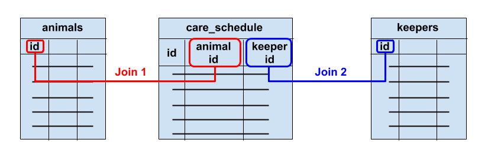
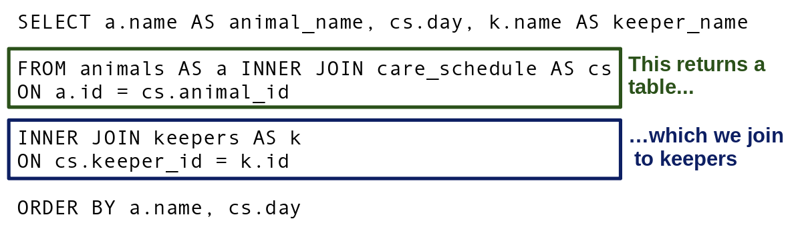

<div class="blame">
author: "Del Middlemiss"<br>
date: "13th June 2019"
</div>


```{r setup, include=FALSE}
knitr::opts_chunk$set(echo = TRUE, fig.align = 'center')
```
# Learning Objectives<br>

* Understand `INNER JOIN`, `LEFT JOIN` and `RIGHT JOIN`
* Understand how to join tables in a many-to-many relationship
* See how joins combine with the other parts of the query syntax.

**Duration - 60 minutes**<br>

We've looked at the three types of relationship that can exist between tables. Now it's time to answer the remaining two questions from the last lesson:

<center>**"Will we ever need to simultaneously access data from multiple tables to solve a problem?"**</center><br>
<center>**"If so, how do we write a single SQL query to do this?"**</center><br>

<hr>

# Setup

Again we'll use the `zoo` database to help you understand the concepts of this lesson, but this time we'll create an actual working `zoo` database in PostgreSQL!

<blockquote class='task'>
**Task - 10 mins**

* Create a local PostgreSQL database called `zoo` and seed it from the file `zoo.sql`. 
* Connect to this database in R using the local PostgreSQL credentials stored in your keychain.
* Remember to lock keychains, and create a separate disconnect command below your connection code. We'll write our queries between the 'connect' and 'disconnect' blocks of code as usual.
* Query all records in the `animals`, `diets`, `keepers` and `care_schedule` tables to prove your code is working.

<details>
<summary>**Solution**</summary>
```bash
createdb zoo
psql -d zoo -f zoo.sql
```

```{r}
library(keyring)
library(RPostgreSQL)

keyring_unlock("local")
username <- key_get("postgresql_username", keyring = "local") 
password <- key_get("postgresql_password", keyring = "local")
keyring_lock("local")
db_connect <- dbConnect(drv = PostgreSQL(), user = username, password = password, dbname = "zoo", host = "localhost")
```

```{r}
dbGetQuery(db_connect,
           "SELECT *
           FROM animals")
dbGetQuery(db_connect,
           "SELECT *
           FROM diets")
dbGetQuery(db_connect,
           "SELECT *
           FROM keepers")
dbGetQuery(db_connect,
           "SELECT *
           FROM care_schedule")
```

```{r, eval = FALSE, echo = TRUE}
# write code to query database before this command
dbDisconnect(db_connect)
```
</details>
</blockquote>

We have a few more animals in the zoo now, and one more diet type: 'tofu', which we guess will not prove very popular with the animals!

# `INNER JOIN`

How can we solve the following problem:

<br>
<div class='emphasis'>
"Get a list of all the animals that have diet plans together with the diet plans that they are on."
</div><br>

We use an `INNER JOIN`! Let's write the query and then describe what it does.

```{r}
dbGetQuery(db_connect,
           "SELECT animals.*, diets.*
           FROM animals INNER JOIN diets
           ON animals.diet_id = diets.id")
```

* `animals INNER JOIN diets` tells SQL to join the `animals` table to the `diets` table.
* `ON animals.diet_id = diets.id` tells SQL **how to do the join**. This says 'take the rows from `animals` and the rows from `diets` and line up any rows where the `diet_id` in an `animals` row equals the `id` in a `diets` row'.
* `INNER JOIN` means 'return only those rows where there is such a match'.

You can see in the results above that the `diet_id` values from `animals` all match the `id` values from `diets`.

It might help to think of 'cutting' both tables up into separate records, and then 'glueing' records together into a joined result, so that primary key matched foreign key and creating duplicate records if needed to balance the numbers required. 

```{r, echo=FALSE, fig.cap="Figure 1. Joining the `animals` and `diets` tables. Think of 'cutting' both tables into individual records and then 'glueing' them together so that primary key (PK) matches foreign key (FK). Here we need to create 'duplicate' `diets` records in the joined table.", out.width = '80%'}
knitr::include_graphics("images/One_to_many_join.png")
```

We can control the columns returned:

```{r}
dbGetQuery(db_connect, 
           "SELECT animals.name, animals.species, diets.diet_type
           FROM animals INNER JOIN diets
           ON animals.diet_id = diets.id")
```

and we can also use **table aliases** to make queries more compact to write:

```{r}
dbGetQuery(db_connect, 
           "SELECT a.name, a.species, d.diet_type
           FROM animals AS a INNER JOIN diets AS d
           ON a.diet_id = d.id")
```

Previously we've seen `AS` being used in the `SELECT` clause to alias columns. Here we use it in the `FROM` clause to alias tables.

We can use all the other advanced query syntax we learned earlier. For example:

<br>
<div class='emphasis'>
"Find any known dietary requirements for animals over four years old."
</div><br>

```{r}
dbGetQuery(db_connect, 
           "SELECT a.id, a.name, a.species, a.age, d.diet_type
           FROM animals AS a INNER JOIN diets AS d
           ON a.diet_id = d.id
           WHERE a.age > 4")
```

<br>
<div class='emphasis'>
"Breakdown the number of animals in the zoo by their diet types."
</div><br>

```{r}
dbGetQuery(db_connect,
           "SELECT d.diet_type, COUNT(a.id)
           FROM animals AS a INNER JOIN diets AS d
           ON a.diet_id = d.id
           GROUP BY d.diet_type")
```

<blockquote class='task'>
**Task - 3 mins** Write a query to return the requested data:
<br><br>
<center>"Get the details of all herbivores in the zoo."</center>
<br>
<details>
<summary>**Solution**</summary>
```{r}
dbGetQuery(db_connect, "
           SELECT a.id, a.name, a.age, a.species, d.diet_type
           FROM animals AS a INNER JOIN diets AS d
           ON a.diet_id = d.id
           WHERE d.diet_type = 'herbivore'")
```
</details>
</blockquote>

<hr>

# `LEFT JOIN` and `RIGHT JOIN`

So, `INNER JOIN` returns only those joined records where there is match in the condition we specify. Let's see this again

```{r}
dbGetQuery(db_connect, 
           "SELECT a.*, d.*
           FROM animals AS a INNER JOIN diets AS d
           ON a.diet_id = d.id")
```

There's no sign of Gerry the Goldfish, or Kim the Kangaroo, as these animals have `NULL`s for `diet_id`. Ditto, tofu is missing from the table, as no animal has a `diet_id` of 4 (i.e. no animal prefers tofu).

But what if we want **all** of the records from **one** of the tables, regardless of whether there is a match in the condition. This is where `LEFT JOIN` and `RIGHT JOIN` come in! See the following problem.

<br>
<div class='emphasis'>
"Return the details of **all** animals in the zoo, together with their dietary requirements if they have any."
</div><br>


```{r}
dbGetQuery(db_connect, 
           "SELECT a.*, d.*
           FROM animals AS a LEFT JOIN diets AS d
           ON a.diet_id = d.id")
```

Now we see all the animals, including Gerry and Kim, although they have no dietary requirements.

So `LEFT JOIN` says 'keep all the records in the left table, adding in any matching records from the right table'. 'Left' here indicates the table to the left of the `LEFT JOIN` operator, i.e. `animals`.

<blockquote class='task'>
**Task - 5 mins** Code and execute a query to perform a similar `RIGHT JOIN`. How do you interpret the results you see? Discuss with the people around you.

<details>
<summary>**Hint**</summary>
Think about the **relationship** between the `animals` and `diets` tables. Is it one-to-one, one-to-many or many-to-many? 
</details>

<details>
<summary>**Solution**</summary>
```{r}
dbGetQuery(db_connect, 
           "SELECT a.*, d.*
           FROM animals AS a RIGHT JOIN diets AS d
           ON a.diet_id = d.id")
```
The relationship between the tables is 
<br>
<center>'one `diets` record may be linked to many `animals` records.'</center><br>
So, when we perform the `RIGHT JOIN`, we expect that all the `diets` records will appear **at least once** in the joined table, and possibly many times, if more than one animal has that diet. This is why we see `tofu`, even though no animal has that `diet_type`.  
</details>
</blockquote>

The `RIGHT JOIN` can be useful in problems like this:

<br>
<div class='emphasis'>
"Return how many animals follow each diet type, including any diets which no animals follow."
</div><br>

Obviously we need to group records by diet type here, but grouping just the `animals` records will not solve the problem, as we would miss 'tofu' (since no animals follow a tofu diet). We need to group the results of the `RIGHT JOIN` we just wrote:

```{r}
dbGetQuery(db_connect, 
           "SELECT d.diet_type, COUNT(a.id)
           FROM animals AS a RIGHT JOIN diets AS d
           ON a.diet_id = d.id
           GROUP BY d.diet_type")
```

We still return `COUNT(a.id)`, as we want to know how many **animals** there are in each `diet_type` group, even if, as in the case of 'tofu', no animals are in that group.

<hr>

# `FULL OUTER JOIN`

What happens if we want all results from both tables whether they have matches or not. `FULL OUTER JOIN` combines the results of both left and right outer joins and returns all (matched or unmatched) rows from the tables on both sides of the join.

Let's take a look at the results of a full outer join in our animals and diets example:

```{r}
dbGetQuery(db_connect, 
           "SELECT a.*, d.*
           FROM animals AS a FULL OUTER JOIN diets AS d
           ON a.diet_id = d.id")
```

We can see that for entries where there is a join they are returned, but so do Gerry the Goldfish and Kim the Kangaroo, who have no match in the diet table, and the diet tofu, even though there is no matching animal for this. 

This picture representation of the different joins can be useful to refer to:

```{r}
knitr::include_graphics("images/joins_summary.png")
```


# Joins in many-to-many relationships

Finally, let's see how to use joins to extract data from tables linked by a many-to-many relationship. Remember we have an extra **join table** in a many-to-many table.

In the `zoo` database, we have a many-to-many relationship between animals and keepers, i.e.<br><br>

<center>'Each animal is cared for by many keepers, and each keeper cares for many animals'.</center><br>

The join table is called `care_schedule`. Each record in `care_schedule` tells us which keeper is looking after which animal, on which day.<br>

```{r, echo=FALSE, fig.cap="Figure 2. Many-to-many relationship between `animals` and `keepers` with join table `care_schedule`", out.width = '80%'}

```

<br>
In order to join `animals` to `keepers` we have to go in two 'hops': first, a join from `animals` to `care_schedule`; and second, a join from `care_schedule` to `keepers`. 

Let's write the query and then describe it step by step. Don't be put off, this looks complicated, but think of building it up bit by bit...

```{r}
dbGetQuery(db_connect, 
             "SELECT a.name AS animal_name, cs.day, k.name AS keeper_name
             FROM (animals AS a INNER JOIN care_schedule AS cs
             ON a.id = cs.animal_id)
             INNER JOIN keepers AS k
             ON cs.keeper_id = k.id
             ORDER BY a.name, cs.day")
```

You see we have two `JOIN` operators. Here's one way to visualise this:<br>

```{r, echo=FALSE, fig.cap="Figure 3. The output of the `JOIN` from `animals` to `care_schedule` is then `JOIN`ed to `keepers`.", out.width = '80%'}

```

<br>
Think of the output table from `animals` to `care_schedule` being **further joined** to `keepers`, i.e. <br><br>

<center>(`animals INNER JOIN care_schedule`) `INNER JOIN keepers`</center><br>

The `INNER JOIN` in parentheses is executed first, and the output from it then `INNER JOIN`ed to `keepers`.

<blockquote class='task'>
**Task - 5 mins**. How would we change the query above to show only the schedule for the keepers looking after Ernest the Snake?

<details>
<summary>**Hints**</summary>

* We need a `WHERE` clause.
* If we're limiting the results to those for Ernest, do we still need to order by animal name?

</details>

<details>
<summary>**Solution**</summary>
```{r}
dbGetQuery(db_connect, 
             "SELECT cs.day, k.name AS keeper_name
             FROM (animals AS a INNER JOIN care_schedule AS cs
             ON a.id = cs.animal_id)
             INNER JOIN keepers AS k
             ON cs.keeper_id = k.id
             WHERE a.name = 'Ernest'
             ORDER BY cs.day")
# or could use WHERE a.id = 7
```
</details>
</blockquote>


<hr>

# Additional topics

## UNIONS

We won't go into them too much, but for awareness there is also a `UNION` operator. Basically, this allows you to 'stack' tables on top of each other, providing the tables have the same number of columns and the columns are of similar data types. They are different to `JOIN`s because you are stacking the columns rather than joining via a key. 

There is a function `UNION ALL`, which stacks tables exactly as they are, and `UNION`, which stacks but removes any duplicate entries which have appeared in both tables. 

You see can an example of `UNION` and `UNION ALL` [here](https://www.w3schools.com/sql/sql_union.asp).

## Useful check - duplicate joining keys 

A common error when `JOIN`ing tables is having (unintended) duplicates of the joining key in one of the tables, leading to duplications in the final `JOIN`ed table. A useful query to check this is:

SELECT  
id,  
count(*) as id_count,  
FROM table  
GROUP BY id  
HAVING count(*) > 1  

## Useful tip - finding entries which don't match in a `JOIN`

Sometimes you may want to find those entries which are *not* matched in another table. There is a helpful way of doing this - `LEFT JOIN` to the table in which you want to find a match, but return only the rows where the join returns NULL i.e. there was no match found. For example the query below would return all the entries in the animals table that did not have a matching entry in the diet table. 

```{r}
dbGetQuery(db_connect, 
           "SELECT a.*
           FROM animals AS a LEFT JOIN diets AS d
           ON a.diet_id = d.id
           WHERE d.id IS NULL")
```


## Shorthand for GROUP BY & ORDER BY

In some SQL languages you can replace variable names with column numbers in GROUP BY and ORDER BY. It is better practice to fully write out column names, as it is easier to read and understand, but for awareness, you may see such syntax in other people's code. It's also undeniably useful for quick checks when you are dealing with many columns. 

```{r}
dbGetQuery(db_connect, 
             "SELECT a.name AS animal_name, cs.day, k.name AS keeper_name
             FROM (animals AS a INNER JOIN care_schedule AS cs
             ON a.id = cs.animal_id)
             INNER JOIN keepers AS k
             ON cs.keeper_id = k.id
             ORDER BY a.name, cs.day")
```

```{r}
dbGetQuery(db_connect, 
             "SELECT a.name AS animal_name, cs.day, k.name AS keeper_name
             FROM (animals AS a INNER JOIN care_schedule AS cs
             ON a.id = cs.animal_id)
             INNER JOIN keepers AS k
             ON cs.keeper_id = k.id
             ORDER BY 1, 2")
```

```{r}
dbDisconnect(db_connect)
```

## Writing SQL in R without connecting to remote database 

You can write and apply SQL code in `R` directly to data in your global enviroment (e.g. pulled in from a CSV) using the `sqldf` package. That being said, the functionality available in SQL (e.g. `JOIN`s, `GROUP BY`s etc) will also be made easily applicable by functions in the 'Tidyverse' so it's unlikely you will use `sqldf` very often, but we mention it here for completeness. 

Below is an example using the `chinesemeal` dataset from CodeClanData package. 
```{r}
library(CodeClanData)
head(chinesemeal) 
```

```{r}
library(sqldf)
#sqldf will try to use the RPostgreSQL driver if both loaded so one option is to unload the RPostgreSQL package (although can do other work arounds)
detach("package:RPostgreSQL", unload=TRUE)

sqldf('SELECT FoodType, avg(CaloriesPerDay) as av_cals FROM chinesemeal GROUP BY FoodType')

```


<hr>

# Recap

* What type of `JOIN` should we perform if we want only matching records from two tables?
<details>
<summary>**Answer**</summary>
An `INNER JOIN`
</details>

<br>

* What type of `JOIN` should we perform if we want only all records from one table and any matching records from another?
<details>
<summary>**Answer**</summary>
Two choices here: a `LEFT JOIN` or `RIGHT JOIN`, depending upon how we set up the query.
</details>

<br>

* How do we join two tables A and B involved in a many-to-many relationship?
<details>
<summary>**Answer**</summary>
We have to `JOIN` in two steps or 'hops', from table A to the join table, and then from the join table to table B.
</details>

<hr>

# Additional Resources

* We didn't have time to cover [self-joins](https://www.w3resource.com/sql/joins/perform-a-self-join.php) (i.e. a join of a table to itself), but they can be useful in certain circumstances!


