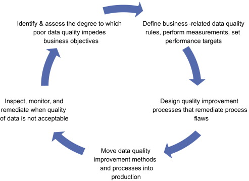
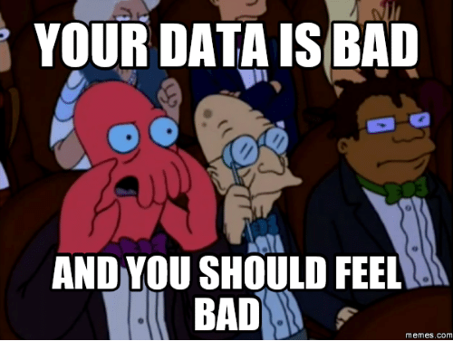
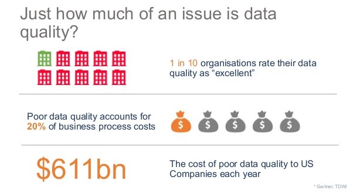
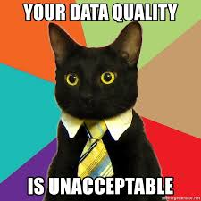

```{r setup, include=FALSE}
knitr::opts_chunk$set(echo = TRUE, fig.align = "center")
```

# Learning Objectives

* Understand why quality data is important
* Awareness of examples of bad quality data
* Know the impacts of bad quality data

**Duration - 25 minutes**

<br> 

# Introduction to Data Quality

We are going to spend this morning looking at Data Quality. 

The most important thing to note is that any analysis is only as good as the data it is built on. There is a famous quote: **garbage in = garbage out**, which refers to the fact that if you have bad data coming in, no amount of data cleaning or statistical transformations will make it useable.   

Unfortunately, data quality is often either forgotten about, or insufficient effort is put into ensuring quality data from the outset. This can end up being disastrous and cost a business a lot of money, as without the a strong foundation of high quality data, we won't be able to build accurate predictive models, automate processes, or provide personalised insights.

Today, we will look at issues surrounding data quality and management.  

<br>

# Data Quality Lifecycle
<br>

Data quality has a lifecycle: that is, there are a number of steps involved in ensuring high quality data is maintained. There are also a number of frameworks often linked to commercial tools, but they all contain the same key steps: 

<br>
```{r, echo=FALSE, out.width = '80%'}

```

This morning we will touch on each of these parts of the cycle. Let's start at the beginning: what is bad quality data? 

<br>

# What is bad quality data?

<br>
In simple terms:

> bad data is an inaccurate set of information. 

This can take **so many** forms.


<blockquote class='task'>
**Task - 5 mins** 

Try and think of some reasons for poor quality data. Discuss in your groups.

</blockquote>


# Reasons for bad quality data
<br>


Let's look at some reasons:

  * **missing data**: you get a spreadsheet, and you have lots of values missing where you don't want them to be.  
  
  * **wrong information**: this could be a simple thing such as people have chosen the wrong option on a survey, have accidently pressed the wrong number (e.g. when entering their age they've pressed 32 instead of 31), or other simple mix ups. But this doesn't always need to be human error. A lot of time websites will have outdated names and email addresses for CEO's or staff who have moved on, or data for a certain year is missing or hasn't been uploaded, or any other number of coincidental mix ups.  
  
  * **non-conforming or inappropriate data**: when we say this, we mean when you have a character instead of a number. Or perhaps, someone has entered all the data in excel but mixed up the headings so they all now correspond to different columns.   
  
  * **bad sampling or data collection**: if you collect data from a biased sample you're never going to end up with good data. For example, imagine you were extremely pro Scottish independence. You ask all your pals and people who know them their opinion on a survey you've sent out on facebook. And what do you know, your results strongly show that people want independence - about 90% of them do! This doesn't actually mean the data are correct. You might live in an echo chamber where everyone believes what you do, and therefore your data isn't representative. Instead, what you should have done is sent out the survey to a random sample of people. This is just one example, but it's a common problem with data quality and sampling.  
  
  * **duplicate data**: this does what it says on the tin - you might have entries twice (or more than twice!), or names repeated where you shouldn't have. 
  
  * **poor entry**: where people have either been lazy or just careless when entering data into spreadsheets or systems and there are misspellings and typos. Or perhaps there are just different people entering data so you have variations in spellings or formatting.  
  
  * **too much data**: data is everywhere now, and often times businesses will collect everything they can with the aims of sorting it out later. But this can lead to problems as you've collected so much data that the overall quality is diminished. For example, if you have to fill in a 40 minute survey, you're more likely to get bored and fill it in inaccurately than you are if you are only asked to fill in a 10 minute survey.  
  
  * **unclear definitions**: data should come with clear explanations - for example, why is a variable called that? What does it stand for? What units is it in?  If you have unclear definitions, you can end up with the wrong interpretation of the data.  
  
  * **outdated data and systems**: data that has been collected in the past often does not suffice and differs from today’s data specifications and requirements. As time goes on, quality deteriorates, as often the data is not regularly maintained or updated.  

<br>

```{r, echo=FALSE, out.width = '60%'}

``` 
 
<br>

<blockquote class='task'>
**Task - 5 mins** 

Can you think of any instances where you have come up against bad data quality?
</blockquote>
<br>


# Real examples of bad quality data
<br> 

Although there are some high-profile examples of data quality, most of the time it is internal bad data that causes issues and in most cases affects company profitability. This may be either through the need for additional manual checks or processes, lost of trust or customers, or incorrect analysis.

For example, there is a system used for pharmaceutical trials had a major data quality flaw programmed into it. Whenever you logged into the system, it updated the "time recorded" field. This was a major data quality issue because when conducting pharmaceutical trials, times are extremely important: you need to know exactly when you dosed a patient or took blood, not the time you logged into the app to put a result in.  

Surveys are also notoriously full of bad quality data. A common error is not including a category called "Prefer not to say" when asking questions about sensitive topics such as income, marital status, religion, etc. If you don't provide this option for people, they will be more likely to leave it blank and you'll end up with missing data.  

<br> 

There are also some high profile examples. For example, the 2016 US Election poll predictions as an example. The most recent U.S. Presidential Election was mired with bad data. Almost all pollsters and predictors got this election completely wrong and predicted a landslide Hillary Clinton victory. It was this error, that many Democrats argued, that caused a historic number of voters to stay home on Election Day. 

<blockquote class='task'>
**Task - 5 mins** 

What data quality issues do you think leads to inaccurate exit polls in this - and many other - cases?

<details> 
<summary>**Potential Answers**</summary>

Bad sampling and data collection is probably the main problem here. 

</blockquote>


<blockquote class='task'>
**Task - 5 mins** 

Can you think of any more instances where you have come up against bad data quality? Or any highly publicised cases you've heard about? Discuss in groups. 

</blockquote>


# Impacts of poor data quality
<br>

Bad data can have a massive impact on businesses in many different ways.


  * **Financial cost**: first and foremost, bad data costs companies a lot of money. In fact, according to Gartner, the financial cost to businesses is in the billions!
<br>

```{r, echo=FALSE, out.width = '60%'}

``` 


  * **Wasted time and effort**: If you have bad data, you have either wasted time collecting it, or you will waste time analysing it. According to HBR, 50% of employee time is wasted in these hidden data factories, hunting for data, finding and correcting errors, and searching for confirming sources.

  * **Reputational Damage**: if a company has an *incident* where it comes out that their data collection hasn't been great, or they've made a decision based on bad data, then the reputational damage is often irreversible. 
  
* **Legal & Regulation**: by now we've all heard of GDPR. If a company has a data breach, or it is revealed they have collected incorrect data or made decisions based on it, there will also usually be legal and regulatory implications (i.e. a hefty fine).  


* **Economic Damage**: The most recent financial crash was - at it's core - down to bad quality data. Models that were used to predict financial changes in markets were outdated, and the data that was being fed into these models was not suited to the models themselves. An additional layer to this was the checks that were in place to monitor the output of economic and financial data models across the world were also not updated or checked, and so the warnings that should have been in place when the models stopped performing well. As a result, they did not correctly predict a recession would occur, which in turn caused the most recent financial crisis.  


# So, why is data quality important?

 In short, bad data

  * Costs money  
  * Wastes time  
  * Damages brand reputation  
  * Annoys your analysts  
  * Results in bad decisions if the data is misleading  
  * Can lead to some catastrophic economic distasters  

Moral of the story: be like this cat, and always strive for good data. 
<br>  
<br>  

```{r, echo=FALSE, out.width = '40%'}

``` 

<br>


## Recap

* Poor data quality is all around us. It is easiest to stress the importance of good data quality by identifying examples of when it hasn't worked.
* As analysts we need good quality data to trust our results
* Poor quality data has a major impact on the bottom line of any company


