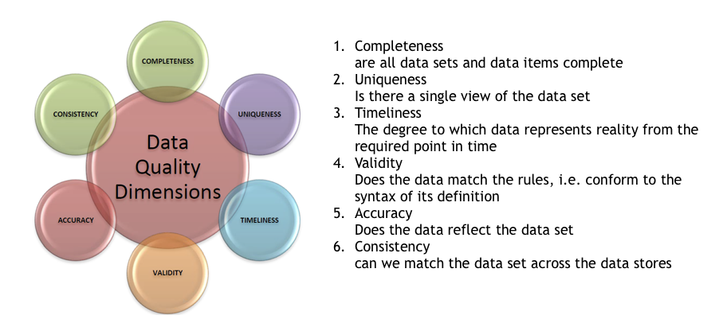
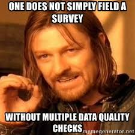

```{r setup, include=FALSE}
knitr::opts_chunk$set(echo = TRUE, fig.align = "center")
```


# Learning Objectives

* Understand the dimensions of data quality
* Understand how to define data quality rules
* Know why data quality reporting is important
* Know how to maintain data quality  

**Duration - 1 hour**


# Dimensions of data quality
<br>

We've already learnt that bad quality data leads to problems. We want good quality data instead. But how do you determine the quality of data? For this, **there are data quality characteristics you should be aware of**. 

>A dimension is defined as some thing (data item, record, data set or database) that can either be measured or assessed in order to understand the quality of data. Each dimension then has its own definition.

The six dimensions of data quality are:
<br> 

```{r, echo=FALSE, out.width = '80%'}

```

## Completeness

**Completeness** refers to how comprehensive the information is. When looking at data completeness, think about whether all of the data you need is available; you might need a customer’s first and last name, but the middle initial may be optional.

This is the easiest dimension to test for. It identifies whether the data is non-blank, or populated. It is important to define what a blank looks like as this could easily be a null value, or an empty string or even "n/a".

The easiest way to ensure completeness is to make fields mandatory, however in some cases, this may lead to lower quality data as users fill mandatory fields with junk information to enable them to submit their information. Make sure you only insist information is mandatory if it actually is.

* **Example:** Parents of new students at school are requested to complete a Data Collection Sheet which includes medical conditions and emergency contact details as well as confirming the name, address and date of birth of the student. 
* **Scenario:** At the end of the first week of the autumn term, data analysis was performed on the ‘First Emergency Contact Telephone Number’ data item in the Contact table. There are 300 students in the school and 294 out of a potential 300 records were populated, therefore 294/300 x 100 = 98% completeness has been achieved for this data item in the Contact table. 

Why does completeness matter as a data quality characteristic? If information is incomplete, it might be unusable. Let’s say you’re sending a mailing out. You need a customer’s last name to ensure the mail goes to the right address – without it, the data is incomplete.


## Uniqueness

Uniqueness refers to not having duplicate entries in your data. Duplicate records are often a problem, where the same or similar information is recorded more than once. 

The main challenge is identifying that records are true duplicates. This can often be done through additional information, eg the same email address, but different names. Care should be taken with deduplication though, since it is not always sufficient to retain the first existence of a duplicate as information may be lost. For customer contact records it is more normal to manually create a third record which contains a merge of the first and second customer information, taking into account the date the information was last updated on each record.

* **Example:** A school has 120 current students and 380 former students (i.e. 500 in total) however; the Student database shows 520 different student records. This could include Fred Smith and Freddy Smith as separate records, despite there only being one student at the school named Fred Smith. This indicates a uniqueness of 500/520 x 100 = 96.2% 

Why does uniqueness matter? If you had a database of email addresses, and you didn't have unique entries for each person, then you are going to be sending out multiple emails to the same person. This would have the potential to not only annoy the receipients and lose you business if they unsubscribe, but also could lead to errors in your analysis for responses or page views generated from the emails.  

## Timeliness

Timeliness refers to how up-to-date the information you have is. 
Information degrades from the moment it is captured. For example in the US 14% of the population move address each year. The UK is a similar number. When capturing data it is extremely important to timestamp when it was captured and updated. This way the age of the data can be calculated. Sometimes it may be necessary to check that the information is still valid after an agreed period of time, but without a timestamp this would not be possible.

* **Example:** Tina Jones provides details of an updated emergency contact number on 1st June 2013 which is then entered into the Student database by the admin team on 4th June 2013. This indicates a delay of 3 days. This delay breaches the timeliness constraint as the service level agreement for changes is 2 days.

Why is this important? The most obvious answer is that if you have old or out of date data, your results will also be old and out of date. 


## Validity


Validity refers to whether ot not the data is the correct format. This could be as simple as being numeric rather than text, or a non-negative number. However, complex `regex` expressions, or reference data tables are also be used to check the validity of a data item.

* **Example:** Each class in a UK secondary school is allocated a class identifier; this consists of the 3 initials of the teacher plus a two digit year group number of the class. It is declared as AAA99 (3 Alpha characters and two numeric characters). 
* **Scenario 1:** A new year 9 teacher, Sally Hearn (without a middle name) is appointed therefore there are only two initials. A decision must be made as to how to represent two initials or the rule will fail and the database will reject the class identifier of “SH09”. It is decided that an additional character “Z” will be added to pad the letters to 3: “SZH09”, however this could break the accuracy rule. A better solution would be to amend the database to accept 2 or 3 initials and 1 or 2 numbers. 
* **Scenario 2:** The age at entry to a UK primary & junior school is captured on the form for school applications. This is entered into a database and checked that it is between 4 and 11. If it were captured on the form as 14 or N/A it would be rejected as invalid.

<br>

## Accuracy

Accuracy refers to the degree to which data correctly describes the "real world" object or event being described. This is where the data item is compared to the value it should be, its "proper" value. Whilst most data quality dimensions can be assessed by analysing the data itself, assessing accuracy of data is the most difficult. It can only be achieved by either:

* Assessing the data against the actual thing it represents, for example, when an employee visits a property; or
* Assessing the data against an authoritative reference data set, for example, checking customer details against the official list of voters. This in itself assumes that the reference data set is accurate.

* **Example:** A European school is receiving applications for its annual September intake and requires students to be aged 5 before the 31st August of the intake year. 
  + In this scenario, the parent, a US Citizen, applying to a European school completes the Date of Birth (D.O.B) on the application form in the US date format, MM/DD/YYYY rather than the European DD/MM/YYYY format, causing the representation of days and months to be reversed. 
  + As a result, 09/08/YYYY really meant 08/09/YYYY causing the student to be accepted as the age of 5 on the 31st August in YYYY. 
The representation of the student’s D.O.B.–whilst valid in its US context–means that in Europe the age was not derived correctly and the value recorded was consequently not accurate. 

Accuracy is a crucial data quality characteristic because inaccurate information can cause significant problems with severe consequences. For example, if there’s an error in a customer’s bank account, it could be because someone accessed it without his knowledge.


## Consistency

Consistency refers to how stable and similar data representations are. Data often flows through a number of systems or stores within an organisation. The value across these different stores can change due to poor ETL processes, or tools or systems reformat the data as it flows through.

* **Example:** School admin: a student’s date of birth has the same value and format in the school register as that stored within the Student database.


<blockquote class='task'>
**Task - 10 mins** 
Data quality improvement options

The optimum point to maximise data quality is at the point of capture.

Imagine you had the data from CodeClan's [online application process](https://codeclan.com/data-analysis-announcement/apply-for-data-analysis/). With reference to each of the dimensions, discuss how information be incorrectly captured. Finally discuss how you would maximise the quality of the data. 

<details>
<summary>**Discussion points**</summary>

* Empty strings to get through mandatory fields
* Duplicate applications
* Non-valid email addresses or data formatting
* Validity UK addresses
* Age of captured data

</details>

</blockquote>


# Data Quality Rules 


**Data quality rules** have been defined to cover multiple data quality dimensions. They are the requirements that businesses set to their data.   

These requirements are aimed at meeting two interdependent objectives: To define the format the data should comply with and the dependencies that should exist among data elements. The data quality rules are then then pulled together into **data quality reporting**. The reporting is an ongoing activity which monitors the quality of the most important data items.  

Data quality rules are normally defined very specifically:

* **A business statement:** this explains the business context of the rule. It may also state the business process it is related to and why the rule is important to the business.  

* **The rule specification:** this is written in pseudo-code and explains at a database level the definition of quality data.  

* **The coded rule:** this is the actual programmatic rule written in the system language of choice. The coded rule should always be a logical test that returns a boolean. It is best practice to return TRUE if it passes and FALSE if it fails. 


## Example of a data quality rule: Marital Status

**Business Statement:** The marital status code may have values of single, married, widowed and divorced. It may not be left blank. A value must be picked when entering a new customer, or when customers request a name change. The values for widowed and divorced are tracked separately from single, since risk factors are shown to be senstive to the existence of a previous marriage.

**Data Quality Rule Specification:** "marital_status" may be "S", "M", "W", "D" representing single, married, widowed and divorced respectively. Blank or an empty string " " is considered an invalid value.

**Coded Data Quality Rule:** 
```{r eval=FALSE}
valid_status <- c("S", "M", "W", "D")
# this could also be a reference table list of valid values

# accepted status
marital_status <- "S"

#the rule
marital_status %in% valid_status

# non-accepted status
marital_status <- "Single"

#the rule
marital_status %in% valid_status
```


Depending on the dimension being monitored, there are different types of data quality rules.

  * **single-column rules**: looking as aspects such as valid values, data types, formats, patterns or distributions.   
  
  * **cross-column rules**: require a number of columns to be reviewed together. Examples of this could be when one column is populated, a corresponding column must be too. Or they contain consistent data eg cities actually exist in the country of residence.  
  
  * **cross-table rules**. These are often carried out on the keys of tables. For example if the account table has a customerID in it, then that customerID should also exist in the customer table.


<br>

# Data Quality Reporting

The purpose of carrying out data quality assessment on a regular basis is to both measure the quality of the data, and therefore show improvements when remediation activities are undertaken. We'll discuss remediation later today.

However, another important reason is to ensure that any changes in quality can be easily and quickly spotted. Often data quality issues creep into systems when changes are made. This might be a new user interface, or a change in the ETL (extract-transform-load) process.

It is also worth noting that whilst ideally the measurement occurs in the operational system, it often actually takes place in a separate profiling system, so additional manipulations and transformations may still have taken place since the actual operational system. This means that an additional check will be needed to confirm that the issue actually exists in the operational system.

We shall discuss data governance in more detail later, however, data quality reporting is a key ingredient into any data governance process, providing the quantitative facts through which to ensure data can be actively managed.  

<br> 

```{r, echo=FALSE, out.width = '60%'}

```

<br>


# Recap

* What are the different dimensions of data quality?

<details>
<summary>**Answer**</summary>

* Completeness
* Uniqueness
* Timeliness
* Validity
* Accuracy
* Consistency

</details>

* Which dimension is it impossible to calculate from the dataset alone?

<details>
<summary>**Answer**</summary>
Accuracy - another authoritative reference dataset is required 

</details>

* What can we do to calculate the data quality?

<details>
<summary>**Answer**</summary>
Carry out data quality profiling or create data quality rules

</details>

* What are the three ingredients of a well-defined data quality rule?

<details>
<summary>**Answer**</summary>

1. A business statement
2. A data quality rule specification
3. A coded rule in the language of the tool being used

</details>
