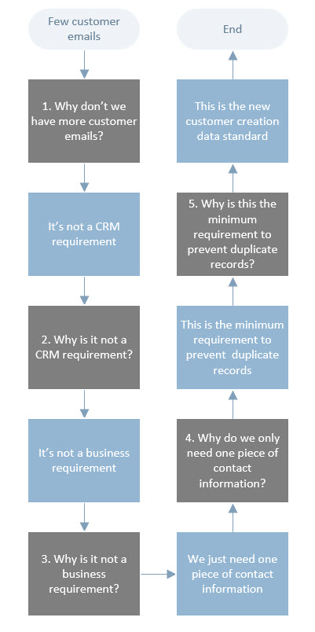
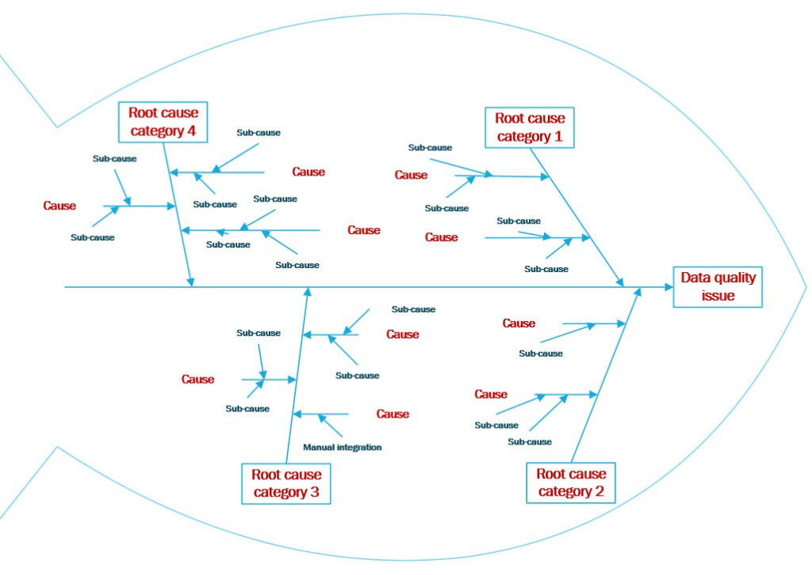
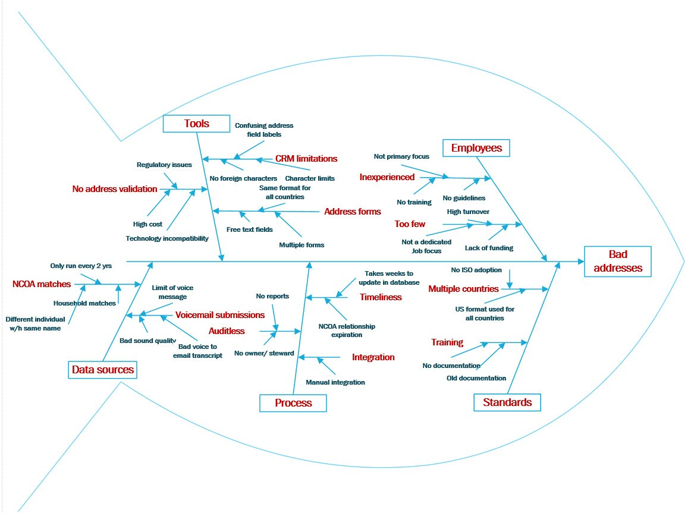

```{r setup, include=FALSE}
knitr::opts_chunk$set(echo = TRUE, fig.align = "center")
```


# Learning Objectives

* Understand the steps involved in maintaining quality data
* Understand how to carry out a root cause analysis
* Be able to carry out root cause analysis of a data quality issue
* Know what data lineage means

**Duration - 30 mins**


# Maintaining data quality

So far today we've learnt what data quality is, how we define a rule, and how we get it. Once we have good data quality, we want to keep it! 
This usually involves several steps:  

<br> 

1. **Assessment**: understand how data quality issues could affect the business processes.      

2. **Measurement**: measure quality of key data and report to business.  

3. **Integrate into infrastructure**: once you know how you want the data to be collected and maintained, you would get this all in the processes and databases you have at work.  

4. **Improvement**: once you've got data coming in, you should assess and define procedures to increase quality of data if needed.   

5. **Prioritisation**: identify the highest priority issues to focus on.  


<blockquote class='task'>
**Task - 5 mins** 

Have a think - what kind of problems do you think might arise from failing to maintain data quality checks? 


<details>
<summary>**Potential Answers**</summary>

The biggest impact could be from a cost, time or reputation perspective. 

If you don't keep check over time, you might end up collecting and publishing incorrect data. 


<br>
</details>
</blockquote>  
<br>


# Identifying why data is bad

Determining the reason the data quality is low is an art all of its own. The standard approach to this is to carry out a **Root Cause Analysis**.

A root cause analysis is when you get to the real cause of the problem, rather than fixing a symptom of it. Practioners advocate using the "5 whys", but really its just a structured approach to digging deeper into the causes of a problem.

For example: 

Problem: my car won't start. 

  * Why? – The battery is dead. (First why)
  * Why? – The alternator is not functioning. (Second why)
  * Why? – The alternator belt has broken. (Third why)
  * Why? – The alternator belt was well beyond its useful service life and not replaced. (Fourth why)
  * Why? – The vehicle was not maintained according to the recommended service schedule. (Fifth why, a root cause)
  
The questioning for this example could be taken further to a sixth, seventh, or higher level, but five iterations of asking why is generally sufficient to get to a root cause.  

Here is a data example of using the 5 whys to identify why there aren't more customer emails in the CRM system:

<br> 

```{r, echo=FALSE, out.width = '50%'}

```

<br> 

## Fishbone diagrams  


Once you've got your why's, you need to have some kind of reporting system. What is often done for data quality workflows is to create a fishbone diagram to help brainstorm the causes of the data quality issue. It would look something like this:  

<br>

```{r, echo=FALSE, out.width = '80%'}

```

<br> 

What does this show us? Let's go through it:

  * The "head" of this fish is where the main data quality issue goes. This might be something like: I have lots of missing values in my marital status category.   
  
  * The main offshoots (or "fish bones") would then be the main categories that you have identified might be causing the issue. Common examples are: tools (my software system is broken), employees (might have entered it wrong), processes (extracted the data wrong), standards (I didn't include a category for unknown), data sources (people are just not filling it in). 
  
  * The tinier fishbones would then be the reasons within each category that you can think of that might be leading to the issue. Finally you can add the detail of the cause as sub-categories.  

<br> 


Here is an example filled in for a data quality issue with addresses:

```{r, echo=FALSE, out.width = '80%'}

```

<br>

<blockquote class='task'>
**Task - 10 mins** 

Think of what benefits of creating fishbone diagrams are. Think about it from the view of:

  * an analyst  
  * a database administrator/creator  
  * a data team  
  

<details>
<summary>**Potential Answers**</summary>

Benefits are:  

* Help teams push beyond the perceived symptoms to uncover potential root-causes.
* Provide a much needed structure to any brainstorming activity  
* Ensure that major causes are not ignored by allowing full participation of the personnel involved
* Focus on the human and environmental side as well as the more technical which often starts out as the prime candidate for investigation
* Are extremely useful for implementing cause prevention even when no issues exist, not just cause analysis

</details>
</blockquote> 

Once you have your fishbone diagram, you can then pin down the root cause and brainstorm how to fix it.   

Addressing bad data could involve:   

* replacing, modifying or deleting records
* improving or fixing systems or software to prevent bad quality data being captured or propagated in the first place
* introducing processes to check for duplicates or consistency across systems
* introducing repeatable processes for specific data quality issues


Once you know how to fix it, you can then prototype a preventative solution and implement and monitor how it is working.  

<br> 


<blockquote class='task'>
**Task - 15 mins**   
Root Cause Analysis

You are part of the data management team in a large insurance company. To make accurate quotes for home insurance it is very important to have accurate postcodes. Data quality monitoring has shown that there has been a sharp decline in the quality of postcodes captured. Analysis has shown an increase in the capture of partial postcodes, with only the area and district eg "EH2" being stored.

Draw a fishbone diagram with possible categories, causes and possible sub-causes for the situation above.


</blockquote>


# Recap

* What is data remediation?

<details>
<summary>**Answer**</summary>

The process of improving data quality through fixing records, systems or putting in place processes to capture higher quality data.

</details>

* How would you carry out a root cause analysis?

<details>
<summary>**Answer**</summary>

* Use structured questioning techniques to get deeper into the actual cause rather than the symptom of the problem
* Develop a fishbone diagram to identify possible root causes
* Determine the actual cause(s)

</details>

* Why should you review data lineage as part of your root cause analysis?

<details>
<summary>**Answer**</summary>

It is important to have a full view of all the systems and processes the data flows through, as errors can happen at each one.

</details>

* Once you understand the cause of an issue, what steps should you do next?

<details>
<summary>**Answer**</summary>

* Validate the root cause using analysis
* Prototype a solution
* Implement and monitor the solution

</details>


