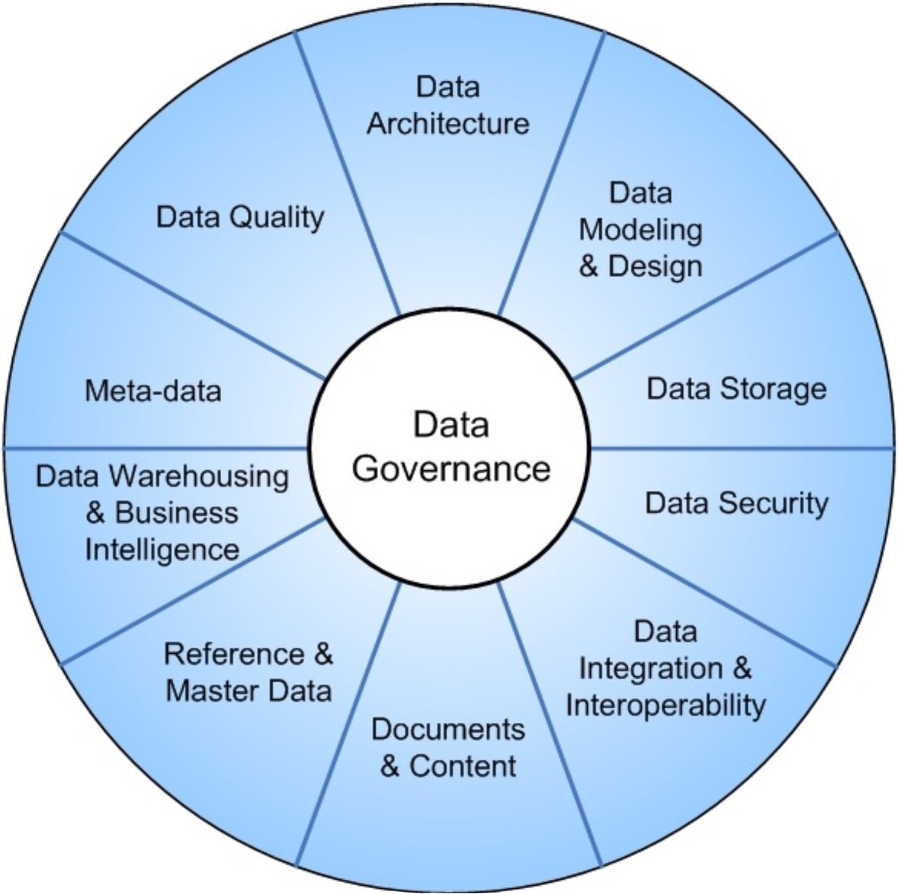
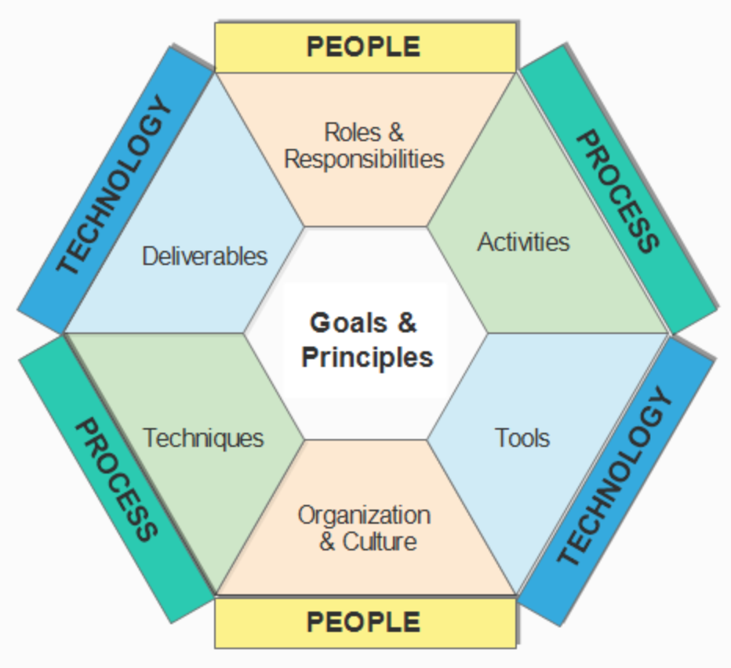
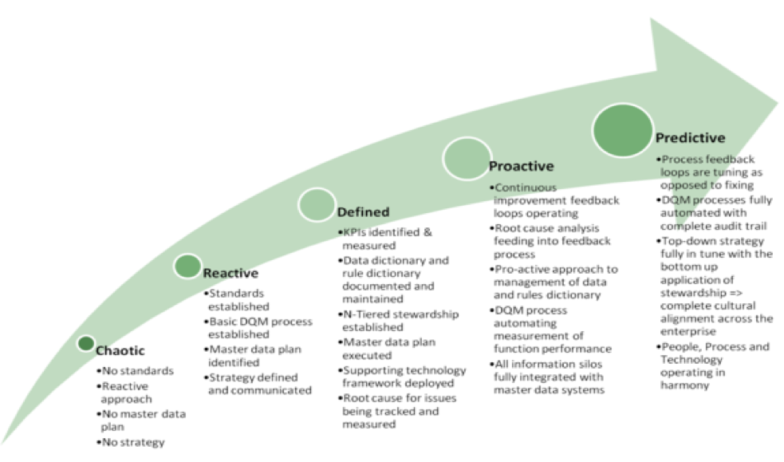
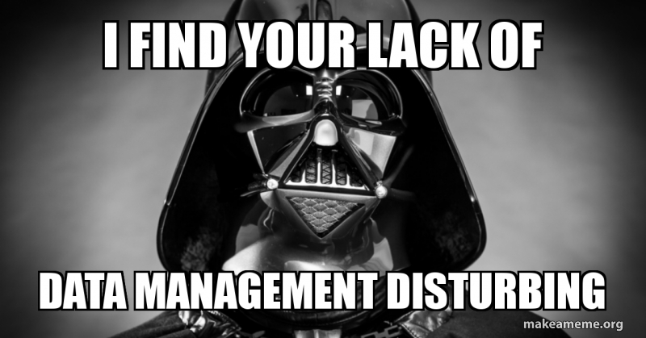

```{r setup, include=FALSE}
knitr::opts_chunk$set(echo = TRUE, fig.align = "center")
```

# Learning Objectives

* Understand why it is important to treat data as a vital business asset
* Know the principles of Data Management
* Know the components of good Data Management
* Understand the DAMA knowledge areas

**Duration - 1 hour**

# What is Data Management?   
<br> 

Many organisations realise that their data is a vital asset to them. It allows them to make better decisions, improve their understanding of their customers, create targeted products and services and in some cases they can even create a product from it and sell it. However, very few organisations are able to actively manage their data as an asset to ensure it continues to be valuable to them. This is what **Data Management** is. Its the coordinated set of activities that ensure that ensure that data is **actively managed**.

The active management of data is complex, messy, cuts across all areas of the business and is not something that most people have ever had any training in. For this reason, it is particularly difficult for organisations who haven't built Data Management capabilities in from the start to change responsibilities, working practices and cultures to set up. It is also quite a dry topic and difficult to generate enthusiasm about, which is why it often falls to the bottom of people's priorities.

Another challenge is that very rarely do data scientists or data analysts get involved in data management activities, so skills are neither spread or shared. That is why it is particularly important for Data Analysts to cross the divide and work together with Data Management Professionals towards common goals.


<br>
# Data Management Goals
<br>

The goals of good data management should include:

* Understanding and supporting the information needs of the enterprise and its stakeholders including customers, employees and business partners
* Capturing, storing, protecting and ensuring the integrity of data assets
* Ensuring the quality of data and information
* Ensuring the privacy and confidentiality of stakeholder data
* Preventing unauthorized or inappropriate access, manipulation or use of data and information
* Ensuring data can be used effectively to add value to the enterprise

In this lesson we are going to cover the areas included in Data Management, some of the key activities that make up good data management and some best practice about carrying out those activities. Although there are a number of frameworks, we will be following the [DAMA International](https://dama.org) (The Data Management Association) DMBOK (Data Management Body of Knowledge).


# Principles of Data Management

There are a number of principles around the management of data that can guide best practice.

**1. Data is an asset with unique properties**

The biggest difference between data and other assets is that it it is not consumed when it is used. This brings with it a number of challenges. It is durable (lasts a long time) but not tangible (can't be touched). It can be stolen without being lost and it is easy to copy and transport. By using data we create more data. Taking all this into consideration, data needs to be managed with care and in a different way to other assets.

**2. The value of data can and should be expressed in economic terms**
	
As an asset we really should put a monetary value on data, but calculating it's value is difficult. To do this we need to understand the costs of low quality data and the benefits of high quality data.

Factors to consider when attempting calculate the value of data include:
	
* The cost of obtaining and storing it
* The cost of replacing it if lost
* The organisational impact if it goes missing
* The cost of risk mitigation and cost of associated risks
* The cost of improving and cleaning it
* The benefits of higher quality data
* What competitors would pay for it
* What it could be sold for
* The expected revenue from innovative uses of it

As you can see, these are values that have historically not be calculated or monitored. However, to build a business case for data management, you would need to attempt to justify it in this way. 

**3. Managing data means managing the quality of data**

Earlier we covered data quality in detail. There are costs associated with poor quality data and benefits from high quality data.
			
**4. It takes metadata to manage data**

We need to capture data about the data, this is called **metadata**. Metadata is actually as valuable as the data itself, as without it, we wouldn't be able to understand what the data represents, who owns it, where it originated, how it is structured, the processes it goes through, how it is classified from a security and access perspective. The list is endless. 

Ideally metadata is created and updated automatically, as its easier to keep up to date and accurate. It is just as important to manage the metadata as it is the data itself.
		
**5. It takes planning to manage data**

Coordination is key to managing data. As data permeates and moves throughout an organisation, there will be many stakeholders involved. Any changes to the data or systems that produce or consume it will require carefully planning and a strategy approach for both the short and long term.

**6. Data management is cross-functional; it requires a range of skills and expertise**

Managing data is not just a technology activity, or the responsibility of the IT department. This is where a number of organisations have struggled in the past, since it requires leadership and coordination to understand how the different pieces fit together and allows data to become a shared and valued asset.
		
**7. Requires an enterprise perspective**

Given the different needs and views of stakeholders and consumers across an organisation, a range of perspectives need to be taken into account. These can be hard to fit together, therefore an enterprise level view is critical, to ensure that decisions are taken for the benefit of the organisation as a whole.
		
**8. Is lifecycle management**

Managing data means managing the whole lifecycle of the data from creation to destruction. The steps involved in the lifecycle are:

* Creation
* Movement
* Transformation
* Storage
* Access and sharing
* Use
* Disposal

Each step of the lifecycle has different characteristics which means that the activities required may be different, and there needs to be a flexibility in approaches. A focus on quality, metadata, security and criticality (importance) are recommended though.

**9. Need to manage the risks associated with data**

Data can be lost, stolen or misued, with ethical and privacy implications to its usage. So although data is an asset, the risks are high. Addressing data-related risks can be one of the key reasons for instigating good data management practices, particularly within the context of increasing regulation and fines.
		
**10. Must drive Information Technology decisions**

Data is deeply intertwined with IT and historically technology decisions have created data. However as data starts to be treated as an asset, technology needs to serve, not drive the strategic data agenda. It is important to understand that managing technology does not result in effective management of data.
		
**11. Requires leadership commitment**

Given the level of coordination and enterprise perspective required, alongside the costs and complexity in managing data, commitment from the top is needed. With a strategic vision to see an organisation's data as an untapped opportunity, it has the support to be successful. Often the appointment of a CDO (Chief Data Officer), whose role it is to deliver the initiatives and culture change required, highlights the commitment needed to achieve the vision. 

# The DAMA-DMBOK Framework

The DAMA-DMBOK Framework is represented by the DAMA Wheel. It places data governance at the centre of all the data management activities or knowledge areas. We'll go into these in more detail in the next lesson. The consist of all the necessary parts to deliver effective data management.


```{r, echo=FALSE, out.width = '50%'}
 
```

Alongside this the hexagon shows the relationships between people, process and technology. The goals and principles at the centre provide the guidance for how all the pieces of the jigsaw fit together.


```{r, echo=FALSE, out.width = '50%'}
 
```

<blockquote class='task'>
**Task - 10 mins** 

Have a look at the wheel and discuss each of the knowledge areas and what they mean to you.
Discuss the types of roles that might be carrying out the activities and what may or may not be included in each.

</blockquote>

# What does Data Management cover?

Let's go through each of the areas in detail.

## Data Governance

Data Governance sits at the heart of wheel and holds it all together. We'll cover all the activities involved in much more detail later today.

## Data Architecture

Data architecture is how data is structured and organised at an organisational level. This can include standards, enterprise-level data models and controls in place to allow data to flow. 

A Data Architect will be responsible for designing the blue-print for data within an organisation. 

## Data Modelling and Design

Data modelling is about structuring data to requirements and then documenting and communicating these requirements in the form of a data model. 

By properly designing and structuring data, it is easier to make products and processes change and scale. Data models can and should be used as both an accurate documentation of an organisation's data landscape, a communiation tool and the starting point for any change activity. 


## Data Storage and Operations

This is about the design, implementation and support of stored data throughout the lifecycle. This includes the database environment, the technical architecture, the monitoring and performance of these environments. Since this covers the whole lifecycle, obtaining, backing up and purging data are also included. DBAs (database administrators) often play a key role in this area.

## Data Security

At the highest level Data Security is about protecting data from unauthorised access or loss. This involves the planning, development and execution of security policies and procedures by putting in place monitoring and controls.

It is important to identify and classify information as sensitive data as different security controls may need to be put in place. For example, in a bank, card numbers are never stored in plain text and are always encrypted, to minimise the possibility of sensitive data falling into the wrong hands. The easiest way to manage sensitive data is via metadata management.

Companies are always at risk of a security breach, with human error being the main cause of a breach happening. However, with careful classification, controls and management, the risk of a breach can be lessened without a loss of productivity.

## Data Integration and Interoperability

This covers the movement of data between data stores, applications and organisations. This could be through the creation of data marts, transformation between systems, ingesting external data or making data available for interrogation.

## Document and Content Management

Documents are information stored outside relational databases in an unstructured format. This could be digital assets such as logos, or actual documents. In a similar manner to structured data, documents need to be protected, classified, retrieved and disposed of. One of the challenges is is efficient searching and retrieval of information.


## Metadata

Metadata is data about data. This knowledge area is about putting controls in place to ensure high quality metadata. There are many tools on the market that are designed to help organisations manage their metadata, as without this in place, data cannot be managed.

It enables the measurement of data quality, prevent the use of incorrect data, improves control and communication, reduces training costs, supports compliance, helps identify redundant processes and many other areas.

## Data Quality

We have already covered data quality, but to summarise it is the area ensuring that the quality of data is fit for the purpose it is used for.


# Data Management Grading

Organisations like to score themselves, or at least have a goal to aim for. This is the reason why data management maturity models are popular.

```{r, echo=FALSE, out.width = '100%'}
 
```

The diagram above, is one of many data management maturity models that can be found. They all have similar characteristics, generally they have five levels ranging from "not doing anything at all" to "being strategic with data", but obviously with different naming conventions. Most organisations are at either level 1 or 2. Which means they haven't started to think about managing their data yet, or they are doing a few localised activities. The hardest step is to move from step 2 to step 3, where everything is more formal and organisation-wide. This involves adhering to the principles covered in section 3 and delivering a culture change in the way data is seen within their organisation. After that it is all around making the processes repeatable and automated.

<br>
```{r, echo=FALSE, out.width = '80%'}
 
```


# Additional Resources

## Organisations
* [DAMA](https://dama.org/)
* [DAMA UK](https://www.damauk.org/)
* [EDMC (Enterprise Data Management Council):](https://edmcouncil.org/)
* [EDMC DCAM](https://edmcouncil.org/page/aboutdcamreview)

## Certifications
* [DAMA CDMP (Certified Data Management Professional)](https://cdmp.info/)
* [EDMC:](https://edmcouncil.org/page/elearning)
* [DMBoK & Dictionary are available on Amazon or from here](https://technicspub.com/dmbok/)
* [EDMC DCAM](https://edmcouncil.org/page/aboutdcamreview)

## Other 
* [Brighttalk:](https://www.brighttalk.com/)
This has a DAMA channel, plus others data related. It is free to join. DAMA UK has published a 1 hour video on each of the knowledge areas. There are also interviews and other material related to specific topics

* [DataVersity:](https://www.dataversity.net/)
Another good source of material, some of which is free. They are also very active on LinkedIn with webinars and other material
