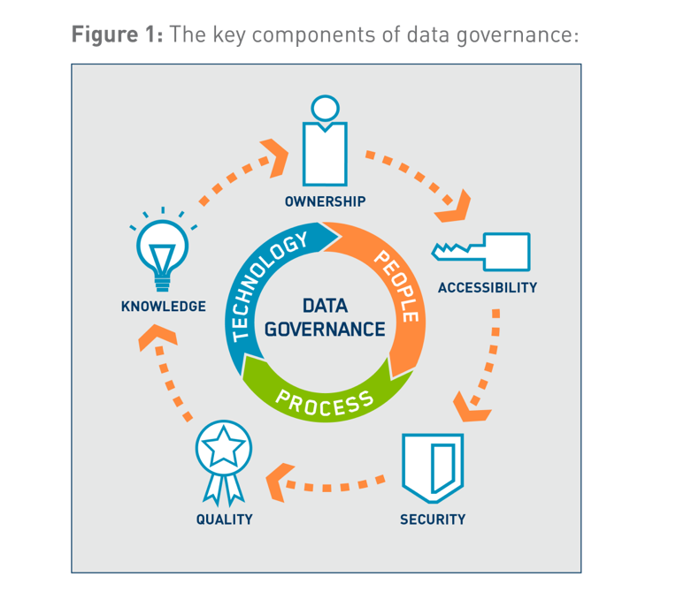

```{r setup, include=FALSE}
knitr::opts_chunk$set(echo = TRUE, fig.align = "center")
```


# Learning Objectives

* Understand the difference between Data Management and Data Governance
* Know the different roles and bodies associated with Data Governance
* Understand the artifacts associated with Data Governance

**Duration - 30 minutes**

# Data Management vs Data Governance

We've discussed all the activities involved in data management. Now we look at the glue that holds all these activities together. It is important to know that Data Governance is different from Data Management. 

**Data Management:** the development and execution of architectures, policies, practices and procedures that properly manage the full data life-cycle needs of an enterprise.  

**Data Governance:**  the exercise of authority and control (planning, monitoring and enforcement) over the management of data assets.  

In short: data governance sets the rules whereas data management executes the activities.


```{r, echo=FALSE, out.width = '80%'}
 
```


# Data governance programmes

There are often data governance programmes setup to kick-start all the required activities. Calling it a programme is a slight misnomer, as data management is never complete, but the putting in place the controls can be.

To ensure success any data governance programme needs to be:

* **Sustainable** : the organisation is committed to both the costs and change required to be successful
* **Embedded** : existing processes will need to change to incorporate new approaches to data
* **Measured** : the benefits of the programme to the organisation top line are measured
* **Business-driven** : it should not be led by IT as it is as much business change as technology change
* **Have shared responsibility** : between data stewards in the business and data management professionals
* **Multi-layered** : happens at every level of the organisation
* **Framework-based** : there needs to be defined accountabilities and interactions due to the required level of coordination
* **Principle-based** : it needs to be led by principles rather than policy, so everyone knows why they are doing it. 

Although organisations are all different sizes and levels of complexity, most data governance programmes will still cover the following areas:

* **Strategy** : defining and communicating what is being done and why. This should align to the business strategy.
* **Policy** : by setting and enforcing a policy around both data and metadata everyone understands what is expected of them. It also enables oversight and compliance as the standards have been clearly set.
* **Standards and quality** : defining standards around data quality and data architecture.
* **Oversight** : this is the ability to provide active engagement in the data management activities, including review of data quality metrics.
* **Compliance** : this is compliance to both the internal policy and external regulation.
* **Issue management** : identification, prioritisation, escalation and resolution of issues. Often this will require budget or additional projects to be set up to remediate.
* **Data management projects** : sponsorship of activities to improve data management practices.
* **Data asset valuation** : setting standards and processes to consistently define the value of data.

Before starting any data governance programme, the organisation should be assessed for its readiness. The factors consider are data management maturity, its capacity to accomodate change, its collaborative readiness and alignment to the object of strategic use of data. If any of those are a challenge, it may be necessary to address those first to ensure sucess. 

# Drivers for Data Governance

It is often difficult to garner enthusiasm for starting data governance activities across a business. The more data governance activities actually help to solve organisational problems the more likely it is that people will change behaviours and adopt new working practices. This encouragment with *carrots* is preferred, however it normally it actually requires the wielding of *sticks* in the form of regulatory compliance to be truly successful. 

The most common drivers for the adoption of data governance practices are:

* **Compliance:** changes in regulation such as GDPR can introduce the need for improved data governance
* **Need for analytics:** a wish to become more data-driven is being thwarted by low quality data can drive interest in data quality activities
* **Reducing risk:** data security, privacy and general risk management
* **Improve processes:** data quality, metadata management, vendor management, HR, software development or change requirements driven by regulatory compliance

# Roles and responsibilities

Much of the activities around data governance involve assigning responsibilities in the form of formalised roles related to data.

The most senior data role in an organisation is the Chief Data Officer (CDO). The CDO has budget and authorisation to deliver a data governance programme. Sometimes the CIO might be given the responsibility for data, but this introduces a slight conflict of interest, with the CDO wanting to "do the right things" and the CIO wanting to "do things right", so is not recommended. 

The CDO has central responsibility for data, but they delegate this through their data stewards. Data stewards are members of the organisation in any role who have an additional responsibility to manage data assets.

The size and complexity of the organisation will affect the number of data stewards required, but they generally cover the following roles:

| Role                       | Activity                                                   |
|----------------------------|------------------------------------------------------------|
| CDO                        | Overall responsibility for data                            |
| Chief data steward         | Chairs data governance bodies                              |
| Executive data stewards    | Serve on governance councils                               |
| Enterprise data stewards   | Have oversight for a whole domain e.g. customer or product |
| Business data stewards     | Subject matter experts for their area of the business      |
| Data owners                | Have authority for decisions within the domain             |
| Technical data stewards    | IT professionals                                           |
| Coordinating data stewards | Manages coordination, compliance and projects               |

Training and communication are key to successful data governance and need to be included in any programme to ensure everyone knows what to do to carry out their enhanced roles.

# Data Governance bodies

For effective governance, organisations set up a number of bodies and committees. If this is done before any training though, people find themselves attending "yet another meeting" without an understanding of their role, which is why the training is so important.

The types of committees that are normally set up comprise of:

* Steering committee - the highest authority with responsibility for funding and oversight. Ensures enterprise-wide support for data.
* Council - Manages the initiatives and projects. This could include the development of policies, agreement of metrics or escalation of issues.
* Office - The Data Governance Office generally reports directly to the CDO and coordinates the activities across the knowledge areas such as definitions and standards
* Stewardship teams - At a more local level focuses on areas of interest and local data change projects (business and technical)
* Local committees - These may be required in large organisations to delegate authority from the main council

# Required artifacts

The types of artifacts produced by a data governance programme consist of the following:

* Strategy and business case - what is the aim and the benefits of carrying out the activity
* Business glossary - a view of the definitions of key data items
* Policies and standards - documented policies and standards about how the organisation manages its data
* Data quality monitoring - data quality reporting for key data items
* Roles and responsibilities - who has agreed to take on additional responsibility for data and what those responsibilities are
* Procedures for issues identification and escalation - how to manage data quality issues
* Training resources
