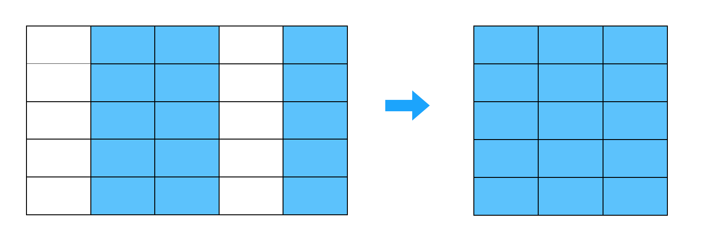
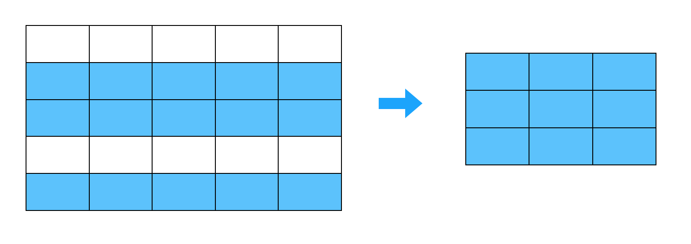
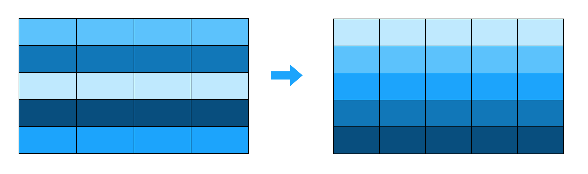
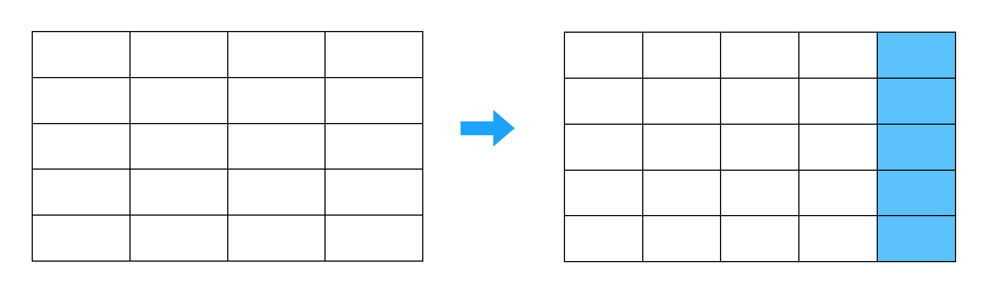
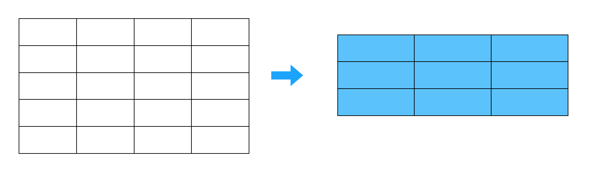
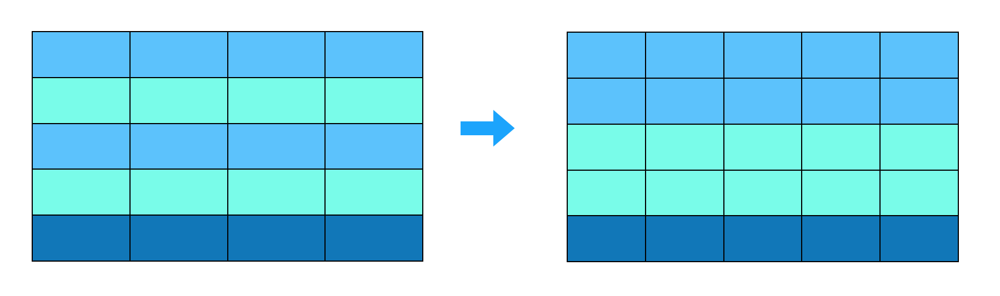
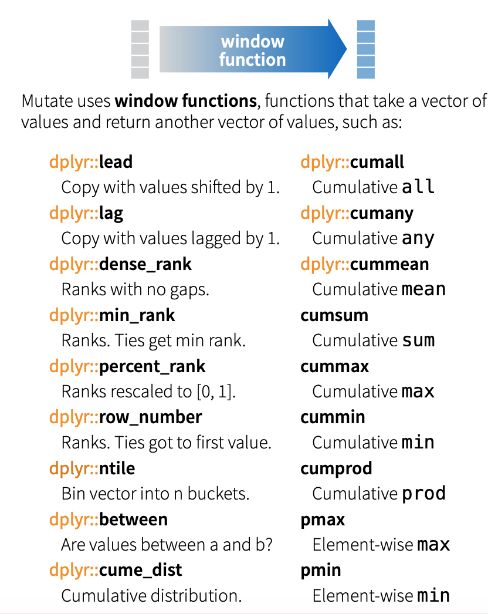

```{r setup, include=FALSE}
knitr::opts_chunk$set(echo = TRUE, fig.align = 'center')
library(tidyverse)
```


# Learning Objectives<br>

1. Understand conceptually what each `dplyr` verb does
2. Be able to use `dplyr` verbs (`filter`, `arrange`, `select`, `mutate`, `summarise`) to extract a required dataset
3. Be able to deal with missing values and nulls whilst using functions
4. Know about - and be able to use - additional functions that support the `dplyr` verbs - `group_by`, helper functions, window functions and logical operators
6. Be familiar with and able to use the magrittr operator (pipe) to chain together commands


**Duration - 1 hour**<br>


# Data wrangling


> "Data wrangling is the process of transforming and mapping data from one "raw" data form into another format with the intent of making it more appropriate and valuable for a variety of downstream purposes such as analytics.  - Wikipedia"

Typically, wrangling data involves selecting columns you want, filtering rows you want, arranging data by a certain order, adding columns you want, grouping data so you can analyse it, and eventually summarising the data you have. And while this may seem like a less exciting part of data analysis, it is without a doubt, the part of your data analysis process you'll spend the most time on. In fact, it is said that 80% of a data scientist's job is cleaning and wrangling data. 

<br>
<center>

</center>
<br>


# Enter... `dplyr` 

<br>
<br>
<center>


</center>
<br>

`dplyr` is a package from the tidyverse created for 'data wrangling'. Given the vast amount of time analysts spend wrangling data, the aim of the dplyr package is to provide you will all the tools you need to do this, in one handy package. Each `dplyr` function is known as a **verb**, and `dplyr` aims to provide a function for each basic verb of data manipulation. As a bonus, the verbs (aka functions) have been given names that actually reflect what they do. 


<center>

***

**`select()`	  Include or exclude certain variables (columns)**
<br>

***


**`filter()`	  Include or exclude certain observations (rows)** 
<br>

***

**`arrange()`	  Change the order of observations (rows)**
<br>
***


**`mutate()`	  Create new variables (columns)**
<br>

***


**`summarise()`	Derive aggregate variables for groups of observations**
<br> 

***


**`group_by()`	Create groups of observations**
<br>

***

</center>


These six functions are known as ’single table verbs’ because they only operate on one table at a time. Later in the course you will learn two-table verbs that you can use to merge tables together. Although the operations of these functions may seem very simplistic, it’s amazing what you can accomplish when you string them together: Hadley Wickham has claimed that 90% of data analysis can be reduced to the operations described by these six functions. 


# Working with `dplyr`

To demonstrate the power of the six dplyr verbs, we will use them to work with the [game of thrones](https://www.kaggle.com/mylesoneill/game-of-thrones/downloads/game-of-thrones.zip/1) dataset downloaded from the open data source website kaggle. 

First, let's have a look at the dataset. [You can find out all about the variables and coding you expect here](https://www.kaggle.com/mylesoneill/game-of-thrones#character-deaths.csv)


```{r, warning = FALSE, message = FALSE}

#the data is called all_deaths in the CodeClanData package
library(tidyverse)
library(CodeClanData)

all_deaths
```

First, let's take a look at our data. This is always the first step when working with data - check if what you have is what you expect. 


```{r}

# number of rows
nrow(all_deaths)

# number of observations
ncol(all_deaths)

# overall dimensions
dim(all_deaths)

# variable names
names(all_deaths)

# look at the actual data
print(all_deaths)

```

<br>
  
So we know we're looking at a tibble, which contains 917 observations and 13 variables. We can also see we have a lot of **null values** coming in. Null values are a common issue across all kinds of datasets, and they signify missing or unknown values. Figuring out where they are and what to do with missing values is an important value of data cleaning, which you will learn more about later on. For now, you can get a good idea of how R recognises the null values by using the `is.na` function:
<br>

```{r}

# print out a particular column with lots of NA's (tidyverse), view the first 10 rows
select(all_deaths[1:10,], book_of_death)

# base R version
# all_deaths$book_of_death
```

```{r}
# use the is.na function to see what it recognises NA's as:
select(all_deaths[1:10,], book_of_death) %>% is.na()

# base R version
# is.na(all_deaths$book_of_death)
```


In our case, it doesn't matter too much about leaving the null values in as they aren't doing much harm right now, and we can exclude them from any summaries we do later. If you did want to remove the null values, you would just add the `na =` call mentioned above to your code:
`read_csv("data/character-deaths.csv", na=".")`

Now we have decided what to do with the null values, we can start wrangling the data using `dplyr`. 


# Wrangling with `dplyr` 

<br>

## The `select()` function : choosing which variables to keep 

<br>

If we wanted to create a data set that included everything but the variable n, we could do this using the `select()` function from the `dplyr` package: 

```{r}

# select a few variables to keep 
deaths <- select(all_deaths, name, allegiances, gender, nobility, year_of_death) 

```


The first argument to the `select()` function is your tibble, and further arguments are the names of columns you want to keep.   

What if you only want to get rid of one variable? `select()` allows you to do that while saving typing by putting a minus sign in front of the column:

```{r} 
# get rid of the Name column
deaths_no_names <- select(all_deaths, -name) 
```

<div class='emphasis'>
Note that `select()` (and all the following functions) do not change the original tibble, but make a new tibble. If you don’t save this new tibble to a variable, it will be printed to the console and lost forever. So if you want to keep it around, assign it to a variable.
</div>
<br> 


<blockquote class='task'>
**Task - 5 mins** 

* Select all columns which relate to a book.
* Select the columns which are related to some kind of death. 

<details>
<summary>**Answer**</summary>

```{r}
# select all columns which relate to a book: different ways
books <- select(all_deaths, -name, -allegiances, -year_of_death, -gender, -nobility)

all_deaths %>%
  select(starts_with("book"))

all_deaths %>%
  select(contains("bo"))


# select the columns which are related to death.
death <- select(all_deaths, year_of_death, book_of_death)
```
</details>
</blockquote>


<br>

## The `filter()` function: subsetting your data
<br>

`filter()` allows you to select a subset of rows in a data frame. Like all single verbs, the first argument is the tibble (or data frame). The second and subsequent arguments refer to variables within that data frame, selecting rows where the expression is TRUE.

```{r}

# let's pick out one house of characters:
lannisters <- filter(deaths, allegiances == "Lannister")

# more than one lannister name : need to do this
lannisters <- filter(all_deaths, allegiances %in% c("House Lannister","Lannister"))


# female characters of that house
female_lannisters <- filter(lannisters, gender == 0)

# let's do a combo: noble lannister characters
noble_lannisters <- filter(deaths, allegiances == "Lannister", nobility == 1)


```


Here we have also started using logical operators again, as we did in Base R. In this case, we have used `==`, which means exactly equal to. So here we are taking all rows where the variable allegiances equals "Lannister". 

<blockquote class='task'>
**Task - 10 mins** 

*[Take a look at this website](https://www.statmethods.net/management/operators.html) which contains a list of logical operators in R.  

* Find where the `year_of_death`is less than or equal to 299. 
* Find the females who are not Lannisters

<details>
<summary>**Answers**</summary>

```{r}
# Find where the `year_of_death`is less than or equal to 299. 
filter(deaths,year_of_death <=299)

# Find the females who are not Lannisters
filter(deaths, allegiances != "Lannister", gender == 0)
```

<br>
<br>

## The `arrange()` function: putting your data in order
<br>

`arrange()` works similarly to `filter()` except that instead of filtering or selecting rows, it reorders them by column names. If you provide more than one column name, each additional column will be used to break ties in the values of preceding columns:
<br>
```{r}

# arrange it so all the females (gender = 0) come first 
arrange(noble_lannisters, gender)

```
<br>

The default is to sort in ascending order. If we want it descending, we wrap the name of the variable in the `desc()` function.   


```{r}
arrange(noble_lannisters, desc(gender)) 
```
<br>
We can sort by more than one column. For instance:
<br>
```{r}
arrange(noble_lannisters, desc(gender), desc(nobility))
```
<br>


<blockquote class='task'>
**Task - 10 mins** 

* Arrange `all_deaths` by `book_of_death`
* Arrange `all_deaths` by `allegiances` and `book_intro_chapter`
* Arrange `all_deaths` by descending `year_of_death`

<details>
<summary>**Answers**</summary>

```{r}
# arrange `all_deaths` by `book_of_death`
book_death <- arrange(all_deaths, book_of_death)

# arrange `all_deaths` by `allegiances` and `book_intro_chapter`
double_arrange <- arrange(all_deaths, allegiances, book_intro_chapter)

# arrange `all_deaths` by descending `year_of_death`
death_arrange <- arrange(all_deaths, desc(year_of_death))

```
</details>
</blockquote>
<br>

## The `mutate()` function: creating new variables (columns)
<br>

Besides selecting sets of existing columns, it’s often useful to add new columns that are functions of existing columns. This is the job of `mutate()`. Let's use it to calculate the number of years people survived in the book series, after the year 298. 

<br>
```{r}

# create a new variable called years_survived, which calculates the year of death, minus the year 298. 
deaths_year <- mutate(deaths, years_survived = year_of_death - 298)
```
<br>

Now we can see we have added another column with a calculation. 

`mutate()` has a bunch of extension functions as well that let you change existing variables in your data: `mutate_all()`, `mutate_at()` and `mutate_if()`. These can be used to modify multiple columns at once.

Let's look at `mutate_all()` and use it to change all our book chapters to characters.

```{r}
# select our book columns
books <- select(all_deaths, book1_GoT, book2_CoK, book3_SoS, book4_FfC, book5_DwD)

# change them to character
char_books <- mutate_all(books, as.character)

```

Here, we selected the columns we wanted to make character first. But if you wanted to skip this, you can use the `mutate_at()` function. 

```{r}

char_books2 <- mutate_at(all_deaths, c("book1_GoT", "book2_CoK", "book3_SoS", "book4_FfC", "book5_DwD"), as.character)
```


Finally, we can conditionally change or add columns using `mutate_if()`. This is particularly useful for transforming variables from one type to another, and can conditionally check across different variables.

```{r}
# change all doubles to characters
if_books <- mutate_if(all_deaths, is.double, as.character)

```


<blockquote class='task'>
**Task - 10 mins** 

* Add a new column which is a logical vector, which has TRUE if `book_intro_chapter` is empty, and FALSE if it isn't. *Hint: you'll need to use the `is.na` function we learned above*. 

* Change the nobility column to a logical vector
* Change any variables which are class `double / dbl` to integer. 

<details>
<summary>**Answers**</summary>

```{r}
# Add a new column which is a logical vector, which has TRUE if `book_intro_chapter` is empty, and FALSE if it isn't
is_book_empty <- mutate(all_deaths, my_test = is.na(book_intro_chapter))
is_book_empty

# Change the nobility column to a logical vector
mutate_at(all_deaths, "nobility", as.logical)

# change all doubles to integers
integers_data <- mutate_if(all_deaths, is.double, as.integer)

```

</details>
</blockquote>


## The `summarise()` function: summarise your table 
<br>
One of the final important things to learn is how to summarise important aspects of your data. Summarise is typically used on grouped data, created by the `group_by` function. When used together, the `summarise` function collapses each group into a single-row summary of that group. 

For example: 
<br>
```{r}
# group the death data by Allegiances
deaths_grouped <- group_by(deaths_year, allegiances)

# print the tibble out, and here you'll see at the top the number of groups you have created: 
deaths_grouped 

# now count the number of people in each group using the n() function
summarise(deaths_grouped, character_count = n())

# Also - you can use `summarise` or `summarize` - works both ways!

```

<br>
The `n` function here counts the number of observations within the group you've made. It can only be used within `summarise`, `mutate`, and `filter`. In the example above, we have grouped our data by `allegiances`, and so the `n()` function in this case will count how many people are in each group (i.e. how many in each house).  


<blockquote class='task'>
**Task - 10 mins** 

Here we have only grouped by one thing, but the `group_by` lets you group by more than one variable, so you can summarise in lots of different ways! Have a go at grouping by more than one variable. 

You can also use the `ungroup()` function, which simply ungroups grouped data. Use the `ungroup()` function on your `deaths_grouped` variable and remove the groups. 

</blockquote>
<br>


One thing to remember is that we had lots of NA values in the data? Well we don't want to summarise them in the counts, as we don't really know if they are dead or not as they don't have any data. Instead, we can add a line to make sure these NA's are dropped before summary:

```{r}
# drop the na's
deaths_no_na <- drop_na(deaths_grouped)

# summarise again 
summarise(deaths_no_na, character_count = n())

```

See the difference from this one and your counts above? Always be careful removing NA's from data, but be more careful of doing any summarising on data with NA's (unless there is a good reason)


<blockquote class='task'>
**Task - 30 mins** 
* Now it's your turn! 

Start with the `all_deaths` data for each question.  

Use the select and filter functions to choose appropriate variables and find which characters we initially met in book 1 that survived to book 5.   

<details>
<summary>**Answer**</summary>
```{r}
book_deaths <- select(all_deaths, name, book1_GoT, book5_DwD)
book_survivals <- filter(book_deaths, book1_GoT==1 & book5_DwD ==1)

book_survivals

```
</details>
<br>


Find out the percentage of characters who died in each book.   
Save the percentage in a new column called `percent`. Arrange the final output in order of highest percentage first.   

<details>
<summary>**Hint**</summary> 
You should remove the na's, group the data, summarise the counts, add the column, and then arrange  
</details>

<details>
<summary>**Answer**</summary>
```{r}
# remove na's
deaths_na_gone <- drop_na(all_deaths)

# group the deaths by book
book_deaths_grouped <- group_by(deaths_na_gone, book_of_death)

# summarise the number in each group 
book_deaths_summarised <- summarise(book_deaths_grouped, death_count = n())

# calculate the percent and make a new column 
book_deaths_percent <- mutate(book_deaths_summarised, percent = death_count / sum(death_count)*100 )

# arrange in descending order 
arrange(book_deaths_percent, desc(percent))


```
</details>
<br>


# Pipes: creating sequences of multiple operations. 


"Pipes: at first you'll probably hate them, but once you get the hang of them you'll love them." - Everyone who has learned pipes in R. 


The pipe, `%>%`, comes from the `magrittr` package by Stefan Milton Bache. It is designed to allow you to create sequences of operations, without having to create lots and lots of datasets in between. Packages in the tidyverse load `%>%` for you automatically, so you don’t usually load magrittr explicitly.

As you can see above, the `dplyr` functions don't save new datasets everytime you do something. Therefore we had to do a lot of assigning, as we stepped through the different ones. Ideally, you don't really want to have lots of different datasets clogging up your environment: not only does it take up a lot of space, but it also becomes harder and harder to remember which datasets are what (even if you've named them well). 

Enter, the pipe. 

Let's look at the code we used above to get a summary: 

```{r, eval=FALSE}


# select a few variables to keep 
deaths <- select(all_deaths, name, allegiances, gender, nobility, year_of_death) 

# create a new variable called years_survived, which calculates the year of death, minus the year 299. 
deaths_year <- mutate(deaths, years_survived = year_of_death - 298)

# group the death data by Allegiances
deaths_grouped <- group_by(deaths_year, allegiances)

# now count the number of characters in each group
deaths_summary <- summarise(deaths_grouped, character_count = n())

# arrange the data
deaths_arranged <- arrange(deaths_summary,desc(character_count))

deaths_arranged
```

Now, let's look at the pipe version of that code:

```{r}
# do the same analysis as above, but in pipe form
deaths_pipe <- deaths %>% 
    select(name, allegiances, gender, nobility, year_of_death) %>%
    mutate(years_survived = year_of_death-298) %>%
    group_by(allegiances) %>%
    summarise(character_count = n()) %>%
    arrange(desc(character_count))

deaths_pipe

```

Can you see how the two outputs end up being the same? Pipes can be hard to read at first, but once you get the hang of them, they become much more intuative than regular non piped code.  

<div class='emphasis'>
The best way to understand a pipe is to translate `%>%` to the words "and then...". 
For example, by doing this you can read this pipe code from top to bottom as follows:

* Make a tibble called `deaths_pipe` and in it put the `deaths` data, and then... 
* `select` the variables name, allegiances, gender, nobility, year_of_death, and then... 
* `rename` the variable year_of_death to `deathyear`, and then... 
* `mutate` it to add a variable called `years_survived` which contains how many years people survived after year 298, and then...
* `group_by` their allegiance, and then... 
* `summarise` the number of people who died in each group. 
* `arrange` the data in `desc` order.   

</div>
<br>

Overall, using pipes eliminates the need to create and store lots of datasets, makes the code easier to read, and makes the code more efficient to write. Which is good, as the two main aims pipes were designed for were: “to decrease development time and to improve readability and maintainability of code.” 


<blockquote class='task'>
**Task - 15 mins** 

Write a pipe which summarises which percentage of the characters in each house are noble, and saves the percentage in a new column called `percent`.

<details>
<summary>**Answer**</summary>
```{r}
all_deaths %>% 
  filter(nobility==1) %>%
  group_by(allegiances) %>%
  summarise(noble_count = n()) %>%
  mutate(percent = noble_count / sum(noble_count)*100 ) %>%
  arrange(desc(percent))
  
```
</details>
<br>


# Window functions : using them in combo with `dplyr` 

By now you've hopefully seen how powerful the `dplyr` functions are. What's even better news is that they have all been designed to work with a whole load of other functions in R. For example, you can combine them with window functions.   

<center>

</center>
<br>


A window function is a variation on an aggregation function. Where an aggregation function, like `sum()` and `mean()`, takes many inputs and return a single value, a window function returns `n` values (where n = the number of inputs). For example, if you had 10 data points and you wanted to rank them in order of highest to lowest, you would use a ranking window function and it would return 10 values. 

In terms of using them with dplyr, window functions are used in conjunction with `mutate` and `filter`.

Let’s say you have a question like, “What are the best houses people to be in, based on how many characters in the family died. To answer this question, we can use one of the window functions called `min_rank()`, within our dplyr functions:

```{r}
all_deaths %>% 
  drop_na()%>%
  group_by(allegiances) %>%
  summarise(total_count_by_group = n()) %>%
  mutate(house_rank = min_rank(total_count_by_group)) %>%
  arrange(house_rank)
```

What does this tell us? Well it tells us that `House Arryn`, `House Martell`, `House Tyrell` and `Tyrell` all have the same value, so they are all joint "first rank". This means these are the best houses to be in if you want to make it through the game of thrones series.   

<br>

What if we wanted the worst ten houses to be in? There is no `max_rank` function. Instead, the easiest way to do this would be to arrange your rankings in descending order instead. 

```{r}

all_deaths %>% 
  drop_na()%>%
  group_by(allegiances) %>%
  summarise(total_count_by_group = n()) %>%
  mutate(house_rank = min_rank(total_count_by_group)) %>%
  arrange(desc(house_rank))
```

Now we can see that having an allegiance of `None`, `Night's Watch`, or `Stark` means you're pretty likely to die...   

<br>


<blockquote class='task'>
**Task - 15 mins** 


For each house, find all where they had more deaths than average.
<details>
<summary>**Hint**</summary>
You'll need to select one of the variables which contains info about when they died, then summarise how many people within each house died, then use the `mean` function to filter where the number of people who died in a house, is greater than the mean count.
</details>

<details>
<summary>**Answer**</summary>
```{r}
all_deaths %>% 
  drop_na() %>%
  select(allegiances, death_chapter) %>%
  group_by(allegiances) %>%
  summarise(count = n()) %>%
  filter(count > mean(count))

```
</details>
<br>


Find all cases where someone died between book chapter 30 and 50. Only keep people who died in these chapters in your final table.  

*Hint: use the between() function*   

<details>
<summary>**Answer**</summary>
```{r}

all_deaths %>% 
  select(name, death_chapter) %>%
  drop_na() %>%
  mutate(between_values = between(death_chapter,30,50)) %>%
  filter(between_values == TRUE)
```
</details>
<br>

**Extension task: Harder!**

Apply the `cume_dist` function to get which allegiances contain the the top 50% of people overall. 

*Hint: Take a look at the [cran window functions documentation](https://cran.r-project.org/web/packages/dplyr/vignettes/window-functions.html) for info on window functions.   
*cume_dist() gives the proportion of values less than or equal to the current rank.*

<details>
<summary>**Answer**</summary>
```{r}
distribution_deaths <- all_deaths %>% 
  select(allegiances, book_of_death) %>%
  group_by(allegiances) %>%
  summarise(total_count_by_group = n()) %>%
  mutate(distribution_score = cume_dist(total_count_by_group)) %>%
  filter(distribution_score > 0.50) %>%
  arrange(desc(distribution_score))
```
</details>
<br>


</blockquote>

For awareness, there is also a handy function `top_n()` which is a handy wrapper that uses `filter()` and `min_rank()` to select the top or bottom entries **within** each group, ordered by a given variable (the argument `wt`). If we want the top values we put a positive number and if we want the bottom values we use a negative number. It will include more rows than the number `n` specified if there are ties.

For example is we wanted to know the last year of death for characters within each alliance we could use `top_n` to give us:

```{r}
all_deaths %>% 
  drop_na()%>%
  select(allegiances, year_of_death) %>%
  group_by(allegiances) %>%
  top_n(1, wt = year_of_death) 
```

We see that there are ties within allegiances e.g. 2 characters within 'Night's Watch' dies in year 300. 

If you don't include `wt`, then `top_n` will use the last column in the data frame. So this code will give exactly the same result.

```{r}
all_deaths %>% 
  drop_na()%>%
  select(allegiances, year_of_death) %>%
  group_by(allegiances) %>%
  top_n(1) 
```

The `top_n` function is particularly useful combined with `group_by` but, like `summarise`, can be used on it's own. Here it will find the top five values across all the data:

```{r}
all_deaths %>%
  drop_na() %>%
  select(name, allegiances, year_of_death) %>%
  top_n(5)
```

And the bottom five values, using `-5` in `top_n`.

```{r}
all_deaths %>%
  drop_na() %>%
  select(name, allegiances, year_of_death) %>%
  top_n(-5)
```

Note we had a lot of tied values in the last two examples!

# Recap

* What do each of the main dplyr verbs do?
<details>
<summary>**Answer**</summary>
select() Include or exclude certain variables (columns) <br>
filter() Include or exclude certain observations (rows) <br>
arrange() Change the order of observations (rows) <br>
mutate() Create new variables (columns) <br>
summarise() Derive aggregate variables for groups of observations <br>
</details>  

* What would you do with missing values in a dataset, and what function would you use?
<details>
<summary>**Answer**</summary>
Remove them when you load in the data (be careful of this!) using `na =`, or deal with them within a data cleaning or analysis stage using `drop_na`.
</details>

* What do logical operators do? 
<details>
<summary>**Answer**</summary>
Help give conditions on which code can filter on. 
</details>

* What are the benefits of using the pipe functions?
<details>
<summary>**Answer**</summary>
Keeps code extremely readble, eliminates the creation (and storing) of unnecessary datasets, and decreases development time. 
</details>

<hr>

# Additional Resources

[Data wrangling cheat sheet](https://www.rstudio.com/wp-content/uploads/2015/02/data-wrangling-cheatsheet.pdf)

[Summarise and group_by: a more in depth tutorial](https://www.guru99.com/r-aggregate-function.html#1)

[Data Carpentry: Analysing data with dplyr](https://datacarpentry.org/R-genomics/04-dplyr.html)

[Dealing with missing values](https://towardsdatascience.com/data-cleaning-with-r-and-the-tidyverse-detecting-missing-values-ea23c519bc6)

[Simplify your code with %>%](https://uc-r.github.io/pipe)

[Window functions with dplyr](https://blog.exploratory.io/filter-data-with-aggregate-and-window-functions-88e3b2353c00)

[Window functions with group_by and mutate](https://rpubs.com/hadley/window)

[R for Data Science: Pipes](https://r4ds.had.co.nz/pipes.html)