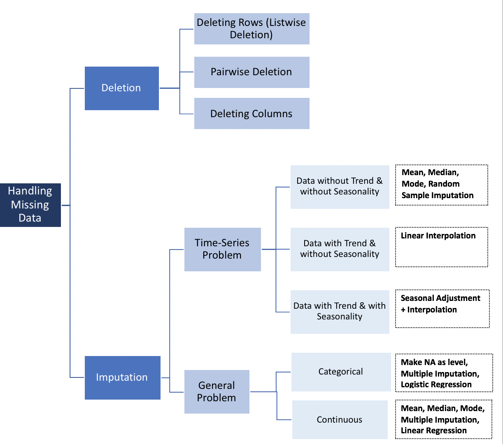

```{r setup, include=FALSE}
knitr::opts_chunk$set(echo = TRUE, fig.align = 'center')
library(tidyverse)
```


# Learning objectives

* Understand the challenges of missing and null values
* Know potential methods of dealing with missing values
* Identify why the data was missing - random or pattern
* Be able to identify and justify the approach taken for each missing data item
* Be able to tidy up a dataset and deal with missing values


# Missing values: what are they? 

Missing values - in their simplest form - are data points that are not entered into your spreadsheet/database/table. First, understand that there is no one good way of dealing with missing data. The missing values you will get differ by dataset, and the way you deal with them will also depend on what analysis you are doing. 


# Missing values: why do they go missing?

Lots of different things contribute to missing data. The types of missing values can be split into categories.  

**Missing at Random (MAR):** There is a pattern in the missing data but not on your primary dependent variables. Instead, it might be related to your data. For example, maybe you have cyclical data, and every night there is a period where the data collection device is shut off. 

**Missing Completely at Random (MCAR):** There is no pattern in the missing data. This is good! This might mean someone has accidently entered data wrong, or it's just a forgotten entry, etc.   

**Missing not at Random (MNAR):** There is a pattern in the missing data that affect your primary dependent variables. For example, lower-income participants are less likely to respond and thus affect your conclusions about income and likelihood to recommend. Missing not at random is your worst-case scenario. Proceed with caution.    

In the first two cases, it is pretty ok to remove the missing values (depending on how many occurrences there are, and where those occurrences are). In the last case, removing observations can produce bias in the results. 


# How are missing values represented? 

In R the missing numeric values are coded by the symbol `NA`, or `NaN` .

* NaN : (“Not a Number”) means 0/0
* NA (“Not Available”) is generally interpreted as a missing value and has various forms

Therefore, NaN ≠ NA and there is a need for NaN and NA. To identify missings in your dataset the function is `is.na()`. This will pick up both NA and NAN values. 

Character variabes are harder to code. They can just be left blank, or replaced with a large variety of different symbols - whatever the analyst chooses really! Missing data within character variables are MUCH harder to find, but potentially a bit easier to deal with. 


# Missing values: the danger

Both data analysts and software may confuse a missing value with a default value or category. For instance, in Excel, if you add a cell that contains the number 2 to a field that is empty, the result will come out as 2. What's wrong with this?   

<details>
<summary>**Answer**</summary>
In this case, the problem is that Excel mistakenly imputes `0' where it should have recognised a missing value. This might not be a problem in a standard addition task, but what if you were calculating a mean? Do you want all the missing values to be included? No - then you're dividing the sum total by the wrong number of observations. 
</details>

<br>
Another commonly encountered mistake is to confuse an NA in categorical data. For example, a missing value can either represent an unknown category OR actual missing data. For example, if you were analysing data from a survey about demographics in a particular city council region. Unfortunately, the survey hasn't been designed or set up properly, and so you've recieved lots of missing values. For example, there may be data values where the person has left the entry blank because they wanted to responded "don't know" (for example, parents birth city). And there may be values where the person has chosen not to intentionally respond and left the field blank (e.g. marital status). Now you've got 2 missing data points, but they represent totally different things. 

This is a common problem, and it's worth remembering that if unknown is indeed a category, it should be added as a response choice, so it can be appropriately analyzed.


# Missing values: what should you do? 

Overall, it's up to you to decide how empty values are handled, since a default imputation by your software might give you an unexpected or erroneous result. There are three main strategies usually employed:

1. Drop the NA values. Delete all data from any participant with missing data. 

2. Replace the NA values with something else. This is known as **imputation**. Different kinds of imputation exist:

* Average imputation: replace the missing values with the mean value. This isn't always recommended though, as you might have outlier data and this can affect the validity of your data. This can also artifically reduce the variability of your data.   

* Common point imputation: you can use the median, mode or most commonly chosen value. For example, on a 5 point scale you could substitute a missing value as a 3 (e.g. neutral). This is better than guessing, but still a risky approach, and again, reduces the variability in your dataset.   

* Regression substitution: Regression analysis estimates and predicts values. Regression substition predicts the missing value from the other values. This typically gives you more statistically stable imputations. 

* Multiple imputations: This is a newer technique, but by far the most popular. In summary, it involves using software to create plausible values based on correlations between responses and via a number of simulations. Each of the simulated datasets are analysed, and then the results are combined into the missing data. In essence, this technique uses models based on simulated data, to create values which you can impute into your missing values. 

*Note: it is worth noting that imputation does not necessarily give better results! It's just one way of preserving some data.*

3. Just leave them alone. This can sometimes work if you just want a true representation of the data. However, if you want to do any summary stats, you will need to deal with missing values. 

[This image sums the different practices up pretty well](https://towardsdatascience.com/how-to-handle-missing-data-8646b18db0d4):


```{r, include = FALSE}

```


<blockquote class='task'>
**Task - 5 mins** 

Have a think about these three categories of options. What are the benefits and pitfalls of each? 

<details>
<summary>**Answer**</summary>

Drop the NAs : 
The benefit of this approach is that you get rid of all the missing data, and you can't accidently convert or summarise it.   
The pitfall of this approach is that you might end up losing a lot of data, which has cost time and money to collect. Similarly, you might end up deleting all participants in a category by accident.   

Impute the values :
The benefit of this approach is that you minimise data loss. For example, you might have a set of temperature recordings over a month, with a few days missing because the equipment was down. In this case, you might feel comfortable replacing the missing values with the average temperature for the month. Or the median. As the temperature within a month doesn't tend to vary that much, either of these is probably a good estimate of the temperature on the missing days. 

Just leave the values: 
The benefit of this approach is that you're keeping the data as close to raw as possible. Sometimes, this can be an appropriate answer. For example, if you were just creating datasets and wanted to retain as much of the raw data as possible for traceability, and you knew you weren't going to do any summary stats, then it might be best just to leave them. However, you MUST remember that your summary stats will be affected, should you choose to do any.  
The pitfalls of this approach however are many. For example, if you leave the missing values in, they might accidently get summarised if someone who isn't familiar with the data starts working on it. Similarly, you might have non standard missing values in the data, and these can cause problems.

</details>
</blockquote>

Now we know what missing values are, why they are bad, and what we should do with them, let's look at working with them in R. 


# Identifying missing values in R : an exercise

R's core functionality (and the tidyverse library) is all set up to be consistent with the idea that the analyst should choose how to deal with missing values. Mostly - R and it's functions give you the option to remove NAs. 

For this exercise we're going to work with some customer attrition data - that is, data which represents the loss of clients or customers. Places such as banks, internet companies, tv companies, insurance firms all use this kind of data and analysis as part of their metrics. We've all heard the adverts talking about "Our clients stay with us for X years because they're so happy.... etc.). Well, that's customer attrition data. 

Here we have some data from a phone supply company (communication company). Let's load in the data and look at the missing values we have. 


```{r}
# load in the data
comms_data <- read_csv("data/telecom_data.csv")
view(comms_data)
```
<br>

You can see almost every column in the dataset contains some kind of missing value, and a wide array of them at that! Let's first start by looking at some standard missing values. 

<br>

## Standard missing values 

The column `monthly_charges` contains what we refer to as "standard missing values". That is, it has NA's in it. Let's take a look, using the `is.na()` function. 


```{r}
# select the monthly_charges column to look at what different missing values we have
comms_data %>% 
  filter(is.na(monthly_charges))
```

<br>

From this you can see that we have missing values (the NA - not available rows), and values where NaN (not a number) has been entered.  “NaN” or “Not a Number” is used for numeric calculations. If a value is undefined, such as 0/0, “NaN” is the appropriate way to represent this.  
<BR>

Now we can count how many missing values we have to see the scope of the problem we're dealing with.   

```{r}
# counting missing values
comms_data %>%
  summarise(count = sum(is.na(monthly_charges)))
```


So, what should we do? As mentioned in the introduction, you usually have three broad options. 


### 1. Remove them 

You can remove them, as we learnt to do in a previous lesson last week: 

```{r}
comms_data %>% 
  drop_na()
```

<br>

### 2. Impute them 

You can impute them (that is, replace them with something else). For example, you could replace them with the median value of `monthly_charges`. 

```{r}
# replace na observations in the monthly_charges column, with the median of that column
comms_data_imputed_median <- comms_data %>%
    mutate(monthly_charges= replace(monthly_charges, 
                                    is.na(monthly_charges), 
                                    median(monthly_charges, na.rm = TRUE)))

ggplot(comms_data_imputed_median, aes(customerID, monthly_charges)) + geom_point()
```

<br>
Here our code is overwriting the `monthly_charges` column with a new one where it replaces the na values (`is.na`) with the median. 

We can also do average imputation, and replace the values with the mean.  


```{r}
comms_data_imputed_mean <- comms_data %>%
    mutate(monthly_charges= replace(monthly_charges, 
                                    is.na(monthly_charges), 
                                    mean(monthly_charges, na.rm = TRUE)))

ggplot(comms_data_imputed_mean, aes(customerID, monthly_charges)) + geom_point()

```

Can you see the difference? Either way, the imputed values are pretty obvious. You can see the straight line really clearly where all the values are the same.   

The final way you can impute is via building models to simulate the missing values. This is generally only used on more complex datasets in prep for model building, and so we won't cover this yet. We will learn about lots of packages that allow you to do this later in the course.


### 3. Leave them as is 

As we stated in the intro, the final option you have is to to just leave them as is. In this particular case, this option isn't appropriate, because we want to summarise the charges eventually.   


Now let's look at dealing with some of the non-standard missing values. 


<br>


## Non standard missing values 

<blockquote class='task'>
Take a look at the `total_charges` column and find the different type of missing value identifiers we have, and how many we have.

What is the problem with the result you get?

<details>
<summary>**Answer**</summary>

```{r}
# see the NA values 
comms_data_imputed_median %>%
  select(total_charges) %>%
  filter(is.na(total_charges)) 

# count how many
comms_data_imputed_median %>%
  summarise(count = sum(is.na(total_charges)))


```

What is the problem here? R hasn't recognised that there are three different types of missing values in this column - we have “na”, “NA”, and “N/A”.

</details>
</blockquote>

So, what to do? 
Well, one option is that you can manually set the missing values to all be NA... 

```{r}
# replace all NA values as NA
total_charges_replaced <- comms_data_imputed_median %>%
  mutate(total_charges = replace(total_charges, total_charges == "na", NA)) %>%
  mutate(total_charges = replace(total_charges, total_charges == "N/A", NA))

# check if the NAs are being found now
total_charges_replaced %>%
  summarise(count = sum(is.na(total_charges)))

```

But this method involves you knowing all the different ways missing values are coded in your data. Which is ok if you have a small dataset like we do here, but what if you had millions of values?   

A better method of dealing with this would be to ensure that you're working with numeric data. In our case, the `total_charges` column is actually set to character. 

```{r}
head(total_charges_replaced)

# do it in base r
# glimpse(total_charges_replaced$total_charges)
```

If we change these to numeric types, you'll notice what happens:

```{r}
charges_numeric <- total_charges_replaced %>%
  mutate(total_charges = as.numeric(total_charges))

# Do it in base R
# charges_numeric$total_charges <- as.numeric(comms_data$total_charges)

# check if the NAs are being found now
charges_numeric %>%
  summarise(count = sum(is.na(total_charges)))
  
```

Now you can see that once again, R has found all the NA's. 

Ok, so we've got those one's covered. But what about if we have an even more non-standard missing value? For example, take the `payment_method` column. 


<blockquote class='task'>
Take a look at the `payment_method` column and find the different type of missing value identifiers we have, and how many we have.

Replace these with NA, and then check if you have the right amount

<details>
<summary>**Answer**</summary>
```{r}
# replacing "--" with NA
payments_replaced <- charges_numeric %>%
  mutate(payment_method = replace(payment_method, payment_method ==  "--", NA)) 

# check if the NAs are being found now
payments_replaced %>%
  summarise(count = sum(is.na(payment_method)))

```
</details>
</blockquote>

Great - so now we have all the NAs. But instead of replacing them, dropping them, or imputing them like we do with numeric variables, what should we do? In most cases, you as the data analyst can decided. Here, let's set them to 'unavailable', which is a new category.   
<br>

```{r}
# replace the missing value to be 'unavailable'
payments_new_category <- payments_replaced %>%
  mutate(payment_method = replace(payment_method, is.na(payment_method), "unavailable"))

```

And voila! There you have it. You've successfully cleaned the data and fixed all the missing values, dealing with them in different ways. The final thing you can do is look at your newly cleaned data. 

```{r}
# final dataset
comms_data_cleaned <- payments_new_category
view(comms_data_cleaned)
```

# Implicit missing data 

So far we have dealt with explicit missing data, in that we have entries in our data which have values of NA etc. But what happens if the data is implictly missing? Let's take a look at an example

```{r}
patient_data <- tibble(
                  patient = c(rep("A", times = 10), rep("B", times = 5)),
                  year = c(seq(2000, 2009, by = 1), c(2000, 2004, 2006, 2007, 2008)),
                  result = c(sample(0:100, 15, replace = TRUE)))

patient_data
```

So some results for patient B are implictly missing (2001-2003, 2005, 2009), in that we do not have data for those years. But what happens if we want to turns these into explict missing entries (and then potentially impute them). We can use the `complete()` function from tidyr. 

```{r}
patient_data %>%
  complete(year, patient) %>%
  arrange(patient, year) 
```

We now have explicit missing values for patient B for the years 2001-2003, 2005 and 2009. This function may come in handy if you wanted a sequence of dates (say for a plot over time) but didn't have all entries. 

We could now use imputation to fill in the missing values. Another function that works well with `complete()` is `fill()`, which fills the created NAs with the last preceeding non-NA value in the column. 

```{r}
patient_data %>%
  complete(year, patient) %>%
  arrange(patient, year) %>%
  fill(result)
```

We see here the missing values for patient B for years 2001 to 2003 are populated with the value from 2000 (the last preceeding non-NA value in the column). 

# Recap


* How does R represent missing values? 
<details>
<summary>**Answer**</summary>
R represents missing values with NA and NaN. NA stands for not available, NaN stands for Not a number. 
</details>

* What is the best way to deal with character missing values?
<details>
<summary>**Answer**</summary>
Best way is usually to create a category to represent them all, e.g. a category of "unknown" could be used to represent missing values. 
</details>

* What function would you use to overwrite missing values?
<details>
<summary>**Answer**</summary>
You can use the `replace` function, in combination with the `mutuate` function. 
</details>


# Additional Resources

[How does R handle missing data, compared to other programming languages](https://stats.idre.ucla.edu/r/faq/how-does-r-handle-missing-values/)  

[Difference between NA and NaN](https://www.r-bloggers.com/difference-between-na-and-nan-in-r/)

[Missing values: Examples for Data frames, columns and vectors](https://statisticsglobe.com/r-find-missing-values/)  

[R bloggers: missing value treatment](https://www.r-bloggers.com/missing-value-treatment/)  

[How to handle missing data](https://towardsdatascience.com/how-to-handle-missing-data-8646b18db0d4)  

[7 ways to handle missing data](https://measuringu.com/handle-missing-data/)