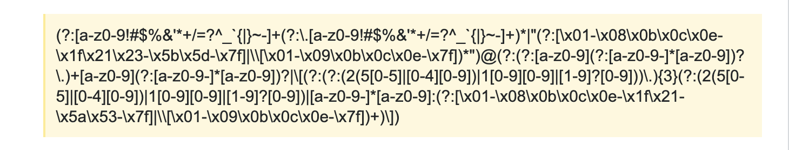
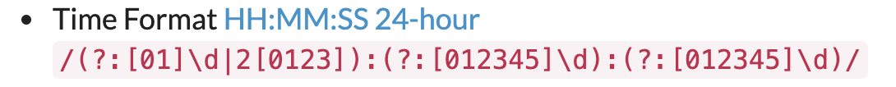
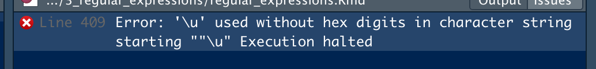

```{r setup, include=FALSE}
knitr::opts_chunk$set(echo = TRUE, fig.align = 'center')
```

# Learning Outcomes

* Know what a regular expression is
* Be familiar with regular expression syntax
* Use regular expressions to match patterns in text
* Create regular expressions using Rebus
* Match patterns in Unicode text

**Lesson Duration: 120 mins**

We've already seen some of the ways in which we can work with strings today, including how we can include some special characters in our reports using Unicode. Now we're going to look at a way in which we can pick specific strings out of a collection based on the characters and symbols they contain.

# What are regular expressions?

A **regular expression** (usually abbreviated to a **regex**) is, fundamentally, just another type of string. We can use them to specify search terms or to validate data by making sure it fits a given pattern. We can also find and replace text in a more generic way than we can by using simple string methods, for example in order to redact email addresses or phone numbers.

Regex is used in data analysis for a number of purposes - e.g. checking whether data is valid (does it follow a pattern of a valid email address, phone number or postcode), extracting parts of variables (e.g. maybe only want the first initial of a surname or the street name from your full address) and more generally it is used in text analysis - which we will come to in module 3.  

# Matching patterns in text

Let's take a look at some of the things we can do with regex. First up, we'll declare some strings to work with:

```{r}
single_string <- "string a"
strings <- c("string a", "string b", "string c", "string d", "striiiiiiing e")
```

These strings all have something in common, but also have their differences. This is something you'll encounter fairly often when working with datasets, both text-based and numerical. Email addresses are a great example: they all contain the "@" symbol and all end in a similar way, eg. ".com", but the other parts could be wildly different. Regex will enable us to find any email address hidden away in a dense block of text.

## Matching Single Characters

The easiest pattern we could try to match is a single alphanumeric character, and we can find some functions in `stringr` to help us do it:

```{r}
library(stringr)
```

Step two is to define the pattern we want to look for. To start with let's just look for the letter "a". Our pattern must be a string and is case-sensitive:

```{r}
pattern <- "a"
```

If we simply want to check if a pattern is present in a string we can use stringr's `str_detect()` function to return a boolean value. We pass it two parameters: the string to check and the pattern to look for. As usual, the pipe operator will take care of the first 'data' argument for us.

```{r}
single_string %>%
  str_detect(pattern)
```

We can pass an optional third parameter `negate` to check for the absence of a pattern:

```{r}
single_string %>%
  str_detect(pattern, negate = TRUE)
```

`str_detect()` is vectorised, enabling us to check many strings at once:

```{r}
strings %>%
  str_detect(pattern)
```

## Matching multiple characters

We don't need to limit ourselves to one character, we can check for many at once. The easiest use case is to look for a specific substring:

```{r}
pattern <- "str"

strings %>%
  str_detect(pattern)
```

But, instead of looking for a substring, we can also look for a selection of characters. We do this by enclosing the characters we're looking for in square brackets (`[]`):

```{r}
pattern <- "[abc]"

strings %>%
  str_detect(pattern)
```

Note that there is no space between the characters, and that we still need to enclose the brackets in quotes. Here we're looking to match any string including the letters "a" **or** "b" **or** "c", (not the pattern "abc"). But what if we wanted to check for a bigger range of letters? Say from 'a' to 't' - do we need to manually type them all out? No! We can use a handy expression which checks for a range of characters:

```{r}
pattern <- "[a-c]"

strings %>%
  str_detect(pattern)
```

Now we're looking for strings containing "a" **or** "c" **or** any character in between (**b**). 

You may often see the common regex testing matching any letter using `[a-z]` in areas such as data-validation. This might seem counterproductive -- after all, it will match **any** lowercase letter but it's useful to check if we infact have a letter in the datafield - rather than a blank space or a number or special character. 

Matching strings in this way is case-sensitive. If we change our pattern to be `[a-z]`, we'll match everything:

```{r}
pattern <- "[a-z]"

strings %>%
  str_detect(pattern)
```

What happens if we change it to match capital letters?

```{r}
pattern <- "[A-Z]"

strings %>%
  str_detect(pattern)
```

Nothing matches any more. We need to take care to use the correct casing when matching letters. If we wanted to match the whole alphabet we would combine the two cases using `[a-zA-Z]`. Or another option is you could cast your data to lower or upper case and then use the resulting case for regex matching.

We can even be specific about how many occurrences of a character we're looking for. If we follow the character(s) with a number in braces (`{}`) we can be quite specific. Let's only match strings which have the letter "i" three times consecutively:

```{r}
pattern <- "i{3}"

strings %>%
  str_detect(pattern)
```

<blockquote class="task">
**Task - 15 mins**

Make a vector containing the following strings:

* "We're having great fun learning about data analysis at CodeClan!"
* "CodeClan is at 37 Castle Terrace, Edinburgh and ClockWise, Glasgow"
* "Our cohort code starts with either DE or DG"
* "You get a great view of the castle from just outside our door"

Write and test regular expressions which will match:

* Any string mentioning CodeClan
* Any string containing two consecutive capital letters
* Any string **not** including the word "castle" or "Castle"

<br>

<details>
<summary>**Hint**</summary>
Remember, `str_detect()` can take an optional third argument called `negate`
</details>
<details>
<summary>**Hint**</summary>
The techniques we looked at above can be combined.
</details>
<details>
<summary>**Solution**</summary>
```{r}
test_strings <- c(
  "We're having great fun learning about data analysis at CodeClan!", 
  "CodeClan is at 37 Castle Terrace, Edinburgh",  
  "We're part of cohort DE2",
  "You get a great view of the castle from just outside our door"
)

# Any string mentioning CodeClan
codeclan_pattern <- "CodeClan"
test_strings %>%
  str_detect(codeclan_pattern)

# Any string containing two consecutive capital letters
capital_letter_pattern <- "[A-Z]{2}"
test_strings %>%
  str_detect(capital_letter_pattern)

# Any string not including the word castle or Castle
castle_pattern <- "[cC]astle"
test_strings %>%
  str_detect(castle_pattern, negate = TRUE)
```
</details>

</blockquote>

# Extracting matching substrings

We've seen how we can find out if a string contains a regular expression or not, but how can we use what we find? We might be only be interestd in certain parts of our data and want to pull them out, or we might want to hide personal information in our dataset before we publish it. We can use regex for both of these.

## Extracting parts of a string

We'll need some longer strings to work with this time:

```{r}
strings <- c(
  "This string has an_address@email.com in it", 
  "This one has user.name@company.co.uk", 
  "Now we've got other_person_123@server.net and my.name@runningoutofideas.com"
)
```

Email addresses are a great example of the kind of thing we may want to find, extract and/or replace in our data. We need to build on the various tools we've already seen in order to find the addresses contained in the above strings (for the purposes of this lesson, we're going to assume that addresses can't have special characters such as `!` or `?` in them).

We'll start by building up our pattern. We're going to need to match some letters, and if we want to do something generic we'll need to match all of them:
```{r}
pattern <- "[a-z]"

strings %>%
  str_extract(pattern)
```

Well, we've found something at least. Our regex has matched the first lower case letter it found in each string, (`str_extract()` will pull out the first matching expression it finds and then stop, ignoring any other potential matches) which doesn't do us much good. We can be more specific though, and say that we want there to be an "@" symbol after those letters:
```{r}
pattern <- "[a-z]@"

strings %>%
  str_extract(pattern)
```

That's a bit better, but not much. We're now matching the symbol and the letter preceding it, but still only one letter. We need to capture all of the letters, but we don't know exactly how many there will be.

If we're not sure about how many occurrences of a character there will be, we can use something called the **Kleene Star**. By adding a `*` after the character or group we want to match, we say "match this expression if there are any number of occurences of these characters".

```{r}
string <- "@emailprovider.com"
pattern <- "[a-z]*@emailprovider.com"

string %>%
  str_detect(pattern)
```

Our expression has matched this string, but if we were checking for valid email addresses we would have wanted this to fail (since there's nothing before the "@"). This is the downside of the Kleene star -- it matches **any** number of occurrences, including none! If we want to make sure we have **at least one**, we use the `+` symbol:

```{r}
string <- "@emailprovider.com"
pattern <- "[a-z]+@emailprovider.com"

string %>%
  str_detect(pattern)
```

Much better.

Let's incorporate what we've just seen into our own expression:

```{r}
pattern = "[a-z]+@"

strings %>%
  str_extract(pattern)
```

More progress! We're not just looking at letters before the "@" though, we've also got an address featuring numbers. We have to think about what comes after "@" too.

```{r}
pattern <- "[a-z0-9]+@[a-z]+"

strings %>%
  str_extract(pattern)
```

Almost there now. The final step is to include the punctuation marks which are vital to defining email addresses: "_" and ".". We can include them in our expression just like any other character:


```{r}
pattern <- "[a-z0-9._]+@[a-z.]+"

strings %>%
  str_extract(pattern)
```

Success! We've pulled the email address out of each of our strings!

Well, almost success... The last string had two email addresses in it, and we've only matched one. As we found earlier `str_extract()` will pull out the first matching expression it finds and then stop, ignoring any other potential matches. It has a partner in `str_extract_all()` which will find everything, though:

```{r}
strings %>%
  str_extract_all(pattern)
```

<div class="emphasis">
We've somewhat simplified the email regex here to suit our example. In the real world there are **lots** more characters which could be included and which all need to be accounted for. A real example would look more like this:

```{r, echo=FALSE, fig.cap="Email Regex", out.width = '100%'}

```

</div>

## Replacing Parts of a String

We've looked at a way of finding any email addresses in a string, regardless of how long they are or where they sit in the string. That gives us a way to extract information from our datasets and analyse it. We may want to publish that dataset though, which means we probably don't want email addresses (or names, or phone numbers) left exposed in it. Instead of simply pulling the information out, we can replace it with something else.

Let's say we want to replace all the email addresses in our strings above with "REDACTED". We can do it using the function `str_replace()`. It works in almost the same way as `str_extract()`, but this time takes another argument representing the string we want to use as a replacement:

```{r}
pattern = "[a-z0-9._]+@[a-z.]+"

strings %>%
  str_replace(pattern, "REDACTED")
```

Just like before, we replaced only the first matching string, but the 3rd element has 2 email addresses in it. Like before, we've got a way to fix it:

```{r}
strings %>%
  str_replace_all(pattern, "REDACTED")
```

<blockquote class="task">
**Task - 15 mins **

Make a vector containing the strings:

* "Colin's mobile number definitely isn't 07777777777."
* "A landline might be 01010 123456."
* "Mhairi, Del, Aileen and Steph have been some of your instructors so far."
* "I'm called your_name_here and I live in your_town_here."

Use regular expressions to:

* Extract all the names
* Extract the landline number
* Insert your name and where you live into the fourth string

<br>

<details>
<summary>**Hint**</summary>
White space can be included as part of a regular expression
</details>
<details>
<summary>**Solution**</summary>
```{r}
test_strings <- c(
  "Colin's mobile number definitely isn't 07777777777.", 
  "A landline might be 01010 123456.",
  "Mhairi, Del, Aileen and Steph have been some of your instructors so far.", 
  "I'm called your_name_here and I live in your_town_here."
)
```


```{r}
# Extracting names
name_pattern <- "[A-Z][a-z]+"
test_strings %>%
  str_extract_all(name_pattern) # can pipe to flatten_chr() to get vector
```


```{r}
# Extract the landline number
landline_pattern <- "[0-9]{5} [0-9]{6}"
test_strings %>%
  str_extract_all(landline_pattern) # can pipe to flatten_chr() to get vector
```


```{r}
# Insert name and location
name_pattern <- "your_name_here"
location_pattern <- "your_town_here"

test_strings %>%
  str_replace_all(name_pattern, "Del") %>%
  str_replace_all(location_pattern, "Edinburgh")
```
</details>

</blockquote>

# Regular expressions with `rebus`

There's a pattern emerging in our regular expressions, and it's not a good one: they're **very** difficult to read. Regex for seemingly simple things can be quite complicated; take this example:

```{r, echo=FALSE, fig.cap="The Regular Expression for 24h Time", out.width = '100%'}

```

It's hard to tell what's going on there without already knowing quite a bit about regex. Although that may not matter to you now (because you'll be an expert by the end of this, right?), it will be massively useful to you and your colleagues to have a more human-friendly version available.

We can get a version just like that by using the `rebus` package. We install it in the standard way:

```{r}
library(rebus)
```

`rebus` enables us to write our regex in a more natural way, although it still has its quirks. Let's look back at our email pattern from earlier:

```{r}
email_pattern <- "[a-z0-9._]+@[a-z.]+"
```

There are a few things going on here: 

* we're insisting on an "@" symbol with at least one character on each side
* after the "@" symbol we need a lower-case letter or a dot
* before the "@" symbol we could also have a number or an underscore. 

Without understanding regex syntax we might be able to make an educated guess and say that we needed the letters and symbols, but we probably wouldn't know about ordering or quantity.

Using `rebus` we can build the same expression in a more readable way. Let's start at the beginning by saying we need at least one character:

```{r eval=FALSE}
rebus_email_pattern <- one_or_more()
```

That seems simple enough: `one_or_more()` is doing the work of the `+` symbol. It's more verbose, but it's also much clearer. What are we asking for one or more of?

```{r}
rebus_email_pattern <- one_or_more(char_class(ASCII_ALNUM))
```

We want to look at things belonging to the character class which `rebus` defines as `ASCII_ALNUM`, ie. the alphanumeric characters. There are various classes we could pass in here, the documentation linked below has details of more. This isn't all we need though, we also need to consider the dot and underscore. Here's where Rebus gets a little unwieldy by introducing its concatenation operator:

```{r}
rebus_email_pattern <- one_or_more(char_class(ASCII_ALNUM %R% "._"))
```

Concatenating by writing `%R%` may not seem intuitive, but it's distinctive at least. We can build up the rest of our query using the same tools:

```{r}
rebus_email_pattern <- 
  one_or_more(char_class(ASCII_ALNUM %R% "._")) %R% "@" %R% 
  one_or_more(char_class(ASCII_ALNUM %R% "."))
```

Using the same strings as earlier, let's see if it worked:

```{r}
email_strings <- c(
  "This string has an_address@email.com in it", 
  "This one has user.name@company.co.uk", 
  "Now we've got other_person_123@server.net and my.name@runningoutofideas.com"
)

str_extract_all(email_strings, rebus_email_pattern)
```

So our search pattern ended up being much longer, but hopefully expressed more clearly, particularly if anyone looking at our code does not understand regex syntax. If we wanted to see what it would have looked like written out in the format we were working with before, `rebus` has a handy tool to help us find out:

```{r}
as.regex(rebus_email_pattern)
```

The pattern we've created with Rebus is actually even more dynamic than our original, since it includes numbers on both sides of the "@" and capital letters too. 

# Regular expressions with Unicode

We can use regex to find Unicode symbols such as the ones we spoke about in the last lesson. We match them in the same way as any other character, only this time we match the Unicode code point. Other than that, it's exactly the same. Let's start with another example string:

```{r}
bank_string <- "I've got \u00A310000 in my bank account."
bank_string
```

The code point for the "£" symbol is `\u00A3` and is evaluated when we print the string. We can set up a simple pattern and try to match the string:

```{r}
unicode_pattern <- "\u00A3"

bank_string %>%
  str_detect(unicode_pattern)
```

This might look like we're simply looking for a match of the **exact characters**, but `\u` has a special significance. `stringr` knows that if we include that in a pattern, the following characters should be a hexadecimal value. If we replace `00A3` in the example above with a placeholder `hhhh` we get an error message.

```{r, echo=FALSE, fig.cap="Using `\\u` Without Hex", out.width = '100%'}

```

We can perform other operations using Unicode, for example finding out how much is in my acocunt:

```{r}
bank_string %>%
  str_extract(str_c(unicode_pattern, "[0-9]+"))
```

We could even change the currency!

```{r}
str_replace(bank_string, unicode_pattern, "\u20AC")
```


<blockquote class="task">
**Task - 10 mins**

Using the [Unicode Character Table](https://unicode-table.com/en/), lookup the code points necessary to make the changes described below. 

```{r}
trademark_string <- "I'm so proud of my SuperAwesomeInvention\u00A9."
greek_string <- "My favourite greek letters are \u03B1 and \u03B3."

trademark_string
greek_string
```

* I've accidentally copyrighted SuperAwesomeInvention, change it to have a registered sign.
* Make sure that $\beta$ hasn't been included in my list of favourite greek letters.

<br>

<details>
<summary>**Hint**</summary>
If you're struggling to find the symbols, pay close attention to the wording of the question.
</details>

<br>

<details>
<summary>**Answer**</summary>
```{r}
# Trademark
copyright_pattern <- "\u00A9"
trademark_string %>%
  str_replace(copyright_pattern, "\u00AE")

# Greek
letter_pattern <- "\u03B2"
greek_string %>%
  str_detect(letter_pattern, negate = TRUE)
```
</details>

</blockquote>

# Recap

* Which function do we use to check if a regular expression matches a string?
<details>
<summary>**Answer**</summary>
`str_detect`
</details>

<br>

* How would we write a pattern to match one occurrence of any upper or lower-case letter?
<details>
<summary>**Answer**</summary>
`[a-zA-Z]`
</details>

<br>

* In what sort of real world cases might we want to use `str_replace()`?
<details>
<summary>**Answer**</summary>
  + Obfuscating data
  + Correcting errors
  + Standardisation, eg. capitalising names
</details>

<br>

* How can we see the regular expressions we generate with `rebus`?
<details>
<summary>**Answer**</summary>
`as.regex(pattern_name)`
</details>

<hr>

# Additional Resources

* [Top 15 Commonly Used Regex](https://digitalfortress.tech/tricks/top-15-commonly-used-regex/)
* [Regex Cheat Sheet](https://www.rstudio.com/wp-content/uploads/2016/09/RegExCheatsheet.pdf)
* [RegexOne Interactive Exercises](https://regexone.com/)
* [Rebus Documentation](https://www.rdocumentation.org/packages/rebus/versions/0.1-3)
* [Regex Xword - if you **really** like regex!](https://play.google.com/store/apps/details?id=com.ilit.regexxword&hl=en)