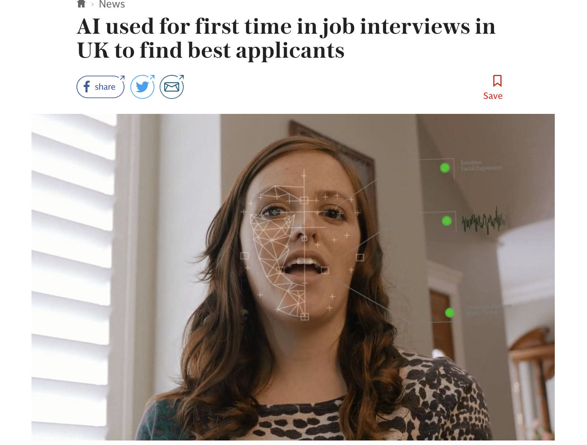

```{r setup, include=FALSE}
knitr::opts_chunk$set(echo = TRUE)
```

Learning objectives:

* Learn what are ethics and why they are important when working with data
* Learn about some of the key ethical issues faced in data & technology projects/products. 
* Learn about how working with data can affect individuals and society 
* Learn about real word examples of each of these ethical challenges 

# Ethics 

Collection and use of data is growing all the time with 2.5 quintillion bytes of data created each day and 90% of the data currently held in the world being generated over the last 2 years alone [1](https://www.forbes.com/sites/bernardmarr/2018/05/21/how-much-data-do-we-create-every-day-the-mind-blowing-stats-everyone-should-read/#1f1e5ef60ba9). However ever increasing media coverage brings to light ethical scandals involving data such as data leakage, data misuse or over surveillance, which is why it's increasingly important that ethical considerations are ingrained into any data project or technology. 


<blockquote class='task'>
**Class discussion**

What is ethics?

</details>
</blockquote>

There's no single definition of ethics but it can be thought of as a system of moral principles (such as our values, principles and purpose) that affects how people make decisions and lead their lives. There is no ready-made way to deal with ethical challenges and there is often no single 'right' answer. This is because these are not absolute concepts that everyone agrees on, and it can differ depending on context, and people's views can vary which are likely to be shaped by their own experiences and backgrounds. 

However there are considerations and conversations that can be had to get us to think about ethical considerations in different aspects of life. 

> *"Ethics is knowing the difference between what you have a right to do and what is right to do."* [2](https://www.goodreads.com/work/quotes/27417251-supreme-justice)  

# Data ethics 

The Open Data Institute defines data ethics as:  
<center>
> *A branch of ethics that evaluates data practices with the potential to adversely impact on people and society – in data collection, sharing and use* [3](https://theodi.org/wp-content/uploads/2019/07/ODI-Data-Ethics-Canvas-2019-05.pdf)  
</center>


<blockquote class='task'>
**Task**

What are some reasons why data ethics has become such an important issue?

</details>
</blockquote>

A few reasons:

* New technologies and tools are creating new situations and behaviours that society has not faced before and have no common view on
* More data is being collected that ever before
* Not always a clear understanding of how the technologies are working e.g. ‘black-box' models
* Data sources from different areas are being linked that has never been possible before
* Algorithms/technologies being built are having every increasing impact on society/individuals lives 
* Data and technologies are being used for things beyond their original purpose
* Regulation/law not always there to control the advances (and regulations and laws will vary depending on region and industry). 
* Reputation of the data community and trust of the public in data use.

Some people may find the the term *ethics* quite abstract and so considerations can also be framed as *'consequences of data or AI use across everyone in society'*, *'impacts of the technology'* or *'responsible data/tech use'*.

## The shoulds

There are different kind of ethical considerations that could be split into 2 groups:

1. Daily practice and consequences - **“Is” and “What if” questions**.   
Is the data input biased? Is there consent? What if the model is inaccurate? What if there is a data breach? 
2. Ethical norms - **“Should” questions**.  
Just because you can do this analysis doesn't mean you should do it. 

```{r, echo=FALSE, out.width = '35%', fig.align='center'}

```

Some other overarching questions you can ask yourself when it comes to ethics [4](https://ethics.org.au/why-were-here/what-is-ethics/):

* Would I be happy for this decision to be headlining the news tomorrow? (Sunlight Test)
* What would happen if everybody did this?
* What will this do to my character or the character of my organisation?

But sometimes we have to think beyond our actions and what happens if/when your product scales and we no longer hold full control. 

In this lesson we will discuss some (but not all!) ethical issues that have arisen in the data industry. 

## Human rights 

When considering ethics is important to think about how algorithms and data technologies can affect fundamental human rights - basic rights and freedoms that belong to every person in the world, such respect for privacy, no discrimination and right to education and a free election. [5](https://www.libertyhumanrights.org.uk/human-rights/human-rights-act)

> *'In order for AI to benefit the common good, at the very least its design and deployment should avoid harms to fundamental human values. International human rights provide a robust and global formulation of those values.'* [6](https://datasociety.net/wp-content/uploads/2018/10/DataSociety_Governing_Artificial_Intelligence_Upholding_Human_Rights.pdf)

## Caveat

Before the lesson beings just want to caveat that it's not all doom and gloom, and that all use of data will have negative ethical consequences! It’s great to be creating tools/technologies that hope will make a difference but want to almost assume a kind of 'worst case' scenario for ethical data discussions to try and cover as many possibilities as possible.  
You’re not expected to be able to ‘solve’ all the issues you raise (and also won’t be able to for-see all possibilities) but by making discussing ethics ingrained in any data project it gets people thinking from day 1 and can change the way that products are shaped, leads to seeking more outside input/views and measures to be put in place to minimise ethical risks.We must train ourselves to envision far-off risk and stretching your imagination because changes come around quickly in tech.  
Also there are plenty stories of good uses of tech and uses of tech to counteract the ethical issues we will discuss (but usually they just aren't as prominent in the news as the bad ones!). 

Also often there is no 'right' answer so this lesson is all about discussion!

```{r, echo=FALSE, out.width = '35%', fig.align='center'}
knitr::include_graphics("images/teaching_ethics.jpg")
```


# Bias 


> *'Bias is the action of supporting or opposing a particular person or thing in an unfair way, because of allowing personal opinions to influence your judgement.'* [7](https://dictionary.cambridge.org/dictionary/english/bias)


You may have heard stories of 'bias algorithms' being racist, sexist and making unfair decisions about already vulnerable or discriminated against groups. 

## Gender bias 

Gender bias in language algorithms: http://wordbias.umiacs.umd.edu/

An algorithm is used to groups words that have similar meaning to be plotted near each other. When we look at occupations, the relationship between 'he' and 'programmer' is similar to that of 'she' and 'home-maker'. 

<blockquote class='task'>
**Task**

Have a play with the tool looking at different categories and words. Share any interesting findings. 

</details>
</blockquote>


### Read world implication 1

```{r, echo=FALSE, out.width = '50%', out.extra='style="background-color: #008080; padding:5px; align-items: center;"'}

```

Amazon created an automated recruitment tool and trained it on data from CVs submitted to the company over a 10-year period. Most of the CVs came from men, a reflection of male dominance across the tech industry. Because of this, their model penalised against CV’s with the word ‘woman’ in it e.g. the term ‘women’s running club’ and against names of all females colleges (even though didn't have the mention of the word 'woman' in it). Although they rectified these difficult to say where proxy for gender being used elsewhere (we will discuss proxies later in the lesson). [8](https://www.reuters.com/article/us-amazon-com-jobs-automation-insight/amazon-scraps-secret-ai-recruiting-tool-that-showed-bias-against-women-idUSKCN1MK08G)

### Read world implication 2

Historically women have been given surgery at lower rates than men for similar medical issues (it is aruged that one reason is that women, as primary caregivers, have fewer people to take care of them post-surgery). [9](https://www.nejm.org/doi/full/10.1056/NEJM200004063421405#t=article) If we were to use this data to train a healthcare model, would it recommend surgery at a lower rate for women when all other variables are the same?


## Racial bias 

Some of the most well publicised cases of racial bias in algorithmic decision making is in policing and court systems. 

### Read world implication 1

In the US a risk assessment software powered by AI named COMPAS calculated the likelihood for someone to re-offend. This was then used by judges in the different decisions they make at each stage of the legal process (sentencing, bail amounts etc.) They didn't stop to think that some of the risk assessments might be biased. 

ProPublica, a non-profit news organisation, exposed issues with the software, which contradicted a lot of studies up until that time that said risk assessment scores can be predicted free of racial and gender bias. One example was:

> *'we ran a statistical test that isolated the effect of race from criminal history and recidivism, as well as from defendants’ age and gender. Black defendants were still 77% more likely to be pegged as at higher risk of committing a future violent crime and 45% more likely to be predicted to commit a future crime of any kind'* [10](https://www.propublica.org/article/machine-bias-risk-assessments-in-criminal-sentencing)

The builders of the software have defended it's accuracy but wouldn't release how they calculated the scores (as is proprietary) so there is a limit to how much can say about it's fairness. Even if the intentions were good in building the tool, in that it was believed it would remove potential human bias, this unfortunately has not been the case and has been relied upon too heavily as an 'unbiased sorce of truth'. 

Another issue of bias is it can cause feedback loops which are self fulfilling. Take policing for example - police forces now use algorithms to calculate which areas are high risk and so are likely to send more resources to these areas. If you have concentrated resource in this area you are more likely to catch any crimes here quicker, even though similar crimes could be happening in other areas where police aren't present. This becomes self fulfilling because the results provide 'proof' that there are in fact more crimes in this area and so it continues to be a high risk area. 

### Read world implication 2

An example of a similar issue in the UK is the Gangs Matrix: 

> *'a controversial database created by the Metropolitan Police (the Met) in the aftermath of London’s 2011 riots to purportedly identify and surveil not only those at risk of committing gang-related violence...It uses a number of data points including previous offences, social media activity and online friendship networks'.*

But human rights charity Amnesty International has heavily criticised the database, saying

> *'35% of those on the matrix had no police intelligence linking them to gang violence and had never been charged with a crime. Sharing certain YouTube videos of grime or drill music, meanwhile, is considered a key indicator of gang affiliation.'* [11](https://www.wired.co.uk/article/gangs-matrix-violence-london-predictive-policing)    

And the Information Commissioner’s Office (ICO), Britain’s watchdog for data use, ruled that the matrix breached data protection rules.[12](https://www.wired.co.uk/article/gangs-matrix-violence-london-predictive-policing)

And to finish this topic on something a bit different this app was presented at the Strata Data Conference in NYC in 2017. It flags areas high risk of white colour crime and then scrapes LinkedIn data to predict what the person may look like https://whitecollar.thenewinquiry.com/. The app  uses industry-standard predictive policing methodologies which are used by police to are used. target so-called “street” crime.[13](https://thenewinquiry.com/white-collar-crime-risk-zones/). Encourage you to have a play!

## Bias task
<blockquote class='task'>
**Task - discussion**

Consider the following news story [14](https://www.telegraph.co.uk/news/2019/09/27/ai-facial-recognition-used-first-time-job-interviews-uk-find/)

```{r, echo=FALSE, out.width = '50%', out.extra='style="background-color: #008080; padding:5px; align-items: center;"'}
  
```

* Companies using AI technology to analyse the language, tone and facial expressions (e.g. brow furrowing, eye widening or closing, lip tightening, chin raising) of candidates when they are asked questions which they film on their mobile phone or laptop.
* The comapnies get about 25,000 data points from 15 minutes of video per candidate to get a data set of “how someone is responding, the emotions and cognitions they go through.”
* Firm claims ‘more reliable and objective indicator of future performance free of human bias’ than reviewing CVs.
* Assessing their performances against about 25,000 pieces of facial and linguistic information compiled from previous interviews of those who have gone on to prove to be good at the job.

In your groups think of some potential ethical risks here.


<details>
<summary>**Solution**</summary>

Some potential issues (but not constrained to)

* Dataset that used to train the model may have had bias in it. 
  1. If there was any human bias in past hiring in the past would have filtered through into dataset. 
  2. If any bias in promoting/success within a firm that would impact who was in ‘successful’ dataset. 
  3. What is their definition of success? Is doing a good job ‘getting many new sales’ or ‘creating long lasting relationships with few clients’ - can differ. Also many reasons a someone who is ‘good candidate' but didn’t go on to be successful in a particular role, and vice versa. 

* Could be discrimination due to facial features - if blink more when get nervous, or even facial disabilities. Could also be facial feature recognition bias due to face shape, skin colour etc. depending on the diversity of the dataset it has been trained on. 
* Potential discrimination with accent or regional wording?
* Consent 
  1. Will the data be removed after the interview or will it be stored and looked at if reapply? 
  2. Is data potentially going to be used for any other purposes?
  3. Is the data being held by the potential employer only or the company who owns the software (as these are separate)? 
  4. People who really want/need a job willing to give away their facial data because would give away their data for chance of getting a job (fair consent or imbalanced power)? 


</details>
</blockquote>


## Proxies for sensitive characteristics

You may be thinking 'if a variable is causing bias then we could just remove it'. The problem is that there may be other variables that could be 'proxies' for sensitive characteristics. 

For example if we remove ethnicity or religion from a model build but keep name in then it could end up being a proxy for these as names can often be reflect different ethnicities. Such as in the following case [15](https://www.thesun.co.uk/motors/5393978/insurance-race-row-john-mohammed/):

```{r, echo=FALSE, out.width = '50%', out.extra='style="background-color: #008080; padding:5px; align-items: center;"'}
knitr::include_graphics("images/news_racial_bias.png")
```


But where do you draw the line? You can't just remove all the variables you think might cause bias because they may hold predictive power and you could end up with no variables left. 

It is also important to consider for variables that are not allowed to be used in certain cases e.g. it is illegal to use gender to model credit risk.

Proxies will be covered more in during predictive modelling lessons. 

## Data gaps 

When working on projects it's not just important to report on what data you have, but also what data you don't have or what might be missing from the data you do have. [This](https://www.nesta.org.uk/blog/mind-gap-between-truth-and-data/) blog from Nesta, a UK innovation foundation, highlights this area very well. 

## Algorithms aren't biased - people are biased

Throughout these examples it is important to think about how these algorithms are created. Data is needed to 'train' a model because it needs to have something to base it's predictions on. Often the news will report about 'racist algorithms' but it is not the algorithm themselves, that's just maths, it is the data that is used to train them that causes the bias. And this data is created based on decisions or opinions people have had. 

Cathy O'Neil, author of Weapons of Math Destruction, states

> *'Algorithms are opinion embedded in code ... they repeat past patterns and apply them blindly.* 

The issue comes because algorithms can often be left to their own devices with little monitoring (and they may only check the code, not the implications!) and that they can be implemented at such a large scale. 

> *'AI learns about how the world has been. It doesn’t know how the world ought to be. That’s up to humans to decide.'* [16](https://www.vox.com/science-and-health/2017/4/17/15322378/how-artificial-intelligence-learns-how-to-be-racist)


#  Spread of information and fake news

The widespread reach of technology makes the ability to share and spread news or information easier than ever before and the mediums people are getting their information from is changing. However the lack of regulation in many of these new mediums also allows for targeted information and subverted truths (such as fakebots) which can lead to increasing divides within society. 

## Targeted news 

http://graphics.wsj.com/blue-feed-red-feed/

For example this website 'Blue Feed, Red Feed' created by the Wall Street Journal shows how perceived reality may differ for different Facebook users (which can be a source many people get their news solely from). It shows how same new stories can be shown differently dependant on the political slant. There is concern that people will be closed off to different views and opinions because online feeds can create “echo chambers,” where users see posts only from like-minded friends and media sources. 

However do these concerns compare to people reading a single newspaper source in the past?


## Targeted advertising   

```{r, echo=FALSE, out.width = '50%', out.extra='style="background-color: #008080; padding:5px; align-items: center;"'}
knitr::include_graphics("images/news_housing.png")
```

It is well known that Facebook allows advertisers to target users based on their interests or backgrounds, but it's tool also allows them to **exclude** based on certain categories, including predicted ethnicity. In the US adverts that exclude people based on race, gender and other sensitive factors are prohibited by federal law in housing and employment (Fair Housing Act), which is why in March 2019 the Department of Housing and Urban Development filed charges against Facebook for housing discrimination. [17](https://www.theverge.com/2019/3/28/18285178/facebook-hud-lawsuit-fair-housing-discrimination)

# Data collection, storage and minimisation 

Often there is a risk when collecting data that we collect as much information as we can 'just in case we need it later'. It can be tempting to just ask an extra application question or to track one extra online activity. But there are a few things to think about here. 

## Data minimisation & GDPR 

> *'Data minimisation is a privacy principle that requires the people collecting data to be intentional about what type of data is collected and how long it is retained ... we should limit data collection to what is directly relevant and necessary to accomplish a specified purpose.
Data minimisation also refers to de-identification practices in which PII (personally identifiable information) is stripped out of data sets before they are shared with others or made accessible to the public.'* [18](http://elan.cashlearning.org/wp-content/uploads/2016/05/Data-minimization-tip-sheet.pdf)

However there is a risk that people can be scared about holding any information on customers/users, especially after the launch of GDPR, and to the extreme delete almost all information they hold. Data can be critical for organisations to understand their impact and enable them to make their organisations more effective, so there is a balance to be found. 

Lets consider the example of a homeless charity in Wales. They collected the gender of the users of their service. They didn't need this information to able to provide their service (and so they could have not collected this and their operations would have continued) but by doing so and analysing their outcomes against gender they found that females using their service were experiencing better outcomes than males. From this they are adjusted their services with an aim to increase their effectiveness for male users, to maximise their impact. [19](https://blogs.ncvo.org.uk/2018/05/22/gdpr-dont-press-the-delete-button-just-yet/)


GDPR is good because more regulation is needed when it comes to data generally but it should not be seen as a reason not to collect data. The purpose of GDPR is protecting people's data and ensuring consent for what it can be used for but not not to collect any.

>*'GDPR is not easy ... there isn’t a one-size-fits-all guide to implementation.'* [20](https://blogs.ncvo.org.uk/2018/05/22/gdpr-dont-press-the-delete-button-just-yet/)

We will cover this more on the privacy day later in the course. 


## Data storage

### Security
Need to ensure that all this data is only accessible by relevant people, particularly if is potentially sensitive. Also need to consider the risk of data breaches - accidental data leakage/loss can be even more damaging for the reputation of a company than knowingly selling it on to a questionable third party.

### Consent
Under GDPR you are responsible, upon request, to delare all the information you hold on someone and/or to delete all that information. So the more data collect the more complex these deletions or information requests can be. 

Also need to consider reasonably, or even legally, how long you should be storing this data. 

### Environmental
An often overlooked consideration is the impact of storing data on the environment. Storing and processing large volumes of data uses large amounts of energy. 

Aside from the electricity needed for data centres to run they also require constant cooling as they generate massive amounts of heat. A 2015 report found that data centres cause 2% of global greenhouse gas emissions, the same as the aviation industry.[21](https://www.theguardian.com/environment/2015/sep/25/server-data-centre-emissions-air-travel-web-google-facebook-greenhouse-gas) Research predicts that by 2040 this could increase to 14%. [22](https://www.theguardian.com/environment/2017/dec/11/tsunami-of-data-could-consume-fifth-global-electricity-by-2025)

Tech companies should consider different options such as aggregating data and regularly reviewing the need for the data they are storing.  


# Privacy, consent and linking data 

```{r, echo=FALSE, out.width = '35%', fig.align='center'}

```


More and more companies in different industries are using non-traditional data sources such as our location data, social network and online posts, to predict risks that would have previously deemed unrelated. Some of these sources can be potentially sensitive data and the ability to link these many previously isolated areas together needs consideration of the ethical consequences of this, particularly around consent. 


## Context and consent of data collection


### Consent & transparency

Consent is often for a particular type of analysis. Do you have consent to use this data for your current analysis task?  

Does the customer know their location data is being used to calculate whether they are eligible for a mortgage? Maybe you’re happy for your medical history to be used to calculate your life insurance premiums but you won’t want that information being used to decide whether you get a job or not. How do we know what data sets are acceptable to use in each context?

Has this consent been clearly communicated or is it tucked away in a 100 page terms and conditions document written in legalese? Should there be a responsibility to make it clear and easy to understand?

What happens if data being used is incorrect or out of date and being used to make a decision for someone? Without transparency of what is being used to do each calculation we will not know. If if we did know how can people request to correct the information? Is there a way to opt-out of any data collection for automated systems?


### Context

Data is often collected for one purpose, and then recycled and used for another. What contextual information about the original data needs to be understood to ensure it is fit for purpose?

When was the data collected and is it current enough for your task? Often data can be from 3rd parties - what source is it form, is it credible and reliable source?

This area has some cross over with bias considerations.

Some examples:

* Was the data collected in a situation where people have a motivation for ‘stretching the truth’? e.g. are being asked questions regarding financial stability when in conversation about applying for a loan. 
* A survey may have been carried but in exchange for financial reward, could this mean that the demographic of the survey audience may be skewed because of this and/or they may be motivated to answer in a particular way.
* Building an algorithm to rate companies and turns out the data used to train the model was Glassdoor reviews, which is not likely to be representative as usually people who leave reviews are those that have had either a very bad or very good experience. 
* Using online behaviour to make assumptions about the user, but perhaps you can only identify the user when they are logged into an account, say online banking. They may act differently online when logged into an account online compared to when not, as may need to consider this context when using the information. 


> *'Without context, data is useless, and any visualization you create with it will also be useless. Using data without knowing anything about it, other than the values themselves, is like hearing an abridged quote second-hand and then citing it as a main discussion point in an essay. It might be okay, but you risk finding out later that the speaker meant the opposite of what you thought.'[23](https://bigthink.com/experts-corner/understanding-data-context)*


## Real world implications 

### Social media and car insurance

```{r, echo=FALSE, out.width = '50%', out.extra='style="background-color: #008080; padding:5px; align-items: center;"'}
knitr::include_graphics("images/news_fb_car.png")
```

Insurance company Admiral was forced to stop plans to use their customer's Facebook posts to analyse the personalities of car owners and set the price of their insurance after Facebook said the scheme breached its privacy rules. [24](https://www.theguardian.com/technology/2016/nov/02/admiral-to-price-car-insurance-based-on-facebook-posts).

### Government surveillance

```{r, echo=FALSE, out.width = '50%', out.extra='style="background-color: #008080; padding:5px; align-items: center;"'}
knitr::include_graphics("images/news_homeless.png")
```

The Home Office secretly acquired sensitive data, which was set up and collected by charities to create a database set up to help support rough sleepers and help policymakers “identify emerging needs”. The data showed the nationality of people sleeping rough on the streets, and using their newly introduced guidance which enables immigration enforcement teams to deport EU nationals solely on the grounds that they are sleeping rough, they used this data to deport EU nationals.
[25](https://www.theguardian.com/uk-news/2017/aug/19/home-office-secret-emails-data-homeless-eu-nationals)


### Predicting employee illness

```{r, echo=FALSE, out.width = '50%', out.extra='style="background-color: #008080; padding:5px; align-items: center;"'}

```

In the US health care costs continue to grow, some companies, including Wal-Mart, are paying third party firms to collate and analyse employee data (including where they shop, whether they vote etc.) to identify, for example, which workers are at risk for diabetes, and target them with personalised messages nudging them to about exercise and health advice. [26](https://www.wsj.com/articles/bosses-harness-big-data-to-predict-which-workers-might-get-sick-1455664940)

> *'I bet I could better predict your risk of a heart attack by where you shop and where you eat than by your genome.'* (Director of one of the 3rd party companies) [27](https://www.cebglobal.com/talentdaily/can-predict-employees-will-get-sick/) 


<blockquote class='task'>
**Class discussion**


What are some of the potential ethical risks here.


<details>
<summary>**Solution**</summary>

Some potential issues (but not constrained to)

* More data is not necessarily better - actually masking some underlying link
* Using many variables can make models unecessarily complex
* Even if the data is anonymised by aggregating it, if you work in a small company employers may be able to identify workers and see sensitive health information on them
* Potentially could use this information against you if they deem you ‘risky’ to be ill. 'Americans with Disabilities Act' makes it illegal for companies to hire or fire people on the basis of disability but no federal statute forbidding employers from firing people who are unhealthy or risky. 
* Employer influence on the employees life and control employees behaviour?

</details>
</blockquote>


### Work wellness programme and health insurance

In a similar field to the example above we are seeing health or life insurance companies are offering lower insurance premiums for the agreement you will wear a health tracking device and maintain a certain level of exercise. 

However in  West Virginia teachers went on strike partly due to their health insurance enforcing a programme like this. They were told to download an app on their phone, which would track their steps and in turn earn points. If they didn’t earn enough points then they were penalised financially. And if they chose not to use the app they were also penalised financially.[28](https://www.theguardian.com/commentisfree/2018/mar/07/west-virginia-teachers-strike-healthcare)

```{r, echo=FALSE, out.width = '70%', out.extra='style="background-color: #008080; padding:5px; align-items: center;"'}
knitr::include_graphics("images/news_teacher_fitbit.png")
```

In 2016 courts ruled it legal to exclude employees from group health insurance if they refuse to participate in wellness programs but after the strikes it became voluntary for the teachers. [29](https://wchstv.com/news/local/governor-justice-says-peia-go365-program-to-be-voluntary-without-penalty)


<blockquote class='task'>
**Task - discussion**


Discuss the ethical points around collecting something such as FitBit data to assess insurance premiums?


<details>
<summary>**Solution**</summary>

Some potential issues (but not constrained to)

* Not necessarily totally accurate of your wellness. 
* May do other exercise not collected via a FitBit
* Other factors affect health - diet, stress, social interactions, environment etc.  
* You may be happy to wear a FitBit when you are healthy as will benefit from lower premium for health insurance from sharing this data, but what happens if you suddenly fall ill? Then you could be fined or increase premiums because locked into agreement due to constant monitoring.
* What else could this data be used for? Is it tracking location etc? 
* Risk it could be sold on to third parties. 
* Risk could be discriminated by employees for not being ‘well’ enough. 
* Employer influence on the employees life and control employees behaviour?

</details>
</blockquote>

### What information are we willing to share to reduce health costs?

> *70% of people in 8 countries would be willing to share data from their smart toilet if it would mean lower healthcare costs. 84%, would be willing to share their vital statistics, like blood pressure or basic lab tests, and 75% would be comfortable giving up information gathered by a health monitor they could swallow.*  
*Only 38% would share their phone records.* [30](https://qz.com/158774/70-of-people-would-be-willing-to-have-a-smart-toilet-share-their-personal-data/)

# Use of automation in government/civil service 

So if we know a private company is using our data in ways we ethically don’t agree with it's likely we have the option to use completitive companies who have ethics we more align with. But what happens if the services and functions where the government is the monopoly provider?

So many decisions made by government bodies can have such a huge impact on people's lives - housing, benefits, health services etc. There is currently a lot of military and defence research into AI with an aim to reduce unintended casualties and surveillance into areas which would have been too dangerous.

## Real world implication 

```{r, echo=FALSE, out.width = '50%', out.extra='style="background-color: #008080; padding:5px; align-items: center;"'}
  knitr::include_graphics("images/news_gov.png")
```

The Department for Work and Pensions (DWP) are developing automated tools to handle benefit claims, such as childcare and housing, and to predict whether they are true. 

While they believe it will allow claims to be handled more quickly and accurately there are concerns that the government is 'accelerating the automation of the welfare system without a proper evidence-based consultation about its impacts'. DWP has refused freedom of information requests to explain how it gathers data on citizens. [31](https://www.theguardian.com/technology/2019/oct/14/fears-rise-in-benefits-system-automation-could-plunge-claimants-deeper-into-poverty)  


# Scale of automation 

In the example above, the article raised concern that sources said that civil servants were unable to contradict the algorithms verdicts and so potentially removing any human element to the process. 

This type of scenario is where the fears of total automation arise. Data is not a silver bullet - it is a tool to help make decisions but still needs to have a human element in the process -checking for reasonableness and fairness. 

It is important to remember that data/information has been used in decision making for a long time e.g. the data used to create the algorithm for DWP could well be the same data/information that a benefits officer would review to make their decision. And it's important to consider that automating decisions might actually be 'fairer' than human decisions. Take for example a paper from UC Berkeley found that in credit risk calculations FinTech companies using algorithms in lending decisions discriminate 40% less than face-to-face lenders in US mortgage lending decisions. [32](https://faculty.haas.berkeley.edu/morse/research/papers/discrim.pdf)


Algorithms can go on a long time before issues are brought to light - which by then can already have affected many lives. This consideration is critical as businesses look to scale with a platform mentality so that what might be a small issue early on compounds and causes increasing risk if not identified and fixed.

Is anyone checking the outcomes? Is the model being updated after it’s scaled? How is it being monitored? Is it possible for a human to override the algorithms decision if it knows it is wrong or unjust?  

> *'As data scientists, we need to move away from “solutionism” and narrowly focusing on our model, and instead understand the model’s connection to the “real world.”'* [33](https://doteveryone.org.uk/2019/05/tech-workers-call-time-on-moving-fast-and-breaking-things/)

Conversely is fear of automation blocking advancement that could make the algorithms fairer or safer? Take driverless cars, they learn from the scenarios they are trained on and so if only confined to closed tracks and simulations (rather than testing on public roads) the odds are that it will take a lot longer to arrive at autonomous cars, possibly never getting there at all.

In March 2018 a pedestrian died in Arizona from a test of Uber's driverless car and both Uber and Toyota paused their testing programs. But given that in the US 100 people a day die from car crashes, with over 17,000 crashes a day [34](https://www.iii.org/fact-statistic/facts-statistics-highway-safety) what is a relative acceptable amount of deaths caused by driverless cars? [35](https://qz.com/1233563/ubers-first-self-driving-car-death-raises-questions-about-acceptable-levels-of-autonomous-vehicle-safety/)

People likely perceive a death by driverless car worse than one by a human but imagine if the news reported the car accidents by humans it did with accidents by driverless cars? Would we perhaps feel someone had to be done?


# Use of public data 

Data that is publicly available (e.g. anything on the web) is not the same as open data. Open data is data that *anyone can freely use, re-use and redistribute them, for any purpose, without restrictions.* but different legal, regulatory and ethical considerations apply to information on the internet.

Many different restrictions may apply to data extracted from APIs, such as you may not be able to retain any copies of the data extracted and/or you can’t add or link it to any data you already hold - but without full transparency of data being used in different technologies who is policing or checking these restrictions? Many websites also have restrictions on text mining the information on the webpage (even for personal use) without their authorisation.

## Real world implication

```{r, echo=FALSE, out.width = '50%', out.extra='style="background-color: #008080; padding:5px; align-items: center;"'}
  
```

Samaritans developed an app which monitored Twitter accounts for tweets indicative of possible depression or suicidal thoughts (based on specific keywords). A concerned friend or family member could sign up and would then send them an email if the content of the person's tweets suggests that they are vulnerable.

 Samaritans had pre-empted concerns about the use of Twitter data by stating in it's descriptions that *'all the data used in the app is public, so user privacy is not an issue'*. [36](https://www.theguardian.com/technology/2014/oct/30/suicide-samaritans-radar-will-save-lives-twitter) But there were a lot of privacy concerns raised that even though the data was in the public domain that they were surveilling people’s tweets without their permission and more seriously that it actually breaches the Data Protection Act 1998 (that has now been replaced by GDPR), leading the app to be suspended. 

# Explainability and understanding of models 

As models get more complex the understanding and explainability of how a model works becomes an ethical risk. Imagine we are predicting a students exam score for an exam and we have used 2 past exam scores to calculate this. In a linear regression we can easily explain that the first score has a x% importance in predicting the future score and the second score has y%. And this we can explain to those making decisions with the data (even if they aren't keen on maths!). With some 'black-box' models it is not so easy to interpret. 

There often needs to be a weigh up between additional accuracy that 'black-box' models can sometimes have over the lack of ease to understand how it is working for people making the business decisions. 

Cathy O'Neil states people *'both fear and trust maths'* but again, should come back to the fact that algorithms are not just an equation, they are built on data and have different levels of human influence (such as variables chosen to initially build the model and the definition of success). 

# Anonymisation 

The ability to link multiple data sets and to use them to identify individuals is a growing problem.

> *'Anonymised data means that all identifiers have been irreversibly removed and data subjects are no longer identifiable in any way...information is fully anonymised if there are at least 3-5 individuals to whom the information could refer.* [37](https://www.ed.ac.uk/records-management/guidance/checklist/anonymisation)

For example, if your data has information on gender, ethnicity and postcode and for some combinations there are less than 4 people in a category then you could use only the first 3 digits of the postcode to allow the number of people in each category to increase. But the counter argument here is if you aggregate at too high a level or remove too much information then the data is no longer useful to analyse.

Furthermore there has been research that 'impossible for researchers to fully protect real identities in datasets' [38](https://www.theguardian.com/technology/2019/jul/23/anonymised-data-never-be-anonymous-enough-study-finds). Additionally there is an issue. Anonomysation will be covered more on the privacy and legal lessons. 


# Value for your data 

Companies are gaining value from your information, either by selling it on to third parties or using it to make their products or services better and so generating more income. People often view services such as social media as free, but are you just paying with your attention and data rather than money? And will there come a time when consumers will get some value for the data they are giving away? 

In 2018, Facebook generated $55 billion in advertising revenue, while Google posted more than $116 billion in the same period.[39](https://qz.com/1655610/how-can-you-measure-the-worth-of-your-data/) Some of this advertising comes from allowing advertisers to target customers based on characteristics that are caclulated from user's data. 

Do you see it less invasive monetisation of customer data if you think it’s the same as supermarket loyalty card tracking shopping data and targeting you with paper adverts posted through your door? This has been going on for years. 

Could consumers retain control and ownership of their data, allowing the consumer to manage it and sell/exchange it as they wish to companies? Will eventually ee get more/less value dependant on how ‘useful/full’ our data is? Business models may change to reflect this. 

Chris Hughes, the co-founder of Facebook who is now an outspoken critic of the company, proposed the idea of a 5% tax on companies that use consumer data that could generate at least $100 billion per year, which would be distributed to citizens. He compared this to the way revenue from oil extracted in Alaska is distributed to the state’s citizens, amounting to about $1,500 per person per year.[40](https://qz.com/1655610/how-can-you-measure-the-worth-of-your-data/)

But other's argue these ideas just detract from the fundamental human right of privacy and even if customers were compensated by money the right persists.  


# Additional resources 
* Black mirror scenarios: https://docs.google.com/presentation/d/1fZah6nYpAhLtUMh1BRy3w1vCHk_-W7bxxv0LeuKZpT0/edit#slide=id.g63d578e5a7_0_155
* Should this exist podcast: https://shouldthisexist.com/  
* EdX data science ethics online course: https://www.edx.org/course/data-science-ethics-0   
* Lots of books - including Cathy O'Neil and Hannah Fry  
* Organisation working for Universal Basic Data Income: https://www.ubdi.com/individuals/how-it-works
