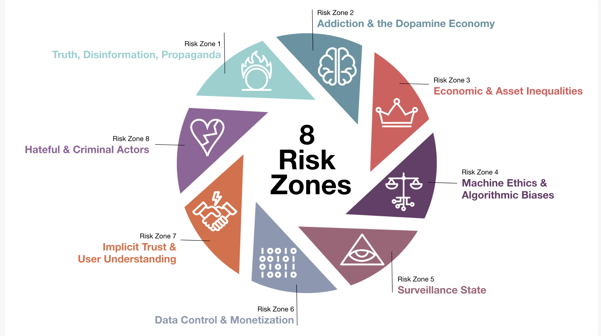
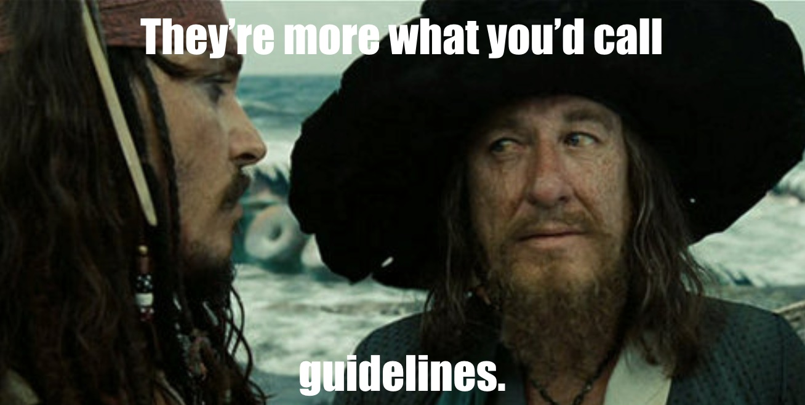

```{r setup, include=FALSE}
knitr::opts_chunk$set(echo = TRUE)
```

Learning objectives:

* Learn what are ethical codes 
* Learn about 2 ethical codes in depth and how they may be implemented in projects
* Learn about some of the limitations with codes
* Learn about some alternatives to codes


# Professional ethics codes 

Professional ethics are principles that regulate the behaviour of a people working within a business environment. Unlike values, which may change from person to person, professional ethics are often set out in a code as a set of rules, which a particular profession may use.[1](https://www.iaa.govt.nz/for-advisers/adviser-tools/ethics-toolkit/professional-ethics-and-codes-of-conduct/) Because the ethical challenges faced by different professions may differ there are different ethical codes for different professions. 

Other professions hold ethical codes of conduct, including doctors, lawyers and actuaries, with the most well known being doctor's Hippocratic Oath. 

# Ethical codes in data

Given the incredibly fast pace of growth of tech and data in recent years and the amount of stories surrounding ethical concerns of technologies, a number of different bodies or think tanks have been set up. Each of these have come up with different proposed codes/rules/frameworks for those working in the data industry. These include:

## General

* Royal Statistical Society and Faculty of Actuaries: [A Guide for
Ethical Data Science](https://www.rss.org.uk/Images/PDF/influencing-change/2019/A-Guide-for-Ethical-Data-Science-Final-Oct-2019.pdf)
* UK Statistics Authority: [Data Ethics Self Assessment Tool]( https://www.statisticsauthority.gov.uk/about-the-authority/committees/nsdec/data-ethics/self-assessment-2/)
* EthicalOS: [A guide to
anticipating
the future impact of
today’s technology](https://ethicalos.org/wp-content/uploads/2018/08/Ethical-OS-Toolkit-2.pdf)
* Open Data Institute: [Data Ethics Canvas](https://theodi.org/wp-content/uploads/2019/07/ODI-Data-Ethics-Canvas-2019-05.pdf)
* Doteveryone: [Consequence Scanner](https://doteveryone.org.uk/project/consequence-scanning/)
* PLOS: [Ten simple rules for responsible big data research](https://journals.plos.org/ploscompbiol/article?id=10.1371/journal.pcbi.1005399)
* Machine Intelligence Garage: [Ethics Framework](https://www.migarage.ai/ethics-framework/)

## Public sector specific codes 

* Nesta: [10 principles that might go into a Code of Standards for Government and Public Sector Use of AI in Algorithmic Decision Making](https://www.nesta.org.uk/blog/10-principles-for-public-sector-use-of-algorithmic-decision-making/)
* UK Government: [Data Ethics Framework from Government for public sector organisations](https://www.gov.uk/government/publications/data-ethics-framework)

# Codes in depth 

We are going to take a look at 2 different codes from the list above, each for a different reason. 

1. **EthicalOS** - forces you think beyond what might currently consider and to envision far-off risk.
2. **RSS/IFoA** - useful for thinking about the more immediate issues and some accessible steps to take to cover issues in front of you. 

## EthicalOS

https://ethicalos.org/  

EthicalOS code covers a wide range of issues and forces you think beyond what might currently consider and to envision far-off risk. It is risk-based and more about spotting potential ethical issues not necessarily to solve them all. 

It gets us to think about how technologies and products might affect issues such as privacy, truth, democracy, mental health, equality of opportunity, economic stability, or public safety. 

Why do we need this? Most tech is designed with the best intentions. But once a product is released and reaches scale, often there is no turning back and it's difficult to implement change or regain control.

> *'It’s no longer enough to simply profess an optimistic desire that the tech we build will have a positive effect on the world. We must create a system of design and development that places real value on ethical thinking from the outset, by incorporating future risk analysis and mitigation directly into our workflow.'* [2](https://medium.com/positive-returns/introducing-the-worlds-first-ethical-operating-system-7acc4abc2bfa)


```{r, echo=FALSE, out.width = '80%'}

```

Below are the 8 risk zones and some examples we covered in the previous lesson that come under each area:

1. **Truth, Disinformation, Propaganda**
  * e.g. fake news, deep fakes, targeted information
2. **Addiction & the Dopamine Economy**
  * e.g. physiological techniques deployed to keep users addicted
3. **Economic & Asset Inequalities**
  * e.g. allowing new opportunities for previously unable to reach but past discrimination being automated and spread at size. 
  * Lesson 1 example: Facebook allowing exclusion of housing adverts based on ethnicity
4. **Machine Ethics & Algorithmic Biases**
  * e.g. historical biases being feedback 
  * Lesson 1 example: gender bias in recruitment and racial bias in court systems
5. **Surveillance State**
  * e.g. facial recognition, mobile data to track location, social media tracking
  * Lesson 1 example: FitBit data used in employee wellness programs
6. **Data Control & Monetisation**
  * e.g. control of your own data and receiving the value of it’s worth
7. **Implicit Trust & User Understanding**
  * e.g. not getting permission for collecting or using data in particular way  
  * Lesson 1 example: Samaritan twitter monitoring 
8. **Hateful & Criminal Actors**
e.g. tool to spread trolling & radicalisation to wider platform - responsibility of online platforms where this occurs. 


<blockquote class='task'>
**Task - 20 minutes**


Each person take a risk zone in the EthicalOS toolkit - look at a good news story (or some work for prevention using tech) and then read the bad story and think about answers to the checklist questions in relation to the ‘bad story’. 
These may be the stories linked in the toolkit or may find others online. 
Note some of findings down, and we will share them with the class.     

</blockquote>


## Royal Statistical Society (RSS)

https://www.rss.org.uk/Images/PDF/influencing-change/2019/A-Guide-for-Ethical-Data-Science-Final-Oct-2019.pdf


This code was released in October 2019 and useful for thinking about the more immediate risk issues and accessible steps to take to cover issues in front of you. 

This guidance is non-mandatory and does not impose any obligations upon RSS or IFoA members, even though they are both professional bodies (and not all people working in data science will be a member of RSS anyway).


It covers 5 main areas. Areas 1 & 2 cover similar overarching themes to the EthicalOS toolkit but the other areas are some different considerations:

1. **Seek to enhance the value of data science for society**  

Consider the potential impact that models have on decisions and for who. Seek to act in the public interest. 

2. **Avoid harm** 

Respect the privacy, equality and autonomy of individuals and groups in society. Harm can be financial loss or disadvantage damage to reputation, privacy or psychological wellbeing exclusion from benefits or services. 

Who could be negatively affected by this project? Could the way that data is collected, used or shared cause harm or expose individuals to risk of being re-identified? Could it be used to target, profile or prejudice people, or unfairly restrict access (e.g. exclusive arrangements)?

3. **Apply and maintain professional competence**  

Some of the items in this section of code cover some of the considerations we covered as part of 'Reproducibility' lesson in week 1, and those covered in a later model monitoring lesson in module 3. Aside from regulatory and legal considerations also show competence in:

  * fully understanding the sources of error and bias in data
  * using ‘clean’ data (e.g. edited for missing, inconsistent or erroneous values)
  * using statistical methods that are appropriate to the question being asked
  * assess and balance the benefits of the work versus the risks posed by it
  * keep models under regular review
  * sharing results and seeking feedback from different sources
  * making sure someone is checking your work - not just code review but also discuss the logic applied.
  * seeking independent or domain-expert advice on assumptions and risks


4. **Seek to preserve or increase trustworthiness**  

Encourages transparency and honesty when communicating about the way data is used. Don’t overstate your confidence in results and be open about limitations (e.g. risks, potential errors and biases) - it is most often not a reflection of you but a reflection of the data available. 

Also avoiding unnecessary complexity in methods to improve transparency - e.g. weighing up a 'black box' model that has slightly greater accuracy over an easier to understand/explain/interpret model.

5. **Maintain accountability and oversight**  

Automation of models can mean removal of human accountability and oversight within work but delegating any decisions to these algorithms shouldn't remove your individual responsibilities i.e. answer can’t just be ‘because the computer said so’. 

You may find people in companies running bits of analysis code and they don’t actually understand what it is doing, often because ‘it was written by someone but now they have left’. Therefore the ‘owner’ of the code now does not have an understanding of its limitations and maintenance required. If ethical accountability was held at individual level then individuals may be encouraged to consider ethics more if think will face ramifications themselves (will discuss this later in the lesson). 

And finally consider regular ethical reviews of models/algorithms (not just reviews of code or logic).


# Is a code enough?

```{r, echo=FALSE, out.width = '80%'}

```


## Limitations with codes
Although it is great setting up these bodies and creating these codes because it gets people thinking and discussing the ethical issues but there are a limitations.


<blockquote class='task'>
**Question**

Can you think of some limitations with ethical codes?
</details>
</blockquote>

Some limitations include:

* Often codes are lagging behind the technology, and it is only when the issues arise after the fact that the rules are written in reflection. 
* Is there an incentive for people to follow these codes, aside from if they align with their own values. If there are no ramifications for not following these codes how can you ensure anyone will follow them (unless it breaks a regulation or law). 
* Data science is such a broad field and ever growing. Should the code apply to anyone who uses data to make decisions? From someone doing quick calculations on an excel spreadsheet to someone building ML algorithms. 
* Some of these risks are difficult to 'solve' and hard to implement prevention into the design. Can say you've considered them but have you done anything to 'stop' it happening? Is there anything that can be done?
* The people who are doing analysis/building solutions don't always fully understand the domain, and therefore won't foresee or understand the future risks.
* Checklists can give an impression that if you have considered these items then have ‘completed’ ethics for your project.

> *'Ethics involve context and interpretation - not just checklist of principles in a code of ethics. e.g. can get to x is an acceptable use if there are y constraints, oversight from z, and a shared recognition that if trigger q is reached we’ll need to reconsider. Rather than binary conclusion that x is unacceptable...A big lesson of past technologies is that they were socially shaped..for example, the many constraints put on cars - from driving tests to speed limits, emission rules to drink-drive laws - were in part ethical, but better understood as part of a social conversation to work out how societies could get the advantages of a new technology without too many harms. None of the rules that resulted could be deduced from abstract ethical principles or codes. But all of them had an ethical dimension.'* [3](https://www.nesta.org.uk/blog/ai-ethics-and-limits-codes/?utm_source=Nesta+Weekly+Newsletter&utm_campaign=3f330b89a1-EMAIL_CAMPAIGN_2019_09_16_03_03&utm_medium=email&utm_term=0_d17364114d-3f330b89a1-180817502)  


Some argue that a code just means people agree generally that these principles are reasonable but then continue on as usual, and more formal limits are necessary. 
Also teaching ethics not mandatory - many people in data are from broad backgrounds and not formally taught via a single course, unlike doctors who all undergo same degree and ethics is part of that.[4](https://bigthink.com/experts-corner/understanding-data-context)

59% of people working in AI have experience of working on products that they felt might be harmful for society and 27% of those quit their jobs as a result.[5](https://doteveryone.org.uk/2019/05/tech-workers-call-time-on-moving-fast-and-breaking-things/)
Some of these cases where a data scientist refused to take part in a project due to ethical issues, they were just replaced by someone else. So this is a sign it needs to come from businesses too, not just on individuals.


## Ethics washing 

> *'Ethics washing — also called “ethics theatre” — is the practice of fabricating or exaggerating a company's interest in equitable AI systems that work for everyone'*[6](https://venturebeat.com/2019/07/17/how-ai-companies-can-avoid-ethics-washing/)

Just because a company publically shows an interest in ethical algorithms doesn’t stop them from participating in unethical ones.

### Real world examples

#### Facebook

In January 2019 Facebook donated $7.5 million to support the creation of an independent AI ethics research centre in Munich [7](https://newsroom.fb.com/news/2019/01/tum-institute-for-ethics-in-ai/)
However it continues to be involved in numerous ethical issues including the Cambridge analytica scandal, the spread of fake news, particularly as part of political campaigns [8](https://www.businessinsider.com/facebook-disinformation-campaigns-new-oxford-study-2019-9?r=US&IR=T) for which it says it is not their role to remove, [9](https://www.theguardian.com/technology/2019/jul/31/facebook-says-it-was-not-our-role-to-remove-fake-news-during-australian-election) and failing to police hate speech against the Rohingya Muslim minority in Myanmar being spread on its platform, for which it faced significant international criticism. [10](https://www.bbc.co.uk/news/blogs-trending-45449938)


#### Google

Google set up an AI advisory board to ensure it is following AI Principles, which was launched after revelations the company was participating in a Pentagon drone weaponary project that made use of the company’s machine learning research. After this, it continued to develop it's censored Chinese search engine, a project that will probably involve AI to some degree and that many think infringes human rights.
The advisory board was disbanded after a week, with one member quitting and a petitions launched against other members, particularly Kay Coles James who was removed due to her anti-LGTBQ+ rhotic and work against climate change efforts. [11](https://www.theverge.com/2019/4/3/18293410/ai-artificial-intelligence-ethics-boards-charters-problem-big-tech)

Are boards and charters changing how these companies work or holding them accountable in any meaningful way? Need clarity and transparency on this. 

#### IBM 

IBM has been vocal about its ethical efforts in AI, and last year, it created an ethnically diverse dataset to help remove racial bias from facial recognition systems. But there are reports the company’s surveillance technology was used by police forces in the Philippines where thousands have been killed in “extrajudicial executions” as part of a brutal war on drugs. [12](https://theintercept.com/2019/03/20/rodrigo-duterte-ibm-surveillance/)

### Issues with too many codes
Ben Wagner, assistant professor at Vienna University of Economics and Business, has been outspoken about the issues with having all these codes and is worried that the focus on ethics can be used as a way of getting around regulation and hat ethics do not substitute fundamental rights or human rights.

> *‘Thus, is a world in which ethics-washing and ethics-shopping are seemingly becoming increasingly common, it is important to have common criteria based on which the quality of commitments made can be evaluated. If not, there is a considerable danger such frameworks become arbitrary, optional or meaningless rather than substantive, effective and rigorous ways to design technologies. When ethics are seen as an alternative to regulation or as a substitute for fundamental rights, both ethics, rights and technology suffer.'*[13](https://www.privacylab.at/wp-content/uploads/2018/07/Ben_Wagner_Ethics-as-an-Escape-from-Regulation_2018_BW9.pdf)


# Beyond codes

<blockquote class='task'>
**Question**

Can you think of some possible alternative routes?
</details>
</blockquote>

Some potential ideas include:

## Individual accountability

First let's consider codes in other professions. 

How do they differ? In implementation? Ingrained in the profession? More on the individual rather than the company as a whole?

As discussed before there is a difference in other professions because they are governed by a single body and all members sit the same course/training or exams to become a part of the profession. For actuaries you agree to comply to the ethical Code of Conduct. If you are found to be not adhering to the code then you are sent before a disaplinary panel and can be fined, forced to undergo training or are no longer allowed to practice as an actuary. Therefore there are potentially serious ramifications if you don't comply with the code. Are similar penalties needed to be enforced on data scientists? If penalties applied to individuals, not just companies, would this force each data scientist to comply in order to protect their reputation and employability?

Tech has long been associated with the 'move fast, break things' ethos. Imagine if doctors or lawyers had the same ‘move fast, break things’ ethos when it comes to people's health or potential prison prospects? Do you think people be ok with that? But algorithms can have serious impacts on individuals and society so perhaps we should be grouped with other high risk professions 

## Regulation or law 

Ethical issues are those 'beyond' regulation or law but given the scale of the impact of tech do these rules need to be formalised into a regulation or law? 

Most people don’t want to do harm and they themselves feel there is not enough regulation - almost half (45%) of tech workers say the sector is regulated too little, but because it is not a priority or ‘business as usual’ often not considered in day to day work. [14](https://doteveryone.org.uk/2019/05/tech-workers-call-time-on-moving-fast-and-breaking-things/)

The business level ramifications would need to  be substantial to deter businesses from breaking these. Often you find if the fines are too small then businesses are happy to pay and continue on as usual. This is why GDPR fines are sizeable to try to avoid this. 

But consideration would need to be enforced across all countries to avoid similar behaviour happening that does with tax, in that companies state they are 'located' in countries with favourable tax laws even when all operations happen elsewhere?.


## Transparency 

Is transparency and informed consumers the best regulation e.g. if everyone knew at the time Facebook was selling their data for political targeting would it mean they wouldn't have signed up in the first place? This would allow for real time shifts in demand for technologies based on ethical risks. 

However it perhaps not enough to assume everyone will have the same ethical standards and boundaries? For example you are probably against sweat shops but still shop in most high street shops and don’t check where the clothes come from, and likely solely focus on price? And do you continue to use Facebook even though you are aware of all their questionable ethical issues because you are willing to oversee this to communicate with your friends and/or share your holiday photos? 


