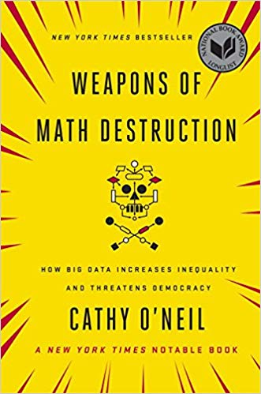

# Learning Objectives<br>

* Understand some real-world examples of bias

**Duration - 55 minutes**<br>

```{r, echo=FALSE, fig.cap="Weapons of Math Destruction", out.width = '50%'}

```

# Brief

In her thought-provoking book Weapons of Math Destruction Cathy O'Neil argues that societal biases are perpetuated by algorithms.

In this interview she summarises her views on the power of opaque algorithms and gives some real-world examples of where this has happened. She also offers some views on how this might be improved in the future.

Listen to the Dataframed interview with Cathy O'Neil, or if you prefer you can read the transcript:
[Dataframed Interview with Cathy O'Neil](https://www.datacamp.com/community/podcast/weapons-math-destruction)

## MVP

Whilst you are listening to the podcast, ask yourself these questions:

- What is a weapon of maths destruction?

<details>
<summary>**Example Answer**</summary>

A secretive algorithm that is used on lots of people for important decisions with negative feedback loops causing destruction for society.

</details>

- What kind of decisions could it be used for?

<details>
<summary>**Example Answer**</summary>

- Financial
- Livelihood
- Liberty
- Information

</details>

- How are WMD causing negative feedback loops?

<details>
<summary>**Example Answer**</summary>

They are ingraining existing societal biases. They not only predict the future, but cause it to happen.

</details>

## Extension

Also ask yourself these questions:

- What do we mean by one variable being a proxy for another?

<details>
<summary>**Example Answer**</summary>

A variable that is highly correlated with another variable that would not be allowed to be used explicitly, such as race, gender or income.

</details>

- What level of understanding should a decision-maker have about a weapon of maths destruction before deciding to implement it?

<details>
<summary>**Example Answer**</summary>

They should understand the risks that implementing an algorithm will bring. They should also be able to demonstrate that it's use is "fair". This might be by understanding the sensitivity of the algorithm on different inputs.

</details>

- What sort of regulation could be put in place to increase "fairness"?

<details>
<summary>**Example Answer**</summary>
Here are some example ideas, but there are many more:

1. a definition of important algorithms
2. an oversight requirement
3. compulsory performance monitoring

</details>

# Additional Resources

* [Cathy's opinion column](https://www.bloomberg.com/authors/ATFPV0aLyJM/catherine-h-oneil) 
* [Cathy's blog](https://mathbabe.org)


