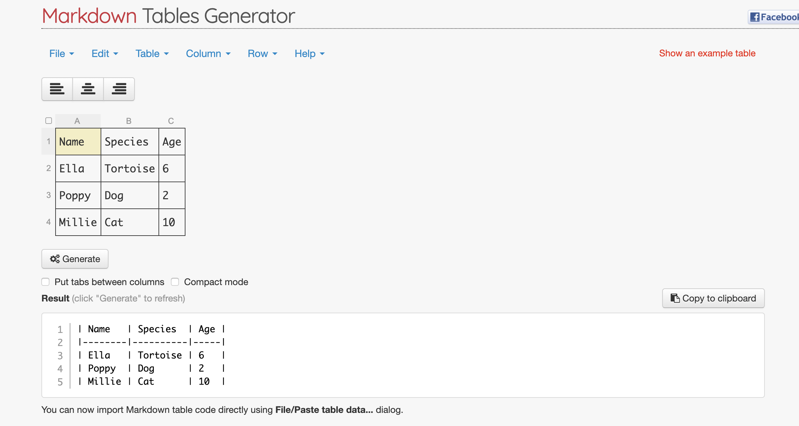
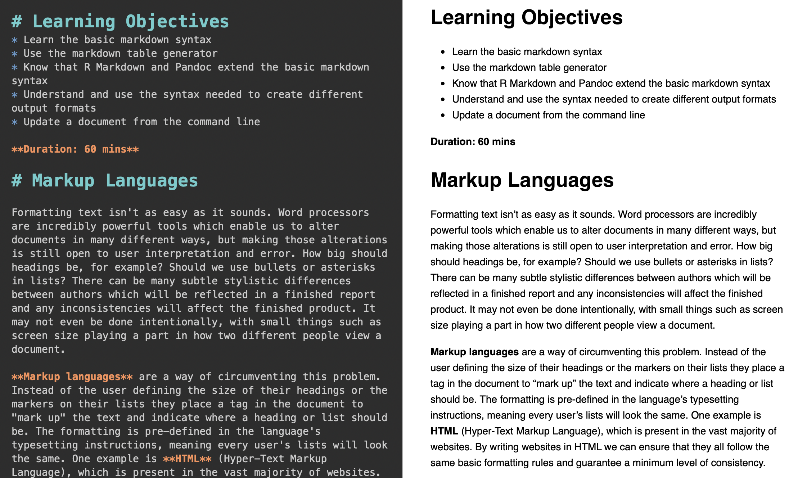
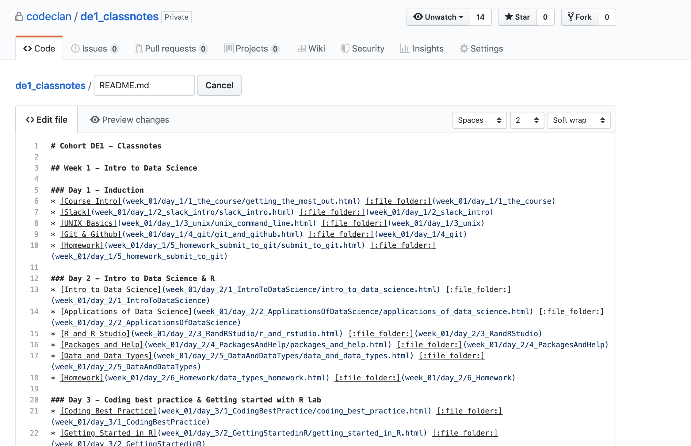

```{r setup, include=FALSE}
knitr::opts_chunk$set(echo = TRUE, fig.align = 'center')
```

# Learning Objectives<br>
* Learn the basic markdown syntax
* Use the markdown table generator
* Know that R Markdown and Pandoc extend the basic markdown syntax
* Understand and use the syntax needed to create different output formats
* Update a document from the command line
  
**Duration: 60 mins**

# Markup Languages

Formatting text isn't as easy as it sounds. Word processors are incredibly powerful tools which enable us to alter documents in many different ways, but making those alterations is still open to user interpretation and error. How big should headings be, for example? Should we use bullets or asterisks in lists? There can be many subtle stylistic differences between authors which will be reflected in a finished report and any inconsistencies will affect the finished product. It may not even be done intentionally, with small things such as screen size playing a part in how two different people view a document.

**Markup languages** are a way of circumventing this problem. Instead of the user defining the size of their headings or the markers on their lists they place a tag in the document to "mark up" the text and indicate where a heading or list should be. The formatting is pre-defined in the language's typesetting instructions, meaning every user's lists will look the same. One example is **HTML** (Hyper-Text Markup Language), which is present in the vast majority of websites. By writing websites in HTML we can ensure that they all follow the same basic formatting rules and guarantee a minimum level of consistency.

# Markdown

Markdown is an example of a **lightweight** (or **simple**) markup language. In contrast to HTML, which wraps passages of text in large opening and closing tags, a document annotated with markdown is very similar to the plain-text equivalent. Annotations are made using as little as one character.

## Headings

The first example of formatting difficulty we gave was heading size. In HTML we use heading tags -- the letter "h" followed by a number corresponding to size, with `<h1>` the largest and going down to `<h6>`. In markdown we use the octothorp (or hash) symbol -- #.

```
<h1>This would be the largest heading in HTML</h1>

# This is the equivalent in markdown
```

```
<h6>We can make text quite small using h6</h6>

###### To make it smaller in markdown we just use more symbols
```

## Emphasis

When writing we can't rely on nuances of speech such as tone to get our point across; we have to use visual methods instead. Typically we will use either **bold** or _italics_ to add emphasis to passages. In HTML there are two ways of doing each (`<b>` and `<strong>` for bold, `<i>` and `<em>` for italics). Markdown also has two options (`*` and `_`, but the number of symbols differentiates between the effects)

```
<b>HTML bold is declared in tags just like anything else.</b>

**Two of your chosen symbol will do it in markdown.**

__And it doesn't matter which one you choose.__
```

```
<i>Italics are the same.</i>

*But only one symbol needed in markdown.*

_Both will do the job._
```

## Lists

We've all had problems with lists in documents: inconsistent indentation, different style bullet points, line wrapping not lining up properly. In HTML we simply decide if we want an ordered (numbered) or unordered list then mark up each entry as a list elememt:

```
<ol>
  <li>These elements...</li>
  <li>...will be...</li>
  <li>...numbered</li>
</ol>

<ul>
  <li>These won't...</li>
  <li>...because we used "ul" this time...</li>
  <li>...but we still use "li" for the elements</li>
</ul>
```

Markdown is much closer to what we've seen before. We use any of `*`, `+` or numbers to denote a list, with sub-lists indicated using indentation.

```
  1. This is the first item
  2. This is the second
    * This item will not be numbered
    * Notice how they're indented?
  3. We're back to numbering again here
```

## Links

We may want to add hyperlinks to our documents. They're a great way of pointing the reader to external sources of information -- we've been doing it in the "further resources" sections of our notes since the start of the course! These are particularly cumbersome in HTML, requiring `a` tags with an `href` attribute set to point at a URL. In markdown this is a _little_ more fiddly than what we've seen before, but it's still more simple than HTML:

```
<a href="www.google.com">HTML links can be hard to read</a>
```

```
[Markdown still isn't great, but at least it reads like English](www.google.com)
```

# Comparing HTML and Markdown

<blockquote class="task">
**Task - 20 mins**

* Recreate the HTML document below using markdown 

```
<!DOCTYPE html>
<html lang="en">
<head>
</head>
<body>
  <h1>Welcome to our page!</h1>
  <p>This is an example of how we <em>could</em> lay something out.</p>
  <h3>Smaller headings are fun too!</h3>
  <ul>
    <li>This element is part of a list</li>
    <li>So is this one</li>
    <li><a href="https://http.cat/200">This one's a link too!</a></li>
  </ul>
</body>
</html>
```

<details>
<summary>**Hint**</summary>
We can nest tags "inside" each other in markdown just like we can with HTML
</details>
<details>
<summary>**Hint**</summary>
All of the annotations required have been mentioned today already
</details>
<details>
<br>
<summary>**Answer**</summary>
```
# Welcome to our page!
This is an example of how we *could* lay something out.
### Smaller headings are fun too!
* This element is part of a list
* So is this one
* [This one's a link too!](https://http.cat/200)
```
</details>
</blockquote>


# Generating Tables

When presenting data, tables will be one of the most powerful tools in your arsenal when trying to get your point across. Unfortunately, they're rather complicated to format properly (we've all had moments using Word where adding a comma throws everything out of alignment).

The same is sadly true for markdown (and doubly so for languages such as HTML). The added complexity of special characters to indicate rows and columns make it even easier to throw something out of line. Consider this table with information about pets:

<div class="emphasis">
| Name   | Species  | Age |
|--------|----------|-----|
| Ella   | Tortoise | 6   |
| Poppy  | Dog      | 2   |
| Millie | Cat      | 10  |
</div>

<br>

The code to generate it looks like this:

```
| Name   | Species  | Age |
|--------|----------|-----|
| Ella   | Tortoise | 6   |
| Poppy  | Dog      | 2   |
| Millie | Cat      | 10  |
```

<br>

Let's see what happens if we skip the second pipe on the third row:
<div class="emphasis">
| Name   | Species  | Age |
|--------|----------|-----|
| Ella    Tortoise  | 6   |
| Poppy  | Dog      | 2   |
| Millie | Cat      | 10  |
</div>

<br>

You can see that a single typo can throw a whole row off. Considering the amount of typing needed (and there's even more required for HTML), that's a lot of pipes to potentially go missing.

Help is at hand in the form of the [Markdown Tables Generator](https://www.tablesgenerator.com/markdown_tables).

```{r, echo=FALSE, fig.cap="The Markdown Tables Generator", out.width = '100%'}

```

<br>

The GUI is fairly simple to navigate: simply decide how big you want your table to be in the `table` menu (allowing space for headers) then type the data in to the fields. There are some basic formatiing options and menu items for adding rows and columns to the middle of the table. Clicking the `Generate` button creates the code for the table, which can be copy-pasted into your document.

Of course we won't always want to be entering everything by hand. We also have the option of importing data from a local .csv file, which is particularly useful when dealing with large datasets. Note that there is not currently an option to remotely source data; if you want to use a .csv file from elsewhere, you'll need to download it first. 

Finally, we can use the same tool to generate other types of tables. In this case of HTML and LaTex (which can both get very complicated where tables are concerned, especially once we get to styling) this can be a huge help.

<blockquote class="task">
**Task - 10 mins**

* Use the table generator to make a table storing some information. Friends' contact details, your classmates' favourite colours, whatever you like!
* If you're feeling a bit more adventurous, try importing a .csv file or building a table using one of the other markup languages
</blockquote>

# Tools for Writing Markdown

Now that you know a bit more about writing markdown you can use of some of the tools at your disposal to really take advantage of it! You have a program called [MacDown](https://macdown.uranusjr.com) installed on your Mac which renders markdown as you write it, making it mush easier to see how your final document will look.

```{r, echo=FALSE, fig.cap="This file -- in MacDown!", out.width = '100%'}

```

That's not the only place we can edit markdown. GitHub has tools which let us edit it in our browser, with the added bonus that we can commit any changes we make there and then!

```{r, echo=FALSE, fig.cap="Editing a README on GitHub", out.width = '100%'}

```

Of course, just like any other text-based file, we can edit markdown in whichever text editor we like. We won't necessarily get the benefit of syntax highlighting or a live preview though!

# Recap

* Which character do we use to denote a heading in markdown?
<details>
<summary>**Answer**</summary>
The octothorp -- `#`
</details>
* How do we differentiate between bold and italic text in markdown?
<details>
<summary>**Answer**</summary>
The number of characters used: two for **bold**, one for *italic*
</details>

# Additional Resources
* [Markdown Cheat Sheet](https://guides.github.com/pdfs/markdown-cheatsheet-online.pdf)
* [Markdown Tables Generator](https://www.tablesgenerator.com/markdown_tables)
* [MacDown](https://resources.github.com/whitepapers/github-and-rstudio/)