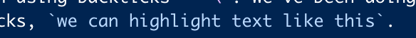
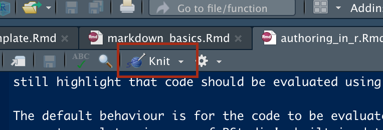
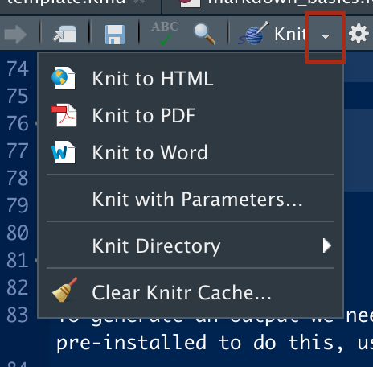
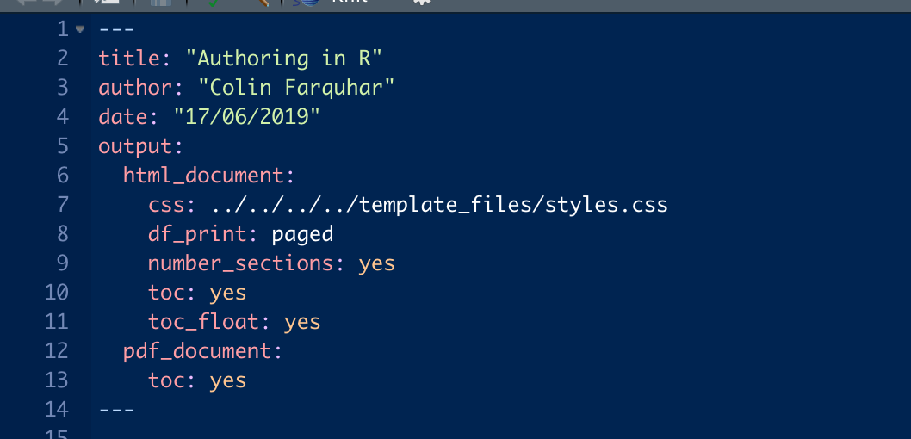
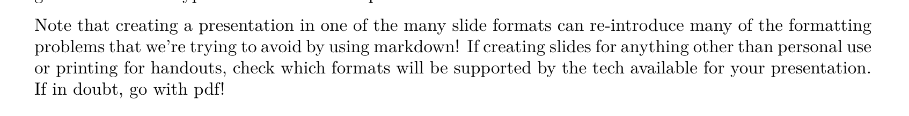

```{r setup, include=FALSE}
knitr::opts_chunk$set(echo = TRUE, fig.align = 'center')
```
# Learning Objectives<br>

* Know how RMarkdown and Pandoc extend Markdown
* Create documents in multiple output formats
* Understand the syntax needed to create them
* Knit a document from the command line

**Duration - 60 minutes**

In the last lesson we looked at how we can use markup languages to enable more consistent formatting of our documents. We won't draw a line under it there though; now we're going to look at some of the tools RStudio has which we can use to deliver different styles of presentation. 

# RMarkdown

You've been using RMarkdown a lot already without even knowing it -- most of your course notes have been written using it! You can tell if a file is using RMarkdown by its `.Rmd` extension.

You've also been using notebooks in this course, which support RMarkdown. When you write text outside the code chunks, this can be written using Markdown. 

When you go to create a new document, you'll see a choice between RMarkdown and notebooks. Notebooks are very similar to RMarkdown documents, except they include some extra features, like code running below your chunk. Everything that applies to RMarkdown documents also applies to notebooks.

RMarkdown is very similar to markdown. Now, though, we also have the power to include snippets of code in our document which can be run when we generate our output, which can itself take one of many different presentational forms.

<br>

```{r, echo=FALSE, fig.cap="Creating a New RMarkdown file", out.width = '50%'}
knitr::include_graphics("images/authoring_new_doc.png")
```

<br>

Creating a new RMarkdown file is essentially the same as creating any other type of file: `File > New File > R Markdown`. The image above shows the GUI window for new file creation, which includes different options for the default output format. For now we'll leave this set to HTML; we'll look at the other options later in the lesson.

## Embedding R Code

Often we'll want to include the results of evaluating some expression in R in our code. The easiest way is to do it _inline_ by denoting the start and end of an expression using backticks -- \`. We've been doing this a lot already, and it's inherited from markdown. With only the backticks, `we can highlight text like this`.

```{r, echo=FALSE, fig.cap="Inline Blocks", out.width = '50%'}

```

In RMarkdown we can add a marker to say that the block should be evaluated as R code, and it will be when we compile the document. We can do that simply by adding the letter `r` after the first backtick. Take a look at the picture below to see how I can tell you that my favourite number is `r 2 + 3`.

```{r, echo=FALSE, fig.cap="Inline Blocks with Syntax Highlighting", out.width = '50%'}
knitr::include_graphics("images/inline_r.png")
```

## Code Blocks

Inline blocks are fine for brief snippets of code, but less useful if we want to evaluate larger or more complex expressions. The principle is the same, although now we use triple instead of single backticks (\`\`\`). We can still highlight that code should be evaluated using R, but now we need to wrap it in braces: `{r}`. Remember the keyboard shortcut alt + cmd + i.

The default behaviour is for the code to be evaluated at compile time and then included alongside the result. Let's generate a plot using one of RStudio's built-in datasets as an example:

```{r}
plot(cars)
```

That's great if we want to show the user how we generated our output, but it's not always practical. Cluttering a presentation with details of calculations can diminish it's impact and that effect is magnified when the calculations are particularly complex or repetitive.  Instead we can hide the details by setting the _echo_ flag to be `false`. Doing this doesn't affect the running of the code, but stops it being included in the final document.

```{r, echo=FALSE, fig.cap="The code to generate the plot below", out.width = '50%'}
knitr::include_graphics("images/block_hidden_code.png")
```

```{r, echo=FALSE}
plot(iris)
```


# Pandoc & Knitr

To generate an output we need to tell RStudio to _knit_ our document. We use a package called _Knitr_ which comes pre-installed to do this, using the handy button in the toolbar:

```{r, echo=FALSE, fig.cap="The knit button", out.width = '50%'}

```

This carries out step one of the process by generating a markdown file from our R Markdown, eg. creating `my_file.md` from `my_file.Rmd`. This is an important step, but doesn't really get us any closer to a presentable document. That stage is handled by _Pandoc_ -- a package which converts the markdown file we get from Knitr into the format of our choosing. When we create a document we can choose the default file type for our output -- for these notes we chose HTML -- but we can change the output at any time by selecting an alternative from the dropdown next to the knit button.

```{r, echo=FALSE, fig.cap="Knitting output options", out.width = '50%'}

```

<br>

If we had selected "presentation" as our document type when we created it we would also have options to generate different types of slides in the dropdown.

<div class="emphasis">
Note that creating a presentation in one of the many slide formats can re-introduce many of the formatting problems that we're trying to avoid by using markdown! If creating slides for anything other than personal use or printing for handouts, check which formats will be supported by the tech available for your presentation. If in doubt, go with pdf!
</div>

## YAML

If you look at the top of an RMarkdown file (such as this one) you'll see a block of code which looks like it bears some relation to the output document, but it may not obvious how. What you're seeing are **key-value pairs**, a common structure across many programming languages where we want to set some parameter (a key) to a given value, eg. setting the document's `title` key to the value `"Authoring in R"`.

```{r, echo=FALSE, fig.cap="YAML configuration", out.width = '50%'}

```

The language used here is **YAML** which (depending on who you ask) stands for either _**Y**et **A**nother **M**arkup **L**anguage_ or _**Y**AML **A**in't **M**arkup **L**anguage_. Yes, really. The important thing is that it is made up of key-value pairs, with it being possible to nest further pairs inside a value (like the value of the `output` key in the above image). That means that we can customise our output, for example by adding styling using CSS (more on that next lesson).


# Different Types of Output

The final appearance of our document and the options available to customise it will vary according to the output type selected.

## HTML

The document you're reading right now has been prepared using HTML! We can specify a wide range of options and import custom styling from a CSS file. We can also include HTML tags in our document and they will be interpreted correctly when the output is generated, such as the blue box we saw earlier with the notes about slide formatting.  

## PDF

Knitting to pdf will generate slightly different results to HTML. All of the content will still be there, but some of it may not be interpreted in the same way. Look at our blue box from earlier, for example:

```{r, echo=FALSE, fig.cap="No sign of our styling...", out.width = '100%'}

```

This has come about because Pandoc compiles pdfs using LaTex, which doesn't recognise the HTML `<div>` tags we used. The tags won't be included in the output since the angle brackets have a similar purpose in LaTeX, but it doesn't know "div" means and so ignores the tags while printing the content. We have similar issues with trying to apply CSS styling. Trying to style LaTeX could be a whole course by itself and so we won't go into it here, but since it is widely used in academic writing the default formatting already has a professional appearance, plus almost guarantees consistency with other documents prepared in this way.

## Word

Most of us will have, at some time, prepared a document using a word processor. One of the options Pandoc gives us is preparing our RMarkdown to look like a Word document, specifically one with a `.docx` extension. It has the advantage of looking like a document format that most people are familiar and comfortable with, but the same disadvantages as knitting to pdf in that our styling disappears.

<div class="emphasis">
**Note**: Pandoc generates `.docx` files, which is the file extension used by Microsoft Word 2010+. We're using MacBooks for this course, which means we might find some unusual interactions when when opening them in a different word processor.
</div>

## Slides

One of the most useful formats to knit to is a slideshow, but we don't get that option when we create an RMarkdown document. Instead we need to choose the **Presentation** option when creating a new file, which opens up more options for us when knitting.

```{r, echo=FALSE, fig.cap="The Presentation Knitting Options", out.width = '50%'}

```

Of the four options presented, three of them will work straight out of the box with no further setup necessary. The exception is PowerPoint which requires a local installation of either PowerPoint or OpenOffice.

<div class="emphasis">
The laptops provided for this course **don't** have either of these programs installed.
</div>

Of the four formats we've spoken about here, it's likely that HTML and slides will be your main options for output. HTML has the advantage of being ready to display online while slides are the format known and loved at conferences around the world. HTML has an added benefit in that -- as with any webpage -- it's possible to save the result as a pdf and circumvent the problems we saw earlier with styling.

# Knitting From the Terminal

As with most functions in all good GUIs, RStudio's knitting function is essentially a shorthand way of doing something already achievable through the command line. The two steps in the process are performed separately. Firstly, we knit the file:
 ```{sh eval=FALSE}
 Rscript -e "library(knitr); knit('my_file_name.Rmd')"
 ```
 
The `Rscript` command tells Terminal that we're running some R code, with the `-e` flag indicating that what follows will be an R expression (we could also pass the name of a file to run). The code in quotes is what we would enter if we were to knit from the RStudio console, with a semi-colon denoting the break between commands.
 
This will generate a markdown file with a `.md` extension, as it would if we simply clicked the "knit" button. The next step is to run Pandoc on it:

```{sh eval=FALSE}
pandoc -f source_type -t output_type -o output_file_name.ext target_file.ext
```

As with knitr, `pandoc` tells Terminal that what follows will use Pandoc. The `-f` and `-t` flags refer to file types (markdown, pdf, html, etc) with `-f` representing the source's file type and `-t` the desired output type. `-o` denotes the name we supply for the file which will be generated by pandoc. Note that we need to provide the extension even though we have already told it the output type, meaning we must take care that it matches. Finally we need to provide the relative path to the file we want to get our output from. 

It would be possible to handle both of thse steps at the same time if we were to write a script for it, indeed we could go as far as automating the process to run whenever some dataset was updated or even at a specific time of day. Unfortunately that goes beyond the scope of this course, but could be a worthwhile research exercise if you find yourself frequently re-compiling documents!

# Recap

* How to we prevent a code snippet being included when knitting a document?
<details>
<summary>**Answer**</summary>
By setting the `echo=FALSE` flag in the code block.
</details>
* Why do we include YAML in our files?
<details>
<summary>**Answer**</summary>
To store configuration information.
</details>

<hr>

# Additional Resources

* [RMarkdown Cheatsheet](https://www.rstudio.com/wp-content/uploads/2015/02/rmarkdown-cheatsheet.pdf)
* [Knitr Documentation](https://yihui.name/knitr/)
* [Pandoc Documentation](https://pandoc.org/)