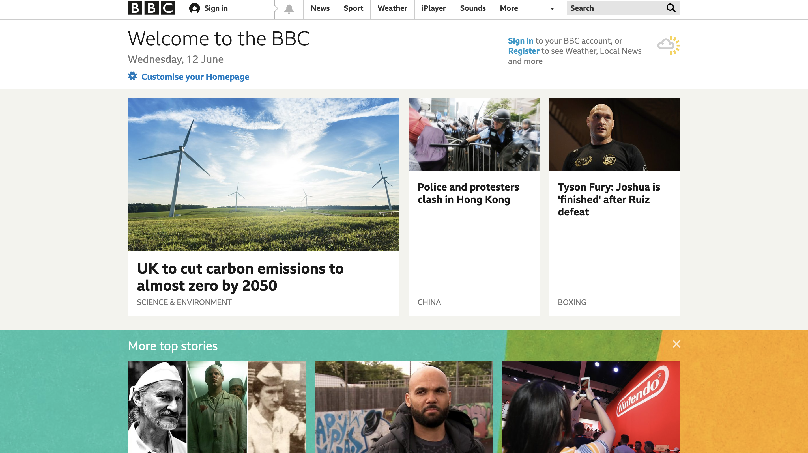
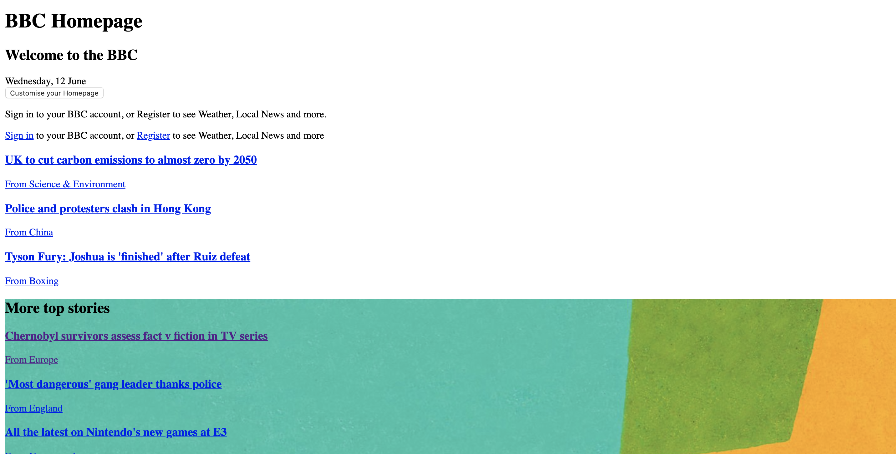
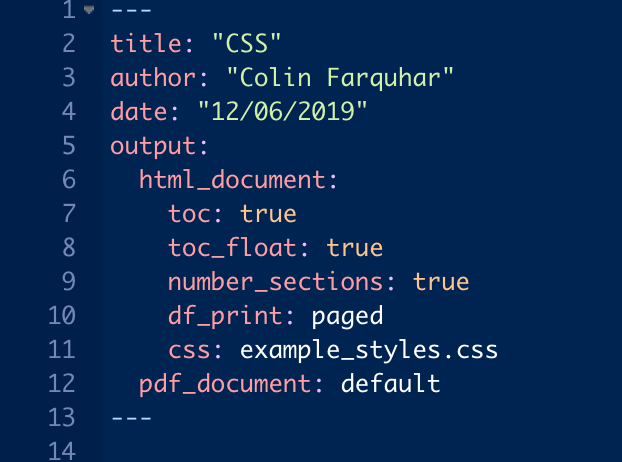
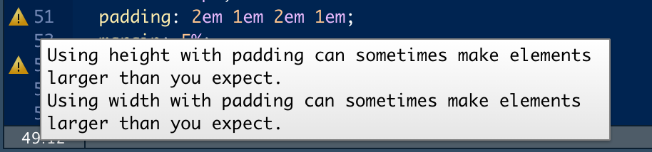

```{r setup, include=FALSE}
knitr::opts_chunk$set(echo = TRUE, fig.align = 'center')
```

# Learning Objectives<br>
* Understand how stylesheets can change the look and feel of a document
  + Know how to use font and colour for maximum impact
* Create a stylesheet from scratch
* Use a stylesheet when creating a document
  
**Duration: ???mins**

# The Impact of Styling

Imagine a world where the internet didn't have any styling. Everything would still work and we could still access all of the information we can at the moment, but it would all look the same and be pretty boring. Adding even a little bit of styling can go a long way towards making a website more appealing and user-friendly. Consider this well-known news site:

<br>

```{r, echo=FALSE, fig.cap="With styling...", out.width = '100%'}

```
<br>
```{r, echo=FALSE, fig.cap="...and without", out.width = '100%'}

```
<br>
Which would you rather visit?

Reports, presentations and other documents are similar: the basics will get the job done, but spending a bit of time making them look good will pay dividends when it comes to user engagement.

# CSS

In word processors it's fairly easy to style our documents: we just click some buttons and we can change font, size, colour and many other things. With markup languages we use a different tool -- CSS.

**C**ascading **S**tyle **S**heets are special files in which we can define stylistic properties for different elements, either individually or by grouping them together. Every property has a default value but they can all be altered, [and there are lots of them](https://developer.mozilla.org/en-US/docs/Web/CSS/Reference).

## Adding CSS to a document

First thing's first, we need a file to keep our CSS in. Typically we'll use a file called `styles.css`. We can keep this file anywhere in our filesystem, but we'll keep it in the same palce as your document. Depending on how you're using it, it may need to go somewhere else.

Importing CSS into a document is also fairly straightforward. While setting up the output for Knitting, we tell Knitr where to look for the file by giving the `css` key the relative filepath to the stylesheet.

```{r, echo=FALSE, fig.cap="Setting up CSS", out.width = '50%'}

```

Let's think about how to set one of those properties we mentioned earlier. Say we want to make all of the text in our document blue. To do that we only need to set the property of one element:
```
  body{
    color: blue;
  }
```
The _cascading_ part of the name means that by setting text colour for the whole body of the document, the change is passed down to every element nestwed within it. We can use this to be more specific in which elements we re-style. For example, we may want to make our links red, but only if they're inside a paragraph:
```
  p  a {
    color: red;
  }
```

The end result would be something looking like this:
<br>
<blockquote>
<div class="body-fake">
  <p>Most of the body's text will be blue.</p>
  <p><a href="http://www.google.com" class="nested-p-a">This "p" tag contains a link to Google, though.</a></p>
  <p>Because of the styling we defined, it should be red instead.</p>
</div>
</blockquote>

<div class="emphasis">
Note the spelling of "color"; programming languages in general tend to use American English.
</div>

## Selectors

In this example, the `body`, `p`, and `a` tags are known as **type selectors**. Setting a property on a type selector applies the change to **every** instance of that selector in the document, with nesting also being reflected. What if we don't want to change every instance of a selector though?

Enter the **class selector**. Every HTML element can be given a **class** property and elements with the same class property will share the same styling. Let's think about an example:
```
  <p>This line should be green.</p>
  <p>So should this one.</p>
  <p>This one needs to be orange.</p>
  <p>Back to green for this one.</>
```
<br>

As it stands there's no way for us to differentiate between the elements. We can split them into two groups with something in common though (those we want to be green and those we want to be yellow), which suggests that classes may be useful here.
```
  <p class="green-text">This line should be green.</p>
  <p class="green-text">So should this one.</p>
  <p class="orange-text">This one needs to be orange.</p>
  <p class="green-text">Back to green for this one.</>
```
<br>

We set the styles for the class selectors in the more or less the same way as the type selectors. This time we add a `.` in front of the selector name to indicate that it is a class:
```
  .green-text{
    color: green;
  }
  
  .orange-text{
    color: orange;
  }
```

<br>

Now our text looks like...
<blockquote>
<p class="green-text">This line should be green.</p>
<p class="green-text">So should this one.</p>
<p class="orange-text">This one needs to be orange.</p>
<p class="green-text">Back to green for this one.</p>
</blockquote>

<br>

We can use the third main type of selector in a similar way. The **ID selector** allows us to target a specific element in the document and style it in a unique way.  Unlike classes, which can be applied to as many different elements as we want, there should only ever be **one** element tagged with a given ID. 

Let's look again at the above example and imagine that instead of having green and orange classes we wanted to use an ID. Similar to adding the _class_ annotation to an element, we can use _id_ here:
```
  <p>This line should be green.</p>
  <p>So should this one.</p>
  <p id="orange-text">This one needs to be orange.</p>
  <p>Back to green for this one.</>
```

<br>

In the CSS file we use the `#` symbol instead of a `.`, but otherwise follow the same process:
```
  #orange-text{
    color: orange;
  }
```

# The Box Model

The `color` property we were modifying above is an example of a _presentation_ property, affecting the appearance of the element. We can also adjust _positioning_ properties, which set the location of an element in the document or on the screen.

Both size and positioning of an element is based on the **box model**, which defines four key parameters which are part of determining layout.

<br>

```{r, echo=FALSE, fig.cap="The Box Model", out.width = '50%'}
knitr::include_graphics("images/box_model.png")
```

<br>

The four are:

* **Height/Width** -- the size of the content
* **Padding** -- the distance between the content and the border
* **Border** -- the border rendered around the content. If nothing is defined nothing is rendered, but the border still exists as a reference point
* **Margin** -- the distance between the border and the adjacent element(s)

**Height** and **width** are both defined in terms of numerical values which set the respective parameter. If only one is set explicitly and the other defined as `auto` the content will retain its original aspect ratio.

**Padding** and **margin** are both defined as follows:
```
  #my-element{
    padding: value-top value-right value-bottom value-left;
    margin: value-top value-right value-bottom value-left;
  }
```
<br>

Alternatively, passing a single value will set the parameter to that value in all directions.

**Border** is the most complex to set, requiring three values to be set:
```
  #my-element{
    border: thickness style color;
  }
```
<br>

Measurements can be defined in a few different ways in CSS. One method is to give an absolute size in pixels using the `px` notation, eg. `width: 100px`. The downside here is that when viewed on screens with different resolutions the document will look different. A more consistent alternative is to reference the size of a capital "M", using `em`, eg. `width: 1em`. There are other options available, check out the further reading materials below.

Putting everything together, we might style a selector as follows:
```
  #my-element{
    background-color: #d3f3c8;
    height: 200px;
    width: 200px;
    padding: 2em 1em 2em 1em;
    margin: 5%;
    border: 2px solid black;
  }
```
<blockquote>
<div id="my-element">
<p>I'll put something here just to show some content</p>
</div>
</blockquote>

<br>

It should be noted that CSS properties don't always play well with each other; hard-coding the dimensions of a border, for example, might lead to content overlapping it. RStudio will warn us when alterations we make could potentially interfere with other aspects of the styling, along with classes we define which are never used.
```{r, echo=FALSE, fig.cap="A CSS warning message", out.width = '50%'}

```
<br>

# Recap

* How important is styling when preparing a document?
<details>
<summary>**Answer**</summary>
Very! It can make a huge difference to user engagement.
</details>
* How do we include a stylesheet in a document?
<details>
<summary>**Answer**</summary>
Define the filepath in the document setup.
</details>
* What are the four parameters defined by the box model?
<details>
<summary>**Answer**</summary>
  * Content dimensions
  * Padding
  * Border
  * Margin
</details>

# Additional Resources

* [List of CSS properties](https://developer.mozilla.org/en-US/docs/Web/CSS/Reference)
* [More about selectors](https://developer.mozilla.org/en-US/docs/Web/CSS/CSS_Selectors)
* [The box model](https://developer.mozilla.org/en-US/docs/Web/CSS/CSS_Box_Model/Introduction_to_the_CSS_box_model)
* [Dynamic Displays -- Flexbox](https://developer.mozilla.org/en-US/docs/Web/CSS/CSS_Flexible_Box_Layout/Basic_Concepts_of_Flexbox)
