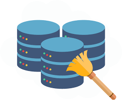
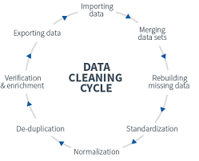
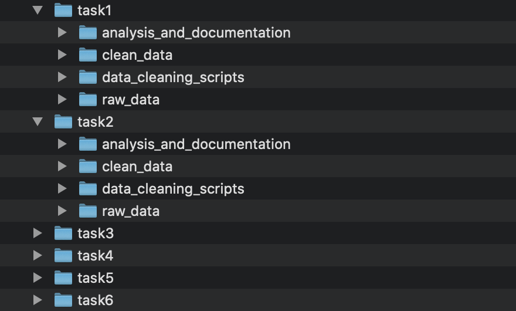

# Data cleaning 

```{r, echo=FALSE, out.width = '30%'}
    
```

One of the most common sayings you will likely hear for anyone working as a data analyst/scientist '80% of your time is data cleaning' - this can include (but is not limited to!) loading all your data in to a single tool for analysis; dealing with missing values, duplicates and outliers; cleaning strings; reshaping and joining. 

```{r, echo=FALSE, out.width = '50%'}
    
```

In 2016, the IBM estimated that the US lost $3 trillion in GDP due to poor quality data and 1 in 3 business leaders did not trust the data sources they were using to make decisions.

And you've probably heard the saying *'garbage in leads to garbage out'* (although in reality we would want *garabage in leads to error or warning out* because we have written checks!)

Don’t panic if you find the vast majority of your time in a project spent on data cleaning, this is the normal reality, and if you rush it then it will only slow you down at the end, and may mean that you need to come back to this stage later (or even worse, you don’t, and any analysis is based on messy data!). 

## Positives of data cleaning 
People can have a negative view of data cleaning but there are many huge positives:

* **You get to know your data**. By cleaning and digging into the data, you fully understand the data. This means that when you get to exploration and analysis, you already have a lot of knowledge, without which you could make a lot of incorrect assumptions. 
* Cleaning may naturally raise relevant questions for your client, and can greatly help you understand the business. 
* You may discover findings people haven’t spotted before e.g. issues with data collection. 
* Cleaning will present many opportunities for problem solving. Every dataset comes with it’s own quirks and challenges and this will increase your skill set every time you are faced with a new dataset. 
* You can view it almost as solving a puzzle! Data cleaning can be incredibly satisfying: you take a lot of messy data from which no insights can be easily extracted, and convert it to a nice cleaned and formatted dataset from which insights naturally flow. 

## Cleaning is the first step

Cleaning will never happen in isolation and will be the first step in the process of answering questions with data - whether that be exploratory analysis or building a predicitve model. This is why as part of the project, we will ask you to answer a few questions with the data: let these questions guide the purpose of your cleaning. So, for example, not every variable in each dataset needs to be cleaned, just those required as part of the subsequent analysis to answer the questions. 

# Project overview

For each of the tasks we want you to create a separate project (`.Rproj`). For every task we would like one script that cleans your data, and a separate script that answers the analysis questions. Both scripts should be clearly coded and commented. 

For your chosen task to present we would like you to write a `markdown` document describing your project. This document should include:

* A brief introduction to the dataset
* A list of any assumptions you have made
* The steps you took to clean the data (you don't need to write out in detail every step, but a combination of commented code chunks with surrounding overall explanations would be great). 
* The answers to the questions presented in the task brief
* Any other interesting analyses or conclusions you come across. 

## Project structure 

We would like your folder structure in the project for each task to be as follows:

```
raw_data
data_cleaning_scripts
clean_data
documentation_and_analysis
```

* The `raw_data` folder will contain the unprocessed data from the `de3_classnotes` folder. 
* The `data_cleaning_scripts` folder will contain your code (clear & commented) used to clean the data. At the end of the script, you should write your cleaned dataset to a `csv` file in the `clean_data` folder. This should be a `.R` script.
* You should then have a separate script in the `documentation_and_analysis` folder containing your analysis code and/or `markdown` documentation. This will be a `.Rmd` file.

So your project folder should look something like this 

```{r, echo=FALSE, out.width = '50%'}
    
```

## `here()` function 

Just a gentle reminder that you are using projects (`.Rproj`) and not single scripts, and so do not use the `Set Working Directory` command in `RStudio` to read in files/scripts. This is never a good idea because it is not self-contained and portable: if someone else on another machine tried to run your code, it wouldn't work properly, unless (completely by chance), they happen to mimic your directory and file structure. 

However there is one small tweak that's needed when running scripts within folders. Say my cleaning file is in the folder `data_cleaning_scripts` and in this file, I read in a data file saved within `raw_data`. I may try the following

```{r , eval=FALSE}
birds <- read_csv("raw_data/birds.csv")
```

I will get an error if I run this. This is a bit of quirk in R. When you are working in a `.Rmd` file, R sets your working directory to the folder that the `.Rmd` file lives in (in this case, it would be `data_cleaning_scripts`). However, if you are working in a script file (`.R`) it makes the working directory the top level of the project (and so the code above would have worked). 

We will be working in `.Rmd` files, so we need a fix for this. Luckily there is a function `here()` found in the `here` package, which figures out the top-level of your current project. And so we can use the following code:

```{r , eval=FALSE}
library(here)

#test where the top level of the project directory is 
here::here()

#use this to set the path to the data file
birds <- read_csv(here("data/birds.csv"))
```

Note: there is also function named `here()` in the `lubridate` package, so, to avoid ambiguity, you may want to specify the use of `here()` from the package `here` by using `here::here()` to avoid any conflicts if you've loaded `lubridate`. 


# Expectations

* The clean data should be in tidy (long) format as covered in week 3.
* Follow the style guide covered in week 1 for both code style, and naming data and variables. 
* Look over the reproducibility lesson from week 1 again to help you think about how to organise your project. Following the steps there to ensure reproducibility and clarity for review, and recap the hints and tips for writing documentation. 
* While the datasets in all of these projects are pretty small (and so processing power won't be an issue), do think about efficient ways of answering the questions. By this we don't necessarily mean that you should write code that runs as fast as possible (as this sometimes can make code more difficult to read), but rather look to avoid overcomplicating the code, and any 'hard coding'. 

# Project output

## MVP

The MVP for the project will be completing cleaning and analysis scripts for tasks 1 to 4, and full documentation/markdown for a task of your choice. On Friday you will present your documentation for your chosen task, stepping us through your processes and output. 

If you don't get to task 4 then just complete task 1 to 3 and ensure you have completed the documentation for a task to present on the Friday. 

## Extension

If you finish the MVP the extension is to continue with tasks 5 and 6 by completing cleaning and analysis scripts with full documentation.


