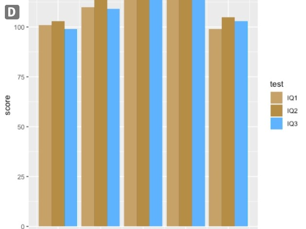

  
  
```{r setup, include=FALSE}
knitr::opts_chunk$set(echo = TRUE, fig.align = 'center')
```

# Learning Objectives<br>

* Understand the strategic use of colour in visuals
* Understand the impact of colour-blindness
* Be exposed to how the brain takes in information visually
* Understand the different pre-attentive attributes for data
* Know what makes a good visualisation

**Duration - 2 hours**<br>
  
To start, we're going to look at some examples of how we take in information visually, and discuss the role of "preattentive attributes" in this process. We'll then look at some more practical examples and see how these attributes function in practice. We'll wrap up with some tips on what makes a good visualisation.

# Colour

Colour is one of the most important attributes in visualisation. They're also one of the most frequently misused. 

The classic expression of this is the RGB (red-green-blue) encoding. This is based on how TVs and computer monitors generate colour, but it doesn't correspond to how the human eye perceives colour.

Although RGB is still used, it is generally better to use more modern encodings such as HCL (hue-chroma-luminance) which is a closer match to how humans perceive colour.

* Hue is a number between 0 degrees and 360 degrees which corresponds to the colour (e.g. red/green/blue)
* Luminance is a number between 0 and 1 which gives the lightness of the colour. 0 is black and 1 is white.
* Chroma is a number between 0 and a variable maximum (depending on the luminance) which gives the purity of the colour. A chroma of 0 is grey and higher numbers are closer to the exact hue chosen.

You can play with a colour picker here: https://bl.ocks.org/mbostock/3e115519a1b495e0bd95

## Colour Schemes

We divide data visualisation colour schemes into five types.


Sequential colour schemes use a single colour from light to dark. They are most useful for representing a range of continous quantitative values from low to high.

Diverging colour schemes use two colours to representing divergence from some mid point (both the direction and size of the divergence).

Categorical colour schemes use colour hue to distinguish between groups/categories.

Highlight/alert colours are used to draw the attention of the reader to a particular element of the visualisation. The distinction between the two is subtle, and is more connected to intent than any theoretical difference.

<blockquote class='task'>
**Task - 5 mins** 
Here is another map showing the number of signatories to a petition "Prevent Donald Trump from making a State Visit to the United Kingdom." We've done three colour schemes.

```{r, echo=FALSE, out.width = '80%'}

``` 
<br>
```{r, echo=FALSE, out.width = '80%'}
knitr::include_graphics("images/trump_map2.png")
```
<br>
```{r, echo=FALSE, out.width = '80%'}
knitr::include_graphics("images/trump_map3.png")
```	
<br> 
Discuss which type of colour scheme each of these is, and which is the most suitable.

<details>
<summary>**Answer**</summary>

* The first is a sequential colour map, and is by far the best.
* The second is a divergent colour map, which doesn't look terrible, but it's not clear what the significance of the midpoint is or why it makes sense to show regions with fairly high numbers of signatures in white, and regions with few or no signatures in bright red.
* The third isn't clear and it is an effort to read the data. This isn't a good thing.  

</details>
</blockquote>


# Colour-blindness

Colour blindness (or, more accurately, color vision deficiency) is an inherited condition. Contrary to popular belief, it is rare for a color blind person to see only in shades of grey - rather their ability to distinguish between certain hues is heavily impaired. The inability of your audience to distinguish hues is still a serious problem though if you've colour coded your lines so they know which group is which, or if you've made one of your bars bright red to draw their attention to it.

If 4-5% of the population are unable to read your visualisation, this is not a trivial consideration; especially if your graphic is to be distributed more widely.

In short, we need to consider the impact of colour blindness if we use colour in our graphics.


## Types of colour-blindness

There are three types of colour blindness.

* Protanopia (red weak)
* Deuteranopia (green weak)
* Tritanopia (blue weak)

The last of these is very rare ($<0.5%$ of the population). The primary problem with colour blindness is with red and green. For this reason it is strongly advised not to use red and green together (traffic lights have a lot to answer for).

However, the problem is broader than just red and green. The inability to see these colours will affect the way you perceive other colours, e.g. you will struggle to distinguish between blue and purple. 

Thinking through all of this can be tricky, but mercifully we can cheat.

There are a number of colour blindness simulators available. 

* <b>Adobe Illustrator CC</b> offers a built in CVD simulator.
* <b>Chromatic Vision Simulator</b> is a free online tool that you can upload images to and simulate different forms of CVD. (http://asada.tukusi.ne.jp/webCVS/)
* <b>Coblis Colour Blindness Simulator</b> is another free online simulator. (https://www.color-blindness.com/coblis-color-blindness-simulator/)
* <b>Sim Daltonism</b> is another simulator for Mac and iOS. (https://michelf.ca/projects/sim-daltonism/)
* <b>NoCoffee vision simulator</b> is a free simulator for the Chrome browser that allows users to simulate websites and images directly from the browser.

## Example in R

Below we have a plot showing the IQ score measured across three different tests for 5 individuals. We're just using the default colour scheme in `ggplot2`.


```{r, message = FALSE, warning = FALSE}
library(CodeClanData)
library(ggplot2)

ggplot(iq_scores) +
  aes(x = person, y = score, fill = test) +
  geom_col(position = "dodge") 
```

How will this fare for someone with colour blindness? If you save the image and uploaded it to Chromatic Vision Simulator, it may cause issues for someone with Deuteranopia



Luckily, it's easy to pick colour pallets that work for colour blind users in R. One options is to use `scale_*_colorblind` from the `ggthemes` package. This gives discrete colour schemes that are better for colour blind users. Note, that the function uses the American spelling of colour. 

```{r}
library(ggthemes)

ggplot(iq_scores) +
  aes(x = person, y = score, fill = test) +
  geom_col(position = "dodge")  +
  scale_fill_colorblind()
```

For continuous variables you can use the `scale_*_viridis` functions from the package `viridis`. There is 5 different colour schemes available that can be seen here: https://cran.r-project.org/web/packages/viridis/vignettes/intro-to-viridis.html

```{r}
library(viridis)

ggplot(iq_scores) +
  aes(x = person, y = test, fill = score) +
  geom_raster() +
  scale_fill_viridis(option = "magma")  
```


# Visual Encodings

As you've seen so far, you have lots of options for how you map your data onto elements of the plot: length, size, colour etc. In `ggplot2` they are called aesthetics but they are also known as "visual encodings".

<blockquote class='task'>
**Task - 2 mins** 

Try to estimate the associated costs with the other offices based on the areas shown.

```{r, echo=FALSE, fig.cap="Figure 11 Cost Areas", out.width = '100%'}
knitr::include_graphics("images/cost_areas1.jpeg")
```	

<details>
<summary>**Answer**</summary>
```{r, echo=FALSE, fig.cap="Figure 12 Cost Areas", out.width = '100%'}

```	
</details>

</blockquote>

Not so easy is it?

If you want to use a visual encoding to represent continous data, some encodings are better than others.  In the mid-1980s, statisticians William Cleveland and Robert McGill measured how accurately volunteers were able to perceive the quantitative information encoded by different cues. The visual below summarises their findings.


The volunteers found it much easier to correctly read graphs that use length, compared to graphs that use colour hue to encode continous variables.

# Highlighting 

Of course, encoding continous variables isn't the only thing we want to do in graphs. Here is a simple matrix of numbers. We are, for whatever reason, interested in how many 1's there are in this grid.

```{r, message = FALSE, echo=FALSE}
library(ggplot2)
library(CodeClanData)

ggplot(table_of_numbers) +
  aes(x = x, y = y, label = num) +
  geom_text() +
  theme_void()
```

<blockquote class='task'>
**Task - 2 mins** 
Count the 1's. 

<details>
<summary>**Answer**</summary>

There are 9.

</details>

</blockquote>

That felt like too much effort. Let's make it easier.

```{r, echo = FALSE}
ggplot(table_of_numbers) +
  aes(x = x, y = y, label = num, colour = num == 1) +
  geom_text() +
  scale_colour_manual(values = c('black', 'red'), guide = FALSE) +
  theme_void()
```

It becomes vastly easier now due to the colour differences. We're very good at spotting this sort of difference. 

Colour is a preattentive attribute. Preattentive attributes are visual properties that are processed in sensory memory; no conscious effort is needed from the user (or viewer) to do this processing - it's automated and takes less than 500 milliseconds to complete. 

As you can imagine, these have great value in data visualization. Used properly they can grab the viewer's attention without any effort on the viewer's part.

This can be very useful in design and in particular in information visualization design because it allows the designer to grab the attention of the user without their input or effort. 

What other attributes can we use?

<blockquote class='task'>
**Task - 5 mins** 
 
The table of numbers you've seen actually are a plot made in `ggplot2`:

```{r, eval = FALSE}
ggplot(table_of_numbers) +
  aes(x = x, y = y, label = num, <aesthetic> = num == 1) +
  geom_text() +
  theme_void()
```

Edit this plot to experiment with aesthetics that make the numbers stick out better.

<details>
<summary>**Answer**</summary>

Your own ideas may differ, but these seem pretty clear.


```{r}
ggplot(table_of_numbers) +
  aes(x = x, y = y, label = num, size = num == 1) +
  geom_text() +
  guides(size = FALSE) +
  theme_void()
```

```{r}
ggplot(table_of_numbers) +
  aes(x = x, y = y, label = num, alpha = num == 1) +
  geom_text() +
  guides(alpha = FALSE) +
  theme_void()
```

You can also (with a bit of effort) use `geom_tile` to enclose the 1s in a box.

```{r}
ggplot(table_of_numbers) +
  aes(x = x, y = y, label = num) +
  geom_text() +
  geom_tile(
    colour = "black",
    fill = NA,
    data = subset(table_of_numbers, num == 1)
  ) +
  theme_void()
```

</details>
</blockquote>

If you want to do effective highlighting with preattentive attributes your best options are:

* Colour hue, e.g. black vs red
* Colour intensity, e.g. light grey vs dark grey
* Size, e.g. big vs small
* Orientation, e.g. horizontal text vs text displayed at 45 degrees
* Added Marks, e.g. underline the 1's
* Enclosure, e.g. boxes around the 1's

# Examples

## Bar Charts

A simple bar chart shows sales numbers by branch.

```{r}
ggplot(total_sales) +
  aes(x = branch, y = sales) +
  geom_col() +
  coord_flip()
```

We're using another preattentive attribute here - length. Length is one of the best attributes for communicating quantitative data like this because they make comparisons very easy.

But the position of these bars is also important. If we want these numbers of have any impact it makes more sense to order them (by size in this case). 

To do this in `ggplot2` we need to install another library `forcats`. This is for working with factors. When plotting, `ggplot2` will put elements in the order they appear in the data *unless* the data is an ordered factor. Then the elements will appear in the order of the factor.

We can use the function `fct_reorder` from `forcats` to order `branch`, by the value of `sales`.

```{r, message = FALSE, warning = FALSE}
library(forcats)
library(dplyr)

total_sales <- 
mutate(total_sales, branch = fct_reorder(branch, sales))

ggplot(total_sales) +
  aes(x = branch, y = sales) +
  geom_col() +
  coord_flip()
```

We don't have to stop there though. If we want to emphasise the performance of the Leeds branch we might utilise a little colour as well.

```{r}
ggplot(total_sales) +
  aes(x = branch, y = sales, fill = branch == "Leeds") +
  geom_col() +
  scale_fill_manual(values = c('grey40', 'red'), guide = FALSE) +
  coord_flip()
```

This isn't sophisticated, but it can be remarkably effective.

<blockquote class='task'>
**Task - 5 mins** 

Suppose we're doing a comparison between January and April now. We want to understand which branches are improving. For this we can look in the dataset `monthly_sales`.  The variable `difference_from_january` has each month's sales differences from January.  

```{r}
ggplot(monthly_sales) +
  aes(x = branch, y = sales, fill = month) +
  geom_col(position = "dodge") +
  coord_flip()
```

This graph is pretty cluttered and it's not clear what we are trying to show. 

Rewrite the graph above in a more compelling manner. Consider how you could emphasise which branches have been most successful in the month of April compared to January. 

The data is available in `monthly_sales`.

<details>
<summary>**Answer**</summary>

Something like this.

```{r, message=FALSE, warning=FALSE}
monthly_sales_april <- monthly_sales %>%
  filter(month == "April") %>%
  mutate(branch_ordered = fct_reorder(branch, difference_from_jan))

```

```{r}
ggplot(monthly_sales_april) +
  aes(
    x = branch_ordered,
    y = difference_from_jan,
    fill = difference_from_jan > 0
  ) +
  geom_col() +
  coord_flip() +
  labs(x = "difference in sales", y = "branch location", title = "Sales differences between January and April") + 
  scale_fill_discrete(name = " ", labels = c("decrease", "increase"))
```

</blockquote>


## Line Charts

Let's look at another graph type.

<blockquote class='task'>
**Task - 5 mins** 
Here is the same information as our first barchart, shown in a line chart.

```{r}
ggplot(monthly_sales) +
  aes(x = month, y = sales, group = branch, colour = branch) +
  geom_line() 
```

1. Which graph is superior for comparing sales growth between branches?
2. Which graph is superior for comparing sales in April between branches?
3. A colleague proposes using the grouped bar chart but changing the order of branches between months so they are ordered by sales numbers in that month. Comment on this suggestion.
4. A senior manager suspects the proportion of sales arising from Northern offices (Edinburgh, Glasgow, Leeds, Manchester) are growing relative to southern offices. Produce a visualisation that speaks to this.

<details>
<summary>**Answer**</summary>

1.  The line graph is superior - the grouped bar chart requires greater mental work to identify which bars belong to the same branch. They are colour coded, but we have too many colours and it's no longer popping out.

2. Both are fit for purpose here, but neither is notably better at this. More generally the line chart seems as good or better than the grouped bar plot for this data for the applications that occur to me.

3. In contrast to the previous example, this sounds like a bad idea. It's hard enough to compare a branch's performance between months - mixing up the order of the bars sounds like a receipe for confusion.

4. 

```{r}
monthly_sales$northen <- monthly_sales$branch %in% c("Edinburgh", "Glasgow", "Leeds", "Manchester")

ggplot(monthly_sales) +
  aes(x = month, y = sales, group = branch, colour = northen) +
  geom_line() 
```

</blockquote>


Line charts are a particularly good way of representing multiple time series. The lines segments between the observations (often coupled to colour) are a great way of connecting observations from the same series.


# Closing Thoughts

Creating successful visualisations requires you to use these attributes. There are no widely agreed rules on these, and learning what makes a successful visualisation is often just a matter of experimentation with different ideas and seeing what works. 

That and looking at other people's ideas!

But, here are some principles you can take or leave:

1. Colour - limit to five at most, and use for specific purposes, not decoration
2. Fonts - select a clear and appropriate font and stick with it (avoid graph annotations that look like ransom notes)
3. Layout - guide readers though a logical hierarchy, e.g. order your bars, structure your process diagram, etc.
4. Text annotations - use these very sparingly
5. Don't try to eliminate too much "white space" or your charts will start to look cluttered and incoherent
6. Only use images if they're appropriate to tone and subject matter, and only if they enhance the content in some way.
7. Icons should be simple, easy to understand, and used consistently
8. Don't overwhelm the reader with multiple graphs of single data points - aggregate and summarise where you can
9. Consistency - comparisons are aided by consistency, using lots of different shapes can make it difficult to compare lengths or sizes 
10. Simplicity - avoid chart-junk - everything in your graph should serve a purpose.

# Wrapping Up Exercise

<blockquote class='task'>
**Task - 10 mins** 

The dataset `got_ratings` contains the episode ratings for the TV series Game of Thrones. Produce a graph. 

The viewer should:

* be able to understand the chronology of the ratings
* be able to attribute each rating to a particular season
* be able to view some indicator of the perceived quality of each season overall
* notice the perceived decline of the series in the final season

You do not need to use the data on number of reviews. 

<details>
<summary>**Answer**</summary>


```{r}
ggplot(got_ratings) +
  aes(x = episode, y = average_rating, col = as.factor(series)) +
  geom_point(show.legend = FALSE) +
  geom_smooth(method = "lm", show.legend = FALSE) +
  scale_x_continuous(breaks = seq(1, 10, 2)) +
  scale_y_continuous(breaks = seq(10)) +
  facet_grid(. ~ series) +
  theme_minimal(14)
```

</details>

</blockquote>


# Recap

* What are the best attributes for showing quantitative data?

<details>

<summary>**Answer**</summary>

* Length and position are best suited to quantitative data in most circumstances.

</details>

  
* What are pre-attentive attributes?

<details>

<summary>**Answer**</summary>

* Preattentive attributes are visual properties that are processed in sensory memory; no conscious effort is needed from the user (or viewer) to do this processing - it's automated and takes less than 500 milliseconds to complete. 

</details>

* What are the pre-attentive attributes we have discussed.

<details>

<summary>**Answer**</summary>

* Colour hue
* Colour intensity
* Size
* Orientation
* Added Marks
* Enclosure


</details>


* What makes a good visualisation?

<details>

<summary>**Answer**</summary>

Hard work, trial and error, and not being ashamed to use other people's ideas when they're good. But if you want something more prescriptive again:

1. Colour - limit to five at most, and use for specific purposes, not decoration
2. Fonts - select a clear and appropriate font and stick with it (avoid graph annotations that look like ransom notes)
3. Layout - guide readers though a logical hierarchy, e.g. order your bars, structure your process diagram, etc.
4. Text annotations - use these very sparingly
5. Don't try to eliminate too much "white space" or your charts will start to look cluttered and incoherent
6. Only use images if they're appropriate to tone and subject matter, and only if they enhance the content in some way.
7. Icons should be simple, easy to understand, and used consistently
8. Don't overwhelm the reader with multiple graphs of single data points - aggregate and summarise where you can
9. Consistency - comparisons are aided by consistency, using lots of different shapes can make it difficult to compare lengths or sizes 
10. Simplicity - avoid chart-junk - everything in your graph should serve a purpose.

</details>


<hr>  

# Additional Resources

Links of where else to look

* [More examples of pre-attentive attributes](https://learnforeverlearn.com/preattentive/)
* [11 Best Practices for Infographic Design and Distribution](https://www.columnfivemedia.com/11-best-practices-for-infographic-design-and-distribution)
* [Guidelines for Good Visual Presentations](https://www.interaction-design.org/literature/article/guidelines-for-good-visual-information-representations)
* [Example of pre-attentive attributes](http://www.storytellingwithdata.com/blog/2011/10/google-example-preattentive-attributes)


