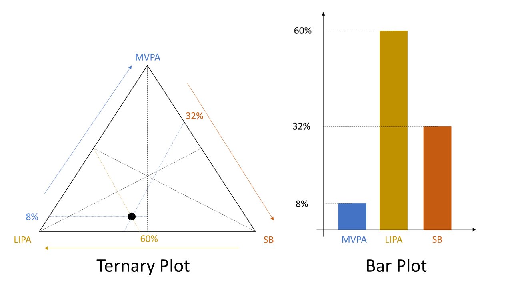
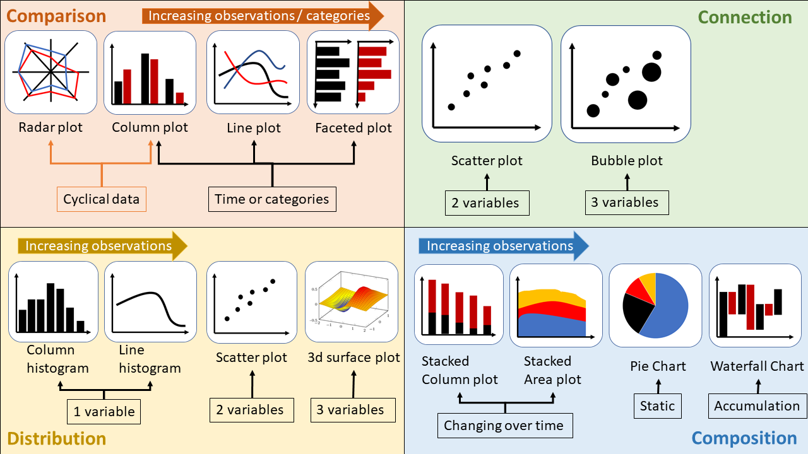

  
```{r setup, include=FALSE}
knitr::opts_chunk$set(echo = TRUE, fig.align = 'center')
```

# Learning Objectives<br>

* Understand which types of chart are best for categorical and continuous data
* Understand which types of chart are best for 1, 2, 3 and n variables

**Duration - 2 hours**<br>
  
<i>"This is my favourite part about analytics: Taking boring flat data and bringing it to life through visualization."</i><br>
 - John Tukey

This is a brief lesson, looking at choosing what type of plot to make. 

First consider the purpose of the chart.

* You've analysed your data. 
* You understand it. 
* You know the trends and patterns that are present in the data.

You shouldn't be designing a new visualisation technique for every problem. There are a huge range of plot types readily available to you that are highly effective. Sometimes you want something custom built, but novelty for its own sake is bad - using established forms makes communication easier, 

i.e. most people can already read a scatter plot or a bar chart, but if you show them a ternary plot you'll need to spend a minute explaining how to read the axes.



Having a huge range of plot types implies an obvious supplementary question though - which to use? To answer that, you need to know what your story is. What do you want to tell your audience?

There are four classic categories of message:

Comparison

* Compare different variables, e.g. revenue by product line or branch
* Compare the same item over time, e.g. monthly revenue over the year 

Connection

* Show a connection between two or more continuous variables, e.g. correlation between total sales and sales incentives

Composition

* Show the parts of a whole, e.g. proportion of revenue by product line
* Show how the parts of a whole change over time, e.g. proportion of revenue by product line each month over the year 

Distribution

* Show the relative frequency of the possible outcomes, e.g. statistical distribution of monthly sales


More practically, how many variables does your message require you to show, and what type of variables are they (quantitative, categorical, or ordinal)? How many data points do you want to display?

The illustration below is intended as an aid to thinking, but it's far from the last word.



# General Advice

* Title your graphs, and clearly label your axes - make sure the viewer knows what they are evaluating.

* Eliminate distracting elements (i.e. chart junk) - allow your viewers to focus on the data.

* Don't eliminate too much white space from your graph - it can make your graph look crowded and busy.

* If you are showing a composition, make sure your totals are correct - it's obvious but easy to overlook.

Now let's consider each purpose in more detail.

# Four categories

## Comparison

Here the goal is to contrast different values between categories or time points.

This naturally points to bar or column charts.

These are great for comparing a small number of quantitative variables between a small number of categories or time points. The bars give a strong and immediate impression of relative size, but people's ability to process pre-attentive attributes is limited - show too many comparisons and the effect is undermined.

If there are too many points to represent, or too many categories to make comparisons natural, then we typically turn to line graphs.

These are particularly suited to time points where the line is naturally suggestive of progression from left to right.

However most line charts become confusing beyond 6-8 lines except in unusual circumstances. In this event, we may need to consider faceting our data over multiple subplots.

Lastly, if our data is naturally cyclical (e.g. angle, months/seasons of the year, etc.) then it's worth considering a radar plot, although if there are too many time points a bar plot may be easier to read. 

<blockquote class='task'>
**Task - 10 mins** 
  
Create a suitable plot for the following three datasets:

* `late_deliveries`
* `recovery_times`
* `fitness_levels`
  
```{r, message=FALSE}
library(ggplot2)
library(CodeClanData)

# All answers here are just suggestions - you may have better answers!
```

```{r}
ggplot(late_deliveries) +
  aes(x = date, y = late_deliveries) +
  geom_line() + 
  geom_point() + 
  labs(x = "year", y = "number of late deliveries") + 
  theme_minimal()
```

```{r}
library(ggthemes)
ggplot(recovery_times) +
  aes(x = treatment_group, y = recovery, fill = prognosis) +
  geom_col(position = "dodge") + 
  labs(x = "\n Treatment Group", y = "Recovery time (months) \n") + 
    scale_fill_colorblind()
```

```{r}

head(fitness_levels)
```
```{r}
ggplot(fitness_levels) +
  aes(x = age, y = fitness_score, group = child, color = child) +
  geom_line() +
  geom_point() +
  facet_wrap(~ group, ncol = 5) + 
  labs(y = "fitness score \n", x = "\n age (years)", title = "Individual child fitness score by Group") + 
  scale_colour_hue(guide = guide_legend(nrow = 10, byrow = TRUE))
```

</details>
</blockquote>

## Connection

Here the objective is to identify the relationship (commonly correlation) between two or three continuous variables.

This is the purpose scatter plots were designed for. 

We can supplement the scatter plot with size or colour aesthetics to show a third dimension, but the effectiveness of this for continuous variables can be uncertain - too many colours can be difficult to make sense of, and sizes are hard to compare. 

If you want to include a categorical variable as your third, this is more hopeful, although if you have too many categories it can run into the same issues.

<blockquote class='task'>
**Task - 10 mins** 
  
Choose a suitable plot for the following datasets:

* `blood_pressure`
* `car_use`  


```{r}
ggplot(blood_pressure) +
  aes(
    x = daily_saturated_fat_intake_mg,
    y = systolic_blood_pressure_mm_hg
  ) +
  geom_point() + 
  labs(x = "daily fat intake (mg)", y = "systolic blood pressure (mmHg)")
```

```{r}
ggplot(car_use) +
  aes(
    x = car_use_percent,
    y = air_so2_concentration_ppm,
    size = population
  ) +
  geom_point(alpha = 0.5) + 
  labs(x = "car use (%)", y = "air CO2 concentration (ppm)")
```

</blockquote>


## Distribution

Here the goal is to show the range of outcomes arising in a dataset and the probabilities associated with these outcomes, i.e. a statistical distribution.

The classic approach for a single variable is to create a column or line histogram, showing counts (or frequency) falling in a series of intervals (also called bins). 

For two variables, we typically revert to the scatter plot.

If we want to show three variables, we have recourse to a 3d surface plot, but there is an inevitable loss of information in representing three dimensions on a flat drawing. Contour plots or heat maps provide an alternative.

<blockquote class='task'>
**Task - 10 mins** 

Plot the following two datasets.
  
* `d20_outcomes`  
* `d20x5_outcomes`  
  
```{r}
ggplot(d20_outcomes) +
  aes(x = outcome) +
  geom_histogram(bins = 20, col = "white") 
```

```{r}
ggplot(d20_outcomes) +
  aes(x = outcome) +
  geom_density()
```

</blockquote>

## Composition

Here the goal is to show how the parts of a whole relate to each other, or how they alter over time.

Be conscious whether you're interest in the shape of the composition (relative size of the parts) or if the level of the composition (absolute size) is also of interest. In the former case, you will usually scale the parts to percentages of the whole. In the latter case you'll usually retain the original units.

If you're only looking at a single composition, a pie chart is fine. 

If you want to compare multiple compositions, then a stacked bar chart is probably better suited to the purpose (lengths are easier to compare than angles).

If you are looking at the evolution of a composition over time then a stacked bar chart is also fine for a small number of time points, but if you have a large number of time points a stacked area chart may be more appropriate. 

Lastly if you want to look at an accumulation (e.g. a series of debits and credits applied to an opening balance) then a waterfall chart is a standard way of representing this.

<blockquote class='task'>
**Task - 10 mins** 

Make plots to display the data in:

* `pension_surplus`
* `pension_liabilities`

```{r}
ggplot(pension_surplus) +
  aes(x = item, y = balance, fill = balance > 0) +
  geom_col() +
  theme(axis.text.x = element_text(angle = 90, hjust = 1)) + 
  coord_flip() 
```

```{r}
ggplot(pension_liabilities) +
  aes(x = year, y = liability_millions, fill = liability_type) +
  geom_col() + 
  scale_fill_colorblind()
```

</blockquote>

# Extension

Can you go though the plots above and clean them up to be presentation worthy?

* Change the coordinates and scales
* Change the colours 
* Add labels
* Change the theme

# Recap
  
* How do we choose a plot type?

<details>

<summary>**Answer**</summary>

Consider the message you want to communicate, the data types, and the size of your data (and potentially the number of categories / time points).

The final choice will depend on the particular dataset, but a useful guide is shown below.


</details>


<hr>  

# Additional Resources

Links of where else to look

* [Choosing the right visualisation - an alternative flowchart](https://extremepresentation.com/wp-content/uploads/choosing-a-good-chart-09-1.pdf)
* [More advice on charts](https://infogram.com/page/choose-the-right-chart-data-visualization)
* [Introduction to PCA and Biplots](https://bookdown.org/danieljcarter/socepi/beer-example.html)
* [plotly - 3d surface plots](https://plot.ly/r/3d-surface-plots/)
