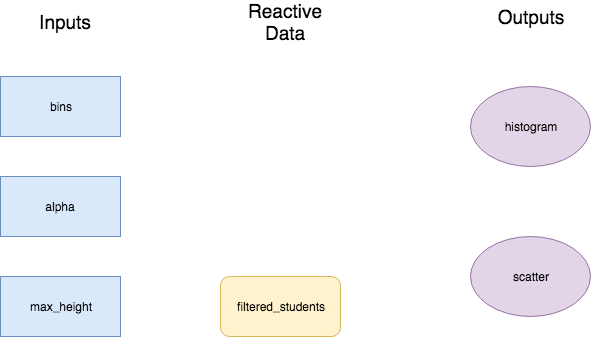
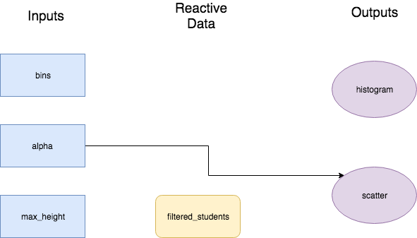
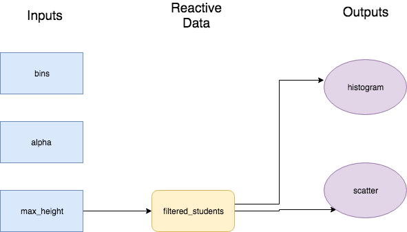

<div class="blame">
author: "Mhairi McNeill"<br>
date: "24/06/2019"
</div>

```{r setup, include=FALSE}
knitr::opts_chunk$set(echo = TRUE, fig.align = 'center')
```

# Learning Objectives<br>

* Know about other types of output in Shiny
* Understand and be able to work with reactivity

**Duration - 2 hours**<br>

In this lesson we're going to go deeper into what can be done in the server. 

Let's start by loading all the libraries we'll need

```{r, message = FALSE, warning = FALSE}
library(ggplot2)
library(shiny)
library(CodeClanData)
library(dplyr)
```

# Other types of output

So far we've only seen examples of plot outputs using `plotOutput` in the UI and `renderPlot` in the server. However, plots of other outputs are available. 

## `textOutput`

One of the most basic outputs in `textOutput`. It directly prints out text in the UI.

It has to be combined with `renderText` in the server. Inside `renderText`, you need to write code that returns a one element character vector.

```{r}
ui <- fluidPage(
  
  radioButtons('text_select',
    'What text do you want to see?',
    choices = c("Cat", "Dog")),
  
  textOutput("text_output")
)

server <- function(input, output) {
  
  output$text_output <- renderText({
    if (input$text_select == "Cat"){
      return("Cats are the best!")
    } else{
      return("Dogs are the best!")
    }
  })
}

shinyApp(ui = ui, server = server)
```

## `tableOutput`

Apart from plots, the other main type of output you will have in your applications are tables. 

For basic, simple tables you can use `tableOutput`, pared with `renderTable` in the server.  Inside `renderTable` you'll need to write code that returns a data frame.

```{r}
ui <- fluidPage(
  
  radioButtons('gender',
    'Male or Female Dogs?',
    choices = c("Male", "Female")),
  
  tableOutput("table_output")
)

server <- function(input, output) {
  
  output$table_output <- renderTable({
    nyc_dogs %>%
      filter(gender == input$gender) %>%
      slice(1:10)
  })
}

shinyApp(ui = ui, server = server)
```

## `DT::dataTableOutput`

If you have data that is in any way complicated, a *data table* output might be more suitable.

This gives features like pagination, sorting and searching by default.

To make this output can use the `dataTableOutput` in the UI and `renderDataTable` in server, both from the DT package.

DataTable has lots of customisable features (such as the number of rows in the table, removing the filter etc., for more information on these visit https://shiny.rstudio.com/gallery/datatables-options.html.  


Note: Both shiny and DT packages have functions named `dataTableOutput` and `renderDataTable`, but the DT version supports additional features so we recommend using this one. To avoid issues with the order which you load in `DT` and `shiny` package overwriting the dataTable functions would recommend to get into thr habit of writing `DT::dataTableOutput` and `DT::renderDataTable`.

```{r}
ui <- fluidPage(
  
  radioButtons('gender',
    'Male or Female Dogs?',
    choices = c("Male", "Female")),
  
  DT::dataTableOutput("table_output")
)

server <- function(input, output) {
  
  output$table_output <- DT::renderDataTable({
    nyc_dogs %>%
      filter(gender == input$gender) 
  })
}

shinyApp(ui = ui, server = server)
```

## Other outputs

There's a small selection of other output options available in Shiny. Look up the help files for any of these to find out more.

| UI                 | Output    |
|--------------------|-----------|
| htmlOutput         | raw HTML  |
| imageOutput        | image     |
| plotOutput         | plot      |
| tableOutput        | table     |
| textOutput         | text      |
| uiOutput           | raw HTML  |
| verbatimTextOutput | text      |

Many packages extend Shiny and allow you to do other custom visualisations. Generally these packages have their own input and output functions, that follow the pattern you've seen so far.

<blockquote class='task'>
**Task - 10 mins** 

Add three drop down selectors to the app above that let you filter the data based on:

1. Dog colour
2. Borough
3. Dog breed

Extension: use one of the layouts from the last lesson to lay the buttons out more neatly.

<details>
<summary>**Answer**</summary>

```{r}
ui <- fluidPage(
  
  fluidRow(
    column(3,
      radioButtons('gender',
        'Male or Female Dogs?',
        choices = c("Male", "Female"))
    ),
    
    column(3,
        selectInput("colour",
        "Which colour?",
        choices = unique(nyc_dogs$colour))
    ),
    
    column(3,
          selectInput("borough",
          "Which Borough?",
          choices = unique(nyc_dogs$borough))  
    ),
    
    column(3,
          selectInput("breed",
          "Which Breed?",
          choices = unique(nyc_dogs$breed))
    )
  ),
  
  tableOutput("table_output")
  
)

server <- function(input, output) {
  
  
  output$table_output <- renderTable({
    nyc_dogs %>%
      filter(gender == input$gender)  %>%
      filter(colour == input$colour) %>%
      filter(borough == input$borough) %>%
      filter(breed == input$breed)
  })
}

shinyApp(ui = ui, server = server)
```

</details>
</blockquote>

# Reactivity 

Reactivity is a very important concept in Shiny. As soon as you start writing code that can be used interactively, it becomes harder to think about the state of that code and to write the code in an efficient manner.

In this section, you will learn how to control how the inputs affect which code is run.

## `reactive`

Take a look at the app below, in particular look at the server function. Is there anything you notice that is redundant?

```{r}
ui <- fluidPage(
  
  fluidRow(
    column(6,
      radioButtons('gender',
        'Male or Female Dogs?',
        choices = c("Male", "Female"))
    ),
    
    column(6,
          selectInput("breed",
          "Which Breed?",
          choices = unique(nyc_dogs$breed))
    )
  ),
  
  fluidRow(
    
    column(6,
           
      plotOutput("colour_barchart")
               
    ),
    
    column(6,
           
      plotOutput("borough_barchart")
           
    )
      
  )
)

server <- function(input, output) {
  
  output$colour_barchart <- renderPlot({
   nyc_dogs %>%
      filter(gender == input$gender)  %>%
      filter(breed == input$breed) %>%
    ggplot +
      geom_bar(aes(x = colour)) 
  })
  
  
  output$borough_barchart <- renderPlot({
   nyc_dogs %>%
      filter(gender == input$gender)  %>%
      filter(breed == input$breed) %>%
    ggplot +
      geom_bar(aes(x = borough)) 
  })
}

shinyApp(ui = ui, server = server)
```

We're doing the same calculations twice - once for each plot. 

This is okay for a small app like this. But what if you are trying to work with a big dataset, or do very complicated questions? Also, this isn't following our DRY principal.

Surely we can rewrite this in a more efficient way, so that we only calculate the data once. Try replacing the server with this server below:


```{r, eval = FALSE}
server <- function(input, output) {
  
  filtered_data <- 
    nyc_dogs %>%
      filter(gender == input$gender)  %>%
      filter(breed == input$breed)

  
  output$colour_barchart <- renderPlot({
    ggplot(filtered_data) +
      geom_bar(aes(x = colour))
  })
  
  
  output$borough_barchart <- renderPlot({
    ggplot(filtered_data) +
      geom_bar(aes(x = borough)) 
  })
}

shinyApp(ui = ui, server = server)
```

But this just gives an error:

*Operation not allowed without an active reactive context. (You tried to do something that can only be done from inside a reactive expression or observer.)*

We can't use our inputs in regular R code. They can only work inside functions like `renderPlot` or `renderTable`. That's because those are *reactive contexts* i.e. those are places in the code where we are expecting interactivity.

However, this problem is easily fixable. We can use the function `reactive`, to create a reactive context. Anything inside `reactive` can work with inputs and outputs, just like `renderPlot`, `renderTable`, `renderText` etc.

If you define a variable to have a reactive value, then when you call that value you need to use brackets afterwards. In this example we need to use `filtered_data()` not `filtered_data`.

Now we can rewrite our server.

```{r}
server <- function(input, output) {
  
  filtered_data <- reactive({
     nyc_dogs %>%
      filter(gender == input$gender)  %>%
      filter(breed == input$breed)
  })
  
  output$colour_barchart <- renderPlot({
    ggplot(filtered_data()) +
      geom_bar(aes(x = colour))
  })
  
  
  output$borough_barchart <- renderPlot({
    ggplot(filtered_data()) +
      geom_bar(aes(x = borough)) 
  })
}

shinyApp(ui = ui, server = server)
```

Now we've written code that is more efficient to read, write and execute.

## `eventReactive`

### Shiny only updates what it needs to

When you change any input value in the app, Shiny will go though and update the value of everything inside `renderPlot`, `renderTable`, `renderText` etc that uses that input value. If an output does not use a input value, then it will not be updated.

For example, look at the app below. There are three sliders

* The number of bins, which effects the histogram
* The alpha of points, which effects the scatter plot
* The maximum height, which effects both plots

Each of the first two sliders only controls one plot, so each input only refreshes one plot. This is good, because it's an efficient way of working.

```{r}
ui <- fluidPage(
  
  fluidRow(
    column(4,
      sliderInput("bins", 
                  "Number of Bins",
                  min = 1, max = 100, value = 30)
    ),
    
    column(4,
      sliderInput("alpha",
          "Alpha of Points",
          min = 0, max = 1, value = 0.8)
    ),
    
    column(4,
      sliderInput("max_height",
          "Maximum Height to Plot",
          min = min(students_big$height),
          max = max(students_big$height), 
          value = max(students_big$height))
    )
  ),
  
  fluidRow(
    
    column(6,
           
      plotOutput("histogram")
               
    ),
    
    column(6,
           
      plotOutput("scatter")
           
    )
      
  )
)

server <- function(input, output) {
  
  students_filtered <- reactive({
    
    students_big %>%
      filter(height <= input$max_height)
    
  })
  
  output$histogram <- renderPlot({
    
    ggplot(students_filtered()) +
      aes(x = height) +
      geom_histogram(bins = input$bins)
    
  })
  
  
  output$scatter <- renderPlot({
    
    ggplot(students_filtered()) +
      aes(x = height, y = arm_span) +
      geom_point(alpha = input$alpha)
    
  })
}

shinyApp(ui = ui, server = server)
```

We can understand this app as a diagram, with three types of notes in it: inputs, reactive data, and outputs.



When we change `bins`, this only effects the histogram so, only the histogram is updated.


And when we update `alpha` this only effects the scatter plot, so only the scatter plot changes.



### Updating cascades

What happens when we update `max_height`?

This behaviour cascades down, so an output that depends on a reactive expression will only update if the reactive expression also is updated.

So the last slider only effects `students_filtered`, but since both plots depend on `students_filtered` they will both be updated.



This cascading can happen as many levels deep as needed: you may have outputs, that depend on reactive data, which in turn depends on different reactive data, which depends on the outputs.

### Using `eventReactive` to control this updating

Sometimes we want more control of how this updating happens.

We can think of using `reactive` as telling R: also update this bit of code, as well as everything else that you are going to update. 

There's on opposite to this do, a function that says: even though this depends on the input, don't update. Or at least, don't update until I say so. This is `eventReactive`. 

The second argument works just like `reactive`, and gives you a reactive piece of code, but this only triggers if the first argument is changed. This is particularly useful when combined with `actionButton`: an input whose value increases by one every time you press it.

In the last exercise you made a table that was controlled by 4 inputs. You might have found the table constantly being refreshed annoying:

```{r, echo = FALSE}
ui <- fluidPage(
  
  fluidRow(
    column(3,
      radioButtons('gender',
        'Male or Female Dogs?',
        choices = c("Male", "Female"))
    ),
    
    column(3,
        selectInput("colour",
        "Which colour?",
        choices = unique(nyc_dogs$colour))
    ),
    
    column(3,
          selectInput("borough",
          "Which Borough?",
          choices = unique(nyc_dogs$borough))  
    ),
    
    column(3,
          selectInput("breed",
          "Which Breed?",
          choices = unique(nyc_dogs$breed))
    )
  ),
  
  tableOutput("table_output")
  
)

server <- function(input, output) {
  
  
  output$table_output <- renderTable({
    nyc_dogs %>%
      filter(gender == input$gender)  %>%
      filter(colour == input$colour) %>%
      filter(borough == input$borough) %>%
      filter(breed == input$breed)
  })
}

shinyApp(ui = ui, server = server)
```

We can fix this by adding an `actionButton` and `eventReactive`. 

```{r}
ui <- fluidPage(
  
  fluidRow(
    column(3,
      radioButtons('gender',
        'Male or Female Dogs?',
        choices = c("Male", "Female"))
    ),
    
    column(3,
        selectInput("colour",
        "Which colour?",
        choices = unique(nyc_dogs$colour))
    ),
    
    column(3,
          selectInput("borough",
          "Which Borough?",
          choices = unique(nyc_dogs$borough))  
    ),
    
    column(3,
          selectInput("breed",
          "Which Breed?",
          choices = unique(nyc_dogs$breed))
    )
    
  ),
  
  actionButton("update", "Find dogs!"),
  
  tableOutput("table_output")
  
)

server <- function(input, output) {
  
  dog_data <- eventReactive(input$update,{
    
    nyc_dogs %>%
      filter(gender == input$gender)  %>%
      filter(colour == input$colour) %>%
      filter(borough == input$borough) %>%
      filter(breed == input$breed) %>%
      slice(1:10)
    
  })
  
  output$table_output <- renderTable({
    dog_data()
  })
}

shinyApp(ui = ui, server = server)
```

<blockquote class ='task'>
**Task 5 mins**

Update the app with the scatter plot and the histogram, so that the plots only update to a change in `max_height` when a button is pressed. 

<summary>**Answer**</summary>
<details>
```{r}
ui <- fluidPage(
  
  fluidRow(
    column(3,
      sliderInput("bins", 
                  "Number of Bins",
                  min = 1, max = 100, value = 30)
    ),
    
    column(3,
      sliderInput("alpha",
          "Alpha of Points",
          min = 0, max = 1, value = 0.8)
    ),
    
    column(3,
      sliderInput("max_height",
          "Maximum Height to Plot",
          min = min(students_big$height),
          max = max(students_big$height), 
          value = max(students_big$height))
    ),
    column(3,
      actionButton("update_height",
                   "Update Maximum Height in the plots")
    )
  ),
  
  fluidRow(
    
    column(6,
           
      plotOutput("histogram")
               
    ),
    
    column(6,
           
      plotOutput("scatter")
           
    )
      
  )
)

server <- function(input, output) {
  
  students_filtered <- eventReactive(input$update_height, {
    
    students_big %>%
      filter(height <= input$max_height)
    
  })
  
  output$histogram <- renderPlot({
    
    ggplot(students_filtered()) +
      aes(x = height) +
      geom_histogram(bins = input$bins)
    
  })
  
  
  output$scatter <- renderPlot({
    
    ggplot(students_filtered()) +
      aes(x = height, y = arm_span) +
      geom_point(alpha = input$alpha)
    
  })
}

shinyApp(ui = ui, server = server)
```
</details>

</blockquote>

<blockquote class='task'>
**Task - 15 mins** 

Take our Olympic Medals app from the first lesson and 

1. Add a table, which lists the counts of Gold, Silver and Bronze medals for the chosen team in the chosen season.

2. Use `reactive` to increase the efficiency of the app you've built.

3. Add an action button so the plots only update after you've clicked the button.

```{r, output = FALSE}
all_teams <- unique(olympics_overall_medals$team)

ui <- fluidPage(
  titlePanel("Olympic Medals"),

  sidebarLayout(
    sidebarPanel(
      radioButtons("season",
        "Summer or Winter Olympics?",
        choices = c("Summer", "Winter")
      ),

      selectInput("team",
        "Which Team?",
        choices = all_teams,
        selected = "Great Britain"
      )
    ),

    mainPanel(
      plotOutput("medal_plot")
    )
  )
)

server <- function(input, output) {
  output$medal_plot <- renderPlot({
    olympics_overall_medals %>%
      filter(team == input$team) %>%
      filter(season == input$season) %>%
      ggplot() +
      aes(x = medal, y = count, fill = medal) +
      geom_col()
  })
}

shinyApp(ui = ui, server = server)
```
<summary>**Answer**</summary>
<details>
```{r,}
all_teams <- unique(olympics_overall_medals$team)

ui <- fluidPage(
  titlePanel("Olympic Medals"),

  sidebarLayout(
    sidebarPanel(
      radioButtons("season",
        "Summer or Winter Olympics?",
        choices = c("Summer", "Winter")
      ),

      selectInput("team",
        "Which Team?",
        choices = all_teams,
        selected = "Great Britain"
      ),
      
      actionButton("update", "Show Medal Counts")
    ),

    mainPanel(
      fluidRow(
        column(8,
          plotOutput("medal_plot")
        ),

        column(4,
          tableOutput("medal_table")
        )
      )
    )
  )
)

server <- function(input, output) {
  
  filtered_data <- eventReactive(input$update, {
     olympics_overall_medals %>%
      filter(team == input$team) %>%
      filter(season == input$season)
  })
  
  output$medal_plot <- renderPlot({
      ggplot(filtered_data()) +
        aes(x = medal, y = count, fill = medal) +
        geom_col()
  })
  
  output$medal_table <- renderTable(filtered_data())
  
}

shinyApp(ui = ui, server = server)
```

</details>
</blockquote>

<hr>

# Recap

What pattern is used for function names in the UI and the server that create other types of output?
<details>
<summary>**Answer**</summary>
* `*Output` and `render*`
</details>

What does the function `reactive` do?
<details>
<summary>**Answer**</summary>
The code inside `reactive` can now depend on inputs.
</details>

What will be updated in the app when an input is changed?
<details>
<summary>**Answer**</summary>
Any reactive expressions that depend on the input *and* any reactive expressions that depend on reactive expressions that are changed by the input, and so on.
</details>

What does the function `eventReactive` do?
<details>
<summary>**Answer**</summary>
The second argument isn't updated until the first argument changes.
</details>

<hr>

# Additional Resources

More on reactivity: https://shiny.rstudio.com/articles/reactivity-overview.html


