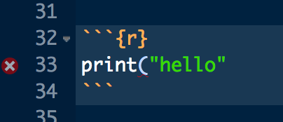
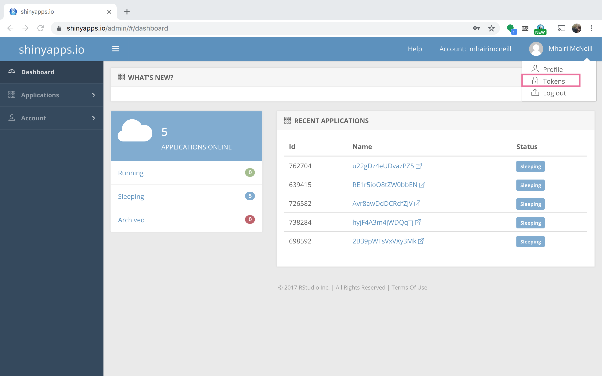
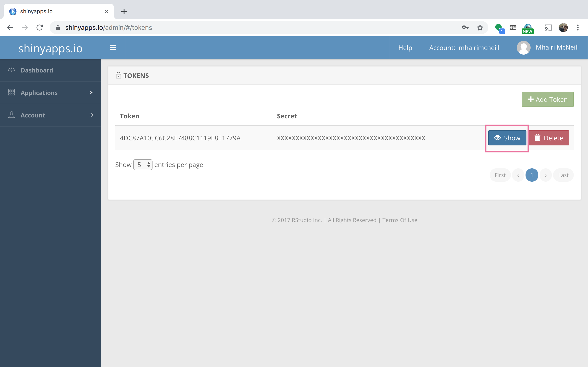
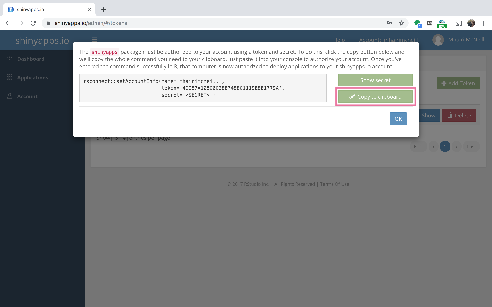
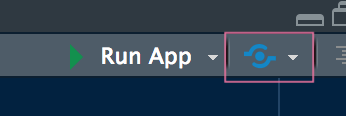

<div class="blame">
author: "Mhairi McNeill"<br>
date: "24/06/2019"
</div>

```{r setup, include=FALSE}
knitr::opts_chunk$set(echo = TRUE, fig.align = 'center')
```

# Learning Objectives<br>

* Learn about debugging Shiny applications
* Be aware of HTML widgets
* Know how to publish apps on shinyapps.io
* Learn some tips for writing Shiny apps more easily

**Duration - 1 hour**<br>

# Debugging

## Use RStudio's features

There's two main features you can use that help write working shiny code. First of all, check for the small x that appear on the left hand side on your code window. 

This indicates a syntax error, if you hover over RStudio will tell you what type of syntax error.



This will help you find where you might have gone wrong. However, there might be more work involved. Since RStudio isn't sure what you were *trying* to do, it might not put the error in the right place. You then might need to select brackets to make sure they match up.

## Debugging with `browser()`

To understand what is happening with your code at any point, you can place a `browser()` call. Once the code reaches this point, it will stop running and you can inspect all the objects that exist at this point, as well as run R code using those objects. This is similar to using `debug` to debug a function.

This works better than `print`, because you can explore the objects interactively. However, you will still need to remember to remove `browser` calls after you've finished using them.

<blockquote class='task'>
**Task - 10 mins** 

Find and fix the errors in this Shiny app. You'll need to use the syntax checker in RStudio and `browser`.

```{r, eval = FALSE}
library(CodeClanData)
library(ggplot2)
library(dplyr)
library(shiny)

ui <- fluidPage(
  sliderInput("sample_size", "Sample Size", value = 50, min = 1, max = 912),
  plotOutput("histogram")
)

server <- function(input, output) {
  
  sampled_data <- reactive({
    students_big %>%
      select(handed) %>%
      sample_n(input$sample_size) 
  )
  
  output$histogram <- renderPlot({
    
    ggplot(sampled_data) +
      aes(x = height) +
      geom_histogram()
    
  })
}

shinyApp(ui, server)
```

<details>
<summary>**Answer**</summary>


```{r}
library(CodeClanData)
library(ggplot2)
library(dplyr)
library(shiny)

ui <- fluidPage(
  sliderInput("sample_size", "Sample Size", value = 50, min = 1, max = 912),
  plotOutput("histogram")
)

server <- function(input, output) {
  
  sampled_data <- reactive({
    students_big %>%
      select(height) %>%
      sample_n(input$sample_size) 
  })
  
  output$histogram <- renderPlot({
    
    ggplot(sampled_data()) +
      aes(x = height) +
      geom_histogram()
    
  })
}

shinyApp(ui, server)
```

The following problems are fixed:

* Missing curly bracket in server
* Height missing from the dataset in sampled data
* Missing brackets when using `sampled_data`

</details>
</blockquote>


# HTML Widgets

More complicated interactive visualisations can't be done with pure R code. Luckily the series of libraries that use htmlwidgets make it easy to include certain types of JavaScript plots in shiny apps.

You can see the range of HTML widget libraries here: https://www.htmlwidgets.org/showcase_leaflet.html

We're only going to see a couple examples in class. However, the pattern these libraries always follow is the same:

1. You'll need to install a new library.
2. Create the visualisation you want.
3. Include it in your app using a specified `render*` and `*Output` functions.


## Leaflet

Leaflet is a very popular JavaScript library for making interactive maps. It's also got an R version, that's very well documented. For more information see here: http://rstudio.github.io/leaflet/

Install it from CRAN.

```{r, eval = FALSE}
install.packages("leaflet")
```

You create a map by including the data in the `leaflet` function, adding some map tile-set, and then adding elements to the map. Here's an example with circle markers at our whisky distillery spots. You describe which variable has the data needed by using `~`. 

```{r}
library(leaflet)

leaflet(whisky) %>% 
  addTiles() %>%
  addCircleMarkers(lat = ~Longitude, lng = ~Latitude, popup = ~Distillery)

# Note that latitude and longitude are the wrong way around in the dataset
```

Now we can include this information in a Shiny app, using the functions `renderLeaflet` and `leafletOutput`. Inside `renderLeaflet` you can use any shiny inputs.

```{r}
ui <- fluidPage(
  selectInput("region", "Which Region?", unique(whisky$Region)),
  leafletOutput("map")
)

server <- function(input, output) {
  
  output$map <- renderLeaflet({
    
    whisky %>% 
      filter(Region == input$region) %>%
      leaflet() %>% 
      addTiles() %>%
      addCircleMarkers(lat = ~Longitude, lng = ~Latitude, popup = ~Distillery)
    
  })
}

shinyApp(ui, server)
```


<blockquote class='task'>
**Task - 10 mins** 

Create an application which makes a line graph for the time series `austres` using the `dygraphs` library. You'll need to read the documentation here: http://rstudio.github.io/dygraphs/. No need to include any inputs. 

<details>
<summary>**Answer**</summary>

```{r}
library(dygraphs)

ui <- fluidPage(
  dygraphOutput("line_graph")
)

server <- function(input, output) {
  
  output$line_graph <- renderDygraph({
    dygraph(austres, main = "Australian Residents") 
  })
  
}

shinyApp(ui, server)
```
</details>
</blockquote>


# Publishing shiny apps

If you want other people to see your Shiny Apps, you'll need to publish them. Since Shiny apps just use R code, you can always share an app with someone just by sending them the whole project. However, if you want to share your app with someone who is not using R, then you've got a few options.

## shinyapps.io

The site shinyapps.io let's you host a limited number of Shiny applications online for free. Note all apps are public on the free version. If you are working with private data do not publish on Shiny apps!

Note that all apps on the free version of Shiny apps are public. If the data in your project is sensitive, do not host your app on shinyapps!

1. Go to shinyapps.io and sign up for their basic plan.

2. Install the package 'rsconnect'

3. Inside your shiny apps account, find the your token, and copy it.

a. First Click "Tokens" in the top left corner



b. Then select "Show"



c. Finally, click "Copy to Clipboard"



4. Paste the code that you've just copied into the console in RStudio.

5. Now that you've connected your account, you can deploy an application. 

a. Select any application that we've made so far.

b. Run it to check that it's working

c. Click the publish button (blue circle with two lines around it, next to run).



d. Give the app a title, and click "Publish".

e. After some work your app should be uploaded and will appear in the browser. You will always be able to access it at the link.

## Hosting on your own server

You can also run your own Shiny server, using the Open Source edition of Shiny Server. For more information see here: https://www.rstudio.com/products/shiny/shiny-server/

# A suggested work flow

## Draw a sketch of your finished app

Start with a quick drawing of the finished application. Normally this is just a series of boxes showing all the inputs and outputs. It's also a good idea to decide the names of those inputs and outputs now. 

## Write all your R code and design all your plots first. 

A big disadvantage of Shiny is that when things go wrong it can be hard to debug. So we recommend writing out all the R code you are going to use in the application first. You might want to have all your inputs at the top of the file set to some value like this:

```{r, eval = FALSE}
n_apples <- 5
date     <- '2016-05-03'
```

## Start with ui.R

For larger apps, we'd recommend writing your UI and server code in separate files. See here for more information: https://shiny.rstudio.com/articles/two-file.html

Generally, ui.R is the harder of the two files to create. It can be a good idea to write the whole of ui.R with only a skeleton server.R. Even with nothing in server.R you can still run the app and get an idea of the layout and check for syntax errors. It can be hard to "switch" your brain between thinking about layout and content.

Also, be scrupulous about getting all the indention correct, particularly matching the indentation level of opening and closing brackets. 

You may want to follow a naming convention for inputs and outputs when creating ui.R  e.g. if you have multiple tabs may have started all inputs/outputs for a tab to do with finance `"finance_input_name"` Or you might want to number the tabs and then have sections within the tabs e.g for an input in section 2.1 would be `"2.1_input_name"`.

## Add code to shiny.R

Use lots of structuring comments in shiny.R, so that you can easily find the piece of code that relates to a piece of the UI. For larger projects it's also a good idea to keep code across many files.  Remember to add brackets to objects that are now reactive, and `input$` to all the inputs. 

We would recommend having as little R code in `shiny.R` as possible. Keep everything in separate files and `source` them in.


## Refine and iterate

Although you have drawn a plan at the start the finished app almost never looks like that. You may need to go though a few iterations to get the app how you like. 

Avoid adding custom formatting until you are happy with the layout and the content of the application. Particularly if you are working with a client get them to sign off before doing any time-consuming tweaking. 


<hr>

# Recap

* What are the two debugging strategies we discussed today?
<details>
<summary>**Answer**</summary>
Using RStudio's syntax checker and using `debug`
</details>

* What form to the functions you use in the server and the UI take for using HTML widgets in a shiny app?
<details>
<summary>**Answer**</summary>
`render*` and `*Output`
</details>

* Give three options for sharing a Shiny app
<details>
<summary>**Answer**</summary>
Sharing the code, hosting on shinyapps.io and hosting on your own server
</details>
<hr>

# Additional Resources

Two file applications: https://shiny.rstudio.com/articles/two-file.html

More information on debugging: https://shiny.rstudio.com/articles/debugging.html

You can see the range of HTML widget libraries here: https://www.htmlwidgets.org/showcase_leaflet.html

Leaflet in R documentation http://rstudio.github.io/leaflet/

Dygraph documentation: http://rstudio.github.io/dygraphs/

Two links with more info on shinyapps.io
- https://shiny.rstudio.com/articles/shinyapps.html
- https://docs.rstudio.com/shinyapps.io/getting-started.html

More on Shiny Server: https://www.rstudio.com/products/shiny/shiny-server/
