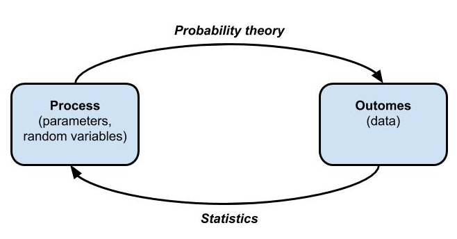

```{r setup, include=FALSE}
knitr::opts_chunk$set(echo = TRUE, fig.align = 'center')
```

# Learning Objectives

* Recognise what is meant by the terms probability and statistics
* Be able to demonstrate an understanding of core probability concepts
* Know the mathematical properties of a probability

**Duration - 40 minutes**

<hr>

# Introduction

Why should you learn about probability theory as a data analyst? The main reason is the following:

<br>
<div class='emphasis'>
<center>Probability theory is the foundation of **statistical inference**</center>
</div>
<br>

OK, but what's so great about statistical inference?

<br>
<div class='emphasis'>
<center>Statistical inference is the technique by which we understand data subject to chance / randomness / noise. This is essentially **all data** in the world around us!</center>
</div>
<br>

Think of this as akin to building a house. Probability theory makes up the foundations of the house, statistics and data analysis are built on top of probability theory.


# Probability and statistics: the difference

Probability theory and statistics are related topics, but in a sense proceed in 'opposite directions' to each other. 


<br>
<div class='emphasis'>

Probability deals with predicting the likelihood of future events, while statistics involves the analysis of the frequency of past events.

* Probability: specifically deals with predicting the likelihood of events or observations in our data.   

* Statistics: allows us to take data we have and make some summaries of it, or allows us to make inferences about events or data that we don't have yet (based on what we do already have).       
</div>
<br>


```{r, echo=FALSE, fig.cap="**Fig. 1.** The relationship of probability to statistics", out.width = '60%'}

```
<br>

A common example used to explain the difference is to imagine you have a jar full of red and green jelly beans.

A probabilist starts by knowing the proportion of each type of jelly bean in the jar, and asks "Knowing what I have in the jar, what is the probability of drawing a red jelly bean from that jar". 
A statistician wouldn't necessary need to know the entire contents of the jar: they would take a sample of jelly beans from the jar, and then **infer** the proportion of red jelly beans from that sample.  


Let's consider another example: drawing and replacing a single marble from a bag containing these marbles:

<br>

| marble_colour | marble_count |
|---------------|--------------|
| red           | 4            |
| green         | 3            |
| blue          | 2            |
| violet        | 1            |

<br>


This distribution of marbles represents the *parameters* of the model, and the *random variable* `marble_colour` can take one of four values in this case: red, green, blue or violet.

**Probability theory** allows us to determine the expected frequencies of particular draws
    - e.g. that red should occur 40%, green 30%, blue 20%, and violet 10% of the time (for large numbers of draws). 
    
**Statistics** works in the *opposite* direction. Imagine we did not know the numbers of each colour of marble in the bag (i.e. the colour distribution). Instead, we have a set of samples: a set of data (i.e. *outcomes*) from a number of draws. Statistics allows us to *infer* the parameters of the model (i.e. the colour distribution of marbles in the bag) from the observed data. *Our confidence in this inference increases the more data we have to work with*.

Today we will be covering an introduction to probability before moving on to statistics later in the week. Let's begin!

# Why learn about probability?

Why is it important to learn about probability and statistics for data? When dealing with data, more often than not, we have a sample of data rather than all the data that exists in the world. Learning of probability helps you in making informed decisions about likelihood of events, based on a pattern of collected data you have. 

## Real life uses of probability theory 

* **Medical tests** - use conditional probabilities to take into account the chances of medical tests giving false positives/negatives depending on the accuracy of the test. 
* **Finance/gambling** - probabilities are used calculate risks and expected pay-offs from stocks and gambling bets. 
* **Predictive models** - probabilities are used in the cost benefit calculation in classification models (which we will cover in module 3). 
* **Retail** - association rules, which are based on probabilities, are used frequently in retail to find patterns in items that customers purchase together in order to target marketing to sell more items. We will look at this in this weekend's homework. 


# Core definitions in probability theory

Before getting into it more, it's useful to define some core definitions that are involved in probability theory.   

<br>
<div class='emphasis'>
**Probability** is a numerical measure of the likelihood of an outcome occurring, ranging from $1$ (the outcome is *certain*) to $0$ (the outcome is *impossible*). A probability of $0.5$ indicates that an outcome is as likely to occur as not. *This specific example is akin to someone saying something along the lines of "That has a 50-50 chance of happening"*.  
</div>
<br>

<div class='emphasis'>
An **experiment** is an observation of a process that can result in *one* of a range of defined outcomes. The outcome of the experiment cannot be predicted with certainty ahead of time. With regards to data, you can think of an "experiment" as you collecting data on something: perhaps you want to collect data on the number of times it rains in Edinburgh vs Glasgow. You don't know before you start what you'll end up with (i.e. you don't know what the outcome is), but you know you'll collect some data on `rainfall` across a period of `time` (your paramters).  <br>
</div>
<br>

<div class='emphasis'>
Each experiment has an associated **sample space** denoted $S$. A sample space is the set of all possible outcomes on an experiment (or in data's case, your data). The sample space is composed of individual **sample points** (also known as **simple outcomes**).
</div>
<br>

| Experiment              | Sample space                           | Example sample point |
|-------------------------|----------------------------------------|----------------------|
| toss a coin             | $S = \{H,T\}$                          | H                    |
| roll a die              | $S = \{1, 2, 3, 4, 5, 6\}$             | 3                    |
| inspect component       | $S = \{\textrm{faulty}, \textrm{ok}\}$ | ok                   |
| measure person's height | $S = \{ \textrm{1.75m, 1.82m, 1.77m, 1.69m}\}$   | 1.77m                |

<br>
The curly brackets in the table above indicate that the sample spaces for the respective experiments are each a mathematical **set**.

<div class='emphasis'>
A **set** is a well defined collection of *distinct* objects, e.g.

* $S_1 = \{\textrm{orange}, \textrm{apple}, \textrm{banana}, \textrm{toast},71\}$: this is a valid set, all objects are distinct.
* $S_2 = \{\textrm{orange}, \textrm{apple}, \textrm{banana}, \textrm{toast}, \textrm{toast},71\}$: this isn't a valid set. Even though toast is great, it's repeated, so $S_2$ is not valid. 

</div>
<br>

Now, here's the definition of an **event** in probability theory:

<div class='emphasis'>
An **event** is a **subset** of the sample space.
</div>
<br>

For example, let's take a dice rolling "experiment", and we want to know what the sample space for `rolling a four or higher` is. For this, you would have: 

<center>
 $S_{E}(number rolled > 4) = \{5, 6\}$  
</center>
<br>
which is a subset of the full sample space $S = \{1, 2, 3, 4, 5, 6\}$.<br> 

<br> 
*Note:$S_{E}$ denotes the set of events that satisfy our condition*     

What about the event `number rolled > 6`? Well, this is impossible on a regular six-sided die, so $S_{E}(n>6) = \{\} = \emptyset$, where the last symbol denotes the **empty set**, i.e. a space containing no outcomes.<br>

<br>
<blockquote class='task'>
**Task - 5 mins**
Two dice are rolled, leading to a sample space:  

<br>
<center>
$S_{\textrm{two-dice}} = \{(1,1), (1,2),(1,3),(1,4)...,(6,4),(6,5),(6,6)\}$. 
</center>
<br>

Write out the set of outcomes corresponding to the event that the total of the two dice is 7.

*Hint: You want to write out all possible combinations of dice rolls that would add up to 7*  

<br> 
<details>
<summary>**Solution**</summary> 

$S_E(\textrm{sum = 7})=\{(1,6),(2,5),(3,4),(4,3),(5,2),(6,1)\}$
<br>
</details>
</blockquote>

# The `prob` package

<br> 

Now we know the basic rules, let's have a go at working through an "experiment" in R. Let's explore the experimental sample space for rolling two dice and the event space for `sum equals 7` using the `prob` package in R. 

The `prob` package is a fantastic resource for learning probability theory: it has a range of functions like `tosscoin()`, `rolldie()`, `cards()` that set up sample spaces, and further functions for defining events and their spaces. Here, though, we'll limit our use of `prob` to setting up sample spaces, we'll then use `tidyverse` functions to manipulate these spaces. 


```{r message=FALSE}
library(prob)
library(tidyverse)
```

```{r echo=TRUE}
# sample space for roll of two dice
s_two_dice <- rolldie(2)
s_two_dice
```

<br> 
If you print this out, you will see all possible combinations of the two die rolls.   

Now we can look at how many possible combinations we have:   

```{r}
# how large is the sample space? 
s_two_dice %>%
  summarise(size_of_s = n())
```
<br> 

And finally, we can extract how many of our combos lead to a total of 7:   
<br>
```{r}
# event space for roll of a total of seven
s_sum_equals_seven <- s_two_dice %>%
  dplyr::filter(X1 + X2 == 7)

# how large is the event space?
s_sum_equals_seven %>%
  summarise(size_of_event_space = n())
```


<br> 
In the example above the sample space `s_two_dice` has two **random variables** $X1$ and $X2$, representing the numbers rolled on die $1$ and die $2$ respectively. We call these random variables in probability theory as we **don't know what values they'll take until we run the experiment** (i.e. roll the dice in this case).

Now say we want to define **our own** random variable $\textrm{total}$, which will contain the total of the two dice. Well, we know the `dplyr` wrangling verbs needed to make this happen!
<br> 

```{r}
s_two_dice <- s_two_dice %>%
  mutate(total = X1 + X2)
s_two_dice
```

Then we can use our new `total` random variable to define various event spaces:

```{r}
s_sum_equals_seven <- s_two_dice %>%
  dplyr::filter(total == 7)
s_sum_equals_seven

s_sum_greater_than_10 <- s_two_dice %>%
  dplyr::filter(total > 10)
s_sum_greater_than_10
```
<br>

<blockquote class='task'>
**Task - 5 mins**

Add your own random variable to `s_two_dice`, and then use your new random variable to define an event space. Some suggestions:

* random variable: `first_die_even`, event: `first_die_even == TRUE`
* random variable: `die2_minus_die1`, event: `die2_minus_die1 == -2`
* random variable: `differ_by_two`, event: `differ_by_two == FALSE`

<details>
<summary>**Solution**</summary>
```{r}
s_two_dice <- s_two_dice %>%
  mutate(first_die_even = X1 %% 2 == 0) %>%
  mutate(die2_minus_die1 = X2 - X1) %>%
  mutate(differ_by_two = abs(X1 - X2) == 2)
s_two_dice

s_first_die_is_even <- s_two_dice %>%
  dplyr::filter(first_die_even == TRUE)
s_first_die_is_even

s_die2_minus_die1_neg2 <- s_two_dice %>%
  dplyr::filter(die2_minus_die1 == -2)
s_die2_minus_die1_neg2

s_dice_dont_differ_by_2 <- s_two_dice %>%
  dplyr::filter(differ_by_two == FALSE)
s_dice_dont_differ_by_2
```
</blockquote>

# Recap

* Describe how probability and statistics are related.
<details>
<summary>**Answer**</summary>
  - Probability theory and statistics work in 'opposite directions' to each other. 
  - Given a random process governed by a set of parameters, probability theory lets us predict the distribution of outcomes of the process. 
  - Statistics starts a set of outcomes (i.e. observed data) and lets us 'infer' the parameters of the process that generated those outcomes.
</details>

<br>

* Define the following core concepts:
  - probability
  <details>
  <summary>**Answer**</summary>
  A numerical measure of the likelihood of an outcome occurring, ranging from $1$ (the outcome is *certain*) to $0$ (the outcome is *impossible*).
  </details>
  
  - experiment
  <details>
  <summary>**Answer**</summary>
  An observation of a process that can result in *one* of a range of defined outcomes. The outcome of the experiment cannot be predicted with certainty ahead of time.
  </details>
  
  - sample space and sample points (AKA simple outcomes)
  <details>
  <summary>**Answer**</summary>
  The sample space is the collection of all possible outcomes of the experiment. It's composed of individual **sample points** (also known as **simple outcomes**)
  </details>
  
  - event
  <details>
  <summary>**Answer**</summary>
  A **subset** of the sample space defined by setting a condition on the outcomes.
  </details>


