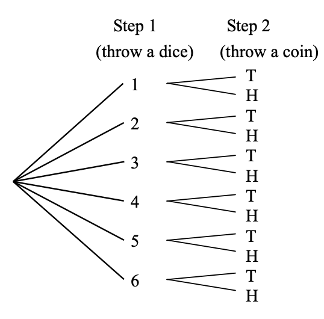

```{r setup, include=FALSE}
knitr::opts_chunk$set(echo = TRUE, fig.align = 'center')
```

# Learning Objectives

* Understand why counting rules are important in probability theory
* Know the counting rules for the following cases:
  - multiple step experiments
  - permutations
  - combinations
 
**Duration - 60 minutes**

# Definition and use

You've seen in the last lesson that a step towards figuring out the probability of an event involves a fair bit of counting. **A counting rule** is a way to figure out the number of outcomes in a probability problem. Sometimes these values can be difficult to calculate, as you have many combinations to consider: counting rules have been developed to deal with these situations. 

Counting rules are used in:

* encyrpton and cryptography 
* pattern analysis (e.g. in biology and studying languages)
* operational research 

# Single step experiments

Let's go back to our double die roll experiment. In this case, we throw some dice (just a single throw, only one set of parameters to consider, hence the single step), and want to know what the probability of a particular outcome is. In this case, **all outcomes are equally likely**, i.e. we have no control over how the die rolls - any combination of die faces are equally likely.   

**If all outcomes are equally likely**, the counting rule to work out probability is as follows: 

<br>
<div class='emphasis'>
$$\textrm{prob(event)} = \frac{\textrm{num(event outcomes)}}{\textrm{num(all outcomes)}} \; \; \; \; \; \textrm{}$$

</div>
<br>

Let's go back to our previous example which asked "how many possible combinations of die rolls total to 7" and fill in explicit values. 

```{r message=FALSE}
# set up the sample and event spaces again
library(prob)
library(tidyverse)

# get all possible combos of 2 die rolls
s <- rolldie(2)
size_s <- nrow(s)
size_s
```
 
 
```{r}
# find when the two separate die rolls total 7
total_seven <- s %>%
  dplyr::filter(X1 + X2 == 7)

# how many combos exist
size_total_seven <- nrow(total_seven)
size_total_seven
```

Now, using the equation above, we can work out the probability of getting a set of die rolls that total to 7:   
<br>

```{r}
prob_total_seven <- size_total_seven / size_s
prob_total_seven
```

And voila: we have our probability of rolling a total of 7 happening. This in some ways is the simplest counting rule we can come across. Now let's look at situations where we have more than a single "experiment".      


<hr>

# Multiple step experiments

In the example above, we've seen the counting rule for when we have a one-step experiment : we throw two die and get two values.   

A multiple step experiment is one where we have more than one step. For example, let's say you throw one die, see the result, and then flip a coin. 

```{r, echo=FALSE, fig.cap="", out.width = '80%'}

```

In this case, we need to consider the die throw, and then the coin throw. This changes the counting rule:    

<br>
<div class='emphasis'>
**Mathematical Notation** 

<br>

If an experiment can be visualised as a sequence of $N$ steps with $n_1$ possible outcomes on the first step, $n_2$ on the second, up to $n_N$ on the N-th step, then we simply multiply the numbers of outcomes at each step to get the total number of outcomes :
$$n(\textrm{total}) = n_1 \times n_2 \times ... \times n_N$$
</div>
<br>


<br>
 


<blockquote class='task'>

Let's take the experiment above and calculate how many outcomes this experiment has using the rule above.  

* Step 1 consists of rolling the die, this can result in 6 possible distinct outcomes, $n_1 = 6$  
* Step 2, of tossing the coin, this can result in 2 possible distinct outcomes, $n_2 = 2$ 
* So $$n(\textrm{total}) = n_1 \times n_2 = 6 \times 2 = 12$$ 

</blockquote>

## Multiple step experiments in R 
<br>

Now, let's see how to get the sample space in R:

```{r}
# set up one roll of a dice
s_die <- rolldie(1)

# set up one toin coss
s_coin <- tosscoin(1)

# merge them together
s_total <- merge(s_die, s_coin)
s_total
```


```{r}
#how many outcomes?
nrow(s_total)
```

The `merge()` function above took a row from `s_die` and associated it with **each** row in `s_coin`. 


<br>
<blockquote class='task'>

Do the same for each row in `s_die` (i.e. merge it to `s_coin`). What do you see?  

<details>
<summary>**Answer**</summary>

```{r}

# merge them together
s_total_2 <- merge(s_coin, s_die)
s_total_2
```

</details>
</blockquote>

<hr>


# Permutations

The final rule we will learn involves permutations. The difference between the rules we've learned above and permutations is **ordering**. With permutations we care about the order of the elements, whereas with combinations we don't. 
<br>
For example, say your locker code is 5432. If you enter 4325 into your locker it won't open because it is a different ordering (aka permutation). 
<br>

**Bonus fun fact!** - a combination lock should really be called a 'permutation' lock, as the order of numbers matters! The lock opens with the correct 'combination' of '6-2-5-1', but doesn't open with '2-1-5-6'...

<br> 

Now, suppose you've remembered that your locker code involves the numbers 2, 3, 4 and 5, but you can't remember the specific order. You want to know how many permutations exist of the numbers 2, 3, 4, 5 so you can figure out how long you'll have to spend trying to break into your locker. How can you figure this out, without listing them all individually? What counting rule can we use? 


<br>
<div class='emphasis'>

The permutations counting rule formula is as follows:
<br>
$$^NP_r = \frac{N!}{(N-r)!}$$

But what does this all mean? Let's break it down step by step.    

<br>
<br>

$^NP_r$ : this denotes the number of permutations for a set of observations $N$, with $r$ denoting the subset of $N$ you're looking for.   
<br>
$N!$ : this is **factorial notation**, which denotes the number of possible combinations of values you can have for your set $N$. You will see your factorial notation when doing problems that ask you about the number of possible combinations. You can calculate $N!$ using the following equation:   

$$N!=N\times(N-1)\times(N-2)\times... (N-N))$$
<br>
where $N$ is the number of observations in your set. If we take our locker code example, we know our code is made up of $4$ possible numbers. So in that case, $N = 4$.     
<br> 

$(N-r)!$ : this is factorial notation again, but this time denotes the number of possible combinations you can have for your set $N$ when you only take a sample of $r$ values. You can calculate this using the following:
$$(N-r)!=(N-r)\times(N-r-1)\times(N-r-2)\times...\times2\times1,$$ 

In this case, it would come into play if we knew our locker code was a 4-digit combination of numbers, but we had 6 to choose from. In that hypothetical situation, our $N=6$ and our $r=4$. We would be able to take that into account with this part of the equation.  
<br>

If we go back to our full equation, 

$$^NP_r = \frac{N!}{(N-r)!}$$

we can translate this to:

"The number of ways of obtaining an ordered subset of $r$ observations from a set of $N$ observations, where order does matter."

It is worth noting some extra rules: 

* If your subset of values is the same as your total observations (but still, **without replacement**), then this equation becomes much simpler: When $N = r$ this reduces to $N!$, a simple factorial of n.

* If your subset of values is not the same as your total observations, but **you are allowed replacement** then you calculate your total permutations as : $N^r$.  

**All that maths might seem a bit theoretical and abstract to you, unless you are relatively familiar with math. So let's take some examples to consolidate.** 

</div>
<br>


## Permuations: Examples

<br> 
**Example 1: when your sample number is the same as your set number ($N=R$)**
<br>

First, let's take a simpler example first of our locker code. In this instance we have a set of 4 different values that our locker code can take, so $N = 4$.   
<br>
We know in the above example we have a locker code that is looking for a 4-digit combination of four specific numbers, so our sample is $r = 4$ as well. And these numbers don't repeat. 

This means, we are looking for how many 4 digit combinations of 4 numbers we can have. Going by our rules above, if $N = r$ we simply calculate $N!$. Which we can do by the following:

$$N!=N\times(N-1)\times(N-2) ... \times 1 $$

Let's look at this now: 
<br>
* The first digit can be any of the 4 numbers you have, so the first option is : `4`    
* Next, we know the second digit can be any of `3` different options left.   
* The third option can only be `2` of the different options.   
* Finally, there is one number left it can be, so we have a final value of `1`.  
<br>

This leaves us with the following: 
<br>

$$4!=4\times(4-1)\times(4-2)\times(4-3)\times(4-4)$$
<br>

which is the same as writing: 
<br>
$$4! = 4\times3\times2\times 1 = 24 $$

<br> 
And there you have it: our counting rule says that there are 24 possible combinations of our 4 different locker code combinations. That might not actually take us too long to try!   

<br>
<div class='emphasis'>

If you want to check it manually, you can see here the 24 different permutations of 2, 3, 4, 5 are: 

5432, 5423, 5324, 5342, 5234, 5243, 4532, 4523, 4325, 4352, 4253, 4235, 3542, 3524, 3425, 3452, 3254, 3245, 2543, 2534, 2435, 2453, 2354, 2345  
</div>

<br>

<br> 
**Example 2: when your sample number is NOT the same as your set number ($N != r$)**
<br>

Imagine we are filling three senior company positions ('CEO', 'CTO', 'COO') from a board of 10 employees. And for some reason, all of our evaluations have shown these 10 employees are completely equal in all measures of competence, and so for the sake of saving time we want to choose 3 of them randomly to fill the positions. How many different permuations of possible employees are there that could end up making up the three senior company positions? 

In this case, our total set is 10 people, so $N=10$. Instead, this time, our sample is 3, so we have $r = 3$. This means we need to go back to our full equation: 

$$^NP_r = \frac{N!}{(N-r)!}$$

<br> 
Let's start with calculating $N!$, as we did above. 
* For the 'CEO' position, we have a choice of $10$ employees, from which we select one. 
* Next, for the 'CTO' role, a choice of $9$ remaining employees, from which we select one.
* Finally, for the 'COO' position, a choice of $8$ remaining employees, from which we select one. 

So our total number of permutations for $N!$ is:
$$10! = 10 \times 9 \times 8\times 7 \times 6 \times 5 \times 4 \times 3 \times 2 \times 1 = 3,628,800$$

<br> 

Next, we calculate $(N-r)!$. This is calculated in the same way, except we start at $N-r$: in our case, this is 10-7 (total number, minus our sample). 

So our total number of permutations for $N!$ is:
$$7! = 7 \times 6 \times 5\times 4 \times 3 \times 2 \times 1 = 5040$$

Our final step is to divide $N!$ by $(N-r)!$:

$$^NP_r = \frac{3,628,800}{5040} = 720$$

And there we have it. This time, we have 720 different possible combinations for our top three positions! 
<br>

<div class='emphasis'>
Hopefully this specific example helps you see why it's important that **counting rules exist**: while we were able to list all the different combinations of our locker code relatively quickly, it would take ages for us to do it here. It might all seem a bit abstract right now, but knowing these rules exist will help you in data analysis to do things like plan for data collection, calculate probabilities based on data, as well as calculate how many permutations of statistical testing you'd need to use once you start doing more complicated analysis or once you start working with truly "big data".  
</div>
<br>

## Permuations in R
<br> 

Let's explore this 'senior employees' problem computationally in R. We'll use the `gtools` package for this. This package is not particularly interesting, it just contains many auxiliary functions for R programming: amongst them, the `permutations()` and `combinations()` functions we will use here.
<br>

```{r message=FALSE}
library(gtools)
```

```{r}

# create vector of choices contains ten employees, n = 10. 
employees <- c("Alice", "Bob", "Carole", "David", "Elaine", "Fred", "Ghislaine", "Hua", "Inigo", "Hugo")

# Choose three at a time, r = 3
# Don't replace an employee once chosen: repeats.allowed = FALSE
seniors <- as_tibble(permutations(n = 10, 
                                  r = 3, 
                                  v = employees, repeats.allowed = FALSE))

# rename the variables in seniors to something better
seniors <- seniors %>%
  rename(
    CEO = V1,
    CTO = V2,
    COO = V3
  )

# let's see what the seniors matrix looks like
seniors

# how many permutations do we have?
nrow(seniors)
```

And there you go - we very quickly used R to calculate how many combinations of the previous example we can have. 

This then leads us on nicely to asking an interesting analysis question from our data: What is the probability of Alice being selected as CEO and Bob being selected as CTO, if the selection process is random? Let's look at this now.  

```{r}
# first get the event space
alice_CEO_bob_CTO <- seniors %>%
  filter(CEO == "Alice", CTO == "Bob")
alice_CEO_bob_CTO

# then calculate the prob
prob <- nrow(alice_CEO_bob_CTO) / nrow(seniors)
prob
```

This tells us there is a probability of 0.01 of Alice and Bob being selected for CEO and CTO togther. Not really great odds! But all the same, it's an interesting observation from the data.       


<blockquote class='task'>
**Task - 10 mins** 
A licence plate begins with three letters from a possible set of A, B, C, D, E. How many permutations are possible if repetition of letters is: 

i. not allowed [**Hint** - how many letters are possible for first position, how many for second if one is 'used up', how many for third if two are 'used up'?]
ii. allowed [**Hint** - all that changes from last answer is that letters don't get 'used up']

<details>
<summary>**Solution**</summary>

So, without repetition, have a choice of $5$ letters in first position, $4$ in second position and $3$ in third, i.e.

$$\textrm{num(without repetition)} = ^5P_3 = \frac{5!}{2!} = 5 \times 4 \times 3 = 60$$

With repetition, have a choice of $5$ letters in all three positions so

$$\textrm{num(with repetition)} = 5^3 = 125$$

Now let's see how to do this in R:

```{r}
letters <- c("A", "B", "C", "D", "E")

# repetition not allowed: repeats.allowed = FALSE
without_rep <- permutations(n = 5, r = 3, v = letters, repeats.allowed = FALSE)
nrow(without_rep)

# repetition allowed: repeats.allowed = TRUE
with_rep <- permutations(n = 5, r = 3, v = letters, repeats.allowed = TRUE)
nrow(with_rep)
```
</details>
</blockquote>

<br>

<blockquote class = 'task'>
**Harder Task - 10 mins** A random four digit pin is set on a gym lock. What is the probability that no digits are repeated?

<details>
<summary>**Hint**</summary>
If we could calculate the number of pins allowing repeated digits $\textrm{num(inc. repeats)}$, and the number of pins excluding repeated digits $\textrm{num(exc. repeats)}$, then we can calculate the probability of no repeated digits as $\textrm{prob}(\textrm{no repeats}) = \textrm{num(exc. repeats)} / \textrm{num(inc. repeats)}$
</details>

<details>
<summary>**Solution**</summary> 
If digits can be repeated, we have a choice of $10$ for the first, $10$ for the second etc, so

$$\textrm{num(inc. repeats)} = 10^4 = 10000$$ 

If digits can't be repeated, we have a choice of $10$ for the first, $9$ for the second etc, so

$$\textrm{num(exc. repeats)}) = ^{10}P_4 = \frac{10!}{6!} = 10 \times 9 \times 8 \times 7 = 5040,$$

thus the probability of no repeated digits in the pin is

$$\textrm{prob}\textrm{(no repeats)} = \frac{\textrm{num(exc. repeats)}}{\textrm{num(inc. repeats)}} = \frac{5040}{10000} = 0.504$$

Let's see this in R:

```{r}
inc_repeats <- permutations(n = 10, r = 4, repeats.allowed = TRUE)
exc_repeats <- permutations(n = 10, r = 4, repeats.allowed = FALSE)
prob_no_repeats <- nrow(exc_repeats) / nrow(inc_repeats)
prob_no_repeats
```
</details>
</blockquote>

<hr>

# Combinations

<br>

The final counting rule we will look at refers to combinations. **Combinations** differ from permutations in that the **order of objects does not matter**. We might use this in a situation where we have $N$ objects and we want to choose a subset $r$ of them and the order doesn't matter, or perhaps we want to know how many subsets (or combinations) we can make within our sample.  

A good example of this would be a set of lottery numbers: you either have a number or not, their order is of no consequence: if the drawn numbers are $\{13, 23, 4, 9, 36\}$ you would win even if the numbers on your ticket are printed in the order $\{9, 13, 36, 4, 23\}$!

A guide to whether you're dealing with permutations or combinations in a problem:   

  - **permutations**: you draw objects from a collection and place them into a group **with** internal structure, e.g. a list, a hierarchy.  
  
  - **combinations**: you draw objects from a collection and place them into a group **without** internal structure, i.e no labelled positions, roles or precedence in the group.


<br>

<div class='emphasis'>
We can find the total number of combinations by using the following formula:

$$^NC_r = \binom{N}{r} = \frac{N!}{r! \times(N-r)!}$$

Hopefully after this lesson, we know how to calculate factorials. This just follows the same procedures, addding in an extra step to divide by the number of sample combinations possible.  

</div>
<br> 

## Combinations: example 
<br> 

For example, let's say we have 52 cards $(n=52)$ and want to know how many 5-card hands $(r=5)$ we can make. In this problem the order is irrelevant since it doesn’t matter what order we select the cards. So we know we can use a combination counting rule. How do we find out how many combinations we can make? 

Let's plug in our card example to the above formula. In this case, we get: 

$$^NC_r = \binom{52}{5} = \frac{52!}{5! \times(52-5)!}$$
<br> 

At this point, we know how to calculate $N!$ and $(N-r)!$, as we have calculated these above. But that’s permutations, not combinations. To fix this we need to divide by the number of hands that are different permutations but the same combination (i.e. how many different ways can I arrange the 5 cards). That's where we find $r!$:

$$r! = 5 \times 4 \times 3 \times 2 \times 1 = 120$$

Overall, this leaves our equation as: 

$$^NC_r = \binom{52}{5} = \frac{52!}{5! \times(47)!}$$

and as the factorials cancel each other out, it can be written as:

$$^NC_r = \binom{52}{5} = \frac{52!}{5! \times(47)!}$$
$$ = \frac{52\times51\times50\times49\times48}{5\times4\times3\times2\times1} = 2,598,960 $$  
<br>
And there you go: you've calculated how many possible combinations of 5-card samples you can have.  
<br>


<br>
<div class='emphasis'>
As for permutations of objects, this formula assumes **repetition is not allowed**. The maths for combinations with repetition allowed is more difficult, we won't go into it here, but thankfully the `combinations()` function in `gtools` has the same `repeats.allowed =` argument as the `permutations()` function. We'll make use of this below!

Also note the two different ways of denoting the number of combinations of $N$ objects taken $r$ at a time. Both of these notations are commonly used, and you might also hear this value pronounced as "$N$ choose $r$".  

</div>


##Combinations in R 

<br>
Let's say we wanted to use R to compute all the different potential combinations of cards. Instead of using the `permutations()` function in R, we can use the `choose()` function to compute the number possible quickly.  
<br>

```{r}
# So use the choose() function instead, which just computes the number 
card_draws <- choose(52, 5)
card_draws
```

Same number, much quicker calculation.  
<br>

Let's consider another example. Imagine we have a variable containing three different colours of cars, and we want to know how many colour combinations of `red`, `blue` and `yellow` we can have. Let's do this in R.    


```{r}
# create the colours
colours <- c("red", "blue", "yellow")

# do the permutations 
three_colour_perms <- permutations(n = 3, r = 3, v = colours, repeats.allowed = FALSE)

# see our combos
three_colour_perms

# check how many rows we have
nrow(three_colour_perms)
```
<br> 

We have six permutations, but all six of these permutations give rise to a **single combination**, because, ignoring order, all six permutations contain the **same** objects.


<br>

Let's confirm that the six permutations correspond to a single combination using R. For this, we can use the `combinations()` function:

```{r}
# use the combinations function, where we have three colours and three samples. 
three_colour_combs <- combinations(n = 3, r = 3, v = colours)
three_colour_combs
nrow(three_colour_combs)
```

This shows there is only one **unique** combination of these three colours that you can have.  


<br>
<details>
<summary>**Detailed discussion - the combination formula**</summary>
Where does the combinations formula come from? 

* The number of combinations should be **less** than the number of permutations by a factor of the number of different ways to arrange the $r$ objects we've selected, as **each** of these permutations (the same $r$ objects in a different order) correspond to the **same** combination. 
* The number of different ways to arrange $r$ objects is $r!$, and so $^NC_r = \frac{^NP_r}{r!} = \frac{N!}{r! \times(N-r)!}$.

So, in the three-colour example above, there were $^3P_3 = 3!$ permutations of the colours, but also $3!$ ways to arrange the colours, so we have $^3C_3 = \frac{^3P_3}{3!}=\frac{3!}{3!}=1$, i.e. a single combination. This will always be true: there is only one combination of $10$ things taken $10$ at a time, of $1001$ things taken $1001$ at a time, and so forth...
</details>
<br>

You might be wondering why this is important? Well, again it allows us to calculate probability.   


<blockquote class='task'>
**Task - 10 mins** 

* Given a lottery with 50 numbers drawn in lots of 6, how many possible winning combinations are there? 
* If you buy ten tickets, each with a different set of numbers, what is your probability of winning?

<details>
<summary>**Solution**</summary> 

Lottery draws will be treated as combinations instead of permutations. Again, because the **order** of numbers in the draw **doesn't matter**: you win if your numbers match the drawn numbers regardless of their order on your ticket or the order in which they come out of the lottery machine.

Can work this out manually as follows:  

$$num(\textrm{possible draws}) = ^{50}C_6 = \frac{50!}{6! \times (50-6)!} = \frac{50 \times 49 \times 48 \times 47 \times 46 \times 45}{6 \times 5 \times 4 \times 3 \times 2 \times 1} = 15890700$$

<br> 
Each ticket gives me a $\frac{1}{15890700}$ probability of winning, so probability with ten distinct tickets is:

$$\frac{10}{15890700} = 6.29 \times 10^{-5}\% = 0.00000629 \%$$

Let's see how to do this in R:
<br>
```{r}
# use the choose() function instead, which just computes the number 
num_draws <- choose(50, 6)
num_draws

prob_win_per_ticket <- 1 / num_draws

# prob with ten tickets
10 * prob_win_per_ticket
```
</details>
</blockquote>


<blockquote class='task'>
**Task - 5 mins** 
Use the `combinations()` function in `gtools` for this task. I have five flavours of ice cream to choose from: 

```{r}
flavours <- c("vanilla", "chocolate", "raspberry", "strawberry", "pistachio") 
```

and a bowl that can hold three scoops. How many different variations in bowls of ice cream can I have assuming:

i. Each scoop must be a different flavour
ii. I can repeat flavours if I wish?

<details>
<summary>**Answer**</summary>
```{r}
# create the combinations: 5 flavours of ice creams, three scoops at a time, no repeats  
three_scoops_no_repeats <- combinations(n = 5, r = 3, v = flavours, repeats.allowed = FALSE)

three_scoops_no_repeats

# how many scoops
nrow(three_scoops_no_repeats)
```
```{r}
# calculate the same if you are allowed repeats
three_scoops_repeats <- combinations(n = 5, r = 3, v = flavours, repeats.allowed = TRUE)
three_scoops_repeats
# how many scoops
nrow(three_scoops_repeats)
```
</details>
</blockquote>

<blockquote class='task'>
**Task - 2 mins**   
Try to think of other situations where objects are selected in a way in which their order of selection is irrelevant.
<details>
<summary>**Solution**</summary> 
e.g. selection of employees to a flat committee, selection of customer accounts to audit from a database, selection of items to inspect for quality from that day's production, selection of citizens to a jury.   
</details>
</blockquote>


# Recap

* What's the definition of the probability of an event in terms of the sizes of the event and sample spaces? What condition applies to this?
<details>
<summary>**Answer**</summary>
The probability of an event is equal to the size of the event space divided by the size of the sample space (for equally likely outcomes)
<br>
$$p(\textrm{event}) = \frac{n(\textrm{event outcomes})}{n(\textrm{all outcomes})}$$
<br>
</details>

<br>

* What's the counting rule for multiple step experiments?
<details>
<summary>**Answer**</summary>
$n(\textrm{total}) = n_1 \times n_2 \times... \times n_N$
</details>

<br>

* Define the counting rule for permutations of $N$ things taken $r$ at a time without repetition
<details>
<summary>**Answer**</summary>
$^NP_r = \frac{N!}{(N-r)!}$
</details>

<br>

* What's the counting rule for combinations of $N$ things taken $r$ at a time without repetition
<details>
<summary>**Answer**</summary>
$^NC_r = \binom{N}{r} = \frac{N!}{r!(N-r)!} = \frac{^NP_r}{r!}$
</details>
  
