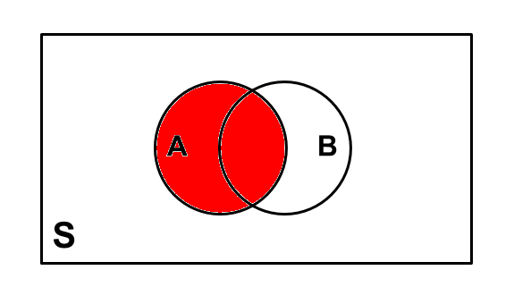
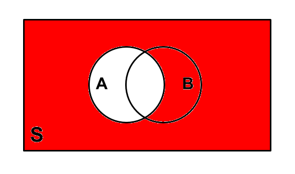
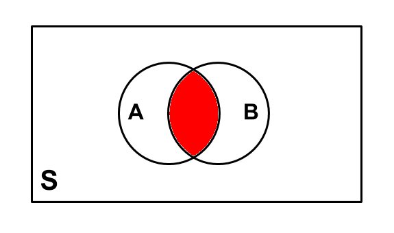
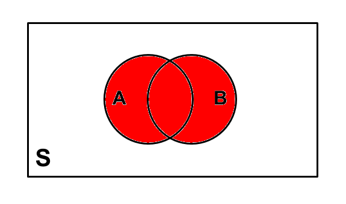

```{r setup, include=FALSE}
knitr::opts_chunk$set(echo = TRUE, fig.align = 'center')
```

# Learning Objectives

* Understand the concept of the complement of an event
* Be able form 'AND' and 'OR' combinations of events
* Understand what it means for events to be mutually exclusive
 
**Duration - 45 minutes**

<hr>


# Complement: definition
<br> 

So far today we've learnt about the basics of probability and counting rules. This has allowed us to take samples of data and make summaries of the likelihood of observations that make up that data.

But what happens if we want to know the likelihood of all our observations, not just the "one" we've chosen? In this instance, we need the **Complement of an event**.  

The **Complement of an event **: is all the other outcomes that are not the event. 

* If you flip a coin and your "event" is **heads**, then the complement is **tails**.  

* If you take a deck of cards and pick a suit **Spades**, the **{Spades}** would be your event, and the complement is **{hearts, clubs, diamonds}**.  

* If you take the weekend days of the week, your event is **{Saturday, Sunday}**. The complement would be **{Monday, Tuesday, Wednesday, Thursday, Friday}**. 

Together the Event and its Complement make all possible outcomes. You can find the probability of events using the complement rule. For data analysis, this is an important concept, as you might not have data on all the possible outcomes you wish. Using the complement rule allows you to make more generalisations from your data.   


# Calculating the complement of an event

<br>

If we remember way back to this morning, we can define the probability of an event as: 

**Event probability = Number of ways it can happen / Total number of outcomes**

<br>

If we go back to our die rolling experiment, we can ask, what are the chances of rolling a 4. Let's call this event 'A'.  

$$P(A) = \frac{1}{6} = 0.16666 $$
<br>

$P(A)$ means : Probability of a Event `A` (in our case, rolling a 4). We here have calculated the probability of the event happening. 

```{r, echo=FALSE, fig.cap="**Fig. 1.** Venn diagram showing all outcomes in event $A$.", out.width = '40%'}

```


Now let's calculate the complement, which could be shown as follows: 

```{r, echo=FALSE, fig.cap="**Fig. 2.** Venn diagram showing $A^c$: all outcomes in sample space $S$ that are not in event $A$", out.width = '40%'}

```

<br>

<div class='emphasis'>
The complement is defined mathematically as:
<br> 
If $A$ is an event occurring with probability $\textrm{prob}(A)$, then the complement is defined as $A^{c}$ . This is the event that $A$ **does not happen**. The complement is shown by a little mark after the letter such as A' (or sometimes Ac or A). 

The probability of $A^{c}$, $\textrm{prob}(A^{c})$ is simply equal to $1-\textrm{prob}(A)$ since an event **has to either occur or not occur**, i.e. $\textrm{prob}(A)+\textrm{prob}(A^{c}) = 1$. 

Your event probability and complement probability will always add to 1. 
</div>
<br>


## Complement: Examples

<br>

**Example:** We toss four coins. The sample space consists of:
<br>
```{r, message = FALSE}
library(prob)
library(tidyverse)
```
```{r}
s_four_coins <- tosscoin(4)
s_four_coins
```

<br> 
<blockquote class='task'>
 
Now, let's consider the event that at least two $H$'s are thrown. What is the probability of this event? 
</blockquote>
<br> 

First, we need to calculate how many heads are in each combination of throws. We can do this using the `rowSums` function and add the totals as a new column in our `s_four_coins` data.  
<br>

```{r}
# first setup a random variable to count number of heads
s_four_coins <- s_four_coins %>%
  mutate(num_heads = rowSums(. == "H"))
```
<br> 

Now we can filter where we have at least two `heads` thrown, and calculate the probability:
<br>
```{r}
# now filter down to event space
s_at_least_two_heads <- s_four_coins %>%
  filter(num_heads >= 2)

# calculate the probability
prob_two_heads <- nrow(s_at_least_two_heads) / nrow(s_four_coins)
prob_two_heads
```

**So the probability we roll at least two heads is 0.69**.   

<br>

Now what about the **complement**? Well, in plain language, this is the event that we throw `less_than_two_H`. 

```{r}
# get the observations where there are less than 2 heads
s_less_than_two_heads <- s_four_coins %>%
  filter(num_heads < 2)

# calculate the probability
prob_less_two <- nrow(s_less_than_two_heads) / nrow(s_four_coins)
prob_less_two
```

This time, our probability of rolling less than two heads is **0.31**.   
<br> 

We can see that the probability of the complement could have equally well been calculated as

$$\textrm{prob}(\textrm{at_least_two_H}^c) = 1-\textrm{prob}(\textrm{at_least_two_H}) $$

$$= 1 - 0.6875 = 0.3125$$. 
<br>


<blockquote class='task'>
**Task: 5 mins**  

Look again at `s_four_coins`. Without using R, can you see a simple way using the complement to calculate the probability that `at_least_one_H` is thrown?

<details>
<summary>**Hint**</summary>
$$\textrm{prob}(\textrm{at_least_one_H}) = 1 - \textrm{prob}(\textrm{no_H})$$
</details>

<details>
<summary>**Solution**</summary>

If you look at the hint above, the probabilty of throwing at least one head is calculated as 1 - the probabilty of no heads (i.e. throwing all tails).  That's because there's only one way to throw `less_than_one_H` (i.e. the complement of $\textrm{at_least_one_H}$), and that is to throw all tails. 

We know that throwing four tails would be 1 combination in our all possible combinations of throws (16 total combos). Therefore, the probability of $\textrm{all_T}$ is $\frac{1}{16}$.   

This means that the probability of $\textrm{at_least_one_H}$ can be calculated as $1-\frac{1}{16} = \frac{15}{16} = 0.9375$.

</details>
</blockquote>

<br>
<div class='emphasis'>
From the above examples, hopefully you can understand why it's useful to know about complements: because of their properties, we can efficiently calculate probabilties for our data. Additionally, many times the probability of an event is messy or complicated to compute, whereas the probability of its complement is much simpler. As our datasets grow, and our calculations become more complex, the complement rule will save us more and more time.  
</div>
<br> 

Let's now look at more complicated examples.  


<hr>

# AND combinations
<br> 

Let's now think about the 'compound event' that one event occurs **and** another event occurs. Here, 'compound event' just means an event composed in some way as a combination of other events, e.g. the event `make_breakfast` combines the events `pour_cereal` and `make_coffee`.


Think about rolling a single die. Let's define:

* event $A$: one of $\{1,2,3,4\}$ is rolled.
* event $B$: one of $\{3,4,5,6\}$ is rolled. 

What is the probability that both $A$ **and** $B$ occur? 

<br>
<div class='emphasis'>
We can think of this as asking *"which outcomes are **common** to both the $A$ and $B$ event spaces?"*. In probability theory, we call this the **intersection** $\cap$ of the two event spaces
$$(A \cap B) = \{3,4\}$$
</div>
<br>

The upside-down U shape is the 'intersection' operator, you would read this as 'A intersect B'. 

```{r, echo=FALSE, fig.cap="**Fig. 3.** Venn diagram for the intersection of events A and B: all outcomes in S that are also in events A and B.", out.width = '60%'}

```

<br> 

For equally likely outcomes, the probability of $A$ **and** $B$ is just defined as the number of outcomes in the intersection divided by the size of the sample space, in the usual way. 

So in our case:

$$\textrm{prob}(A \cap B) = \textrm{num}(A \cap B) / \textrm{ num}(S) = \frac{2}{6} = \frac{1}{3}$$
<br>


<blockquote class='task'>
**Example**  

Given our four coin tossing example from above, what is the probability of tossing at least one head **and** at least one tail?
</blockquote> 
<br>

```{r}
# calculate number of tails in each and add it
s_four_coins <- s_four_coins %>%
  mutate(num_tails = rowSums(. == "T"))

# filter on where it's more than one H and T
at_least_1H_at_least_1T <- s_four_coins %>%
  filter(num_heads >= 1 & num_tails >= 1)

# calculate the probability
prob_H_T <- nrow(at_least_1H_at_least_1T) / nrow(s_four_coins)
prob_H_T
```

Our probability of rolling at least one H and one T is therefore 0.875. 
<br>

## Mutually exclusive events

What about the case that two (or more) have no outcomes in common? In this case, the probability of the intersection is zero, it is not possible for the events to occur together. 


<blockquote class='task'>
**Example**
Again, given our four coin tossing example, what is the probability of tossing at least three heads **and** at least two tails?

There is no way in which these two events can both happen simultaneously. We say that such events are **mutually exclusive**, they share no outcomes. 
</blockquote>  
<br>

We can see this in R: 

```{r}
s_at_least_3H_at_least_2T <- s_four_coins %>%
  filter(num_heads >= 3 & num_tails >= 2)

s_at_least_3H_at_least_2T
```
<br> 

Unsurprisingly, there is no way to simultaneously throw at least three heads and at least two tails on a single toss of four coins, so the intersection contains no outcomes, the two events are mutually exclusive. 

In other words, the probability of this compound event is zero, and we say that the two component events are mutually exclusive.

<blockquote class='task'>
**Task - 2 mins** 
Think of drawing a card from a deck or rolling a die. Can you think of any pairs of mutually exclusive events?
<details>
<summary>**Solution**</summary>

* Drawing a card: (`draw_a_face_card`, `draw_a_non_face_card`); (`draw_red`, `draw_black`); 
* Rolling a die: (`roll_odd`, `roll_even`); (`roll_less_than_3`, `roll_greater_than_3`)
* Simple outcomes are also mutually exclusive!: (`draw_7_hearts`, `draw_queen_diamonds`); (`roll_1`, `roll_4`)

</details>
</blockquote>

<hr>

# OR combinations

<br> 
Now we'll look at the compound event that one event occurs **or** another event occurs. 

Back to rolling a single die. Define: 

* events $A$: roll an even no $\{2,4,6\}$
* event $B$: roll one of $\{4,5\}$

What is the probability that $A$ **or** $B$ occurs? 

<br>
<div class='emphasis'>
We are asking *"which outcomes are in either the $A$ or $B$? event spaces?"* In probability theory, this involves taking the **union** of the two event spaces:

$$(A \cup B) = \{2,4,5,6\}$$
Note that outcome $4$ does not occur twice in the union, despite the fact that it occurs in **both** of the $A$ and $B$ events. Event spaces must always contain distinct, unique outcomes: they cannot contain duplicate outcomes. 
</div>
<br>

```{r, echo=FALSE, fig.cap="**Fig. 4.** Venn diagram for the union of events A and B: all outcomes in S that are in either A or B", out.width = '40%'}

```

<br> 

Let's code out this more complex example and let R do the hard work! Our experiment consists of rolling two dice, and we define two events: the `first_die_is_even`, and `second_die_is_5`. What is the probability of their OR combination?

```{r}
# create our sample space: two die rolls
s_two_dice <- rolldie(2)

# now let's find the rows where the first die roll is a multiple of 2, but isn't 0
s_two_dice <- s_two_dice %>%
  mutate(first_die_even = X1 %% 2 == 0)

# now let's take the rows where there are event numbers and the second roll is equal to 5
s_first_die_even_or_second_die_5 <- s_two_dice %>%
  filter(first_die_even | X2 == 5)

# now calculate the probability of it all:
prob_or_rule <- nrow(s_first_die_even_or_second_die_5) / nrow(s_two_dice)
prob_or_rule
```

Our probabilty is therefore **0.58**.  

<br> 
The fact that we don't count common outcomes twice means that the probability of the union of two events $A$ and $B$ has to be written

$$\textrm{prob}(A \cup B) = \textrm{prob}(A) + \textrm{prob}(B) - \textrm{prob}(A \cap B)$$
a result known as the **addition law**. 

The probability of the intersection $\textrm{prob}(A \cap B)$ is subtracted because, as we've seen, some outcomes may occur in both events $A$ and $B$, and **we don't want to count them twice**. 

<br> 

<blockquote class='task'>
**Task - 10 mins**

Calculate probabilities for each event below:

* $\textrm{first_die_even}$
* $\textrm{second_die_5}$
* $\textrm{first_die_even AND second_die_5}$

Then use these probabilities in the expression from above

$$\textrm{prob}(A \cup B) = \textrm{prob}(A) + \textrm{prob}(B) - \textrm{prob}(A \cap B)$$

and check you get the same probability for $\textrm{prob}(\textrm{first_die_even OR second_die_5})$ as we obtained from the last block of code.

<details>
<summary>**Hint**</summary>
$$
\begin{multline}
\textrm{prob}(\textrm{first_die_even OR second_die_5}) = \\ 
\textrm{prob}(\textrm{first_die_even}) + \textrm{prob}(\textrm{second_die_5}) - \textrm{prob}(\textrm{first_die_even AND second_die_5}) 
\end{multline}
$$
</details>

<details>
<summary>**Solutions**</summary>

```{r}
# 1. calculate first die even 

# take rows where the first die is even
s_first_die_even <- s_two_dice %>%
  filter(first_die_even)

# calculate the probability of your first die being even
prob_first_die_even <- nrow(s_first_die_even) / nrow(s_two_dice)
```

```{r}
# 2. second die 5

# now take rows where the second die is 5
s_second_die_5 <- s_two_dice %>%
  filter(X2 == 5)

#... and calculate the probability of this
prob_second_die_5 <- nrow(s_second_die_5) / nrow(s_two_dice)
```

```{r}
# 3. first even, second 5 

# double filtering 
s_first_die_even_and_second_die_5 <- s_two_dice %>%
  filter(first_die_even & X2 == 5)

# calculate the probability 
prob_first_die_even_and_second_die_5 <- nrow(s_first_die_even_and_second_die_5) / nrow(s_two_dice)

# calculate the or probability
prob_or <- prob_first_die_even + prob_second_die_5 - prob_first_die_even_and_second_die_5
prob_or
```

Yep, that's the same as before! 


</details>
</blockquote>

<hr>

# Recap

* How are an event and its complement related in terms of outcomes and probabilities?
<details>
<summary>**Answer**</summary>
The complement $A^c$$ of an event $A$ corresponds to all the outcomes in the sample space that **do not belong** to the event. The probabilities are related by $p(A)+p(A^c) = 1$. 
</details>

<br>

* Given two events $A$ and $B$, what outcomes would you expect to find in their 'AND' combination, i.e. event $A \cap B$?
<details>
<summary>**Answer**</summary>
The 'AND' combination $(A \cap B)$ of two events $A$ and $B$ corresponds to all the outcomes in the sample space that are in **both $A$ and $B$**. The event space of $(A \cap B)$ corresponds to the **intersection** of the event spaces of $A$ and $B$.
</details>

<br>

* Similarly, given two events $A$ and $B$, what outcomes would you expect to find in their 'OR' combination, i.e. event $A \cup B$? 
<details>
<summary>**Answer**</summary>
The 'OR' combination $(A \cup B)$ of two events $A$ and $B$ corresponds to all the outcomes in the sample space that are in **either $A$ or $B$**. The event space of $(A \cup B)$ corresponds to the **union** of the event spaces of $A$ and $B$ 
</details>

<br>

* What does it mean for two events to be mutually exclusive?
<details>
<summary>**Answer**</summary>
Two events $A$ and $B$ are mutually exclusive if they **have no outcomes in common**, i.e. $(A \cup B)$ contains no outcomes.
</details>


