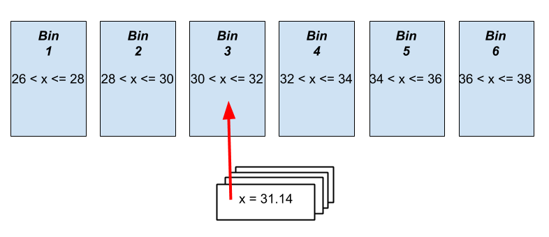

```{r setup, include=FALSE}
knitr::opts_chunk$set(echo = TRUE, fig.align = "center")
```
# Learning Objectives

* Understand meaning of the term "distribution"
* Understand the different measures of centre for a distribution - mean, mode, median
* Be able to identify unimodal, bimodal, uniform, left and right skewed distributions
* Know the correct measure of centre for a skewed distribution and/or in the presence of outliers
* Be able to link distributions to probabilities

**Duration - 90 minutes**
<hr>


# Distributions
<br> 

So far this week we've learnt about probability as a concept, and how to calculate the probability of an observation occuring within a dataset. However, probability theory is often useful in practice when we use probability distributions. In the following lessons, we will learn more about what a probability distribution is, what kind of distributions we encounter, and why knowing about them is incredibly useful for data analysis. 


# What is a distribution? 

This week we learnt about random variables and their associated frequency and probability. For example, a random variable could be the outcome of the roll of a die or the flip of a coin. 


<br>
<div class='emphasis'>

A distribution is a list of all of the possible outcomes of a random variable along with either their corresponding frequency or probability values (we would speak of the **frequency distribution** or **probability distribution** respectively). 

Defined either way, the distribution gives insight into *how likely* or *how common* the various outcomes are.  
</div>
<br>


As ever, an example should help make the concept clear. Imagine an experiment in which we toss three unbiased coins. The sample space contains eight outcomes:

```{r, message=FALSE, warning = FALSE}
library(prob)
library(tidyverse)
```

```{r}
s_three_coins <- tosscoin(3)
s_three_coins
```
<br>

<blockquote class='task'>
**Task - 2 mins** what is the probability of each of the eight outcomes if all of the coins are unbiased? What does 'unbiased' mean here? Why is it important that each of the coins are unbiased in this calculation?

<details>
<summary>**Solution**</summary>
We did calculations like this on day 1 of this week. <br>

* If all of the coins are unbiased (i.e. $\textrm{prob}(H)=\textrm{prob}(T)=\frac{1}{2}$) then each outcome in the sample space has equal probability! There are eight outcomes and so the probability of each is $\textrm{prob}=\frac{1}{8}$. <br> 
* If any or all of the coins were biased (i.e. $\textrm{prob}(H) \neq \textrm{prob}(T)$), we couldn't compute probabilities of outcomes in this way. <br> 
e.g. coin 3 is biased, so $\textrm{prob}\{H,H,H\} \neq \textrm{prob}\{H,H,T\}$

</details>
</blockquote>
<br>

Each outcome has a probability of $\frac{1}{8}$ (or 0.125). If we plot this, we'll get a so-called **uniform probability distribution**, 'uniform' because each of the outcomes has the **same** probability.

```{r}
s_three_coins <- s_three_coins %>%
  mutate(label = paste(toss1, toss2, toss3, sep = "")) %>%
  mutate(prob = 1 / n())

s_three_coins %>%
  ggplot(aes(x = label, y = prob)) +
  geom_col() + 
  xlab("coin toss result") + ylab ("prob of each outcome")
```
<br>


Now let's do something much more interesting!  What are the probabilities of getting 0 1, 2 or 3 heads on the toss of three unbiased coins?

```{r}
# first, we need to count the number of heads in each outcome
s_three_coins <- s_three_coins %>%
  mutate(num_heads = rowSums(. == "H"))

# then we can work out the probability associated with each combo
prob_num_heads <- s_three_coins %>% 
  group_by(num_heads) %>%
  summarise(prob = sum(prob))

# show the probabilities of each
prob_num_heads
```
<br>

We've done quite a lot here, so let's step through it slowly.

* First, we counted the number of heads in each outcome. We add a column to the original data frame with the number of heads.
* Next, we grouped outcomes by the number of heads they contained, and totalled probability in each group. This is equivalent to defining *four events*: `has_n_heads` where `n` is $0$, $1$, $2$ or $3$ and calculating the probability of each event.

<br> 
Now let's plot the probability distribution!

```{r}
prob_num_heads %>%
  ggplot(aes(x = num_heads, y = prob)) +
  geom_col() + 
  xlab("Number of heads thrown") + 
  ylab("Probabiltiy")
```


What does this tell us? The probability distribution we get is **not uniform**. One and two heads are each **three times more likely** than no heads or all heads. This is an example of a what we call a **discrete probability distribution**: 'discrete' because the events or outcomes are finite and countable. The alternative would be a **continuous** distribution: we'll talk about those shortly. 

<br>
<div class='emphasis'>
**General properties of discrete probability distributions**

* On the $x$-axis we have outcomes or events
* On the $y$-axis we have the probability of each outcome or event
* The probabilities must sum to $1$

</div>
<br>

<blockquote class='task'>
**Task - 2 mins**   

Given the distribution we just calculated and plotted:

i. what is the probability that we get *zero or one head* on the toss of three coins?
ii. what is the probability that we get *zero, one, two or three heads* on the toss of three coins?

<details>
<summary>**Solution**</summary>

i. The probability required is $\textrm{prob}(\textrm{no heads})+\textrm{prob}(\textrm{one head}) = 0.125 + 0.375 = 0.5$
ii. This event includes all outcomes, so the probability is $1$. 

</details>
</blockquote>

<hr>

# Measures of centrality: mean, median and mode

Now we have our distribution, we can start making summaries from it. To start, we're going to look at three measures of the 'centre' of a probability distribution. Each of the measures have advantages and disadvantages, which we will talk about later. First, we'll define the measures.

We'll work with a data set tracking daily sales of air conditioning units in a small business. 

```{r}
# read in dates as strings
air_con_sales <- read_csv("data/AirConSales.csv")

# then convert column to Date afterwards
air_con_sales$Date <-as.Date(air_con_sales$Date, format = "%m/%d/%Y")
air_con_sales
```
<br> 

Next, what we need is the total number of occurrences in our data. For this, we can use the the base R `table()` function, which let's us take a variable and sum up the total number of occurrences of each value of the variable. For example, the `Units_sold` variable of `air_con_sales` is **discrete numerical**, let's run `table()` on it! 


```{r}
sales_freq_table <- table(air_con_sales$Units_sold)
sales_freq_table
```
<br> 
In the first row we have the number of units sold, and on the second row, how many dates on which that number of sales occurred. The entries on the second row we can think of as **frequencies**, e.g. days on which $4$ units were sold occur with frequency $8$ in this dataset.

<br>
<div class='emphasis'>
**Relative frequencies and empirical probabilities**<br>

How do frequencies relate to probabilities? A **frequency** is the number of times a given observation occurs in a data set. A **relative frequency** is the fraction of times a particular observation occurs. **Relative frequencies** correspond to **empirical probabilities**. But how do empirical probabilities differ from probabilities as we understood them yesterday?   

The best way to understand this is via an example. Imagine we have an unbiased die, which we roll $100$ times, noting the results as we go. We know that the **theoretical probability** of each number is $1/6 = 0.166667$. However, the frequencies we actually rolled are:

```{r}
rolls <- sample(1:6, 100, replace = TRUE)
freqs <- table(rolls)
freqs
```

This tells us that we rolled a `1` 16 times, a `2` 21 times... and so on.   

We get then get the **relative frequencies** by dividing the observed frequencies by the total number of rolls:

```{r}
rel_freqs <- freqs / 100
rel_freqs
```

and these are **empirical probabilities**, 'empirical' in the sense of 'obtained by observation'. 

*If all we knew about this die were the results of these $100$ rolls, the empirical probabilities would be our best estimate of the behaviour of the die*.

<br> 

We can also get the relative frequencies via the `prop.table()` function in base R:

```{r}
prop.table(freqs)
```

Or, if we want to work only in the `tidyverse`, the `tabyl()` function in the `janitor` package can do similar things for us!

```{r, warning = FALSE, message = FALSE}
library(janitor)
```
```{r}
rolls %>%
  tabyl()
```
</div>
<br>


So, let's look at the relative frequencies (or empirical probabilities) for the sales of air con units using `dplyr`:   

```{r}
daily_sales_dist <- air_con_sales %>%
  tabyl(Units_sold)

```
<br> 

And let's plot the distribution:  


```{r}
daily_sales_dist %>%
  ggplot(aes(x = Units_sold, y = percent)) +
  geom_col()
```

Now we have our distribution, we can start looking at summaries of that distribution. 
<br> 


## Mean

Now let's calculate the **mean** number of units sold per day. The mean is just another term for the average, defined as

$$\textrm{mean} = \frac{\textrm{sum of values}}{\textrm{no. of values}}$$

<br> 
The mean is given the symbol 

* $\mu$ for a population, and 
* $\bar{x}$ for a sample.

```{r}
air_con_sales %>%
  summarise(mean_daily_sales = mean(Units_sold))
```

Note that there is no reason that the mean should be an integer. A floating point number, as we obtain here, is perfectly valid. So, on average, $5.95$ units are sold every day.

## Median

The **median** is the value for which one-half of the values in the data set lie below it, and one-half above. R makes this easy with the `median()` function!

```{r}
air_con_sales %>%
  summarise(median_daily_sales = median(Units_sold))
```

We had an odd number of values in the `AirConSales` CSV. What if we had an even number?

<br> 

<blockquote class='task'>
**Task - 2 mins**   
Try calling `median()` on vectors `c(1, 2, 3, 4)` and `c(1, 2, 3, 4, 5)`, and interpret the output for both.

<details>
<summary>**Solution**</summary>
```{r}
# even: no middle value, so averages middle two values
median(c(1, 2, 3, 4))

# odd: this returns the middle value
median(c(1, 2, 3, 4, 5))
```
</details>
</blockquote>
<br> 

## Mode

The **mode** is the most likely value in the data set, i.e. the value that occurs most frequently. R has no built-in function to calculate the mode of a distribution (this is genuinely weird), but we can create one ourselves!

```{r}
# let's make our mode function 
getMode <- function(data){

  tabled_data <- table(data)
  table_names <- names(tabled_data)
  
  return( table_names[tabled_data == max(tabled_data)] )
  
}

# call the mode function 
air_con_sales %>%
  summarise(mode_daily_sales = getMode(Units_sold))
```


So, it turns out that $3$ is the most common daily sales figure. The plot of the distribution confirms that the sales value with the highest probability is $3$.

<hr>

# Outliers

We've seen the definition of outliers earlier in the course. Just a reminder: we can get the values of outliers from the object returned from `boxplot()`

```{r}
# boxplots will be described in the next lesson
aircon_box <- boxplot(air_con_sales$Units_sold)
aircon_box$out

```


So, value $43$ is an outlier in the `Units_sold` distribution. It turns out there was a flash clearance sale that day, so it's not surprising that sales figures were much higher than usual! 

<br>
<div class='emphasis'>
**Measures of centre and outliers**

Why mention outliers here? It turns out that **the three measures of distribution 'centre' show very different sensitivities to outliers!**

</div>
<br>

Let's investigate this!

```{r}
# distn including outlier
air_con_sales %>%
  summarise(
    mean_daily_sales = mean(Units_sold),
    median_daily_sales = median(Units_sold),
    mode_daily_sales = getMode(Units_sold)
  )

# distn excluding outlier 
air_con_sales %>%
  filter(Units_sold < 43) %>%
  summarise(
    mean_daily_sales = mean(Units_sold),
    median_daily_sales = median(Units_sold),
    mode_daily_sales  = getMode(Units_sold)
  )
```

The key point is that **the mean is more heavily swayed by outliers than the median or the mode**. If we suspect our data set contains outliers, we should consider carefully which measure of centrality to use, and perhaps prefer the median to the mean. 

<hr>

# Unimodal and bimodal distributions

<br>
<div class='emphasis'>
A **unimodal** distribution is one in which there is **a single** 'peak' or 'hump' in the data. We can think of a mode as being a local peak in the distribution, so 'unimodal' just means 'one-peaked'
</div>
<br>

```{r, warning = FALSE, message = FALSE}
unimodal <- read_csv("data/unimodal.csv")
```

```{r}
unimodal %>%
  ggplot(aes(x = x)) +
  geom_histogram(col = "white", bins = 20)
```

<br>
Here, we can see there is one clear peak in the distribution.  
<br>  

<div class='emphasis'>
On the other hand, we might have a **bimodal** ('two-peaked') distribution.
</div>
<br>

```{r, warning = FALSE, message = FALSE}
bimodal <- read_csv("data/bimodal.csv")
```

```{r}
bimodal %>%
  ggplot(aes(x = x)) + 
  geom_histogram(col = "white", bins = 20)
```

Here, you can see the two peaks in the data. 


<br>
<blockquote class='task'>
**Task: 2 mins**  

Look back at the `AirConSales` distribution of daily sales figures - is this unimodal or bimodal? 

<details>
<summary>**Answers**</summary>
Bimodal!
</details>
</blockquote>
<br> 


We can extend this to a **multimodal** distribution, featuring more than two peaks!

We need to be careful when applying measures of centrality to multimodal distributions. For example, let's compute the mean and the median of the example bimodal distribution above.

```{r}
bimodal %>%
  summarise(
    mean = mean(x),
    median = median(x)
  )
```
<br> 

So, the mean and median both lie around $12$ to $13$, i.e. in the 'dip' between the two peaks. Aside from at the outer edges of the distribution, this is the region with the **lowest frequency** of values! Do the mean and median provide *useful summaries* of the data if they fall in this region? Probably not... 

<hr>

# Skewness

Not only can we describe the central tendencies of a distribution, as well as how many peaks it has, but we can describe how symmetrical it is. This is called **skewedness**.   


<br>
<div class='emphasis'>
**Skewness** in a distribution refers to **asymmetry**, to a tendency to be distorted to the left or right.
</div>
<br>

## Left skewness

In a **left-skewed** distribution, the centrality measures **typically** fall in the order

$$\textrm{mean} \lt \textrm{median} \lt \textrm{mode}$$ 

<br> 
Let's take a look at an example: 

```{r, warning = FALSE, message=FALSE}
left_skewed <- read_csv("data/leftskew.csv")
```

If we calculate the descriptive stats we see it follows what we said above:  
<br> 
```{r}
left_skewed %>%
  summarise(
    mean = mean(x),
    median = median(x)
  )
```
<br> 

And if we plot it, we can see it is **left skewed**: the tail is pointing towards the left.  

```{r}
left_skewed %>%
  ggplot(aes(x = x)) + 
  geom_histogram(col = "white", bins = 20)
```


## Diversion - binning a continuous variable

In the above example, variable `x` dataset is continuous numeric variable.   

How do we interpret the mode of a continuous variable? Essentially, every `x` value is (or has the potential to be) unique, and occurs with frequency $1$, so what does mode mean in this context?

We can 'bin' a continuous variable to get around this problem: in short, this converts the variable from continuous to factor. Here's a picture that might help to explain the process.

<br> 

```{r, echo=FALSE, fig.cap="**Fig. 1.** Binning a continuous variable", out.width = '100%'}

```

<br> 
To do this, we set up a series of 'bins' into which we sort the values in the distribution, one-by-one. The `cut()` function in base R does this for us. We specify a number of `breaks` to use:  

```{r}
binned_left_skewed <- cut(left_skewed$x, breaks = 25)
head(binned_left_skewed)
```

The variable has been converted to `factor` type, with a number of levels equal to the `breaks` parameter. What does `(11.8, 11.9]` mean? This is just **interval notation** in maths: this means $11.8 \lt x \le 11.9$, i.e. this bin 'grabs' all the values in that range.

Now that we've seen how we can bin a continuous variable, we'll do this before we calculate the mode

```{r}
left_skewed %>%
  mutate(binned = cut(x, breaks = 25)) %>%
  summarise(mode_daily_sales = getMode(binned))
```

So the mode falls within the range 11.9 to 12.1. This puts the centrality measures in the order $\textrm{mean} \lt \textrm{median} \lt \textrm{mode}$, as expected. Note that the term 'left' in the name 'left-skewed' refers to the direction in which the 'long tail' points!

## Right skewness

Right skewed data is the opposite of left skewed. For right skewed data, the tail should be pointing towards the right.  

<br>
<blockquote class='task'>
**Task - 10 mins**

Try the same process again for the *right-skewed* data below:

```{r, warning = FALSE, message = FALSE}
right_skewed <- read_csv("data/rightskew.csv")
```

* Visualise the distribution.
* What order do the mean, median and mode fall in for right-skewed data?

<details>
<summary>**Solution**</summary>
```{r}
right_skewed %>%
  ggplot(aes(x = x)) +
  geom_histogram(col = "white", bins = 25)
```

```{r}
right_skewed %>%
  mutate(binned = cut(x, breaks = 25)) %>%
  summarise(
    mean = mean(x),
    median = median(x),
    mode = getMode(binned)
  )
```
<br> 

The measures fall in the order $\textrm{mode} \lt \textrm{median} \lt \textrm{mean}$. Notice now how the 'long tail' of the distribution points to the right!
</details>
</blockquote>
<br>


## Measure of skewness
<br> 

We can compute the `skewness()` of a distribution prior to further analyses. A **negative** value correspond to left-skew, and a **positive** value to right-skew. The magnitude of the skewness (i.e. the value ignoring the sign) can be interpreted on the following table.

|   Magnitude of Skewness  | Classification     |
|--------------------------|--------------------|
|          < 0.5           | fairly symmetrical |
|         0.5 - 1.0        | moderately skewed  |
|          > 1.0           | highly skewed      |

```{r, message=FALSE}
library(e1071)
```

```{r}
left_skewed %>%
  # highly left skewed
  summarise(skewness = skewness(x, type = 1))
```
```{r}
right_skewed %>%
  # moderately right skewed
  summarise(skewness = skewness(x, type = 1))
```


We should try not to use the mean as a measure of centrality for moderately and highly skewed distributions, preferring the median instead in these cases.  

<blockquote class='task'>
**Task - 2 mins** Calculate and interpret the skewness of the `Units_sold` variable in `air_con_sales`: 

* is the distribution significantly skewed?
* if significantly skewed, is it left- or right-skewed? 

<details>
<summary>**Solution**</summary>
```{r}
air_con_sales %>%
  summarise(skewness = skewness(Units_sold, type = 1))
```
The distribution is highly right-skewed.
</details>
</blockquote>

<hr>

# The key message
<br> 

Why does distribution shape and skewness matter? It will become clearer later, but the TL;DR version is that all statistical tests have assumptions about the underlying distribution of data. And if your data doesn't meet these assumptions, you will have to use a different statistical test. The only way you can ensure you're using the correct test is to look at your data carefully and assess the underlying distribution.    

We've been saying this a lot, but it bears repeating: 
<br><br>
<center>**"Always visualise your data before performing any further statistical analyses!"**</center>
<br>

<hr>

# Recap

<br>

* What is a distribution?
<details>
<summary>**Answer**</summary>
The distribution is a function that tells us either the *frequency* or *probability* of each outcome in the sample space of an experiment (we would speak of the **frequency distribution** or **probability distribution** respectively)
</details>

<br>

* Define mean, median and mode
<details>
<summary>**Answer**</summary>

    * The **mean** is the sum of all values divided by the number of values.
    * The **mode** is the most likely value in the data set, i.e. the value that occurs most frequently.
    * The **median** is the 'middle' value of the sorted data set.

</details>

<br>

* What are unimodal, bimodal and multimodal distributions?
<details>
<summary>**Answer**</summary>
A **unimodal** distribution is one in which there is **a single** 'peak' or 'hump' in the data, a **bimodal** distribution has two humps, and **multimodal** data has more than two. 
</details>

<br>

* What is the skewness of a distribution?
<details>
<summary>**Answer**</summary>
**Skewness** in a distribution refers to **asymmetry**, to a tendency to be distorted to the left or right.
</details>

<br>

* Which centrality measures should you be careful of for data with outliers, bimodal and multimodal data, and skewed data?
<details>
<summary>**Answer**</summary>
The mode is probably the most reliable centrality measure overall, the mean is strongly affected by the presence of outliers and skew and may lie in a 'dip' in multimodal data, and the median suffers difficulties in multimodal data. 
</details>

