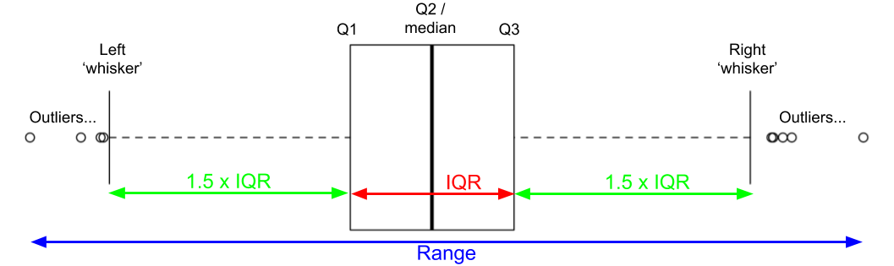
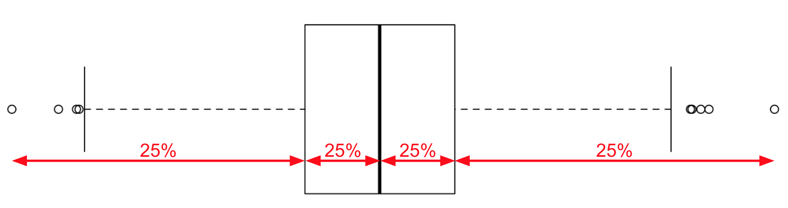
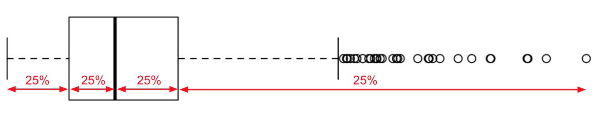

```{r setup, include=FALSE}
knitr::opts_chunk$set(echo = TRUE, fig.align = 'center')
```

# Learning Objectives

* Understand measures of spread - range, quartiles, interquartile range
* Be able to interpret spread and skew on a box plot
* Understand the definition of an outlier from the interquartile range
* Know the formula for calculating the sample variance

**Duration - 90 minutes**

<hr>

# Measures of spread
<br> 

In the last lesson we discussed **centrality** of a distribution, and we saw that there are various measures we can use, each with their own advantages and disadvantages. We think of the centre, however defined, as the position around which the data distribution **spreads**, and now we'll move on to detail the latter concept. 

* How broad is the spread? 
* How do we measure it?  

<hr>

# Range

The simplest measure of the spread of a distribution is the **range**. We define this as 

$$\textrm{spread} = \textrm{max. value} -  \textrm{min. value}$$
i.e. the difference separating the maximum and minimum values in the dataset.

Another lesson, another dataset! Of course, this is all just a thinly-veiled excuse to give you practice manipulating data in R! 

This time, we're going to look at the distribution of 'Accounting' and 'Management' salaries in the Tyrell Corporation. Let's load the CSV and have a look at the `head()` of the data. 

```{r, message = FALSE}
library(tidyverse)
```

```{r}
jobs <- read_csv("data/TyrellCorpJobs.csv")
glimpse(jobs)
```

So, `Accounting` and `Management` salaries are mixed together in a single dataset. Clearly, some grouping will be necessary if we want to examine *only* `Accounting` or `Management` data. 

Firstly, let's try to get the `range()` of the entire distribution

```{r, error=TRUE}
jobs %>%
  summarise(range_salary = range(Salary))
```

Hmm, we get an error, as `range()` actually returns the minimum and maximum values in the `Salary` column. We get the properly defined range by subtraction

```{r}
jobs %>%
  summarise(
    min = range(Salary)[1],
    max = range(Salary)[2],
    range = max - min
  )
```

We've broken a key rule, however! We haven't yet visualised the distribution...

```{r}
jobs %>%
  ggplot(aes(x = Salary)) +
  geom_histogram(col = "white", bins = 25)
```

There's weak evidence that this may be a **bimodal** distribution, with two local maxima around 30,000 and 50,000. Let's plot salaries grouped by `Position`!

```{r}
jobs %>%
  ggplot(aes(x = Salary)) +
  geom_histogram(col = "white", bins = 25) +
  facet_wrap(~ Position)
```

Ah, so the two local maxima seem to come broadly from the two classes of position. Let's get separate ranges for these salaries grouped by position

```{r}
jobs %>%
  group_by(Position) %>%
  summarise(
    min = range(Salary)[1],
    max = range(Salary)[2],
    range = max - min
  )
```

The range of 'Management' salaries is nearly four times greater than that of 'Accounting' positions.

<hr>

# Quartiles and interquartile range

The **quartiles** of a distribution, $Q1$, $Q2$ and $Q3$, are the values that split the distribution into sections as follows: 

* $Q1$ = the value at which 25% of distribution is equal to or lower, and 75% higher,<br>
* $Q2$ = the value at which 50% of distribution is equal to or lower, and 50% higher, and <br> 
* $Q3$ = the value at which 75% of distribution is equal to or lower, and 25% higher.<br> 

We've already encountered $Q2$, it's just the **median**, so it's really $Q1$ and $Q3$ that are new here. R has an efficient way to get the quartiles, and indeed, any quantile we desire, via the `quantile()` function!

* *General quantile*, e.g. the $43%$ quantile = the value at which 43% of the distribution is equal to or lower, and 57% higher  

```{r}
jobs %>%
  group_by(Position) %>%
  summarise(
    Q1 = quantile(Salary, 0.25),
    Q2 = quantile(Salary, 0.5),
    Q3 = quantile(Salary, 0.75)
  )
```

We define the **interquartile range (IQR)** as

$$IQR = Q3 - Q1$$

Let's now summarise to get these values for each type of `Position`

```{r}
jobs %>%
  group_by(Position) %>%
  summarise(
    Q1 = quantile(Salary, 0.25),
    Q2 = quantile(Salary, 0.5),
    Q3 = quantile(Salary, 0.75),
    IQR = Q3 - Q1
  )
```

The IQR is the range in which $50\%$ of the values fall. It is a useful measure of spread, as it's **insensitive to outliers**. R also gives us an `IQR()` function to use directly

```{r}
jobs %>%
  group_by(Position) %>%
  summarise(IQR = IQR(Salary))
```

<hr>

# The `skim()` function and the 'five number summary' 

It's important to understand how we derived the range and IQR above, but, the `skim()` function in the `skimr` package easily gives us these values and more!  Let's see how it works

```{r, message = FALSE}
library(skimr)
```


```{r}
jobs %>%
  select(-X1) %>%
  group_by(Position) %>%
  skim()
```

The `mean` is self-explanatory, and `p0`, `p25`, `p50` and `p75` correspond to the minimum, Q1, Q2 (median), Q3 and maximum values, respectively. The base R `summary()` function gives us something similar, but `skim()` offers the convenience that it can be easily combined with other `dplyr` wrangling verbs. 

The combination of values<br><br>

<center>minimum, Q1, median, Q3, maximum</center><br>

is known as the **five number summary** and is very commonly quoted for a distribution. 

<hr>

# Box plots

Box plots (also known as 'box-and-whisker' or 'hinge' plots) were popularised by John Tukey (the originator of the term 'data science') in 1970, and they are an effective means to visualise the key measures of a distribution. 

<br>
```{r, echo=FALSE, fig.cap="**Fig. 1** Components of a box plot", out.width = '80%'}

```
<br>

* The central 'box' corresponds to the IQR of the distribution, the left-hand or lower edge marking Q1, and the right-hand or upper edge, Q3. 
* The median or Q2 is also marked by a line within the box. 
* The whiskers on either side of the box, also known as the **Tukey fences**, mark the positions beyond which data values are normally deemed to be outliers. 

Precise definitions do vary, but, for a data set $x$ the whiskers in R are positioned at
<br><br>
<center>Lower whisker: $\textrm{max}[ \; \textrm{min}(x), \; \textrm{Q1} – 1.5 \times \textrm{IQR} \;]$</center><br>
<center>Upper whisker: $\textrm{min}[ \; \textrm{max}(x), \; \textrm{Q3} + 1.5 \times \textrm{IQR} \; ]$</center><br>

and this is a very common definition. Data points **below the lower whisker** or **above the upper whisker** are deemed to be **outliers**, as you've seen earlier in the course.

<blockquote class='task'>
**Task - 2 mins** Examine the boxplot shown in Figure 1 and, starting from the left, sketch and partition the plot into sections, each section corresponding to 25% of the data used to generate the plot. 
<details>
<summary>**Solution**</summary>
```{r, echo=FALSE, fig.cap="**Fig. 2** Box plot sectioned into 25% pieces", out.width = '80%'}

```
</details>
</blockquote>

Spread of a distribution is evident in many ways in a box plot! The key is to think carefully about **how much of the data is present in each section of the plot**.

<blockquote class='task'>
**Task - 10 mins** Investigate and comment on the centrality and spread of the distributions produced by the following function calls.

i. Use `geom_boxplot()` and `skim()` first
ii. Next, plot histograms to confirm your descriptions. 

[Don't worry about what the functions generating `distribution_1` and `distribution_2` are doing]
```{r}
# SLACK THIS OUT
set.seed(42)
distribution_1 <- tibble(
  y = append(rnorm(n = 100, mean = 5, sd = 10), rnorm(n = 200, mean = 5, sd = 1))
)

distribution_2 <- tibble(
  y = runif(n = 1000, min = -30, max = 30)
)
```
<details>
<summary>**Solution - distribution_1**</summary>
```{r}
distribution_1 %>%
  skim()

distribution_1 %>%
  ggplot(aes(y = y)) +
  geom_boxplot()
```

Very narrow central peak, IQR is ~2 units so 50% of values in distribution within ~2 units of median at ~5 units, and many outliers spread between -25 to +28 units. Range is approximately 53 units.<br><br>
Summary: strongly peaked unimodal distribution with long 'fat' tails. 

```{r}
distribution_1 %>%
  ggplot(aes(x = y)) +
  geom_histogram(col = "white")
```
</details>

<details>
<summary>**Solution - distribution_2**</summary>
```{r}
distribution_2 %>%
  skim()

distribution_2 %>%
  ggplot(aes(y = y)) +
  geom_boxplot()
```

Very broad distribution centred around median at ~ -1 unit, range is approximately 60 units, IQR is ~30 units, so 50% of values in central 30 units, 25% in lowest 15 units, and final 25% in highest 25 units.<br><br>
Summary: nearly uniform distribution, guess that it won't even be strongly unimodal...
```{r}
distribution_2 %>%
  ggplot(aes(x = y)) +
  geom_histogram(col = "white")
```
</details>
</blockquote>

## Skew in box plots

How does **skew** of a distribution manifest in a box plot? Let's have a look at the box plot of a **heavily right skewed** distribution and see!

```{r}
library(e1071)
heavily_right_skewed <- read_csv("data/heavily_right_skewed.csv")
heavily_right_skewed %>%
  summarise(skewness = skewness(x, type = 1))
```

Positive skewness means right-skew, and a value greater than 1 indicates a highly skewed distribution.

```{r}
heavily_right_skewed %>%
  ggplot(aes(y = x)) +
  coord_flip() +
  geom_boxplot()

heavily_right_skewed %>%
  ggplot(aes(x = x)) +
  geom_histogram(col = "white")
```

Hmm, so we see most of the values concentrated to the left of the plot, the median is also shifted leftwards in the central box, and we have a long whisker and many outliers to the right, corresponding to the rightwards pointing tail of the skewed distribution.

<blockquote class='task'>
**Task - 5 mins** Repeat the '25% partitioning' of the Task above for the boxplot of the skewed distribution. Think carefully about *where* the weight of the distribution is concentrated and try to make the link between what you see in the histogram and the features of the boxplot.
<details>
<summary>**Solution**</summary>
```{r, echo=FALSE, fig.cap="**Fig. 3** Skewed box plot sectioned into 25% pieces", out.width = '80%'}

```
</details>
</blockquote>

<hr>
 
# Variance - a single number measure of spread!

So far we have the range, IQR, distance between the whiskers on a box plot; indeed, a wealth of measures of the spread of a distribution. Which should you use, and when? 

Ask a statistician which measure of spread they would quote first for a distribution and they would likely say the **variance**. This section will define that measure.  
<br> 
<div class='emphasis'>
The variance is a measure of how far each value in the data set is from the mean. 
</div>
<br> 

What does this really mean though? Let's suppose I collect the weight of a group of 50 people on a morning bus, around peak commuting and school time. Then suppose I collect the weights of the first 50 people to finish running the London Marathon. Coincidently, the mean weight for each group is roughly the same. Does this give you an accurate picture of the data?

Anyone who has been squeezed into a morning commuter bus in the morning might know that there is a large variation in the weights of passengers: some will be larger, some will be small children on their way to school. In contrast, the weight of people running the London marathon and finishing in the top 50 probably hovers around the lower end of the weight scale. 

As such, in our example, the weights of the bus passengers will be more "spread out" than the weights of the runners. This in itself is a more informative way of looking at the data. And this is where the variance and standard deviation comes into play (we'll learn about the standard devation next!).  


## Calculating variance

The formula for the variance $s^2$ of a **sample** of size $n$ elements is

$$s^2 = \frac{1}{n-1}\sum_i(x_i - \bar{x})^2$$

where $x_i$ is each of the data values in the sample and $\bar{x}$ is the sample mean. If we were calculating the variance of a **population** of size $N$ the formula would be slightly different, but this is a much rarer thing to do: we almost always deal with samples. You can find a description of the population variance [here](https://www.statisticshowto.datasciencecentral.com/population-variance/).


Capital sigma $\sum$ is used in mathematics to indicate the **sum** over a set of objects. For example, if we have a set of numbers

$$x = \{3, 1, 9, 4, 12\}$$
The we can write the **sum** of the numbers using capital sigma notation as 

$$\sum_{i=1}^{5}{x_{i}}$$

Let's break this down to see what it means. 

* First, read the capital sigma with attached letter $i$ and numbers as *"the sum from i equals 1 to 5"*. 
* Next we say **what** we are summing: in this case, each number in the $x$ set. We indicate each member as $x_{i}$, so, the first member of the set is $x_{1}$ (which is $3$ in this case); the second, $x_{2}$ (which is $1$), and so on...

So what our sum is telling us to do is the following

$$
\begin{align}
\sum_{i=1}^{5}x_i & = x_1 + x_2 + x_3 + x_4 + x_5 \\
& = 3 + 1 + 9 + 4 + 12 \\
& = 29
\end{align}
$$

<blockquote class='task'>
**Task - 2 mins** Using the same set of numbers $x = \{3, 1, 9, 4, 12\}$ evalute the sum 
$$\sum_{i=2}^{4}{x_{i}}$$
<details>
<summary>**Solution**</summary>
$$\sum_{i=2}^{4}{x_{i}} = 1 + 9 + 4 = 14$$
i.e. start at index 2 and sum up to index 4
</details>
</blockquote>

Sometimes, if we just want to indicate *"sum everything in the set $x$"*, we might omit the *lower and upper indices* (i.e. $1$ and $5$) and write something like this

$$\sum_{i}{x_i} = 29$$

it's understood here we mean *"go from the start to the end of the set"*. 

Finally, we can apply more complicated operations inside the sum, e.g. *"sum the squares of each of the numbers minus 1 in the set $x$"*

$$
\begin{align}
\sum_i(x_i^2-1) & = (x_1^2 - 1) + (x_2^2 - 1) + (x_3^2 - 1) + (x_4^2 - 1) + (x_5^2 - 1) \\
& = 8 + 0 + 80 + 15 + 143 \\
& = 246
\end{align}
$$

In R, we can use the `sum()` function to do this for us.

```{r}
x <- c(3, 1, 9, 4, 12)
sum(x^2 - 1)
```

## Back to variance...

The **units of the variance** will be the square of whatever the units were of the original data. So, for example, if we were computing the variance of a set of people's heights, measured in metres, the variance will be in metres squared. 

The `var()` function in R computes the variance, but it always assumes you are doing so for a **sample**. Just think of it as the *'sample variance'* function, and worry about population variance if that situation ever arises. 

Let's apply the `var()` function salaries split by `Position`.

```{r}
jobs %>%
  group_by(Position) %>%
  summarise(var = var(Salary))
```

So, the variance of `Management` salaries is approximately 21 times larger than that of `Accounting` salaries. This fits with all our findings above that the distribution of `Management` salaries is wider than `Accounting` salaries. 

<hr>

# Standard deviation

The fact that the units of variance are the **square** of the units of the original data can make interpretation difficult. The fix for this is to take the **square root** of the variance: we call this value the **standard deviation**. 

<br>
<div class='emphasis'>

The standard devaiation is again, a quantity expressing by how much the members of a group differ from the mean value for the group. In other words, how spread out are the observations?

</div>


<br>
<div class='emphasis'>
Maths wise: 

The standard deviation $s$ for a sample is just the **square root of the sample variance**! This is nice, as the standard deviation is then measured in the same units as the original variable, making it easier to interpret. 

</div>
<br>

$$s = \sqrt{s^2}$$

The `sd()` function in R returns the sample standard deviation of a data set. Let's try this with the `jobs` data:

```{r}
jobs %>%
  group_by(Position) %>%
  summarise(
    sd = sd(Salary)
  )
```


# Recap
<br>

* What measures of the spread of a distribution were discussed in this lesson?
<details>
<summary>**Answer**</summary>
The range, the interquartile range (IQR) and the variance.
</details>

<br>

* How many **quartiles** does a distribution have? What are their names and into what proportions do they split the distribution?
<details>
<summary>**Answer**</summary>
There are three quartiles:<br>
$\textrm{Q1}$: splits the distribution as: $25\%$ equal to or below, $75\%$ above.<br>
$\textrm{Q2}$: splits the distribution as: $50\%$ equal to or below, $50\%$ above. This is just the median by another name.<br>
$\textrm{Q3}$: splits the distribution as: $75\%$ equal to or below, $25\%$ above.
</details>

<br>

* What is the definition of the IQR of a distribution?
<details>
<summary>**Answer**</summary>
$$\textrm{IQR} = \textrm{Q3} - \textrm{Q1}$$
</details>

<br>

* What is the five-number summary of a distribution?
<details>
<summary>**Answer**</summary>
minimum, Q1, median, Q3, maximum
</details>

<br>

* What are the main components of a boxplot? Where do outliers lie on a boxplot?
<details>
<summary>**Answer**</summary>
<br>
```{r, echo=FALSE,out.width = '80%'}

```
<br>
Outliers are points lying beyond the 'whiskers', which lie at positions:
<br><br>
<center>Lower whisker: $\textrm{max}[ \; \textrm{min}(x), \; \textrm{Q1} – 1.5 \times \textrm{IQR} \;]$</center><br>
<center>Upper whisker: $\textrm{min}[ \; \textrm{max}(x), \; \textrm{Q3} + 1.5 \times \textrm{IQR} \; ]$</center>
</details>

<br>

* What is the equation for the sample variance?
<details>
<summary>**Answer**</summary>
Variance of a sample of size $n$ elements:
$$s^2 = \frac{1}{n-1}\sum_i(x_i - \bar{x})^2$$
</details>

<br>

* What is the definition of the sample standard deviation?
<details>
<summary>**Answer**</summary>
It is the square root of the variance
$$s = \sqrt{s^2} = \sqrt{\frac{1}{n-1}\sum_i(x_i - \bar{x})^2}$$
</details>

