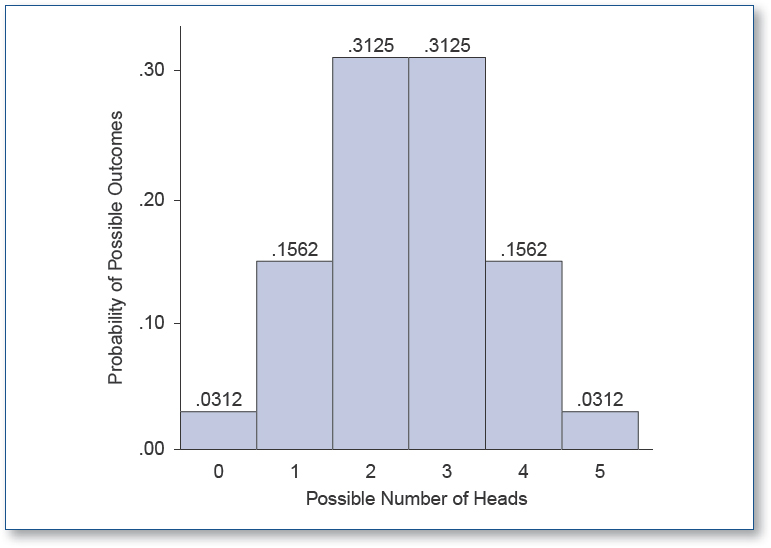
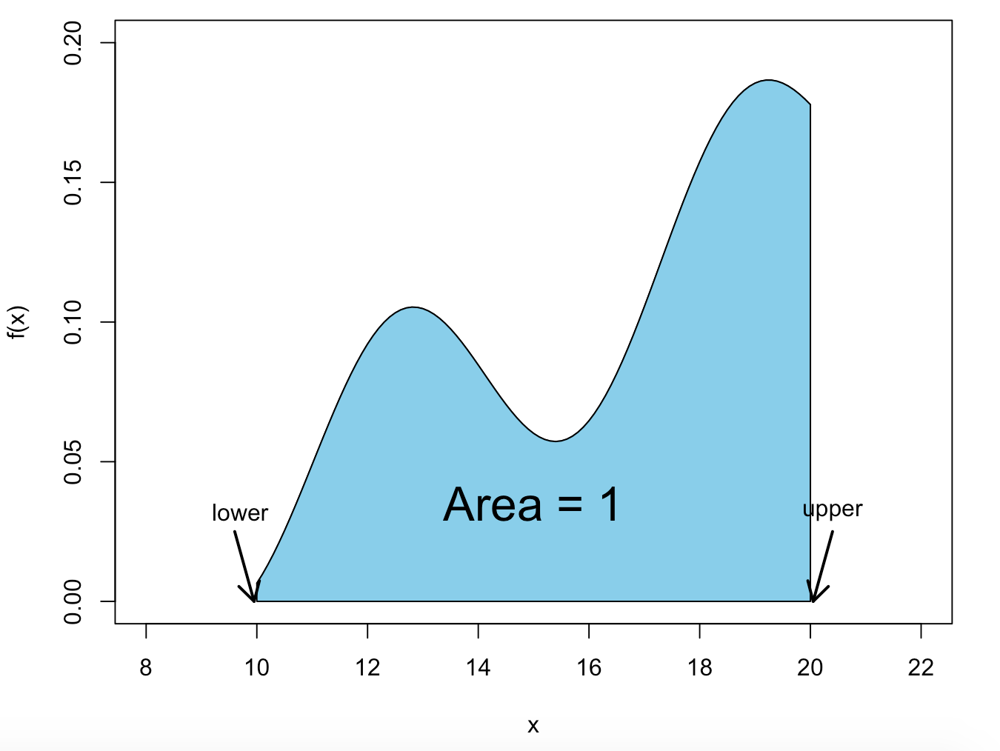

```{r setup, include=FALSE}
knitr::opts_chunk$set(echo = TRUE, fig.align = 'center')
```
# Learning Objectives

* Understand the concepts of probability mass function and probability density function
* Be familiar with some common distribution functions
* Understand that many things are normally distributed
* Know some examples of normally distributed quantities
* Understand variance and standard deviation for a normal distribution
* Be able to use distributions to calculate parameters of a normal distribution
* Know about the empirical $3\sigma$ rule for a normal distribution

**Duration - 90 minutes**

<hr>

# Discrete vs. Continuous variables

Today we're going to have a look at a few commonly used standard probability distributions: how they arise, and the circumstances in which they are useful. First, we need to make sure we know the fundamental distinction between **discrete** and **continuous** variables (so we can make a distinction between their resulting distributions).  

As a reminder, we can distinguish between **discrete** and **continuous** random variables: 

* essentially all categorical variables are discrete 
* numerical variables may be of either class, e.g. 
  - a count of flawed items coming from a production line each day is discrete numerical.
  - the masses of the items produced are continuous numerical. 


And as another reminder, random variables are they are uncertain before they are measured/counted/ascertained, and they vary from person to person. Most of the variables we concern ourselves with in statistics will be random variables.  

<br>

For example, imagine sampling people from a population and taking note of each person's age in years, height in metres, weight in kilograms, shoe size and vegetarian status (true/false). This will all come in a variety of different forms:   


| Variable         | Classification       |
|------------------|----------------------|
| age (years)      | discrete numerical   |
| height (m)       | continuous numerical |
| weight (kg)      | continuous numerical |
| shoe size        | ordinal categorical  |
| vegetarian (T/F) | binary categorical   |

<br>


<blockquote class='task'>
**Task - 5 mins**   
Think about any data you might have gathered or worked on in your life before CodeClan. Identify a few random variables and their classifications.
</blockquote>

<br>


# Probability mass and density functions

Now we can move on to seeing how discrete and continous variables are reflected in their distributions. Let's first start with their different definitions.  

<br>


<div class='emphasis'>
**Discrete probability distribution**: A discrete distribution associates a probability with each allowed value of a discrete random variable. Sometimes you may hear this described as a **probability mass function**.
</div>
<br>

<div class='emphasis'>
**Continuous probability distribution**: A continuous distribution associates a **probability density** with each allowed value of a continuous random variable. This is very commonly described as a **probability density function**.<br>
</div>

<br> 

Only questions that ask about the probability of a random variable lying **between two values** give meaningful probabilities as answers.<br><br> For example, if we have a study of people and their heights are:  

<center><br> 170.1, 169.3, 180.2, 170.4, 173.4 </center> <br>


A **valid question** for the height variable might be: <br><br>

<center>"What is the probability that a randomly sampled person has a height **between** 170 and 180cm?".</center>
<br>
But, a question like:<br><br> 

<center>"What is the probability that a randomly sampled person from our dataset has a height **of exactly** 173.240915cm?"</center>
<br>
is **not valid**, as in our sample data this probability is actually zero!    

<br>


## Rules for valid probability distributions


* All probabilities have to be positive.      

  
* (**discrete**) The probabilities of each of the allowed values of a discrete random variable $x$ must sum to $1$, i.e.   $$\sum_i{f(x_i)}=1$$


* (**discrete**) Each probability $f(x_i)$ must be between 0 and 1
  $$0 \leq f(x_i) \leq 1$$
  
    
For discrete values, this can be represented as a bar graph, with the probabilities on the y axis and the discrete values (in our case, values of a coin toss) on the x axis. Here, we can see our probabilities all sum to 1, and are all between 0 and 1. 

<br>
```{r, echo=FALSE, out.width = '60%'}

```
  
* (**continuous**) For a continuous probability distribution, the ‘sum’ of the probability density also must equal  1. For now, you need to know that this is calculated a slightly different way: for a continuous probability, probability is calculated as the area under the curve. Don't worry too much about this right now, we will go through this today. Essentially, a continuous probability distribution represents the same kind of information as above, but along the x you have your continous values and the probability is again up the y.

<br> 

```{r, echo=FALSE, fig.cap="**Fig. 1** A valid probability density function f(x), defined between x-values *lower* = 10 and *upper* = 20. The area under the curve is 1.", out.width = '60%'}

```


The maths behind calculating a continuous distribution sum is slightly more complicated. If you are interested, it is stated below. However, **don't worry** if this rule is bringing back painful memories of calculus, it's not required, all you really need to know is that, for a continuous probability distribution, the 'sum' of the probability density is the area under the curve, and this must equal $1$.

Calculating the sum of a continous distribution involves an **integral**. For a continuous probability distribution, the integral of the probability density $f(x)$ must equal $1$, i.e. for a probability density defined between limits $x=\textrm{lower}$ and $x=\textrm{upper}$
$$\int_{\textrm{lower}}^{\textrm{upper}}f(x)dx = 1$$
<br>
e.g. if we assume that people have weights $w$ in kilograms between limits $\textrm{lower}=0$ kg and $\textrm{upper}=200$ kg, the probability density $f(w)$ must obey $\int_{0}^{200}f(w)dw=1$<br><br> 

  
<br>


<hr>


# Discrete distributions

## Discrete uniform

Let's revisit our uniform distribution from earlier today. 

```{r, message=FALSE}
library(tidyverse)
```

```{r, echo = FALSE}
die <- tibble(
  x = c(1, 2, 3, 4, 5, 6),
  f_x = replicate(6, 1/6)
)

die %>%
  ggplot(aes(x = x, y = f_x)) +
  geom_col() + 
  xlab("number on die rolled") + ylab("probability")
```

If we have $n$ possible values for a random variable $x$, and all possible values are equally likely, the discrete probability distribution is given by

$$f(x_i) = \frac{1}{n}$$
e.g. roll of a single die, $S = \{1,2,3,4,5,6\}$, random variable $x$ is the number rolled, so the probability distribution $f(x) = \frac{1}{6}$.


<br>
<div class='emphasis'>
**Cumulative distribution function**

It turns out there is another interesting way to think about distributions: the **cumulative distribution function (CDF)** $F(x)$. 'Cumulative' here just means 'adding up': $F(x)$ tells you the probability of obtaining an outcome of value $x$ or below. So, in the die rolling example:

$$F(1) = \frac{1}{6}$$
i.e. we have a $\frac{1}{6}$ probability of obtaining a value $1$ or below

$$F(2) = \frac{1}{6} +  \frac{1}{6} = \frac{1}{3}$$
a $\frac{2}{6} = \frac{1}{3}$ probability of obtaining a value $2$ or below

$$F(3) = \frac{1}{6} +  \frac{1}{6} + \frac{1}{6} = \frac{1}{2}$$
a $\frac{3}{6} = \frac{1}{2}$ probability of obtaining a value $3$ or below, and so on...  
  
The `cumsum()` (cumulative sum) function in R can calculate the CDF for us!
</div>
<br>

Let's have a look at the CDF for the die-roll experiment

```{r}
die <- die %>%
  mutate(F_x = cumsum(f_x))

die %>%
  ggplot(aes(x = x, y = F_x)) +
  geom_step() +
  ylim(0, 1) + 
  xlab("number on die rolled") + ylab("probability")
```

<blockquote class='task'>
**Task - 2 mins**   
How would we use the CDF to get the probability of $x$ taking a value $4$, $5$ or $6$?

<details>
<summary>**Hint**</summary>
Can we use the values of $F(6)$ and $F(3)$ somehow?
</details>

<details>
<summary>**Solution**</summary>
$F(6)$ gives us the probability of $x$ being $6$ or less, and $F(3)$ gives us the probability of $x$ being $3$ or less, so we can take the difference to get:

$$\textrm{prob}(x=\{4,5,6\}) = F(6) - F(3) = 1 - 0.5 = 0.5$$
</details>
</blockquote>

# Continuous distributions

## Continuous uniform

The lengths $l$ in minutes of the 'brain breaks' at CodeClan were monitored for a week, and it was found that they were **distributed uniformly** from 5 mins to 22 mins. Now here $l$ is **continuous**: it could be $6$ mins, it could be $7.1823$ mins, or any other value between $5$ and $22$ mins. What will the **probability density function** $f(l)$ for the continuous random variable $l$ look like?  

R can help us here! It provides: 

* a uniform density function `dunif(x, min, max)`
* a cumulative density function `punif(q, min, max)`

<br>
<div class='emphasis'>
This pattern of probability related functions recurs everywhere in R, it goes like this:

* `d<something>()` is a *distribution* or *density* function (input: a value, output: the probability or probability density of that value)
* `p<something>()` is a *CDF* (input: a value, output: the probability of obtaining that value or less)
* `q<something>()` is a *quantile* function (think of this as the 'opposite' of the CDF, input: a probability, output: the value at which the CDF equals that probability)
* `r<something>()` generates *random numbers* drawn from the distribution (outputs as many random numbers as you request)
</div>
<br>

```{r}
# plot a bit extra below l = 5 and above l = 22 mins
brain_breaks <- tibble(
  l = seq(4, 23, by = 0.01),
  f_l = dunif(x = l, min = 5, max = 22)
)

brain_breaks %>%
  ggplot(aes(x = l, y = f_l)) +
  geom_line() +
  ylim(0, 0.075) + 
  xlab("L (breaks minutes)") + ylab("f_l (probability density)")
```

So we can see that the probability density is zero outside the range 5 to 22 mins, and equal to $\frac{1}{22-5}$ within the range.

What about the cumulative density function $F(l)$? This has to start at zero at $l = 5$ and go to $1$ at $l = 22$, as we've said that all the $l$ values **must** be in the range from $5$ to $22$ minutes.

<blockquote class='task'>
**Task - 2 mins**   
Take a moment to think about the form of the cumulative density, given the limits we mentioned above. Sketch what you think it will look like.
<br><br>
[**Hint**: every time we increase $l$ by a 'little bit', the cumulative density will increase by another 'little bit' at constant rate]
<details>
<summary>**Solution**</summary>
```{r}
brain_breaks <- brain_breaks %>%
  mutate(F_l = punif(q = l, min = 5, max = 22))

brain_breaks %>%
  ggplot(aes(x = l, y = F_l)) +
  geom_line()
```
</details>
</blockquote>

How do we use the continuous CDF? Just as we did for the discrete CDF: like this!<br><br> 

<center>"What is the probability of a brain break lasting between $8.4$ and $10.751$ mins?"</center><br>

$$\textrm{prob}(8.4 \lt l \leq 10.751) = F(10.751) - F(8.4)$$

```{r}
punif(q = 10.751, min = 5, max = 22) - punif(q = 8.4, min = 5, max = 22)
```

Let's shade that part of the distribution function

```{r}
brain_breaks %>%
  ggplot(aes(x = l, y = f_l)) +
  geom_line() +
  ylim(0, 0.075) +
  geom_area(aes(x = ifelse(l > 8.4 & l < 10.751 , l, 0)), fill = "red")
```

The probability $\textrm{prob} = 0.138$ we calculated above is just the area of the red rectangle!


## Normal

Last but not least, we get to the **normal distribution**. Let's plot the probability density for a **normal distribution** to get a sense for what it looks like! 

We'll use the `dnorm(x, mean, sd)` function, which provides the normal probability density. Here, `mean` and `sd` are the mean and standard deviation of the distribution: the `mean` **centres** the distribution at a particular value, and `sd` tells us how **broad** it will be. 

```{r}
three_norms <- tibble(
  x =  seq(0, 20, 0.1),
  f1_x = dnorm(x = x, mean = 10, sd = 1), 
  f2_x = dnorm(x = x, mean = 10, sd = 2),
  f3_x = dnorm(x = x, mean = 10, sd = 3)
)

three_norms %>%
  ggplot() +
  geom_line(aes(x = x, y = f2_x), col = "black")
```


So we see the curve is "bell shaped" (often also called a "Gaussian" shape) and is centred around the mean of $10$ that we specified. 

The spread of the distribution is governed by the standard deviation parameter: the greater $sd$, the greater the spread. You'll see this if we plot the distributions which have a greater standard deviation:
<br>
```{r}

three_norms %>%
  ggplot() +
  geom_line(aes(x = x, y = f1_x), col = "black") +
  geom_line(aes(x = x, y = f2_x), col = "red") +
  geom_line(aes(x = x, y = f3_x), col = "blue")
```
<br>
Notice as well that the distribution never reaches the horizontal axis, so even very large variable values (positive or negative) have a non-zero probability density, even if that density is **really** small. 

<br>
<div class='emphasis'>
For completeness' sake, here is the equation for the probability density of the normal distribution.

$$f(x) = \frac{1}{\sigma \sqrt{2\pi}} \textrm{exp} \bigg[ \frac{-(x-\mu)^2}{2\sigma ^2}\bigg] \; \textrm{where} \; (-\infty \lt x \lt \infty)$$
Here $\mu$ is the mean, and $\sigma$, the standard deviation. You really don't need to know this! It's much more important to have a feeling for the **shape** of the distribution, how it shifts and varies with $\mu$ and $\sigma$. 
</div> 
<br>

<br>
<blockquote class='task'>
**Task - 2 mins** 
Using the R code above as your starting point, play around in the R console plotting normal distributions with:

* different spreads (i.e. standard deviations `sd`)
* centred around different mean values (`mean`).
</blockquote>

The **normal distribution** is incredibly important in statistics because it turns out that many quantities in all aspects of life are approximately **normally distributed**. Classic examples of normally distributed quantities include: physical parameters of individuals (height, weight, shoe size), mental parameters (IQ), stock volatilities, travel times.

We've also learnt already what distributions that aren't normal look like: you've seen examples of **left skewed** and **right skewed data** earlier today as well. 

We'll also see tomorrow that **sampling distributions** tend to be normal: this is a really important fact. Essentially the whole of classical statistics is built on this finding. 

<br>
<div class='emphasis'>
Quantities tend to be normally distributed when they are 'made up' of contributions from many smaller and randomly distributed quantities that vary independently of each other. e.g. 

* potentially many genes and environmental factors contributing to the heights of individuals
* variations in numbers of passengers boarding, traffic density, weather and time of day contributing to bus journey times etc.

</div>
<br>

There are various different ways to 'test' whether a given distribution is normal or not, you'll find a decent description of these tests [here](http://www.sthda.com/english/wiki/normality-test-in-r).

## 'Fitting' a normal distribution to a data set

If we have a data set that we believe is normally distributed, we can 'fit' a normal distribution to the probability distribution or density by calculating the mean and standard deviation of the data. 

We then use these calculated values as our 'best estimates' of the `mean` and `sd` parameters of the fitted normal distribution. 

Let's try fitting a normal distribution to the salaries of `Accounting` positions in the Tyrell Corporation.

```{r, warning = FALSE}
jobs <- read_csv("data/TyrellCorpJobs.csv")
accounts_salary_stats <- jobs %>%
  filter(Position == "Accounting") %>%
  summarise(
    num = n(),
    mean = mean(Salary),
    sd = sd(Salary)
  )
accounts_salary_stats
```
<br>
Now let's build a fit a normal distribution to our data:  
<br>
```{r}
jobs %>% 
  filter(Position == "Accounting") %>%
  ggplot(aes(x = Salary)) +
  geom_histogram(aes(y = ..density..), col = "white", bins = 25) +
  stat_function(
    fun = dnorm, 
    args = list(
      mean = accounts_salary_stats$mean, 
      sd = accounts_salary_stats$sd
    ),
    col = "red"
  )

```

And there we go. Our data has been plotted and a normal distribution curve fit. You might look at that and say, "it looks a bit skewed", but in reality that value out on the right is probably an outlier rather than a pattern of data demonstrating skew. We will touch more on these topics during our "outlier" removal lesson.  

<br> 

## Standard normal

Often, we describe a normal distribution in terms of a **standardised variable**, which is called **$z$** by convention (this is just the **$z$-score** introduced in the earlier `tidyverse` lessons)

$$z = \frac{x - \bar{x}}{s}$$
This variable just tells us how far away we are from the mean (the centre of the distribution) in units of the standard deviation of the distribution, and the sign tells us the direction. 

So, for example:

* $z = -1$ tells us we are "one standard deviation below the mean"
* $z = 2.6$ tells us we are "2.6 standard deviations above the mean".

If we use $z$ rather than $x$ in the normal equation, it assumes a simpler form known as the **standard normal distribution**

<br>
<div class='emphasis'>
You can think of the standard normal distribution as a normal distribution with mean set equal to $0$, and standard deviation set equal to $1$.
</div>
<br>

<br>
<details>
<summary>**Standard normal equation**</summary>
If we use $z$ rather than $x$ as our variable, the normal distribution density transforms to the standard normal

$$f(z) = \frac{1}{\sqrt{2\pi}} \textrm{exp} \bigg[ \frac{-z^2}{2}\bigg] \; \textrm{where} \; (-\infty \lt z \lt \infty)$$
 
Phew, much simpler, but you still don't need to remember this! 
</details>
<br> 


The function `dnorm()` **defaults to plotting the standard normal distribution** if we don't provide `mean` or `sd` arguments (i.e. it assumes `mean = 0, sd = 1` by default). 

```{r}
standard_normal <- tibble(
  z = seq(from = -4, to = 4, by = 0.01),
  f_z = dnorm(x = z)
)

standard_normal %>%
  ggplot(aes(x = z, y = f_z)) +
  geom_line()
```

What about the standard normal CDF? This works in exactly the same way as for the continuous uniform distribution above: we provide a $z$-value, and R provides the probability of the random variable taking a value less than or equal to that $z$-value!

e.g. "What is the probability of the standard normally distributed random variable $z$ assuming a value $z \leq 0$

```{r}
# first, lets get the probability of z <= 0
pnorm(q = 0)
```

Now let's make the graph and see how that matches up.   <br>
```{r}
# SLACK THIS OUT
shade_standard_normal <- function(lower, upper){
  standard_normal <- tibble(
    z = seq(from = -4, to = 4, by = 0.01),
    f_z = dnorm(x = z)
  )
  standard_normal %>%
    ggplot(aes(x = z, y = f_z)) +
    geom_line() +
    ylim(0, 0.5) +
    geom_area(aes(x = ifelse(z > lower & z <= upper , z, NA)), fill = "red")
}

shade_standard_normal(lower = -4, upper = -0)
```

This makes sense! The distribution is **symmetrical to the left and right of zero**, so half the values have to lie below $z = 0$ and half above. 

Note that the probability is just equal to the shaded area under the density, exactly as it was for the continuous uniform distribution. We can either use calculus to find the probability, or let R do it for us using `pnorm()`.
<br> 

<blockquote class='task'>
**Task - 10 mins** 
Use the `pnorm()` function and the `shade_standard_normal()` function we defined above to find and illustrate the probabilities of finding a standard normally distributed variable $z$ with values:

1. $z \leq -3$
2. $z \leq -2$
3. $z \leq -1$
4. $z \leq +1$
5. $z \lt +\infty$ 

Convert the probabilities into percentages.

[**Hint**: for question 5, you can pass `Inf` to `pnorm()` and `shade_standard_normal()`]

<details>
<summary>**Solution**</summary>

```{r}
# 1.
100 * pnorm(q = -3)
shade_standard_normal(lower = -4, upper = -3)

# 2.
100 * pnorm(q = -2)
shade_standard_normal(lower = -4, upper = -2)

# 3.
100 * pnorm(q = -1)
shade_standard_normal(lower = -4, upper = -1)

# 4.
100 * pnorm(q = 1)
shade_standard_normal(lower = -4, upper = 1)

# 5.
100 * pnorm(q = Inf)
shade_standard_normal(lower = -4, upper = Inf)
```
</details>
</blockquote>

## The empirical $3\sigma$ rule


We've said that most values lie within three standard deviations of the mean. Now let's calculate the percentages of values lying within one-, two- and three standard deviations of the mean.  

**(i). Within one standard deviation**  

The percentage of values within one standard deviation of the mean is
```{r}
100 * (pnorm(q = 1) - pnorm(q = -1))
shade_standard_normal(lower = -1, upper = 1)
```

**(ii). Within two standard deviations**  

<br>
<blockquote class='task'>

**Task - 2 mins** Calculate the percentage of values lying within two standard deviations of the mean. Plot the corresponding area of the standard normal.

<details>
<summary>**Solution**</summary>
The percentage of values within two standard deviations of the mean is
```{r}
100 * (pnorm(q = 2) - pnorm(q = -2))
shade_standard_normal(lower = -2, upper = 2)
```
</details>
</blockquote>
<br>

*(ii). Within three standard deviations*

<br>
<blockquote class='task'>
**Task - 2 mins** Finally, calculate the percentage of values lying within three standard deviations of the mean. Plot the corresponding area of the standard normal.

<details>
<summary>**Solution**</summary>
The percentage of values within three standard deviations of the mean is
```{r}
100 * (pnorm(q = 3) - pnorm(q = -3))
shade_standard_normal(lower = -3, upper = 3)
```
</details>
</blockquote>
<br>

<br>
<div class='emphasis'>
We call these results the **empirical $3\sigma$ rule**, or **68-95-99.7 rule**.<br>
The proportions of values lying within one-, two- and three standard deviations of the mean are 68, 95 and 99.7% respectively. This is true for **any** normal distribution regardless of mean or standard deviation!
</div>
<br>

<hr>

# Recap

* What are the defining rules for a **probability mass function** associated with a **discrete** random variable?
<details>
<summary>**Answer**</summary>
No probability below zero or above 1.<br>
Sum of probabilities over all possible values of the random variable is 1.
</details>

<br>

* What are the defining rules for a **probability density function** $f(x)$ associated with a **continuous** random variable?
<details>
<summary>**Answer**</summary>
$f(x)$ 'sums' to 1 over all allowed $x$ ('sums' here means integrates, but don't worry about this)<br>
$f(x) \ge 0$ for all $x$.
</details>

<br>

* Briefly describe the normal and standard normal distributions.
<details>
<summary>**Answer**</summary>
**Normal**: an important distribution that turns up often in real data. Characterised by a 'bell shaped' curve that concentrates probability density close to the mean value, tailing off away from the mean. The mean parameter determines the centre of the curve, the standard deviation determines the spread.  

**Standard normal**: equivalent to the normal curve with a mean of zero and standard deviation of one.
</details>

<br>

* What sort of questions yield meaningful probabilities from a probability density function?
<details>
<summary>**Answer**</summary>
Questions where we ask about the probability of the corresponding continuous random variable lying in a range **between** two values, e.g. "What is the probability of an individual having a height between $1.70$ and $1.9124$ metres?"
</details>

<br>

* How do we answer such questions?
<details>
<summary>**Answer**</summary>
As a difference between the CDF values calculated at the edges of the range, e.g. $\textrm{CDF}(1.9124)-\textrm{CDF}(1.70)$ in the example above.
</details>

<br>

* If we think a probability density function $f(x)$ might be close to normal, how could we 'fit' a normal distribution to check?
<details>
<summary>**Answer**</summary>
Calculate the mean and standard deviation for the data, and plot a normal density function passing those values as parameters. 
</details>

<br>

* What is the $3\sigma$ rule for a normal distribution?
<details>
<summary>**Answer**</summary>
The proportions of values lying within one-, two- and three standard deviations of the mean are 68, 95 and 99.7%. This is true for **any** normal distribution.
</details>
  
<hr>


