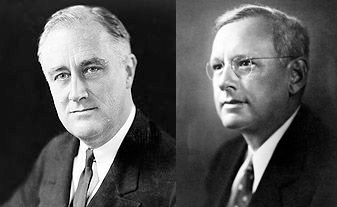
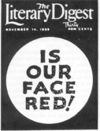
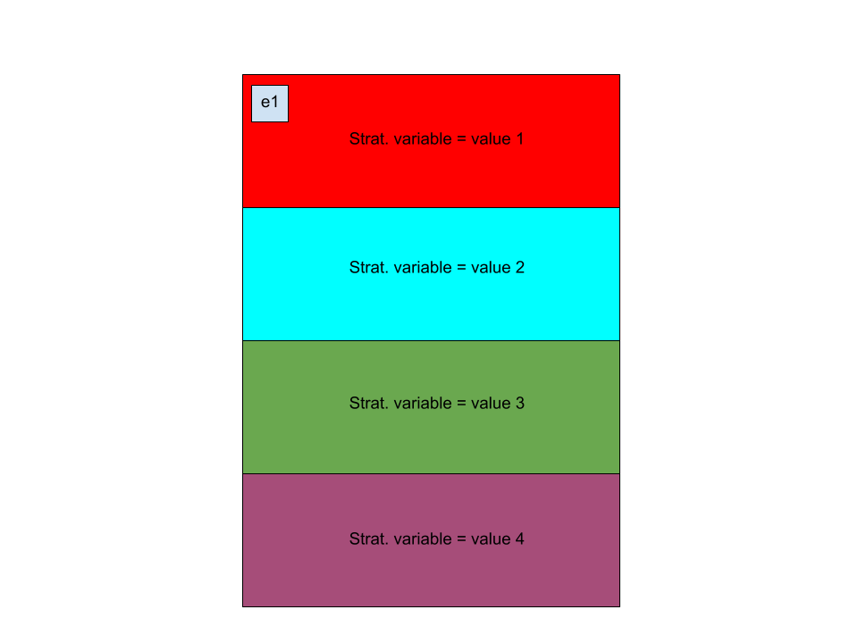

```{r setup, include=FALSE}
knitr::opts_chunk$set(echo = TRUE, fig.align = 'center')
```
# Learning Objectives
* Be able to distinguish between sampling error and bias
* Be able to describe potential sources of bias
* Know about some real-world examples of biased samples

**Duration - 60 minutes**

<hr>

# Sampling bias

When we perform a sample from a population, what we want to achieve is a smaller dataset that keeps the same statistical information of the population.

Earlier today we introduced the concept of sampling error:

<div class='emphasis'>
**Sampling error**: the difference between a population parameter and the comparable statistic computed from a particular sample. We rarely know population parameters, and so we usually cannot directly calculate sampling errors.
</div>

<br>

In addition to these, we consider a new topic in this lesson:

<br>

<div class='emphasis'>
**Bias (aka 'sampling bias')**: the concept that some aspect(s) of the sampling process make it more likely to include particular elements of the study population than others, leading to a sample that is **not representative** of the full population. This undermines the whole idea of being able to use a relatively small sample to inform us about a much larger population.

For example, if we try to sample the population of the country by calling $1,000$ home landlines during the day, we are likely to introduce *bias* into our sample, as we are excluding people out at work. Our sample will not be a true reflection of the population, it will have proportionally too few working people.
</div>

<br>

Now, keeping the concept of bias in mind, we can think of sampling error as having two main components: 

* First, there is a random part due to the fact that we sampled only a subset of the full population, often with some degree of randomness in the selection of elements to include.  
* Second, there is a non-random 'systematic' part due to the fact that our sampling method introduces *bias*: the sample we obtained and used for our analysis was not representative of the population. 

We can reduce sampling error in two ways: 

* We can gather larger samples (statisticians are sometimes accused of *always* suggesting this course of action)
* We can design sampling procedures to minimise bias.

<hr>

# Major sources of bias

The presence of sampling bias in a study is due to deficiencies in the process of **how we select our sample** or **how we measure or collect responses**. Here are the major sources of sampling bias.

## Self-selection bias
  
Consider performing an online survey of computing habits: our primary aim is to determine how many hours on average each member of the population spends interacting with IT equipment. But the fact that we are performing our sampling **online** biases the results we obtain! We are drawing our sample from people who already have a tendency to spend more time interacting with IT equipment. 

A similar phenomena occurs when we publish an open call for individuals to submit their opinions on a topic. People must **self-select** into our sample. As a consequence, the sample will be biased towards individuals holding strong views on the topic, as they will be more likely to submit a response.
  
## Undercoverage and/or non-response bias

Undercoverage occurs when members of a distinct subset of our study population are inadequately sampled. This is a failure at the design stage of our study. Consider surveying a population in a country where region A is readily accessible, and region B is dangerous or presents other obstacles to travel. We may not be able to risk or afford sending a sufficient number of surveyors to region B, and so the subpopulation of that region is **undersampled** relative to the subpopulation of region A. Consequently, the results of our survey are biased towards the responses of individuals living in region A.

Another form of undercoverage bias called **non-response bias** can occur at execution of sampling. Consider asking 1000 employees in a corporation to complete and return a survey of their current workload. Now, our study design seems good: we have adequately covered all departments, grades, genders etc. However, employees with a high workload may not return the survey because they lack sufficient time to fill it out! On the other hand, employees with low workload may not return the survey because they fear their anonymity will not be maintained and they will be seen as candidates for redundancy! Our sampling will likely be biased towards employees with moderate workloads.      

## Survivorship bias

Survivorship bias (AKA survival bias) occurs when we select into our sample only those elements of a population who survive to be sampled! This is a subtle point: [this video](https://www.youtube.com/watch?v=7BizkfE-T58) on survivorship bias in Second World War bomber planes might help you to see the problem.

In this example, military leaders were interested in armouring bombers to help them survive bombing runs over enemy territory. Not being able to completely armour the planes (due to weight restrictions), the leaders focussed on damaged areas found on bombers returning from runs and decided to further strengthen those areas. But statistician Abraham Wald examined their data and instead suggested armouring the areas that **had not been significantly damaged in returning bombers**...

His logic? The leaders were examining bombers that had been able to return to base, and so, by definition, the damaged areas on those planes were non-critical! Planes damaged in other areas had presumably **not been able to return**, and so those were the areas requiring extra armour... 

## Response bias

Response bias occurs due to problems in the execution of a survey, in which participants or objects under study give **inaccurate responses** or are otherwise measured inaccurately. 

Consider a survey of the incidence of antisocial behaviour amongst a population. Individuals likely do not wish to be seen as antisocial, and are likely to under-represent their antisocial behaviour when replying to a survey, particularly if they are interacting with a surveyor in person. Misleading survey questions or asking individuals to recollect distant memories ('faulty recall') may also generate response bias.  

<hr>

# A classic real-world case

<blockquote class='task'>
**Task - 20 mins** 

Do some internet investigation of the Literary Digest poll for the Landon-Roosevelt US Presidential Election of 1936. 

This is considered a classic case study of bias in statistical sampling. Consider the following questions in particular:<br> 

* How did the Literary Digest conduct their sampling of the electorate?
* Why was their poll so badly wrong? 
* Why was George Gallup's much smaller poll more accurate?

<br>
```{r, echo=FALSE, fig.cap="**Fig. 1** Landon vs. Roosevelt, 1936 US Presidential Election", out.width = '40%'}

```

<details>
<summary>**Solution**</summary>

Sample resources:

* [video](https://www.youtube.com/watch?v=R2vhjC5qCQk)
* [video](https://www.youtube.com/watch?v=JwZo28RKdvU)
* [short document](https://www.math.upenn.edu/~deturck/m170/wk4/lecture/case1.html)

<br>

Literary Digest prediction:  Langdon 57%,   Roosevelt 43% <br>
Actual election result:      Langdon 38%,   Roosevelt 62%       

<br>

The sampling error was 19%, one of the largest ever recorded, and this was mostly due to sampling bias! On the face of it, the Literary Digest poll should have been excellent: 2.3 million people were sampled, as compared with 50,000 people in the Gallup poll. But Gallup correctly called a victory for Roosevelt, whereas the Literary Digest blundered badly. So where did the Literary Digest go wrong?  
<br>
**Sampling Technique**: The Literary Digest compiled a mailing list of 10 million people from every US telephone directory, registered automobile owners, membership rosters of clubs and associations and lists of magazine subscribers. Next they mailed each of the 10 million people on the mailing list a mock ballot paper and asked them to fill it out and return it, obtaining 2.4 million mailed responses.  
<br>
**Problems**: automobiles and telephones were still very much luxury items in the 1930s, as were memberships of the type of clubs targeted by the magazine, biasing the sample towards higher economic status individuals. Moreover, at least 9 million people (approx. 7% of the US population) were unemployed in 1936, and would likely not be represented in the Literary Digest sample. Finally, the response rate of the poll was only 24%. Were the people who responded broadly comparable to those who did not respond, or did they differ significantly (beyond the obvious differences in their attitude to surveys)? The final result was that the Literary Digest sample did not accurately represent the US voting population.        
<br>
```{r, echo=FALSE, fig.cap="**Fig. 2** Literary Digest cover after their disastrous prediction", out.width = '20%'}

```
<br>
*Gallup's poll* used direct survey techniques and was far less likely to suffer from sampling bias, leading to a more accurate prediction with a much smaller sample.
</details>
</blockquote>

<hr>


# Potential bias in sampling techniques 

In the last lesson we introduced the 'simple random sampling' method. 

<div class='emphasis'>
**Simple random sampling (SRS)** - a sampling method in which **every** element of the population has **an equal** probability of being selected into the sample.
</div>
<br>

Simple random sampling is usually the easiest and simplest sampling method, it's probably the most common too. It works well **on average**, but there's still a chance that the single sample that you draw is far from representative of your population (maybe you happen to choose lots of 'extreme' values from your population). The probability of this occuring is very small, but it can introduce a bias in our sample that would mean our inferences about the population would be poor! 

There are lots of other sampling techniques; another commonly used one is **stratifed sampling**, which aims to reduce the chance of generating an unrepresentative sample. 


## Stratified sampling 

Stratified random sampling is a technique that can help us generate representative samples! Under certain circumstances, it can also lead to **increased precision** relative to simple random sampling.

<div class='emphasis'>
**Stratification** - the process of splitting the population up into separate 'strata': non-overlapping groups of the population. Each element of the population belongs to one and only one stratum.

```{r, echo=FALSE, fig.cap="**Fig. 1** Stratification of the population in terms of the values of a stratification variable. Population element e1 belongs to the first stratum", out.width = '80%'}

```
</div>
<br>

<div class='emphasis'>
**Proportionate stratified sampling** - sampling such that the proportion of each stratum in the sample is the same as the proportion of that stratum in the population. So we need to have prior information about the population split of these to groups to do this. We then randomly sample the required number of elements from each stratum, we would call this **proportionate stratified random sampling**.

For example, the 2011 census of England and Wales revealed a breakdown of population by age as in the following table. So, we could use this data to form four strata for sampling. If we sampled $1,000$ people in total, a proportionate stratified random sample would try to capture the number of people in the last column from each stratum. 

| stratum | age range (years) | proportion in population | N(sample 1000) | 
|---|---|---|---|
| 1 | less than 18 | 21.3% | $0.213 \times 1000 = 213$ people |
| 2 | 18 to 39 | 29.5% | $0.295 \times 1000 = 295$ people |
| 3 | 40 to 59 | 26.7% | $0.267 \times 1000 = 267$ people |
| 4 | 60 and over | 22.5% | $0.225 \times 1000 = 225$ people |

<br>

We may use stratified sampling if we can identify an important predictor variable to stratify by. Stratification is particularly effective when the strata are homogeneous with respect to the target variable of the study, particularly when the target variable distributions in each strata show little overlap. What does this mean?

In the case of the telecomms data, we are interested in estimating the mean monthly charges. So, we should look for a variable on which to stratify our population so that each stratum has as narrow a spread of monthly charges as possible, preferably overlapping little with monthly charges in other strata. Perhaps we may start with gender and then test out some other stratification variables. 

The main difficulty with stratified sampling is we need to know the strata splits of the **population** in order for us to create the representative strata splits in the sample. We may need domain knowledge for this, or it can perhaps be obtained by running small 'pilot' studies to design the bigger sampling study. 

### Post-sample stratification 

What we've just described is stratifying before taking the sample i.e. we take the sample **based on** these strata splits. But we can also stratify post-sample. 

So we may have taken a sample via simple random sampling but we notice that some stratas are over represented. For example in the telecoms example from earlier today, we may know that we expect our population to have a 50:50 male to female split but our sample ends up having a 20:80 split. We can apply the stratification logic described above to our sample to 'rebalance' the sample to look more like the strata proportions in the population . 


# Recap

* What is sampling bias and how does it arise?
<details>
<summary>**Answer**</summary>
Sampling bias can be broadly defined as the concept that, in any sample taken from a population, some elements or objects from the population are more likely to be included in the sample than others, and/or are liable to provide inaccurate responses. We think of a poor sampling methodology *leading to* biased samples. A biased sample is **not representative** of the population from which it was drawn.
</details>

<br>

* What four major sources of sampling bias have we discussed?
<details>
<summary>**Answer**</summary>

    * **Self-selection bias**: if population entities must 'opt in' to a sample, we are liable to bias a sample towards entities with strong views.
    * **Undercoverage and non-response bias**: design failure may lead some sub-populations to be undersampled relative to other sub-populations. Even with good design, entities in some sub-populations may be less likely to participate than those in other sub-populations, yielding non-response bias.
    * **Survivorship bias**: entities in a population who 'fail' or otherwise do not pass some 'selection event' cannot be included in a sample, biasing the sample towards those entities that survived the selection event. 
    * **Response bias**: misleading questions, fear of judgement or criticism, or other measurement deficiencies may lead some entities in a population to give inaccurate responses to a survey. 

</details>

# Additional Resources

* Try out [this quiz](https://www.khanacademy.org/math/ap-statistics/gathering-data-ap/sampling-observational-studies/e/bias-sample-survey) at Khan Academy on sources of bias!


