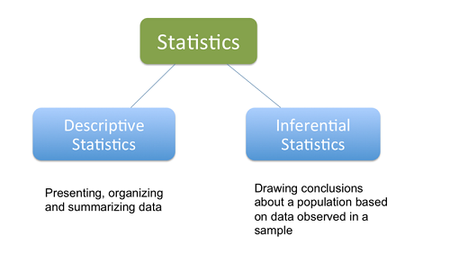

```{r setup, include=FALSE}
knitr::opts_chunk$set(echo = TRUE)
```


# Learning Objectives

* Know the difference between descriptive & inferential statistics

**Duration - 10 minutes**

# Descriptive and inferential statistics 

In module 1 we learnt about how to manipulate, digest and gain insight from data using both R and SQL. The kinds of techniques we applied there are called **descriptive statistics**, in which you summarise and/or plot the data to find meaning. 

Examples are finding the mean of your data, how widely spread  it is (standard deviation/variance) and plotting a histogram to show the shape of the data distribution. These techniques tell us information solely about the dataset (i.e. sample of data) that we hold. 

But what if we want information about the wider group from which our sample of data was drawn? Often we will not have access to data on the whole population we are interested in - often because it would be hugely expensive and time consuming to gather. 

For example, you may work in a bank and want to investigate the credit ratings of people who hold a credit card. 

* If you wanted to draw conclusions about **people who have a credit card issued by your bank**, then this would be a case of descriptive statistics because you would likely hold all relevant data on the population in question (i.e. everyone who holds a credit card issued by your bank). You would summarise and plot this data, and draw conclusions. 
* But if you wanted to draw conclusions about **people who hold credit cards in general**, well then, the data you possess is only a sample of this population. It would be incredibly difficult to get data on every credit card holder at every bank! 

So, how do we use this sample to draw conclusions about the wider popluation? 

This is what we will be covering over the next two days: the field of **inferential statistics**. We use a sample to make **inferences** about a population.

A well-known case of inferential statistics you may have heard of are exit polls conducted at elections (and surveys more generally), in which only a sample of voters at polls are questioned but this information is used to draw conclusions about the votes cast by the population of all UK voters, producing an estimated election result. 

<div class='emphasis'>
**Inferential statistics** allows us to draw conclusions from a sample and generalise them to a population,
</div>

We will be covering ways to collect samples, ensuring your sample is representative of the population, techniques to estimate the properties of a population from your sample and also to test hypotheses you make about your population. 

```{r, echo=FALSE,, out.width = '60%', fig.align="center" }

```


