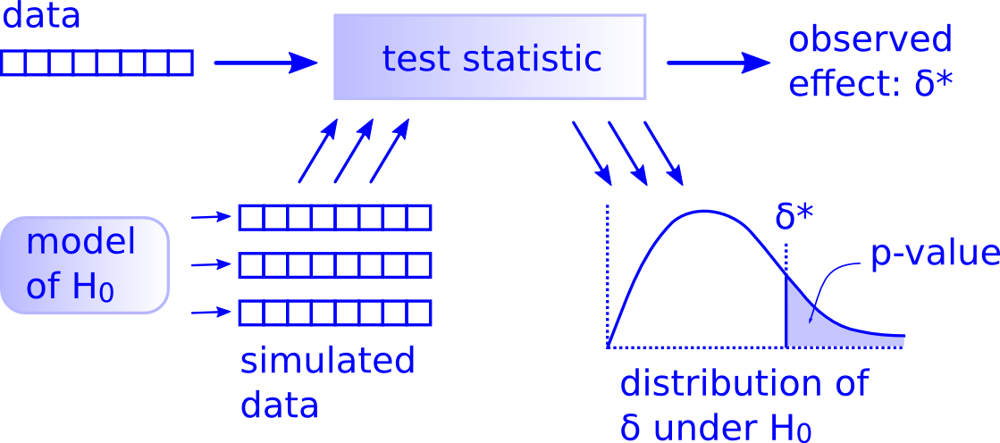

```{r setup, include=FALSE}
knitr::opts_chunk$set(echo = TRUE, fig.align = 'center')
```
# Learning Objectives<br>

* Understand the concepts of:
  - hypothesis tests
  - significance level
  - null and alternative hypotheses: $H_0$ and $H_a$
  - $p$-value
* Know what the outcomes of a hypothesis test are
* Be able to perform hypothesis test using the `infer` package

**Duration - 90 minutes**<br>

<hr>

# Introduction

We've seen how confidence intervals allow us to comment meaningfully on the likely range of a population parameter. In essence, they allow us to make comments like

<br>
<center>
*'We are XX% confident that the population parameter lies between [YY and ZZ]...'*
</center>
<br>

But what if we want to answer specific questions **about population parameters given a sample** of the population. For example:

* "From a sample of $10,000$ people and their voting intentions, can we reliably say that more than $50\%$ of the population intend to support the Monster Raving Loony Party?"

* "Given a sample of $1250$ credit records, can we reliably say that the mean credit score of the population is equal to $450$?"

Questions such as these are **statistical hypotheses** - they are statements about a population parameter that are either **true or false**. We investigate such statements using **hypothesis testing** (also known as **significance testing**).

# Ingredients of a hypothesis test 

```{r, message=FALSE}
library(tidyverse)
library(janitor)
library(infer)
```

First, let's load up the data set we'll be using: it's **a sample** of books and their details taken from the 2020 Goodreads database.

```{r, results ='hide'}
books <- read_csv("data/books.csv")
books <- clean_names(books)
```

Let's do some tidying up: 
```{r}
books_tidy <- books %>%
  filter(!is.na(average_rating)) %>%
  rename(num_pages = number_num_pages)
glimpse(books_tidy)
```

That looks better. Now we'll visualise the distribution of the `average_rating` values. These are the averages of the ratings recorded by Goodreads users for each book. 

```{r}
books_tidy %>%
  ggplot(aes(x = average_rating)) +
  geom_histogram(col = "white")
```

```{r}
books_tidy %>%
  ggplot(aes(y = average_rating)) +
  geom_boxplot() +
  coord_flip()
```

We have a large number of outliers leading to some left-skew. Now, we want to address the following problem:

<br>
<div class='emphasis'>
The mean `average_rating` for books in the Goodreads database in 2016 was $3.93$. Now, we have taken this current sample of books from the database, and we want to know if the mean `average_rating` for 2020 database **differs significantly** from the 2016 value? 
</div>
<br>

Again, remember here, if we had data for the population (i.e. the 2020 Goodreads database) then we wouldn't need to perform a hypothesis test. We could just look at descriptive statistics i.e. calculate the population mean from this full database and see how it compares to 3.93. But we have only a sample of the population, so we have to use inferential techniques to make predictions about the population. 

We frame this question in terms of two competing hypotheses:

* $H_0$: (the **null** hypothesis, pronounced 'H naught') - the current mean `average_rating` **is the same as** the mean `average_rating` in 2016.

* $H_a$: (the **alternative** hypothesis) - the current mean `average_rating` **is different from** the mean `average_rating` in 2016.

Note that we frame the question in **two mutually exclusive and exhaustive** hypotheses. Only one of them can be true: either the null hypothesis or the alternative hypothesis (**exclusive**), but it **must** be one or the other: there's no 'third option' (**exhaustive**). 

<br>
<div class='emphasis'>
* Typically, the null hypothesis represents a skeptical or conservative stance: the position of 'business as usual', 'no change', 'nothing interesting is happening' etc. 
* The alternative hypothesis is usually the dynamic stance: the position that 'something is different', 'things have changed' etc.
</div>
<br>

We can write our two hypotheses more mathematically as:

<br>
<center>
$H_0$: $\mu_{\textrm{average_rating}} = 3.93$<br>
$H_a$: $\mu_{\textrm{average_rating}} \ne 3.93$
</center>
<br>

When we're writing hypotheses mathematically, you'll often see:

* a population mean represented as $\mu$
* a population proportion represented as $\pi$

This is general - we tend to use Greek letters for population parameters (e.g. $\mu$, $\pi$, $\sigma$ etc), and Latin letters for sample statistics (e.g. $m$, $p$, $s$ etc). 

Let's see what the current `mean(average_rating)` is, this will be our observed statistic! When writing the observed statistic mathmatically you'll often see:

* a sample mean represented as $\bar{x}$
* a sample proportion represented as $p$

```{r}
observed_stat <- books_tidy %>%
  summarise(mean_rating = mean(average_rating))

observed_stat
```

So the `mean(average_rating)` is slightly higher now than it was in 2016, but is the difference big enough for this to be statistically significant? That is, could this difference just be down to noise, or is it due to a real effect? A hypothesis test is the way to answer this!

# Elements of a hypothesis test

<br>
<div class='emphasis'>
**Step-through of a hypothesis test**<br><br>

1. First, and ideally before we've seen the data, we decide upon a **significance level** $\alpha$ for our test. This is the **false positive** or **type-I error** rate: it tells us **how often we will incorrectly reject $H_0$ and accept $H_a$ in cases where $H_0$ is actually true**.<br><br> Often we set $\alpha = 0.05$: if you've done any statistics before, you may have seen this value being used essentially by convention. A value $\alpha = 0.01$ is also often used: this results in a more stringent test. 

2. Next, we calculate the **statistic** we are interested in from the current sample. In the present case we calculate `mean(average_rating)` from the current sample.

3. Next, we treat the situation specified by the **null hypothesis as if it were true**, and use this to generate a sampling distribution, which we call the **null sampling distribution**. We'll bootstrap to do this in the normal way.

4. Finally, we see where our calculated statistic falls on the null sampling distribution. We calculate the **probability of getting a statistic equal to or greater than our observed value**, i.e. how much of the null distribution lies beyond our observed statistic. We call this the **$p$-value** of the test.

5. Finally:
    * if the calculated $p$-value is **less than or equal to** $\alpha$ then **we reject the null hypothesis in favour of the alternative hypothesis**. 
    * if the $p$-value is greater than $\alpha$ then we **fail to reject the null hypothesis**.
</div>
<br>

# There is only one test...

Historically, the teaching of statistics has had a bad reputation because it seems like it is just a long list of different types of hypothesis tests and the circumstances under which they can be used. Students often feared that statisticians would dismiss their work if they made a mistake and selected the wrong test for their data. 

Thankfully, computation and simulation (the cheap availability of compute power) has made all of this much easier. Just as we can bootstrap to calculate an approximate sampling distribution and then compute confidence intervals, we can do something very similar to generate an approximate null sampling distribution and then compute a $p$-value.

Allen Downey, a computer scientist and general polymath makes a good point in his [blog article](http://allendowney.blogspot.com/2011/05/there-is-only-one-test.html) that there is really only **one type of hypothesis test**!

<br>
```{r, echo=FALSE, fig.cap="**Fig. 1.** Simulating hypothesis tests (due to Allen Downey)", out.width = '80%'}

```
<br>

* The key here is that we're using $H_0$ to **simulate** the null sampling distribution. 
* In this picture $\delta^*$ is the **observed statistic** calculated from our sample. 
* Note also that the $p$-value is shown as the shaded region of the null distribution: all of the null distribution that lies further beyond the observed statistic.   

# `infer` workflow

Let's see an example of a hypothesis test in `infer`. The workflow will be very similar to what you've seen so far for confidence intervals!

## Calculate the null sampling distribution

Let's generate the null sampling distribution, i.e. the *sampling distribution we would expect if $H_0$ were true*. You'll see that this just involves one extra line of code!

```{r}
# add in extra step: hypothesize()
# "point" and "mu" tell `infer` to centre the null distribution at 3.93
# because this is our null hypothesis: that the mean average_rating is 3.93
null_distribution <- books_tidy %>%
  specify(response = average_rating) %>%
  hypothesize(null = "point", mu = 3.93) %>%
  generate(reps = 10000, type = "bootstrap") %>%
  calculate(stat = "mean")
```

Now we can visualise the null distribution in the normal way

```{r}
null_distribution %>%
  visualise(bins = 30)
```

## Visualise the observed statistic

Remember we calculated the observed statistic from our sample

```{r}
observed_stat
```

Let's plot this on the null distribution. 

```{r}
null_distribution %>%
  visualise(bins = 30) +
  shade_p_value(obs_stat = observed_stat$mean_rating, direction = "both")
```

The observed statistic ($\bar{x}$) $3.9376$ is marked with a red line, but note the more subtle shading of the bars in the histogram. The `direction = "both"` argument needs a bit of explanation. We have three choices here 

* "greater" (or "right" if you prefer)
* "less" (or "left")
* "both" or "two-sided"

we choose the correct one depending upon $H_a$, our alternative hypothesis. Here we said $H_a$: $\mu_{\textrm{average_rating}} \ne 3.93$. The $\ne$ means we are interested in differences from $3.93$ in **either direction**, so we choose "both" or "two-sided" as our `direction`. We call this a **two-sided** or **two-tailed** test for this reason.

If we had said $H_a$: $\mu_{\textrm{average_rating}} \gt 3.93$, this would have been a **one-tailed** test, and we would have set `direction = "greater"` to match!

<details>
<summary>**One-tailed tests - mutually exclusive hypotheses**</summary>
We stated that $H_0$ and $H_a$ are **two mutually exclusive and exhaustive** hypotheses. But for a one-tailed test where $H_a$: $\mu_{\textrm{average_rating}} \gt 3.93$ this in theory would mean that $H_0$ would be $\mu_{\textrm{average_rating}} \le 3.93$.

But this would mean we have a range of null conditions, so do we calculate the null distribution assuming a value $3.93$, or $3.92$, or $3.91$, or $3.9$?! How do we choose?

In practice, we always act conservatively, and select the null distribution that make it **as difficult as possible to reject $H_0$**, i.e. the null distribution that makes the calculated $p$-value **as big as possible** (because, remember, small $p$-values make it more likely to reject $H_0$, and large $p$-values, to fail to reject $H_0$). This **will always be the value at the end of the range we specify for $H_0$**, so in this case we test:

<br>
<center>
$H_0$: $\mu_{\textrm{average_rating}} = 3.93$<br>
$H_a$: $\mu_{\textrm{average_rating}} \gt 3.93$
</center>
<br>
</details>
</blockquote>
<br>


<br>
<div class='emphasis'>
Just as best practice is to choose an $\alpha$ value **before** you see the data, you should also set your alternative hypothesis **before** you see the data. Resist the urge to change your alternative hypothesis after seeing the data! 

If you're not sure whether to choose a one-tailed or two-tailed test, select two-tailed, as it's a more difficult test to pass and is therefore the more skeptical option.
</div>
<br>

## Calculate $p$-value

```{r}
p_value <- null_distribution %>%
  get_p_value(obs_stat = observed_stat$mean_rating, direction = "both")
p_value
```

Finally we calculate the $p$-value. Put plainly, this answers the question

<br>
<center>
*How likely is it to see a result as extreme as your observed result, if the null hypothesis is true?*
</center>
<br>

It might help to think of a **low** $p$-value as being 'surprising', it means we've seen something **significantly different** from the behaviour expected if $H_0$ were true. 

Here the $p$-value is $`r round(p_value$p_value, 2)`$ (or thereabouts, it will vary due to bootstrapping), and so we *reject* $H_0$ in favour of $H_a$. The current `mean(average_rating)` of $3.9376$ is significantly different to the value $3.93$ recorded in 2016!

# Test outcomes

<br>
<div class='emphasis'>

Here is a table of the possible outcomes of a hypothesis test. 

```{r, echo=FALSE, out.width = '60%'}

```

* We denote the **type-I** or **false positive** error rate with the symbol $\alpha$. Again, many statistical tests set this at $0.05$, this is regarded as a bit of a convention in statistics.
* The **type-II** or **false negative** error rate is denoted with symbol $\beta$. Many statistical tests set this at $0.20$, although it is less common to worry explicitly about type-II errors. A technique called **power analysis** can be used to analyse $\beta$. 

</div>
<br>

This can be a handy meme to remember the difference between type-I and type-II errors:

```{r, echo=FALSE, out.width = '60%'}
knitr::include_graphics("images/pregnant_meme.jpg")
```

# Practice

<br>
<blockquote class='task'>
**Task - 15 mins**

Now it's your turn! We want to test the following hypothesis:

<center>
Do books in Spanish have a `mean(average_rating)` less than $3.96$?
</center>

You will need to:

* set an $\alpha$ level
* write $H_0$ and $H_a$ (think carefully about 'less than')
* now you can look at the data:
  - filter the books down to just those in Spanish (have a look at `language_code`)
  - calculate your observed statistic
  - create the null distribution
  - overlay your observed statistic on it (think carefully about `direction`)
  - calculate and interpret your $p$-value (again, think about `direction`)

<details>
<summary>**Solution**</summary>
We'll stick with the conventional value of $\alpha = 0.05$. The two hypotheses are: 

<br>
<center>
$H_0$: $\mu_{\textrm{average_rating(Spa)}} = 3.96$<br>
$H_a$: $\mu_{\textrm{average_rating(Spa)}} \lt 3.96$
</center>
<br>

Filter down to just books in Spanish using `language_code`

```{r}
books_in_spanish <- books_tidy %>%
  filter(language_code == "spa")
```

Get value of observed statistic, the `mean(average_rating)` of books in Spanish

```{r}
observed_stat <- books_in_spanish %>%
  summarise(mean_rating = mean(average_rating))
observed_stat
```

Now generate the null distribution. The value `mu` we put in here should be the one assuming $H_0$ is true.

```{r}
null_distribution <- books_in_spanish %>%
  specify(response = average_rating) %>%
  hypothesize(null = "point", mu = 3.96) %>%
  generate(reps = 10000, type = "bootstrap") %>%
  calculate(stat = "mean")
```

Visualise the null distribution and overlay the observed statistics. Here we use `direction = "less"` as $H_a$ was $\mu_{\textrm{average_rating(Spa)}} \lt 3.96$

```{r}
null_distribution %>%
  visualise(bins = 30) +
  shade_p_value(obs_stat = observed_stat$mean_rating, direction = "less")
```

Finally get the $p$-value

```{r}
p_value <- null_distribution %>%
  get_p_value(obs_stat = observed_stat, direction = "less")
p_value
```

Since $p$ is **greater** than $\alpha$ we **fail to reject** $H_0$. There is not enough evidence to say that the mean average rating of books in Spanish is less than $3.96$! In other words, if $H_0$ were true, we would expect to see statistics lower than $3.96$ with probability around $`r round(p_value$p_value, 2) `$.

</details>
</blockquote>
<br>

# Other types of hypothesis test

We haven't explored all the options offered by `infer` for hypothesis tests. Here, we've only been concerned with **one-mean** tests, i.e. comparing the `mean()` of a sampled variable with a null value. We might also want to compare:

* one proportion with a fixed value, e.g. "The proportion of books in Japanese is $5\%$."
* two proportions with each other, e.g. "The proportion of books in Japanese is higher than the proportion in Danish."
* two means with each other (independent samples: values are not associated row-wise), e.g. "Long books (`num_pages > 500`) have a lower `mean(average_rating)` than short books (`num_pages <= 500`)." 
* two means with each other (paired samples: values are associated row-wise), e.g. if we had book samples from 2017 and 2018 "Individual books are more highly rated in 2018 than 2017."

We will look at these type of tests in the next lessons! 

<hr>

# Recap

<br>

* What are the components of a hypothesis test?
<details>
<summary>**Answer**</summary>

  * Significance level $\alpha$
  * Null hypothesis $H_0$
  * Alternative hypothesis $H_0$
  * $p$-value

</details>

<br>

* When we compare the $p$-value with $\alpha$, what are the two possible outcomes of a hypothesis test?
<details>
<summary>**Answer**</summary>

  * $p\textrm{-value} \le \alpha$. Reject $H_0$ and accept $H_a$. We have strong enough evidence that $H_0$ is incorrect.
  * $p\textrm{-value} \gt \alpha$. Fail to reject $H_0$. We do not have strong enough evidence to say that $H_0$ is incorrect, but we can't really say that it's correct either.

</details>

<br>

* Compared to calculating a confidence interval, what extra steps do we add in the `infer` workflow for a hypothesis test? 
<details>
<summary>**Answer**</summary>
We add in a `hypothesis()` call, and finally visualise the $p$-value on the null distribution with `shade_p_value()`.
</details>

<br>

<hr>

# Additional resources

`infer` [documentation](https://www.rdocumentation.org/packages/infer)

