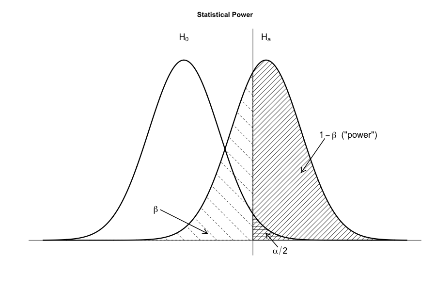

```{r setup, include=FALSE}
knitr::opts_chunk$set(echo = TRUE, fig.align = 'center')
```
# Learning Objectives<br>

**Duration - 90 minutes**<br>

<hr>

# Effect size

## Statistical and practical significance

As you've seen in the previous lessons, large sample sizes or low sample variability can lead to findings of statistical significance for very small 'effects'. Recall that, back in the single sample $t$-tests lesson, our first two-sided $t$-test was able to detect a statistically significant difference between a null mean `average_rating` of $3.930$ and a sample mean of $3.937568$. Is this difference of $0.008$ in rating **practically significant**?

<br>
<div class='emphasis'>
With increasing sample size and/or low sample variability, even very small effects can become statistically significant. No statistical analysis can tell you whether an effect is large enough to be of practical significance: this depends upon the context and application of the analysis!<br><br>

The best way to view statistical significance is perhaps as a **necessary but not sufficient ingredient** of practical significance:

<br>
<center>
*All practically significant effects should be statistically significant, but not all statistically significant effects are practically significant*.
</center>
<br>

More prosaically, a low $p$-value just means a finding is statistically significant, but it doesn't mean it's practically significant.
</div>
<br>

In addition to $p$-values, we must also concern ourselves with **effect sizes**. There are a number of useful measures of effect sizes for different statistical tests and modelling methods.

## Effect size and correlation

This will make more sense to you when we've studies correlation coefficients later in the course, but the correlation coefficient $r$ is itself an effect size. 

The correlation coefficient is a **'standardised'** effect size, in the sense that it does possess have any units, it's just a number in the range $-1 \le r \le 1$. So, the magnitude of $r$ obtained in one analysis is directly comparable to the $r$-value noted by another analysis, regardless of context. 

The typical interpretation is:

<br>
<center>
$|r| \approx 0.1$ is a 'small' effect,<br>
$|r| \approx 0.3$ is a 'medium' effect, and<br>
$|r| \approx 0.5$ is a 'large' effect
</center>
<br>

<br>
<div class='emphasis'>
**Small, medium and large effects**<br><br>

Cohen has worked on much of the theory of effect sizes in statistics, and he broadly classifies a 'small' effect as one which is certainly present but observable only through careful analysis, while a large effect might be observable without detailed analysis (i.e. by inspection alone).
</div>
<br>

## Cohen's $d$ for differences of means

The standardised effect size for a difference of means (as investigated say by a $t$-test) is Cohen's $d$:

$$d = \frac{|\textrm{mean}_1 - \textrm{mean}_2|}{s_{\textrm{pooled}}} $$

where $\textrm{mean}_1$ and $\textrm{mean}_2$ are the respective means of the two groups and $s_{\textrm{pooled}}$ is the **pooled standard deviation**

$$s_{\textrm{pooled}} = \sqrt{\frac{s_1^2 + s_2^2}{2}} $$

where $s_1$ and $s_2$ are the group standard deviations. 

Cohen's $d$ has a simple interpretation: it is just **the number of standard deviations separating the means of the two groups**.

The typical interpretation is:

<br>
<center>
$d = 0.2$ is a small effect,<br> 
$0.5$ a medium effect, and<br>
$0.8$ a large effect
</center>
<br>

<hr>

# Confidence intervals

## Means

A key concept when planning an experiment to determine a CI is the **planned margin of error (PME)**. 

If we are estimating a population mean via a point estimate $\bar{x}$ calculated from a sample, and we would like to control the precision of the estimate to $\bar{x} \pm \textrm{PME}$ (to within the assumed confidence level), then $\textrm{PME}$ is our planned margin of error.

For example, if we would like to estimate the mean `height` of individuals in our population to within say $\pm 2\textrm{cm}$ with $95\%$ confidence, then $2\textrm{cm}$ is the planned margin of error of the estimate.

We can determine the sample size $n$ necessary to achieve a desired $\textrm{PME}$ as follows. Say, for a $95\%$ CI:

$$n = \frac{z_{0.975}^2 \times \sigma^2}{\textrm{PME}^2}$$

For a $99\%$ CI, we would substitute in here $z_{0.995}^2$ instead, and so on. You can see we need to have an estimate for variance $\sigma^2$ or standard deviation $\sigma$ for the variable of interest. We could get this from a small pilot study, or from the results of other analyses of similar populations. 

For example, in the mean `height` estimation case above, if we have an estimated $\sigma = 8 \textrm{cm}$ from an earlier study, then the minimum sample size to achieve $\textrm{PME} = 2\textrm{cm}$ can be calculated as

```{r}
n <- (qnorm(0.975)^2 * 8^2) / 2^2
n
```

So in this case we would need a minimum sample size of approximately $62$ people to achieve this $\textrm{PME}$ at $95\%$ confidence level.

<br>
<blockquote class='task'>
**Task - 5 mins**<br><br>

The quality manager of Pizza-A-Go-Go pizza factory would like to know the mean weight of pepperoni pizzas produced by the factory tomorrow to within $\pm 1 \; \textrm{grams}$ with $99\%$ confidence. 

Prior process control records suggest that the standard deviation in pepperoni pizza weights is $\sigma = 5 \; \textrm{grams}$.

What is the minimum number of pizzas they should randomly pull off the production line tomorrow to be weighed? 

[**Hint** - don't forget to pass the correct quantile for a $99\%$ CI into `qnorm()`]

<details>
<summary>**Solution**</summary>

```{r}
n <- (qnorm(0.995)^2 * 5^2) / 1^2
n
```

They should randomly pull a minimum of $166$ pepperoni pizzas. Alas, they may have to just eat them after they've been handled...
</details>
</blockquote>
<br>

## Proportions

The method by which to determine the sample size $n$ required for a planned margin of error $\textm{PME}$ of a proportion CI is very similar. 

For example, given an estimate $p$ for a proportion, and for a $95\%$ CI, the minimum sample size required is

$$n = \frac{z_{0.975}^2 \times p \times (1-p)}{\textrm{PME}^2}$$

Here, we clearly need to have a prior (perhaps rough) estimate for the proportion $p$. But, if this is not available, a conservative estimate is to use $p = 0.5$, as this makes $p \times (1-p)$ as large as possible and generates the largest sample size.

<hr>

# Power

We've fretted and worried about $\alpha$, the type-I error rate, a great deal in our discussions of hypothesis testing, but we haven't said much yet about the type-II error $\beta$, except to note that it's usually seen as less important than $\alpha$.

We also said, somewhat cryptically, that we normally set $\beta = 0.20$ when we do worry about type-II error rate, but we haven't included $\beta$ in our analysis! There have been no comparisons of anything with $\beta$, in the way that we compare a $p$-value with $\alpha$. So, **how** does $\beta$ enter our analyses?

On the way to answering this, let's just recall the definitions of type-I and type-II errors in the context of hypothesis testing:

<br>
<center>
**type-I error**: a false positive; falsely rejecting $H_0$ when it is true. In plain language 'concluding that something interesting has happened, when in reality, it's business as usual'<br>
**type-II error**: a false negative; falsely failing to accept $H_a$ when it is true. In plain language 'concluding that it's business as usual, when in reality, something interesting has happened'
</center>
<br>

We would like our statistical tests to have a reasonably high probability of detecting effects when they occur.

The **statistical power** (or just **power** of a test) is the probability that the test will detect an effect when there is an effect present to be detected.

The power is defined as

$$\textrm{power} = 1 - \beta$$

and it is also called the 'true positive rate' (which we've seen for classification algorithms) or the 'probability of detection'. We'll just stick to 'power' though, as it's the most common name.

Here's the a diagram of the relationship between $\alpha$, $\beta$ and power in the context of a hypothesis test.  

```{r, echo=FALSE, fig.cap="**Fig. 1.** The relationship between alpha, beta and power = 1- beta", out.width = '60%'}

```

We imagine we have a sampling distribution for $H_0$, and another sampling distribution for $H_a$. The distance between the two 'peaks' of these distributions is the effect size $d$. The vertical line shows the boundary at which we reject $H_0$ and accept $H_a$.

It's probably easier though to see how all of these values interrelate with a hands-on simulation! In truth, this is a dynamic situation, there are many parameters we can alter in a hypothesis test. 

<br>
<blockquote class='task'>
**Task - 5 mins**<br><br>

Have a play with the following simulation of a hypothesis test, and then try to answer the questions below.

[Understanding statistical power and significance testing](https://rpsychologist.com/d3/NHST/)

* Set the simulation to solve for `Power`, keep `Effect size` fixed at $0.5$ and `Sample size` fixed at $30$. Is it possible to decrease $\alpha$ while increasing `Power`? (this would be the ideal, if we could make $\alpha$ as small as possible and `Power` as big as possible)
* For fixed `Effect size`, what is the only way to increase `Power` while keeping $\alpha$ fixed?

<details>
<summary>**Solution**</summary>

* No, it's not possible to decrease $\alpha$ and increase power while keep everything else fixed. This is a problem, because ideally we would like $\alpha$ to be as small as possible and `Power` to be as big as possible. Again, this is the 'no free lunch' law in action!
* The only way to increase `Power` while keeping $\alpha$ fixed is by increasing `Sample size`.

</details>
</blockquote>
<br>

<br>
<div class='emphasis'>
This is the logic of practical hypothesis testing:

* First, we pick the smallest effect size we would be practically interested in detecting. For a difference in group means, this would be a $d$-value, or a correlation coefficient $r$.
* Next, we choose $\alpha$ and $\textrm{power}$. $\alpha$ normally stays at $0.05$ or below, and lacking any clearer intention, $\textrm{power} = 1 - \beta$ is often set at $0.8$, but **we have to think carefully about acceptable rates of type-I and type-II errors in the context of our analysis**. In an application where it would be really important to detect an effect (if one exists), we may wish to set $\textrm{power} \gt 0.8$.
* For reference, the conventional settings $\alpha = 0.05$ and $\textrm{power} = 1 - \beta = 0.8$ imply a **four-to-one** trade-off between type-II and type-I errors.
* Finally, once we've chosen effect size, $\alpha$ and $\textrm{power}$, we do some complicated maths to work out the minimum sample sizes. Thankfully there are `R` packages to help with this last task!
</div>
<br>

## The `WebPower` package

There are a number of packages available in `R` for power calculations and experimental design: `pwr` is probably the best known of them, but the `WebPower` package offers a slightly easier syntax for beginners. We'll use the latter package.

<br>
<div class='emphasis'>
The general idea is that some of the input arguments to the various `WebPower` functions can be set as `NULL`. If we leave pass a `NULL` value in one of these arguments, the function will take that as the objective and calculate it for us. 
</div>
<br>

If you wish, there is also a an [online](https://webpower.psychstat.org/wiki/kb/statistical_power_analysis) GUI interface to the package, but we recommend using the `R` package, as the results of the power analysis can be incorporated more easily into your summary documents.

Let's demonstrate the use of various `WebPower` functions by example!

## Power calculations for correlation

<br>
<center>
*'A student wants to study the relationship between `study_time` and `grade` in a population of students. Based on her prior knowledge, she expects the two variables to be correlated with a correlation coefficient of $0.2$. If she plans to collect data from $60$ participants, what is the power of the analysis to obtain a significant correlation using a sample of this size?'*
</center>
<br>

```{r, message=FALSE}
library(WebPower)
```

Now we run the power analysis, setting the `power = NULL` argument but filling in the other arguments that are `NULL` by default. So this run will return the power of the correlation test. 

```{r}
wp.correlation(n = 60, r = 0.2, power = NULL, alpha = 0.05, alternative = "two.sided")
```

The $\textrm{power}$ is pretty low, she has only a $34\%$ chance of detecting this strength of correlation, if it exists! What sample size should she use instead to achieve $\textrm{power} = 0.8$?

```{r}
wp.correlation(n = NULL, r = 0.2, power = 0.8, alpha = 0.05, alternative = "two.sided")
```

A minimum of $193$ students, which we would probably round up to $200$ students.

<br>
<blockquote class='task'>
**Task - 2 mins**

What if she revises her assessment and thinks the correlation coefficient is likely to be a large effect. What sample size should she use instead to achieve $\textrm{power} = 0.8$?<br><br>

[**Hint** - substitute a typical large value for $r$]


<details>
<summary>**Solution**</summary>

Broadly, a 'large' effect is $r \approx 0.5$

```{r}
wp.correlation(n = NULL, r = 0.5, power = 0.8, alpha = 0.05, alternative = "two.sided")
```

Now, she would need to sample around $30$ students. The minimum sample size has decreased substantially because the larger correlation will be easier to detect! 
</details>
</blockquote>
<br>

## Power calculations for $t$-tests

<br>
<center>
*'To test the effectiveness of a medical intervention for high cholesterol, a researcher plans to recruit a group of patients and test their cholesterol levels once _before_ and once _after_ treatment, taking the mean of all the differences for each patient. Say the practical significant difference in cholesterol levels is $10 \; \textrm{mg/dl}$ and the standard deviation in cholesterol levels across the population can be estimated at $25 \; \textrm{mg/dl}$ from previous studies. What sample size is necessary to have a $95\%$ probability of detecting a mean difference of this size?'*
</center>
<br>

First, realise this is a *paired test*: the same patients are being investigated before and after the treatment.

```{r}
# Cohen's d will be measure of effect size here
effect_size <- 10 / 25
# this lies between a small and medium effect
effect_size

# wp.t() provides power analysis for t-tests
wp.t(n1 = NULL, d = effect_size, alpha = 0.05, power = 0.95, type = "paired", alternative = "two.sided")
```

We need $84$ patients minimum, which we would probably round up to $100$ for planning purposes. Notice too that we have a wide range of possibilities available via the `type` and `alternative` arguments.

<br>
<blockquote class='task'>
**Task - 5 mins**

<br>
<center>
*Imagine in the example above the experimental design is changed, and the researcher now intends to recruit _two independent samples_: a 'control' group, and a 'treatment' group. They wish the control and treatment groups to be of the same size (we call this a **balanced design**). Now how large would the number of patients in each group have to be to detect an effect of this size?*
</center>
<br>

<details>
<summary>**Solution**</summary>
```{r}
wp.t(n1 = NULL, d = effect_size, alpha = 0.05, power = 0.95, type = "two.sample", alternative = "two.sided")
```
Now the minimum sample size in each group would have to be $164$ patients, i.e. $328$ patients in total, spread over the two groups.
</details>
</blockquote>
<br>

Note as well the existence of the `two.sample.2n` type for power calculations on **unbalanced** $t$-test designs (where the two groups have different sizes). We would need to use both the `n1 = ` and `n2 = ` arguments for `wp.t()` for this type.

<br>
<blockquote class='task'>
**Task - 5 mins**

<br>
<center>
*Unfortunately, due to drop-outs and side effects, only $105$ patients in the control group and $87$ patients in the treatment group completed the trial. What would the final power of the test be to detect an effect of the stated size?*
</center>
<br>

<details>
<summary>**Solution**</summary>
```{r}
wp.t(n1 = 105, n2 = 87, d = effect_size, alpha = 0.05, power = NULL, type = "two.sample.2n", alternative = "two.sided")
```
The final power would drop from the desired $95\%$ to only $78\%$. The researcher would likely need to factor in an allowance for drop-out when setting sample size in each group. 
</details>
</blockquote>
<br>

# Recap

<hr>

# Additional resources


