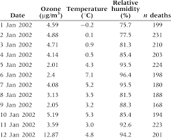
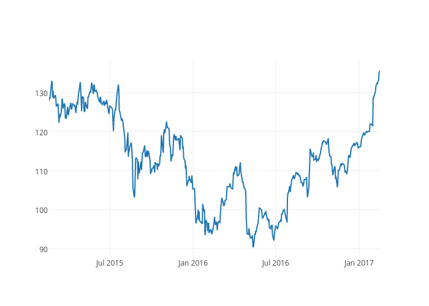
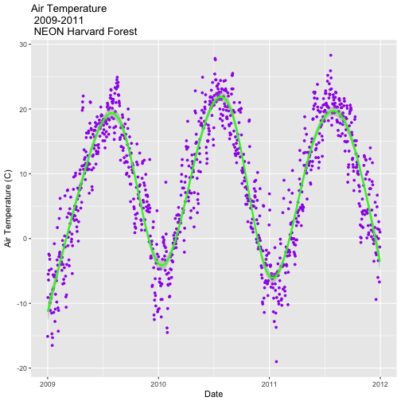
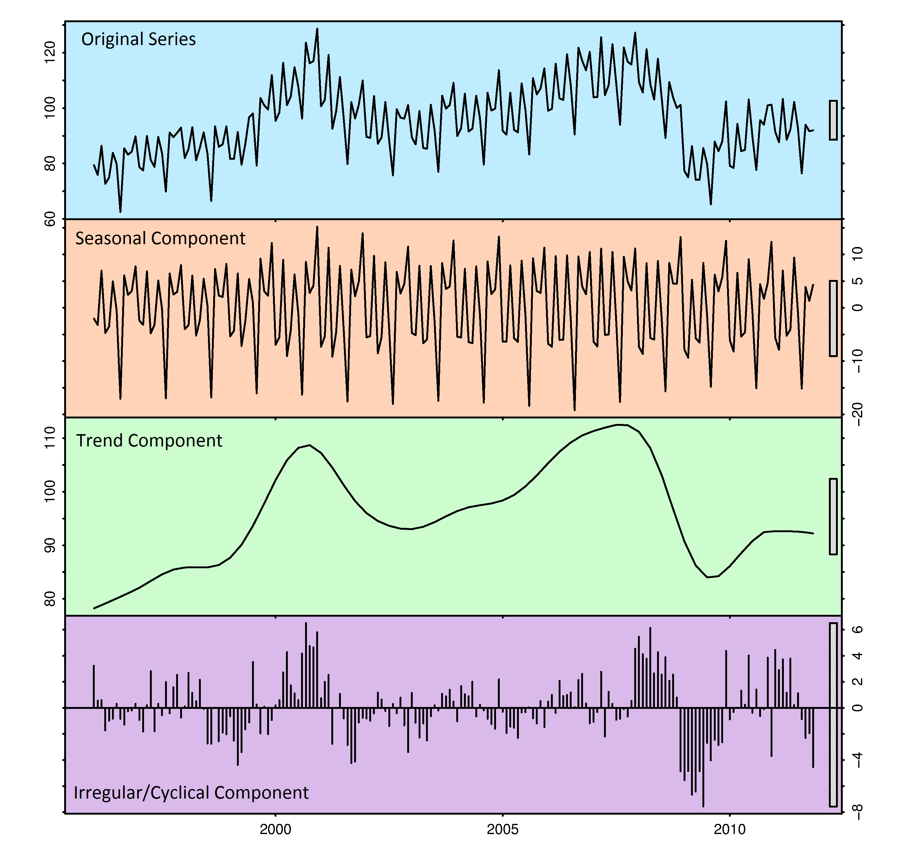

```{r setup, include=FALSE}
knitr::opts_chunk$set(echo = TRUE, fig.align = 'center')
library(tidyverse)
```

# Learning objectives

  1. Know what time series data look like
  2. Understand some of the key components of time series data
  3. Know examples of time series data application
  4. Understand why time series data familiarity is important

**Duration: 30 mins**

*** 

# What is Time Series Data?
<br>

The simplest explanation of time series data is : **time-series datasets track and represent changes in a system over time.**
<br>

Time series data is a sequence of data points taken at successive, equally spaced points in time. In other words, time-series data are generally “append-only”.  

This practice of recording each and every change to the system as a new, different row is what makes time-series data so powerful. Time isn't just a metric in itself, but rather a primary axis. It allows us to measure change: analyze how something changed in the past, monitor how something is changing in the present, predict how it may change in the future.


***

# What does time series data look like?

<br>
Time series datasets have 3 broad things in common: 

1. The data that arrives is almost always recorded as a new entry  
2. The data typically arrives in time order  
3. Time is a primary axis (time-intervals can be either regular or irregular)  
<br>
  
Let's take a look at some examples of time series data. 

<br> 

<center>

</center>


<br>

<center> 

 



</center>

This practice of recording each and every change to the system as a new, different row is what makes time-series data so powerful. It allows us to measure change: analyze how something changed in the past, monitor how something is changing in the present, predict how it may change in the future.

</center>


# Key components of time series data 
<br>

Time series data can be broken down into different components.   

1. **Trend:** Trend is the increase or decrease in the series over a period of time, which persists over a long period of time. For example, time series data relating to population growth or number of houses in a city often show upward trend, whereas data relating to mortality rates and epidemics often show downward trends. 

2. **Seasonality:** This is a regular pattern of up and down fluctuations, aka short-term variation occurring due to seasonal factors. For example sales of ice-cream probably increase in summer, while sales of waterproof clothes probably increase in winter. 

3. **Cyclicity:** Cyclical variation in a time series describes the medium-term changes in the series, caused by circumstances, which repeat in cycles. The duration of a cycle extends over longer period of time, usually two or more years. Most of the economic and financial time series show some kind of cyclical variation. For example a business cycle consists of four phases :  i) Prosperity, ii) Decline, iii) Depression and iv) Recovery.

4. **Irregularity:** Irregular or random variations in a time series are caused by unpredictable influences, which are not regular and also do not repeat in a particular pattern. These variations could be caused by incidences such as war, strike, earthquake, flood, revolution, etc. There is no defined statistical technique for measuring random fluctuations in a time series.

Here you can see these below in plot format: 
<br>

<center>

</center>


# Time series structure 

As discussed in the previous lesson, the key point about the structure of time series data is that it is data points collected over time. Most importantly, the ordering of the time points matters.  

For example, if you collected the height of children in a class, it doesn’t matter which order the data are obtained or listed. However, if you were trying to collect data about how global temperature changes over time, the ordering is crucial: for clarity and inference it is important that the data is collected and presented in sequential order. Additionally, looking at questions on how observations at one time point might influence observations in the future, which relies on the time series being ordered. 

So the main point is that time series data is always structured **by sequential time order**. For example:

<br>
<center>

</center>
<br>

You can also describe the overall pattern of your time series data in different ways:    
  1. Regular  
  2. Irregular  
  3. Seasonal  
  4. Non-seasonal  

<br>

**Regular time series** refers to data which has been collected at regularly spaced interval of time - for example, every hour, or every day, every month, etc.   
<br>
<center>

</center>
<br>


**Irregular time series** time series data still follows a temporal sequence, but the measurements might not happen at a regular time interval.    

<br>
<center>

</center>
<br>


In addition to this, your data can be **seasonal** and **non-seasonal**. 
<br>

**Seasonal data** patterns, or seasonality, are cycles that repeat regularly over time. A repeating pattern within each year is known as seasonal variation, although the term is applied more generally to repeating patterns within any fixed period. 
<br>
<center>

</center>
<br>

**Non-seasonal data** is data which has no seasonal component. Non-seasonal time series consists of a trend component and an irregular component.
<br>
<center>

</center>
<br>


Now we know what time series is, we can start working with it in R.

<br>

# Where do we encounter time series data?

<br>

Time series data is everywhere. For example:

**Financial sector**: how stock markets, currency, exchange rates, etc. change over time. Trading algorithms continuously collect data on how markets are changing.   
<br>
<center>

</center>

<br>
**Environmental sector**: world organisations and weather stations continually collect temperature/wind/weather readings to they can studty how they change over time.
<center>
<br>

</center> 

<br> 
**Health Sector**: data is collected on patient wait times, number of NHS visits, etc. in order to provide funding and plan.  
<center>
<br>

</center>

<br>
**Digital/Tech**: systems that monitor room temperature and adjust accordingly. Self-driving cars continuously collect data about how their local environment is changing around them. Smart home meters monitor what's going on in the house. Things like Alexa continually monitor so they can respond to our commands. 
<br>
<center>

</center>
<br>

**Gaming/Entertainment**: companies will collect data on how many players will install app, how much time will they spend online, how many actions users will do, etc.
<br> 
<center>

</center>
<br>

**Retail**: the retail industry monitors how their assets are moving with such precision and efficiency that cheap same-day delivery is a luxury that many of us take for granted.    
<br>
<center>

</center>
<br>


***

# Why is time series analysis important?
<br>
The biggest advantage of using time series analysis is that it can be used to understand the past as well as predict the future. This means it can be used for two main analyses: 

1. Identifying the nature of the phenomenon represented by the sequence of observations (time series analysis)
2. Predicting future values of the time series variable (time series forecasting).
<br>

<center>

</center>

<br>

In turn, this helps achieve various objectives for businesses and industry:

1. Descriptive Analysis: determines trends and patterns of future using graphs and other tools.
2. Forecasting: It is used extensively in financial, business forecasting based on historical trends and patterns. Cyclical variation can help to understand business cycles, and seasonal variation is useful for retailers and companies.
3. Explanative Analysis: to study cross-correlation/relationship between two time series and their dependency on one another.


<br>

# Recap

* What are the four main components of time series data?
<details>
<summary>**Answer**</summary>
Trend, seasonality, cyclicity and irregularity.
</details>

* What is the difference between seasonality and cyclicity?
<details>
<summary>**Answer**</summary>
Seasonality occurs over a short time span (the seasons), whereas cyclicity is over a longer period. 
</details>

* What are the main benefits of time series analysis?
<details>
<summary>**Answer**</summary>
It studies the past behaviour of the phenomenon.
It compares the current trends with that in the past or the expected trends.
It is used in forecasting sales, profit etc. and policy planning by various organisations.
The cyclic variation help us understand the business cycles.
The seasonal variation are very useful for businesses and retailers as they earn more in certain seasons.
</details>

<hr>

# Additional Resources

[Intro to time series analysis](https://medium.com/greyatom/introduction-to-time-series-analysis-431beb02adc4)

[What is time series data](https://blog.timescale.com/blog/what-the-heck-is-time-series-data-and-why-do-i-need-a-time-series-database-dcf3b1b18563/)  

[What are the benefits of time series data](https://www.quora.com/What-is-time-series-analysis-What-are-its-advantages-and-disadvantages)  


