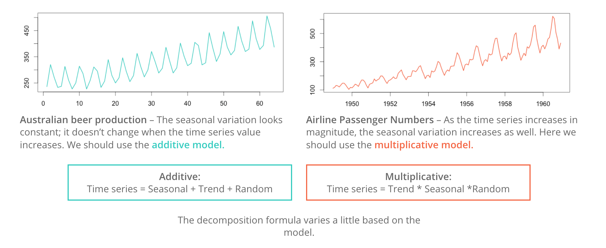

```{r setup, include=FALSE, warning = FALSE, message=FALSE}
knitr::opts_chunk$set(echo = TRUE, fig.align = "center")
library(tidyverse)
```


# Time series in the tidyverse  

<br>
In R, most time series data analysis pipelines make use of the `ts` object structure from the `stats` package. This is standard base R, and is still the predominant way of analysing time series data in R (probably because no one made a better way of doing it until relatively recently). 

So, what's not so great about the base R version?   


1. Well the original `ts` formatting doesn't fit with our principles of tidy data.   
2. It often stores data in wide format
3. It has unnatural indexing formatting (i.e. locations in the table instead of names of variables)

All of these make it difficult to analyse, but also near impossible to integrate with `tidyverse` functions.     

Enter the tidyverse time series packages...     

<br>
<center>

```{r, echo=FALSE, out.width = '70%'}

``` 

</center>
<br>


## `tsibbledata`  

The tsibbledata package provides a diverse collection of datasets for learning how to work with tidy time series data. There are 12 time series datasets included in the package, each of which featuring a unique time series characteristics or structures. These datasets are stored as tsibble objects, which allows time series data to be used with the tidyverse.  

```{r, warning = FALSE, message = FALSE}
library(tsibbledata)
```

You can look at all the datasets contained in this package here:

```{r, eval = FALSE}

ansett
vic_elec
gafa_stock
aus_livestock
aus_production
aus_retail
global_economy
hh_budget
nyc_bikes
olympic_running
PBS
pelt
```

The datasets above cover a diverse set of time series patterns. It covers regular and irregular data; non-seasonal, seasonal and multi-seasonal; frequent (30 minutes) and infrequent (4 years). Some data contain nested and crossed structures, some have relationships between variables or series.  

If you find that your data isn't in `tsibble` format, you can also convert `tibble` format tables to `tsibble` format. `Tibble` format isn't bad, but to do time series analysis we ideally want it in time series format. Two functions within the `tsibble` package allow us to do this: `tsibble()` creates a tsibble object, and `as_tsibble()` coerces other objects to a tsibble. These are included in the `tsibble` package. 

<br>


## `tsibble` package    

The `tsibble` package by Earo Wang provides a tidy data structure for time series. Built on top of the tibble, a `tsibble` (or `tbl_ts`) follows the tidy data principles. A `Tsibble` is essentially a tibble which preserves the time index with the data, and with extra contextual semantics: key and index. 

1. **index**: this identifies the time component of the data. Usually this will be a date or datetime.   

2. **key**: keys are used within tsibble to uniquely identify related time series in a tidy structure.  

Together, this provides valuable structural information for the data. 

Let's load the library and have a look at one of those datasets from the `tsibbledata` package. 

```{r, warning = FALSE, message = FALSE}
library(tsibble)
```
```{r}
head(vic_elec)

```
<br>

You can see here that there is a time index which is preserved in the `Time` variable. This is the defining characteristic of time series data. In this particular case, our key is Holiday, which will be set to **TRUE** or **FALSE**. This would be our key as we have a time series for both holiday categories, and when combined with our index (`Time`), this uniquely identifies the observation.   

<br>

### tsibble and dplyr

So next, we can start using the tidyverse methods, as these can naturally be applied to a `tsibble`.

Row-wise verbs, for example `filter()` and `arrange()`, work for a tsibble in exactly the same way as a general data frame, but column-wise verbs behave differently yet intentionally. For example, one important thing to note is that the index column cannot be dropped in a tsibble. For example, if you do the following:

```{r, eval = FALSE}
vic_elec %>%
  select(-Time)
```

  
You'll get an error message:

>`Error: Column Time (index) can't be removed. Do you need as_tibble() to work with data frame?`  

So you do need to keep your index, but you can select some different columns using the `select()` function in the same way.  

```{r}
vic_elec %>%
  select(Time, Demand, Temperature)
```
<br>

You can also filter rows as you would normally:

```{r}
vic_elec %>%
  filter(Holiday == TRUE)
```

<br> 

And you can also extract a section of a time series using the function `filter_index`: 

```{r, warning = FALSE, message = FALSE}
vic_elec %>%
  filter_index("2012")
```
<br>

In terms of adding columns, you can do as you would in tidyverse:

```{r, warning=FALSE, message=FALSE}
library(lubridate)

vic_year <- vic_elec %>%
  mutate(year = year(Date))
```

<br>

And you can summarise the same way you would with a normal tibble (although instead of `group_by`, you use `index_by`):

```{r}
vic_year %>%
  select(year, Temperature) %>%
  index_by(year) %>%
  summarise(mean_temp = mean(Temperature))
```
<br>
***


### tsibble and ggplot 

In terms of visualisation, `ggplot` also works with your `tsibble` data. 

```{r}
# plot temperature over time 
ggplot(vic_elec %>% filter(Holiday == FALSE)) + 
  geom_line(aes(x = Time, y = Temperature), colour = "purple")

```


We can see that this data is collected on an hourly basis, and so there are a lot of data points to show. So we can see that it could use some aggregation to be more informative. 

In time series analysis, it is common to **aggregate** to less granular time intervals, which means you don't get as many data points. The function `index_by()` allows you to do this. Lubridate’s functions such as `floor_date()`, `celling_date()` and `round_date()` are helpful to do all sorts of sub-daily rounding; `as_date()` and `year()` help transit to daily and annual numbers respectively. `yearweek()`, `yearmonth()` and `yearquarter()` in the tsibble cover other time ranges. 

For example, if we wanted to summarise the info by date (rather than hour), we could do the following:

```{r}
# aggregate by date
elec_date <- vic_elec %>%
  index_by(date = ~ as_date(.)) %>%
  summarise(temp_mean = mean(Temperature, na.rm = TRUE))

# make a plot
ggplot(data = elec_date, aes(x = date, y = temp_mean)) +
  geom_line()
```
<br>

If we wanted to summarise by month, rather than date, we would do this:

```{r}
elec_month <- vic_elec %>%
  index_by(date = ~ month(., label = TRUE)) %>%
  summarise(temp_mean = mean(Temperature, na.rm = TRUE))

# make a plot
ggplot(data = elec_month, aes(x = date, y = temp_mean)) +
  geom_point() + 
  geom_line(group = 1)
  
```

<br>

And if we wanted to summarise by year, rather than month, we would do this:

```{r}
elec_year <- vic_elec %>%
  index_by(date = ~ year(.)) %>%
  summarise(temp_mean = mean(Temperature, na.rm = TRUE))

elec_year

# make a plot
ggplot(elec_year, aes(x=date, y=temp_mean)) +
  geom_bar(stat="identity", fill = "grey") + 
  ylab("Mean Temperature")+ 
  xlab("year")

```


### Rolling windows

Aside from aggregating, you can also calculate rolling windows. In time series analysis, nothing is static. A correlation may exist for a subset of time or an average may vary from one day to the next. Rolling calculations simply apply functions to a fixed width subset of this data (aka a window), indexing one observation each calculation. There are a few common reasons you may want to use a rolling calculation in time series analysis:

1. Measuring the central tendency over time (`mean`, `median`)
2. Measuring the volatility over time (`sd`, `var`)
3. Detecting changes in trend (fast vs slow moving averages)
4. Measuring a relationship between two time series over time (`cor`, `cov`)


We can use rolling functions to better understand how trends are **changing over time**.

Several functions in tsibble allow for different variations of moving windows using purrr-like syntax:

`slide()`/`slide2()`/`pslide()`: sliding window with overlapping observations.  
`tile()`/`tile2()`/`ptile()`: tiling window without overlapping observations.  
`stretch()`/`stretch2()`/`pstretch()`: fixing an initial window and expanding to include more observations.  

The most common example of a rolling window calculation is a moving average, so we will focus on this as an example.  

A moving average allows us to visualize how an average changes over time, which is very useful in cutting through the noise to detect a trend in a time series dataset. Further, by varying the window (the number of observations included in the rolling calculation), we can vary the sensitivity of the window calculation. 

<br>
<center>

</center>
<br>


```{r}
# calculate a rolling window 
elec_rolling <- vic_elec %>% 
  group_by_key() %>% 
  mutate(temp_ma = slide_dbl(Temperature, ~ mean(., na.rm = TRUE), .size = 1000))

# plot the data 
ggplot(elec_rolling) + 
  geom_line(aes(x = Date, y = Temperature), colour = "grey") + 
    geom_line(aes(x = Date, y = temperature_ra), colour = "red")
```

<br>

<blockquote class='task'>
**Task - 5 mins** 

You can change the rolling average window width. This will yield either a slow (longer window) or fast (shorter) moving average. Have a go at changing the width of your window. What does it do to the moving average? What does this tell you?

</blockquote>

While the `tsibble` package provides more functions for you to use, these are the main ones you'll turn to when exploring time series data. 

<br>


***


## feasts

The `feasts` package stands for: **F**eature **E**xtraction **A**nd **S**tatistics for **T**ime series. It works with tidy temporal data provided by the tsibble package, and produces time series features, decompositions, statistical summaries and visualisations.   

Let's look at the tourism data, which comes from the `feasts` package. 

```{r, warning=FALSE, message=FALSE}
library(feasts)
```

```{r}
# load the tourism data from the feasts package
tourism 
```

This is fine, and it is in `tsibble` format, so we can use tidyverse functions on it. For example, let's filter for holidays, grouped by state, and calculate a total trips variable for each state. 

```{r}
holidays <- tourism %>%
  filter(Purpose %in% c("Holiday","Business")) %>%
  group_by(State) %>%
  summarise(Trips = sum(Trips))

holidays
```

<br>

### Autoplot 

As we mentioned, visualisation is often the first step in understanding the patterns in time series data. And while we know we can make use of `ggplot2`, the `feasts` package uses ggplot2 to produce customisable graphics to visualise time series pattern. Additionally, it has default function plotting behaviour which allows you to plot multiple time series data easily on one plot.   

For example, you can plot your data over time using the `feasts` function `autoplot()`. *Make sure you're not using the base R version of `autoplot()`. 

```{r}
holidays %>% 
  autoplot(Trips) + 
  xlab("Year")
```

Here, we can see the number of holiday trips taken in each State, across the different years. 

<blockquote class='task'>
**Task - 5 mins** 

What inferences (if any) can you make about the trends, seasonality and overall patterns of these time series signals?

<details>
<summary>**Potential Answer**</summary>

NSW, Queensland and Victoria all have the highest number of visitors. Overall, it seems after 2010 there is a gradual upwards trend in the data: visitor numbers are increasing. There seems to be a seasonal component, but this would need some different plotting techniques to narrow it down. 

</details>
</blockquote>

<br>

### Seasonal patterns

We noted above that it might be useful to learn how to plot seasonal trends in the data. The `feasts` package has a plot function called `gg_season` that allows us to do this.  A seasonal plot is similar to a regular time series plot, except the x-axis shows data from within each season. This plot type allows the underlying seasonal pattern to be seen more clearly, and is especially useful in identifying years in which the pattern changes.

For this, let's just look at the top three states.   

```{r}
holidays %>%
  filter(State %in% c("Queensland", "New South Wales", "Victoria")) %>%
  gg_season(Trips)
```

The seasonal plot (`gg_season()`) wraps a seasonal period (in this case, quarters) over the x axis, allowing you to see how each quarter varies.
<br>

<blockquote class='task'>
**Task - 5 mins** 

What can you tell from this seasonal plot?

<details>
<summary>**Potential Answers**</summary>

Summer trips (Sep - March) seem to go down in Victoria, but up in Queensland. Could this be people coming to Queensland for their summer holidays? Overall 2017 seems to have the highest tourist rates. However, this might be easier to see if we split the data out a bit more into subseries.

</details>
</blockquote>

<br>


### Subseries 

Now we can split our data out into subseries - that is, have one per quarter for each state. This might make it easier to observe trends over time, as the trend of recent years can also be seen in the spread between the lines.

```{r}
holidays %>%
  filter(State %in% c("Queensland", "New South Wales", "Victoria")) %>%
  gg_subseries(Trips)
```

<br>

<blockquote class='task'>
**Task - 5 mins** 

What can you see from these plots regarding the overall trends and seasonality in the three states? 

<details>
<summary>**Potential Answers**</summary>

New south wales: holiday trips are highest in the first quarter of the years, and almost equal in the last three. There seemed to be a big dip in trip numbers between 2005 and 2010, before there has been an increase again. 

Queensland: Trips are higher in the third quarter (winter months). Again, there was a small dip between years 2005 and 2010, but trip numbers are on the increase. 

Victoria: Holiday trips are higher here again in the first quarter of the year (the summer months). Overall trend across the years again is a rise after year 2015. 

</details>
</blockquote>
<br>


### Time series decomposition 

As mentioned in the first lesson, a common task in time series analysis is decomposing a time series into some simpler components. Because it’s hard to see seasonality and other components in the data, when doing time series analysis it is often good to use a technique called decomposition to identify the various parts of our series. Time series decomposition is a mathematical procedure which transforms a time series into multiple different time series. Decomposing a time series means separating it into its constituent components, which are usually a trend component and an irregular component, and if it is a seasonal time series, a seasonal component.

Time series decompositions allow you to isolate structural components such as trend and seasonality from the data. 

The feasts package supports two different time series decomposition methods (for now):

  1. Classical decomposition
  2. STL decomposition  


</center>
<br>
  
#### Classical decomposition

Classical decomposition is a relatively simple procedure, and forms the starting point for most other methods of time series decomposition. There are two forms of classical decomposition: an additive decomposition and a multiplicative decomposition.

What type of decomposition you use will depend on what your time series looks like:

<br>
<center>

</center>
<br>

In classical decomposition, we assume that the seasonal component is constant from year to year. For many series, this is a reasonable assumption, but for some longer series it is not. For example, electricity demand patterns have changed over time as air conditioning has become more widespread. 

```{r}
tourism %>%
  filter(State == "ACT") %>%
  classical_decomposition(Trips ~ season(4), type = "additive") %>%
  autoplot()

```

<br>

#### STL decomposition

A more useful decomposition for time series data is the STL decomposition. This allows you to extract multiple seasonal patterns with any seasonal period.


```{r}
tourism %>% 
  filter(State == "ACT") %>%
  STL(Trips ~ season(window = "periodic")) %>%
  autoplot()
```
<br>

The above call to `STL()` has decomposed the `Trips` variable into three components such that `Trips = trend + season_year + remainder`. By setting `season(window = "periodic")`, we have set the seasonal pattern to be unchanging — you can control how quickly the seasonal pattern can change by setting this to some number (smaller numbers correspond to more rapid change).

The decomposed table (known as a `dable`) explains how the `Trips` variable has been split into three new series via `Trips = trend + season_year + remainder`, which has been done for all four travel purposes.

<br>


### Feature extraction

Aside from looking at trends and seasonality, `feasts` also contains functions that allow us to extract features and statistics across a large collection of time series to identify unusual/extreme time series, or find clusters of similar behaviour. This allows you to visualise the behaviour of many time series (where the plotting methods above would show too much information).

The STL decomposition above can be used to compute features about the strength of the its trend and seasonality components, allowing us to see an overview of the entire dataset’s patterns. Let's extract the features from our decomposition we performed above. 

*Note: you can search ?feature_set and it will list all the features you want. We are choosing tags = stl, as the help documentation says this computes a variety of measures extracted from an STL decomposition of the time series.*

```{r}
holiday_features <- holidays %>%
  features(Trips, feature_set(tags = "stl"))

holiday_features
```

The features from an STL decomposition also describe other behaviours such as how linear, curved, and spiky the data is. This dataset of features can be used with ggplot2 (and other packages) to produce stunning overviews of many time series.

For example, here we can plot the seasonal strength against trend strength, and separate it out by Purpose of the visit to each state. 

```{r}
tourism_features <- tourism %>%
  features(Trips, feature_set(tags = "stl"))
  
ggplot(tourism_features,
       aes(x = trend_strength, y = seasonal_strength_year, col = Purpose)) + 
  geom_point() + 
  facet_wrap(vars(State))

  
```


<blockquote class='task'>
**Task - 5 mins** 

What does this plot tell us? 

<details>
<summary>**Potential Answers**</summary>

Well, holidays seem to be more seasonal than other travel. And Western australia has the strongest trends. 

</details>
</blockquote>

<br>

So, how can we find the most seasonal time series in our lot?

```{r}
most_seasonal <- tourism %>%
  features(Trips, feature_set(tags = "stl")) %>%
  filter(seasonal_strength_year == max(seasonal_strength_year))

most_seasonal
```

<br>

<blockquote class='task'>
**Task - 5 mins** 

1. Which state has the minimum trend strength?  
2. What is the average spikiness of each holiday purpose?  

<details>
<summary>**Potential Answers**</summary>

```{r}
# 1. Which state has the minimum trend strength?
min_trend <- tourism %>%
  features(Trips, feature_set(tags = "stl")) %>%
  filter(trend_strength == min(trend_strength))

min_trend
```


```{r}
# 2. What is the average spikiness of each holiday purpose?  
tourism %>%
  features(Trips, feature_set(tags = "stl")) %>%
  group_by(Purpose) %>%
  summarise(mean_purpose_spiky = mean(spikiness))
```
</details>
</blockquote>

<br>


### Lags

The final thing to cover are lags. Lag is essentially delay. And often in time series data, lags are important because they can show interesting statistical patterns, the most common being a phenomenon called autocorrelation, which is a tendency for the values within a time series to be correlated with previous copies of itself. 
One benefit to autocorrelation is that we can identify patterns within the time series, which helps in determining seasonality, the tendency for patterns to repeat at periodic frequencies. 


Consider a discrete sequence of values, such as:

```{r}
# create a time series 
ts_example <- c(1:10)

# have a lag of 0 and 1
lag(ts_example,0)
lag(ts_example,1)

```


For lag 1, you compare your time series with a lagged time series, in other words you shift the time series by 1 before comparing it with itself. Proceed doing this for the entire length of time series by shifting it by 1 every time. You now have autocorrelation function. Here is an example of a table, with various lags stored. 

<center>

</center>
<br>

So, why is lag important? Well, just as correlation shows how much two time series are similar, autocorrelation describes how similar the time series is with itself. For any time series you will have perfect correlation at `lag/delay = 0`, since you're comparing same values with each other. As you shift your time series you begin to see the correlation values decreasing. Note that if timeseries comprises of completely random values, you will only have correlation at `lag=0`, and no correlation everywhere else. In most of the datasets/time series this is not the case, as values tend to decrease over time, thus having some correlation at low lag values.

<br>
Now, consider a long periodic time series, for example outdoor temperature over a few years, sampled hourly. Your time series will correlate with itself on daily basis (day/night temperature drop) as well as yearly (summer/winter temperatures). Lets say your first datapoint is at 1 pm in mid summer. `Lag=1` represents one hour. The autocorrelation function at `lag=1` will experience a slight decrease in correlation. At `lag=12` you will have the lowest correlation of the day, after what it will begin to increase. Move forward 6 month to 1 pm. Your time series is still somewhat correlated. Move lag to 6 months and 1 am. This might be your lowest correlation point in the time series. At lag of 12 months your timeseries is again close to the peak value.
<br>

Let's illustrate with with some retail data. One goal in collecting retail data is often to find a way to predict the next month's data and sales. 

```{r}
# look at the data 
head(aus_retail)
```
```{r}
# create some lag variables 
aus_shop <- aus_retail %>%
    mutate(lag1 = lag(Turnover,1),
         lag2 = lag(Turnover,2))

head(aus_shop)
```

The `lag` function allows you to calculate lag variables based on different delays. Here we have added two variables - a lag of 1 and a lag of 2. This simply shifts the values in the original time series (`erruptions` variable) by the specified number of places. 

In order to see if the wait for the last month's turnover is useful in predicting the next, one can consider the correlation between the previous month and the next month (i.e. a lag of one). The calculation of the autocorrelation in R statistical software is:

```{r}
# calulate the correlation
cor(aus_shop$Turnover[2:100], aus_shop$lag1[2:100])

```

The correlation is 0.847, indicating that the previous month's sales tend to be a good predictor of the next months. 

*You'll notice we've had to index so that the NA values don't appear. These won't work in the correlation function*. 
<br>

We can also plot the data to see if there is a correlation between points. 

```{r}
# look at the australian data
aus_filtered <- aus_shop %>% 
  filter(Industry == "Cafes, restaurants and catering services" & State == "Queensland") %>%
  group_by(State)

# plot the data 
ggplot(aus_filtered) + geom_point(aes(x = Turnover, y = lag1)) +
  xlab("Turnover") + 
  ylab("Turnover lagged by 1 month")

```

Here you can interpret this as follows: the data is highly correlated - one month predicts the next. 

So why are these important? Lags and autocorrelation are central to numerous forecasting models that incorporate autoregression, regressing a time series using previous values of itself. 

The first release of `feasts` includes a total of 42 feature metrics, which can be computed together using feature_set(pkgs = "feasts"). A list of all currently available features can be found in links from the `?feature_set` help file.

By now, we've covered all the basics of looking at time series data, decomposing it, and making some basic inferences from the plots. 


# Recap

* If you had constant seasonal variation in your time series, what decomposition method would you use?
<details>
<summary>**Answer**</summary>
Additive, as this assumes constant seasonal variance. Multiplicative assumes the magnitude of variation increases. 
</details>

* What can lag tell us about our time series?
<details>
<summary>**Answer**</summary>
The values within a time series to be correlated with previous copies of itself. 
One benefit to autocorrelation is that we can identify patterns within the time series, which helps in determining seasonality, the tendency for patterns to repeat at periodic frequencies.
</details>

* What is the benefit of a rolling window function?
<details>
<summary>**Answer**</summary>
*A moving average allows us to visualize how an average changes over time, which is very useful in cutting through the noise to detect a trend in a time series dataset. 
</details>
<hr>


# Additional Resources

[Time series transformations](https://datascienceplus.com/time-series-analysis-in-r-part-2-time-series-transformations/)  

[How to decompose a time series](https://machinelearningmastery.com/decompose-time-series-data-trend-seasonality/)  


