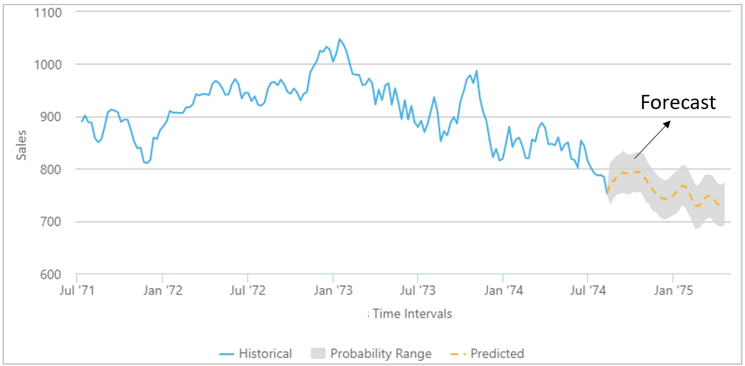
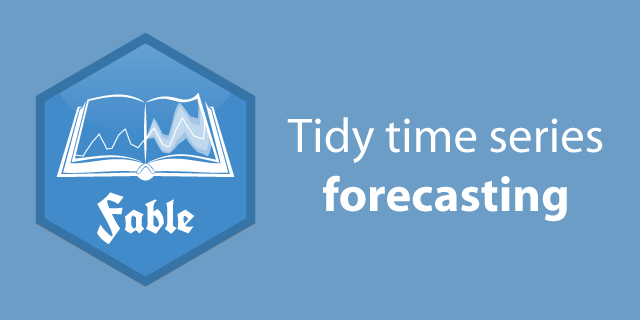

```{r setup, include=FALSE}
knitr::opts_chunk$set(echo = TRUE, fig.align = 'center')
library(tidyverse)
```


# Learning Objectives

  * Know what time series forecasting is 
  * Be able to create a simple forcast in R
  * Be able to check the accuracy of your forecast


# What is forecasting 

Time series forecasting involves creating and using a model to predict future values, based on previously observed values. 

<br>
<center>

</center>
<br>


# When do we use forecasting? 

Forecasting is required in many situations, for example:  

1. Deciding whether to build another retail shop location in the next two years -this requires forecasts of future demand, based on your past retail demand.   

2. Stocking an inventory requires forecasts of stock requirements  

3. City councils planning their gritting resources for winter need forecasts about how the weather might affect them in the upcoming week.    

Some of these things will be easier to forecast than others. For example, the air temperature tomorrow might be easier to forecast than sales a business might have two years in the future. 


# How do we create a forecast
 
To create a forecast, you have to use data you already have collected, and follow the normal data process we've learned about by now:

<br>
<center>

</center>
<br>


You then use models which take in past data, and calculate the future possible options from it. It sounds simple enough, but the ease of forecasting depends on several factors, including:     

1. How much data is available : the more data you have, the better your forecast will be  

2. how well you understand the factors that contribute to the forecast : e.g. do you understand the seasonal variation in your data? Are there trends that need taken into account?  

3. can the forecast actually affect what you are trying to forecast? 

<br>
Let's take an example. We are trying to forecast how energy an offshore wind farm needs to generate and transfer to power a set of homes. Generating a forecast of energy demand is usually relatively easy and accurate because we have a good understanding of the three conditions above:

1. Unless it is a relatively new company with no access to the national grid data, you have a lot of data from many years showing energy demand.    

2. We have a reasonable understanding that when (for example) it's really cold, people will turn on their heating and therefore energy demands will increase.  

3. Knowing the energy demand forecast won't actually change the amount of energy people need, so it's not a contributing factor. 

<br>
Now let's take an example of a situation that is hard to forecast: the stock exchange. Stock exchange data is notoriously difficult to forecast, as usually only one of the conditions above is satisfied:

1. There is a lot of data available showing stock prices.   

2. While we have some understanding of what influences stock prices, it can change rapidly from day to day, and depends on a lot of independent variables that we may not actually have a full understanding of.  

3. Knowing the forecast for the stock exchange (if there was one), would in fact influence how the stock exchange rates go up and down. If people saw a particular stock was forecast to do well, they might invest in it and then this would change how accurate the forecast is.   

<br>

These three things encapsulate the essence of time series forecasting : a forecasting model is intended to capture the way things move, not just the way things are. They do not assume that the environments never change, instead they assume that **the way the environments change** will continue in the same way.    

Whatever the circumstances, forecasting is an important aid to effective and efficient planning for businesses and industry. And while forecasting is a difficult activity, businesses that do it well have a big advantage over those whose forecasts fail. That's why it's important to learn how to do it. 


<blockquote class='task'>
**Task - 5 mins** 

Take a few minutes and try to think of data that you may have encountered in your past job (or a job you'd like to work in) that you could forecast. What would you like to forecast? What kind of data would you need?

It's good to conceptually try and understand and describe problems before we tackle them in R.

</blockquote>

<br>


# Forecasting in R with Fable

<br>
<center>

```{r, echo=FALSE, out.width = '60%'}

``` 

</center>
<br>

As usual, the tidyverse contains a package which allows you to do time series forecasting. 

> The `fable` package bridges the gap between popular tidy data analysis workflows and time series forecasting. Using tidy temporal data from Earo Wang’s `tsibble` package, `fable` allows complex forecasting tasks to be performed with ease. It has been designed to provide the tools you need to forecast and model your time series data within the tidyverse. 

Here are some of the main points about `fable`:

  1. It is designed for `tsibble` objects  
  2. It can handle many time series at once  
  3. It can fit multiple models at once  
  4. It produces point forecasts and distribution forecasts, and you can get prediction intervals and plots all in one package  
  5. It works in combination with the `tsibble`, `tsibbledata` and `feasts`package, allowing you a joined up workflow  
  
<br>

Let's load all of these packages now:


```{r, warning = FALSE, message=FALSE}
library(tidyverse)
library(fable)
library(tsibble)
library(tsibbledata)
```

<br>


Let's say we want to make a forecast for how australian beer sales will be over the upcoming years, based on all the past data we have. We can use the `aus_production` dataset from the `tsibbledata` package. 
<br>

```{r}
# check the data
head(aus_production)

# check the names of our variables
names(aus_production)

# sleect the variables we need
beer <- aus_production %>%
  select(Quarter, Beer)

# use autoplot to check the series
beer %>% 
  autoplot()
```


Great, now we have our data, and we know what it looks like, we can start fitting our model. 


## Defining and fitting a model 


Before fitting a model to the data, we first must describe the model. There are many different time series models that can be used for forecasting, and there is no way we can go into detail about all the models that exist out there in one morning. 

<br>
<center>

</center>
<br>

Going through all these models is beyond the scope of the day, [but you can find out more about different models here](https://towardsdatascience.com/an-overview-of-time-series-forecasting-models-a2fa7a358fcb)  

<br>
Specifying an appropriate model for the data is essential for producing appropriate forecasts. For this data set, a reasonable benchmark forecast method is:

 1. **Seasonal Naive model**, where forecasts are set to be equal to the last observed value from the same quarter. This looks more complicated than it really is. For example, with monthly data, the forecast for all future February values is equal to the last observed February value. With quarterly data, the forecast of all future Q2 values is equal to the last observed Q2 value (where Q2 means the second quarter). Similar rules apply for other months and quarters, and for other seasonal periods. **Naive method** is pretty much the same (i.e. all forecasts are set to be the value of the last observation), apart from it works on non-quarterly data.   
 
 2. **Averaging model**: the forecasts of all future values are equal to the average (or “mean”) of the historical data.  
 
 3. **ARIMA model**: this stands for 'Auto Regressive Integrated Moving Average' model. It is actually a class of models that 'explains' a given time series based on its own past values, that is, its own lags and the lagged forecast errors, so that equation can be used to forecast future values.
 
 
All these can be included in a single call to the `model()` function like this.

<br>

```{r}
# create a fit dataset which has the results from our three different models for beer production in australia
fit <- beer %>%
  model(
    snaive = SNAIVE(Beer),
    mean_model = MEAN(Beer),
    arima = ARIMA(Beer)
  )
fit
```


The returned object is called a `mable` or model table, where each cell corresponds to a fitted model. Because we have only fitted models to one time series, this mable has only one row.

<br>

## Calculating a forecast   

With an appropriate model specified, it is time to produce the forecasts. 

To forecast all models, we pass the object to the `forecast` function. The easiest way to use this function is by specifying the number of future observations to forecast. For example, here, we are forecasting for the next 12 observations - which in this case, are quarters. So this is a forecast for 3 years ahead. 

```{r}
forecast_1 <- fit %>%
  fabletools::forecast(h = 12)
forecast_1
```
<br>

The return object is a `fable` or forecast table with the following characteristics:

1. the `.model` column becomes an additional key  

2. the `.distribution` column contains the estimated probability distribution of the response variable in future time periods    
3. the `beer` column contains the point forecasts equal to the mean of the probability distribution.


We can also use natural language; e.g., `h = "2 years"` can be used to predict two years into the future. For example:
<br>

```{r}
forecast_2years <- fit %>%
  fabletools::forecast(h = "2 years")
forecast_2years 
```

The `forecast()` function is able to interpret many different time specifications. For quarterly data, `h = "3 years"` is equivalent to setting `h = 12`.

<br>

## Plotting our forecast   

Once we've calculated our forecast, the easiest way to see how it performs is to visualise it. The `autoplot()` function will produce a plot of all forecasts. 

```{r}
forecast_1 %>%
  autoplot(beer) +
  ggtitle("Forecasts for Australian beer sales") +
  xlab("Year") +
  guides(colour = guide_legend(title = "Forecast"))
```

By default, level=c(80,95) so 80% and 95% prediction intervals are shown. This is what those large shaded bar areas are. 

If you want to avoid clutter, you can set `level=NULL` to show no prediction intervals.

```{r}
forecast_1 %>%
  autoplot(beer, level = NULL) +
  ggtitle("Forecasts for Australian beer sales") +
  xlab("Year") +
  guides(colour = guide_legend(title = "Forecast"))
```

<br>
Great, now we have our forecast plotted and it's a little bit easier to see what is going on here. Sometimes you might just want to see past a certain year in the plot - that can sometimes make it clearer. 

```{r}
library(lubridate)

# create a shorter interval to plot: years after 1980
beer_shorter <- beer %>%
  filter(year(Quarter) >= 1980)

# plot the shorter one
forecast_1 %>%
  autoplot(beer_shorter, level = NULL) +
  ggtitle("Forecasts for Australian beer sales") +
  xlab("Year") +
  guides(colour = guide_legend(title = "Forecast"))
```


Or perhaps you want to view one model at a time:

```{r}
# view one model at a time
forecast_1 %>%
  filter(.model == "snaive") %>%
  autoplot(beer_shorter, level = NULL) +
  ggtitle("Forecasts for Australian beer sales") +
  xlab("Year") +
  guides(colour = guide_legend(title = "Forecast"))
```


<blockquote class='task'>
**Task - 10 mins** 

Calculate a forecast for the next 10 years, and plot it. What do you see? Write a description. 

<details>
<summary>**Answers**</summary>
```{r}
forecast_10 <- fit %>%
  fabletools::forecast(h = "10 years")

forecast_10 %>%
  autoplot(beer, level = NULL) +
  ggtitle("Forecasts for Australian beer sales for 10 years") +
  xlab("Year") +
  guides(colour = guide_legend(title = "Forecast"))
```
</details>
</blockquote>
<br>


## Comparing model accuracy

So far, we've calculated a few different models. But how do we choose which is best? Well we could just look at it... in the plot above, it's pretty clear that the mean model doesn't fit this data very well, as the forecast is just a straight line. However with the other two, it's hard to tell. This is where it will help us to more formally statistically test the accuracy of the models. 

When choosing models, it is common practice to separate the available data into two portions, training and test data, where the training data is used to estimate any parameters of a forecasting method and the test data is used to evaluate its accuracy. Because the test data is not used in determining the forecasts, it should provide a reliable indication of how well the model is likely to forecast on new data.

The size of the test set is typically about 20% of the total sample, although this value depends on how long the sample is and how far ahead you want to forecast. The test set should ideally be at least as large as the maximum forecast horizon required. The following points should be noted.

1. A model which fits the training data well will not necessarily forecast well.  
2. A perfect fit can always be obtained by using a model with enough parameters.  
3. Over-fitting a model to data is just as bad as failing to identify a systematic pattern in the data.  

To compare the forecast accuracy of these models, we will create a training data set containing a subset of the data. We will then forecast the remaining years in the data set and compare the results with the actual values for those years. 

<br>

```{r}
# check our last year so we know where to put the split in the data
beer %>%
  mutate(year = year(Quarter)) %>%
  distinct(year)%>%
  arrange(desc(year))

# Set training data from 1992 to 2006
train <- beer %>%
  filter_index("1992 Q1" ~ "2006 Q4")

# run the model on the training set 
fit_test <- train %>%
  model(
    mean_model = MEAN(Beer),
    arima = ARIMA(Beer),
    snaive = SNAIVE(Beer))

```

<br>


Now let's generate a forecast for 14 quarters (3.5 years), from  our training set data, and then plot it against the actual values.


```{r}
# forecast from the training set
forecast_test <- fit_test %>% 
  fabletools::forecast(h = 14)

# Plot forecasts against actual values
forecast_test %>%
  autoplot(train, level = NULL) +
    autolayer(filter_index(aus_production, "2007 Q1" ~ .), color = "black") +
    ggtitle("Forecasts for quarterly beer production") +
    xlab("Year") + ylab("Megalitres") +
    guides(colour=guide_legend(title="Forecast"))
```

By looking at it, it seems as though the seasonal naïve abd arima forecasts are close to the observed values from 2007 onwards. The mean model doesn't look anywhere near it, so that one can probably already be discounted.  
<br>


Now to check the accuracy, we use the `accuracy()` function. By default it computes several point forecasting accuracy measures such as MAE (mean absolute error), RMSE (Root mean square error), MAPE (Mean absolute percentage error) and MASE (mean absolute scaled error) for every key combination.

[You can find out more about each type of error you can get in a model here](https://otexts.com/fpp3/accuracy.html)


```{r}
accuracy_model <- fabletools::accuracy(forecast_test, beer)

accuracy_model %>% 
  select(-.type) %>%
  arrange(RMSE)
```

In this case, the `arima` mocel is doing the best of all accuracy measures. Sometimes, different accuracy measures will lead to different results as to which forecast method is best. In this case, all of the results point to the arima method as the best of these three methods for this data set. Therefore this is the one we should use for this particular forecast. 


# Recap 

What three things does a good forecast depend on?

<details>
<summary>**Answer**</summary>
How much data is available, how well you understand the factors that contribute to the forecast, and if the forecast can actually influence what you are trying to forecast. 
</details>
<br>

What method of forecasting would you use to build a forecast where all values are set to be the value of the last observation?
<details>
<summary>**Answer**</summary>
Naive method
</summary>
</details>
<br>

What can you do to improve model accuracy?
<details>
<summary>**Answer**</summary>
Create a training and testing dataset, and compare the model predictions to actual values from the data. 
</summary>
</details>
<br>


# More Resources

[What is time series forecasting](https://machinelearningmastery.com/time-series-forecasting/)  

[Introducing fable](https://www.mitchelloharawild.com/blog/fable/)

[Suprising facts about time series forecasting](https://towardsdatascience.com/3-facts-about-time-series-forecasting-that-surprise-experienced-machine-learning-practitioners-69c18ee89387)  

[An Introductory Study on Time Series Modelling and Forecasting](https://arxiv.org/pdf/1302.6613.pdf)   


