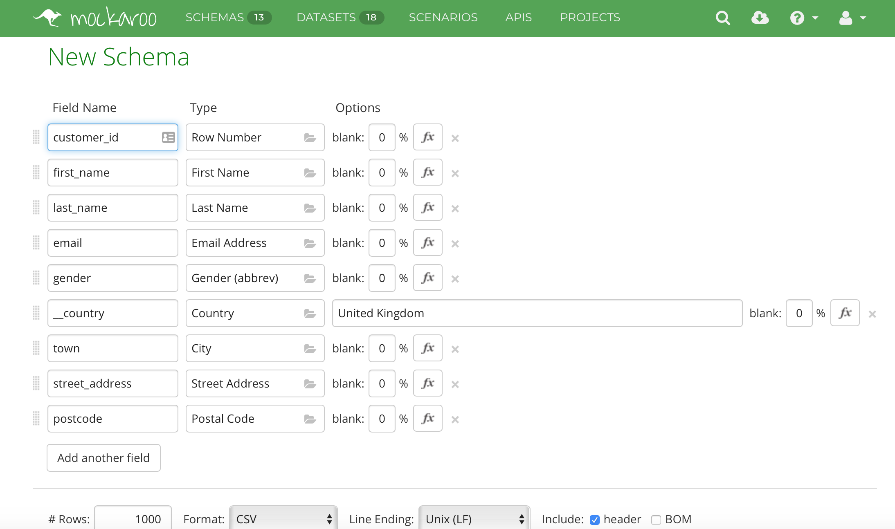
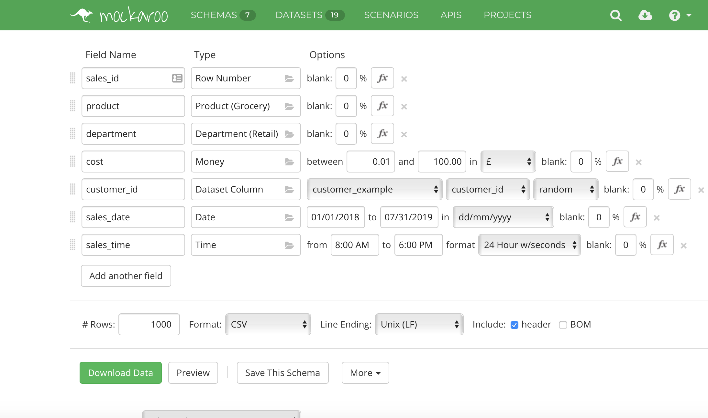
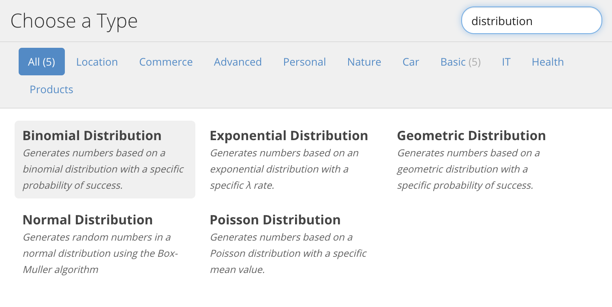
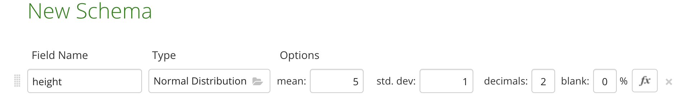
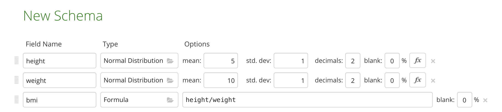

  
```{r setup, include=FALSE}
knitr::opts_chunk$set(echo = TRUE, fig.align = 'center')
```

# Learning Objectives<br>

* Know what synthetic data is
* Know some suitable applications of synthetic data
* Be able to create synthetic datasets with required formats and distributions

**Duration - 90 mins**<br>

# What is synthetic data?

Synthetic data is often called fake data, test data or simulated data. For today's purposes, we'll use them interchangeably.

The dictionary definition of synthetic data is given below:

<div class='emphasis'>
**Synthetic Data:** any production data applicable to a given situation that are not obtained by direct measurement
</div>
<br>

So, synthetic data is that we've "made up" or "faked" to look like real data.

When we say "looks like real data" we mean that it can be created to mimic real data in a number of ways:

* **Type:** It has the same type eg string, numeric, array, list, table as the real data
* **Format:** The data is formatted in the same way as the real data, be this email address, name, monetary value, currency etc.
* **Range:** The maximum and minimum values of the data can be made to be the same as the real data. It is also possible to push these boundaries to explore the applicability outside normal operating ranges.
* **Distribution:** The data and be made to mimic specific distributions, be they normal, linear, poisson etc. This will ensure that the volumes in bins match the real expected volumes. Again there is also the possibility to mimic slightly different distributions and test the effect this has on model performance.

There are a number of benefits of synthetic data:

* **No usage restrictions:** Real data may have usage constraints due to privacy rules or regulations. Synthetic data can replicate all important statistical properties of real data.
* **Create unencountered conditions:** Where specific situations have not yet been met in the real world, synthetic data is able to create these.
* **No data quality issues:** The synthetic data will only contain the data quality issues you decide to give it. No cleaning or imputing required.
* **Preserves multivariate relationships:** Synthetic data preserves the multivariate relationships between variables instead of specific statistics alone.

# Where is synthetic data used?

There are many valid use cases for synthetic data. The most common ones today are given below, but they will only continue to grow as scenario completeness and privacy become increasingly important.

## Software Testing

When we are testing software we need to create specific scenarios. This normally involves either looking for existing data that meets the specified test case requirements, or creating data that forces the scenario to happen. In the case of brand new software products, there is actually no existing data use, so there is no choice but to create synthetic data.

Often you will find that the development and staging environments have weaker security controls around them, which is another reason why it is not good practice to use production data in these environments.

## Clinical Trials

The use of synthetic data for healthcare is a growing industry. The benefits are obvious: patient confidentiality is maintained, there are no risks to the data being lost, whilst systems can be tested in a full range of scenarios.

There are still challenges around the validity of synthetic data to match real patient data but these are outweighed by the benefits. It is much more cost-effective, more flexible and customisable, whilst ensuring that it is possible to work with really large datasets. The data can also be made available openly and enable anyone with an interest in the topic to use the data to run their own projects. An example is the [Similacrum dataset](https://simulacrum.healthdatainsight.org.uk). This looks and feel like real cancer data.

## Training Machine Learning models

When we are training machine learning models there is the possibility that real data does not cover all the different possible scenarios. If the model has not been exposed to a certain scenario it won't have adapted to deal with that scenario.

The thought may be that want synthetic data to be as close to 'real' data as possible but by generating new data points that aren't the same as 'real' data we can introduce new information that could enrich the training of the model (if that is the purpose of synthesising the data). 

Financial services are already using synthetic data for fraud detection algorithms. This ensures that any personal financial data remains safe, whilst being able to test a wider range of scenarios, but also that the number of labelled fraud transactions is limited and so creating 'fake' fraud transactions can be used for training. 

Autonomous cars are also being trained on similar simulated roads to expand the testing with less risk to the public.

## Data Science Portfolio expansion

Although there are many open data sources out there for budding data scientists to practice their art, with synthetic data the options become endless. The data can be perturbed to introduce noise and models can be built and shared to showcase capabilities without any privacy or confidentiality risks.

For someone looking to expand both their data science capabilities and portfolio, synthetic data is a godsend. It is possible to have both enormous datasets and the required structure and data types to ensure the modelling is able to exhibit the required skills.

# Synthetic data for this course

As part of the dashboard projects you might have to create synthetic data. This is because the data is either sensitive and can't be shared on your Github (but we want you to be able to share your lovely dashboards!) or it might be accessed via an API (namely CodeClan Google Analytics) and the access to the data from this API is restricted and so we want to be sure you have data behind your dashboard to showcase it in the future.

For the purposes of the dashboard it is unlikely to be necessary that the synthetic data follows the same distributions etc. but it will need to be the same format, type etc. If you were to synthesis the data to follow a particular distribution (and so for example running a model on the 'real' and 'fake' data would yield similar conclusions more consideration would be needed that is necessary for populating our dashboards). 


# How do we create synthetic data?

There are a number of tools you could use - and we will cover two in this lesson. Firstly in R we can use the `synthpop` package (created by oresearchers at The University of Edinburgh) to create data that mimics an original dataset. And then we will look at Mockaroo - an online tool to mock up data from scratch. 

## Synthpop

Synthpop uses a dataset you already have to generate a synthetic dataset. Variables in the data are synthesised one-by-one:

* The first variable is sampled, from the 'real' data, with replacement to create a 'synthesised' version of that variable
* The second variable is generated by drawing from conditional distributions fitted based on the first synthesised variable. 
* And so on with the third variable, fourth variable, until all the variables are synthesised.

The user can specify the order in which variables can be synthesised and which modelling method is used to synthesise. At a high level the model learns the underlying patterns of variables that control the overall structure of the data.

There are lots of different parameters that can be changed within the function `syn()`, which we will be using the synthesis data. A few of the parameters we will be covering are:

* **visit.sequence**: this sets out the variables you want to synthesise (as it may not be all in the data) and the order you wish to synthesise them (since they are done one-by-one with sequential replacements). Any columns in the dataset you don’t specify in this argument will remain as in the original data and won't be synthesised. If nothing is specified in visit.sequence the default is to use the order left to right in the data. 
* **maxfactors**: the maximum number of factor levels a variable that is to be synthesised can have, with the default being 60. This maximum can be increased by increasing this argument but it may cause computational problems for factors with low occurances (will discuss this later). 
* **rules**: a named list of rules for restricted values. Restricted values are those that are determined explicitly by values of other variables.
* **rvalues**: a named list of the values corresponding to the rules specified by ‘rules’ argument. 


Let's try an example with 2 variables:

```{r, , library = FALSE, message = FALSE}
library(synthpop)
library(tidyverse)
library(CodeClanData)
```

Let's take a look at the `salary` dataset in the `CodeClanData` package, which gives salaries of different job types. 

```{r}
head(salary)
```

Let's assume we are only interested in the job_area and salary variables, and then let's plot the data:

```{r}
salaries <- salary %>%
                  select(job_area, salary)
                    
salaries %>%
  ggplot(aes(x=job_area, y=salary)) +
  geom_boxplot()
```

Let's assume this data is sensitive and we can't share this externally but we want to synthesise it to show some external clients the type of work we can do. Within the synthpop package we will use the `syn()` function to synthesise the data. 

```{r}
syn_sal <- syn(salaries)

syn_sal
```

The result gives us back information about the synthesising method:

* **Order of synthesis** - if we had specified a visit.sequence argument here then it would use the order we had specified, but as we didn't here it has used the default of listing variables left to right in the data, and has synthesised 'job_area' and then 'salary'. 
* **Synthesising methods** - 'job_area' was created by sampling with replacement and then for 'salary' a modelling technique was used based on the synthesised values for job_area. We could have specified a particular modelling technique here, but the default is CART (classification and regression trees). You can learn more about this in the help file `?syn`. 

So we want to pull out the actual synthesised data from this output and we so this by pulling out the 'syn' object:
```{r}
syn_sal_data <- syn_sal$syn

#let's check the summary statistics for this synthesised dataset compared to the original dataset
summary(syn_sal_data)
summary(salaries)
```

They look pretty similar. 

The synthpop package offers also tools to assess quality of the synthetic data sets. We can compare the two datasets using the `compare` function, which is part of the synthpop package. If we input the two datasets it compares the relative frequency distributions of each variable (in both table and graph form).   

This compare function can also be used if we run models based on both the sets of data we can compare the outputs (most cases would expect conclusions from model output to be same for both sets of data).
```{r}
compare(syn_sal, salaries)
```

And we would want to graph our new dataset to see if it looks reasonable. 
```{r}
syn_sal_data %>%
  ggplot(aes(x=job_area, y=salary)) +
  geom_boxplot()
```


<blockquote class='task'>
**Task - 15 mins** 

Let's take a look at IBM stock price data in the CodeClanData package. 

We are only interested in the opening stock prices and so only want to look at the variables date and open (we also want to covert the date column to be date format, as is a string in the data. We just do this to make adjusting the plotting easier):

```{r, , library = FALSE, message = FALSE}
library(lubridate)

IBM_stock_price_open <- IBM_stock_price %>%
                            select(date, open) %>%
                            mutate(date = dmy(date))
```

Now have a go yourself at synthesising the `IBM_stock_price_open` data yourself.

Compare the summary statistics of the original dataset with the synthesised one.

Plot the price over time. 

Does the synthesised dataset make sense?

What could we do to make more meaningful synthetic data?

**Hint**: think about the using the visit.sequence argument. 

Redo the synthesis to create more meaningful data.

<br>

<details>
<summary>**Answer**</summary>

```{r}
#Synthesising the open stock price data
open_syn <- syn(IBM_stock_price_open)

#extract the dataset
new_open <- open_syn$syn

#compare statistics
summary(IBM_stock_price_open)
summary(new_open)

#plot the comparisons
compare(open_syn, IBM_stock_price_open)

#plot of stock price over time for both sets of data
ggplot(IBM_stock_price_open, aes(date, open)) + 
  geom_line()

ggplot(new_open, aes(date, open)) + 
  geom_line()
```

```{r}
new_open %>%
  arrange(date)
```


The synthesised dataset doesn't make sense. We have multiple open stock prices for the same date! 

We don't want to synthesise the dates because otherwise we might end up with repeats entries for a given date, which doesn't make sense. Also the dates aren't likely to be sensitive so it's ok to keep these as is. So we don't list 'date' in the `visit.sequence ` argument and it won't synthesise it.

The main field we wish to synthesise is open price, keeping the same dates.

```{r}
#Synthesising the energy_scotland data
open_syn2 <- syn(IBM_stock_price_open, visit.sequence = c("open"))

#extract the dataset
new_open2 <- open_syn2$syn

#compare statistics
summary(IBM_stock_price_open)
summary(new_open2)

#plot the comparisons
compare(open_syn2, IBM_stock_price_open)

#plot of energy by sector over time
ggplot(IBM_stock_price_open, aes(date, open)) + 
         geom_line() 

ggplot(new_open2, aes(date, open)) + 
         geom_line() 
```

This is a simple example, with only one variable, so it will just be generated by sampling with replacement from the original open variable, but is an example that it may make sense to not synthesise all the variables in your data as it might mean the resulting data doesn't make 'sense' (for example you may only want one data entry per category/date). 

</details>
</blockquote>


## Missing data?
What happens if you have missing values in variables to be synthesised?

Usually it is better to synthesise variable first and then deal with missing values (e.g. replacing with mean/median, dropping rows etc.) because we want to mimic the observed patterns of missing data (in that missing data is a pattern in the data we want to synthesise). 

## Rules in the data?

You may have particular rules in the data and these can be written into the synthesis of the data. For example let's take a look at the salary data again. 

```{r}
head(salary)
```


In this company if you live in Shetland then you can only work in Legal, because the only department you have in Shetland is a legal one. This rule would hold true for the 'real' data because they are observed values. However we want to ensure it hold true in the synthesised dataset. (This is a simple example so may well hold true for the synthesised dataset because it only has a small number of variables and so this 'pattern' is learnt by the model, but with a more complex dataset with many variables we may run into cases in the synthesised data where someone in Shetland works in, say, Human Resources). 

We can set rules to ensure this rule holds true for any synthesised data. We would do this using the `rules` and `rvalues` arguments in `syn()`.

The name of the rule must match the name of the variable the rule applies to, in this case `job_area`. Our rule for our situation would be written as:

```{r}
rules_shetland <- list(job_area = "location == 'Shetland'")
rvalues_shetland <-  list(job_area = 'Legal')

syn_sal_data_rule <- syn(salary, 
                         visit.sequence = c('location', 'salary', 'job_area'), #we need to synthesise location before job_area since the rule for job_area is dependant on location
                         rules = rules_shetland , 
                         rvalues = rvalues_shetland)
```

Let's see if the rule worked:
```{r}
syn_sal_data_rule$syn %>%
  filter(location == "Shetland") %>%
  select(job_area) %>%
  group_by(job_area) %>%
  summarise(n = n())
```

## Many levels of a factor variable?
In the examples we have looked at, if we are synthesising a factor variable they have had a small number of possible values (e.g. job_area in the all_salaries data had 5 possible values). 

Issues may arise when you have a rare event, i.e. a small number of entries of a particular factor. 

Let's take the following dataset as an example, which has the city and gender for 10,000 people. 

```{r}
head(population)
```

Let's take a look at the spread of where people live:
```{r}
population %>%
  mutate(city = fct_rev(fct_infreq(city))) %>%
  ggplot(aes(x = city)) +
  geom_bar() +
  coord_flip() +
  theme(axis.text.y = element_text(size = 5))
```

```{r}
population %>%
  group_by(city) %>%
  summarise(n = n()) %>%
  arrange(n)
```

So see there are some cities with very low number of people i.e. rare event to live in this city. 

The sequence in which we synthesise the data is important here. If we use the city variable first, the model used to create the gender variable may overfit (due to the small sample of certain cities here) and so avoid this the variable with the low category counts should be the last to be synthesised.  

The `syn()` function has a maximum factor level of 60 to try to avoid rare event occurrences - you can adjust this restriction using the argument 'maxfaclevels'. However if some categories are very rare, even if you have less than 60 categories you may still run into computation issues. 

```{r}
#So instead of using the city variable (with rare events) to synthesis gender i.e.
#population_syn <- synthpop::syn(population, maxfaclevels = 65)
#which may take a very very long time to run (or never finish!), we will synthesise city based on gender:

population_syn2 <- syn(population, visit.sequence = c("gender", "city"), maxfaclevels = 65)
population_syn2
```


Some potential workarounds if you still have computational difficulties with rare events:

* If not all the factor levels are required for the synthesised data (in that it doesn’t need to follow exact pattern of underlying data) then could subset data to only include a certain threshold of the highest volume factors to reduce the number of factor levels while retaining as much of the data as possible. 
* Or you could combine the rare event categories in an 'Other' category, if that made sense for the data in question. 

## Person or company names?
What happens if have data with names of people/companies which are sensitive and even if synthesised sensitive information still remains. We will discuss more about anonomysation during GDPR & Privacy day in week 9. 

# Synthesising using sampling 

Let's take a look at the savings dataset

```{r}
head(savings)
```

Let's say we wanted to create some fake data which looks similar to this dataset (but doesn't necessarily follow the patterns of the original data). We can first create a set of a few examples of the character variables; names, genders, job areas and locations.  
```{r}
female_names <- c("Amy", "Bonnie", "Cara", "Dora", "Emmy", "Florence", "Gilly", "Helena", "India", "Jools")
male_names <- c("Angus", "Bert", "Charles", "Donald", "Ed", "Freddy", "Gord", "Harry", "Ivan", "Jimmy")
all_surnames <- c("Smith", "Taylor", "McKay", "Williams", "Cameron", "Jones")
all_genders <- c("Male", "Female")
all_job_areas <- c("Human Resources", "Sales", "Product Management", "Training", "Legal")
all_locations <- c("Edinburgh", "Glasgow", "Shetland", "Stirling", "Inverness", "Aberdeen", "Orkney", "Western Isles")
```

We can then use the `sample` function to sample each of these examples, with replacement. We can use random generator functions discussed during stats week, with the distribution chosen depending on what kind of variable it is (height/weight/age will likely be normal, where as salary may be more likely to follow a poisson distibution). Below is an example of how it can be done but we use different distribtuons and different parameters. 

```{r}
data_size <- 1000

savings_fake <- tibble(
  gender = sample(all_genders, data_size, replace = TRUE),
  name = if_else(gender == "Female",
                 sample(female_names, data_size, replace = TRUE),
                 sample(male_names, data_size, replace = TRUE)),
  surname = sample(all_surnames, data_size, replace = TRUE),
  job_area = sample(all_job_areas, data_size, replace = TRUE),
  salary = rpois(data_size, 20)*1000,
  age = runif(data_size, 18, 90) %>% round,
  retired = if_else(age > 65, "Yes", "No"),
  location = sample(all_locations, data_size, replace = TRUE),
  savings = 0.5*salary + (retired == "No")*20000 + 200*age + rnorm(data_size, sd = 10000) %>% round()
)

head(savings_fake)
```

This can be particularly handy for generating sensitive variables, such as names, which we wouldn't want to do using synthpop because it would still include the 'real' names, from the original data. 

# Mockaroo

There are also online tools to synthesise data. The most commonly used one is [Mockaroo](https://mockaroo.com). This has an almost unlimited library of different formats and more importantly allows you to create self-consistent data across multiple tables. For example, if you had a customer table with a customer_id and a sales table with a link to the customer_id of the customer that bought that product, then the sales table would contain valid customer_ids.

The only limitation to Mockaroo for the free plan is that only 1000 rows can be downloaded per query.

## Using Mockaroo to create our own data

We are going to create a customer table containing customer_id, first_name, last_name, email_address, gender (M/F) and address fields for UK addresses.

```{r, echo=FALSE, out.width = '80%'}

```
<br>

The nice thing about Mockaroo is that there is self-consistency between some of the fields. Female names give female genders, UK country gives UK town names.
To get a UK place name, you need to create a country field, above where it will be used. However, if you don't want this field in your final output, put two underscores `__` before the field name and it will be missed out.

To create self-consistent links between tables, the schema needs to be saved and the related dataset downloaded. The dataset then needs to be uploaded and saved as a dataset in your Mockaroo account. 

When creating the new table, set the variable type set to "Dataset Column", where the dataset and column can then be selected.

<blockquote class='task'>
**Task - 10 mins** 

Create a Mockaroo account.

Create a sales table, linked to the customer table containing:

* sales_id
* product
* department
* cost (in £s)
* customer_id
* sales_date
* sales_time

Remember the date must be in the past and the customer_id should be consistent with the customer table.

<details>
<summary>**Example Answer**</summary>

```{r, echo=FALSE, out.width = '100%'}

```

</details>
</blockquote>

A few other things to point out about Mockaroo: 

* You can use it to mock an API (more info https://mockaroo.com/mock_apis)
* You can specify that want a variable to follow a particular distribution, by selecting this as the variable type:

```{r, echo=FALSE, out.width = '80%'}
  
```

And then you can specify the distribution parameters, such as mean and standard deviation:

```{r, echo=FALSE, out.width = '80%'}
  
```

* You can specify formulas (like rules in synthpop), where you can use other fields as part of your formula. For example

```{r, echo=FALSE, out.width = '80%'}
  
```

When you specify the variable type as 'Formula' and it provides a helpful list/explanation of different formulas you can use. 


# Recap

What parameters help to define synthetic data?
<details>
<summary>**Answer**</summary>
Type, format, range and distribution
</details>

What are the benefits of using synthetic data for software testing?
<details>
<summary>**Answer**</summary>
More secure and real-data may not exist for required scenarios
</details>

What package can you use in R to synthesise data?
<details>
<summary>**Answer**</summary>
`synthpop`
</details>

What steps do we need to undertake to create linked tables in Mockaroo?
<details>
<summary>**Answer**</summary>

* Save the schema
* Download the dataset
* Upload the dataset
* Use the Dataset Column type to select the dataset and variable to link
</details>

# Additional resources

* [Waymo: driverless car simulation data](https://www.theverge.com/2018/7/20/17595968/waymo-self-driving-cars-8-million-miles-testing)

`synthpop`

* [synthpop CRAN page - with links to reference manial and vignettes](https://cran.r-project.org/web/packages/synthpop)

* [R-bloggers article](https://www.r-bloggers.com/generating-synthetic-data-sets-with-synthpop-in-r/)

Mockaroo

* [Mockaroo website](https://mockaroo.com)

* [Mockaroo training YouTube channel](https://www.youtube.com/playlist?list=PLKMZcxOsC3u0Y-4CHg5SDpVjTcrvGttTt)


