```{r setup, include=FALSE}
knitr::opts_chunk$set(echo = TRUE, fig.align = 'center')
```

# Learning Objectives

* Know about Git naming conventions
* Be able to create and move between branches
* Be able to use Githubs tools to manage branches

**Lesson Duration - 45 mins**

We have been using GitHub as a versioning tool to enable us to go back to previous versions of our code. Git has a feature called branching that allow us to create parallel versions of our projects, so as to ensure we always have a stable version readily available. GitHub also has a whole host of features that allows developers to collaborate on projects, working on the code simultaneously.

# Branches

Until now we have been working on one branch, the "master" branch. In a Git initialised directory, you will see the word "master" after the directory name in the terminal. This is the default branch that is created when we initialise a new Git repository. Every time you have been committing your changes, you have been committing to master. You have then been able to use git commands to go back to a previous version of your code. One problem with this process is that it can be difficult to find the commit relating to the version you want to go back to. Branches help with this problem.

## The Master Branch

In addition to being the default branch, master typically represents the current "live" version of your project. If a client wanted to download a copy of your project, the master branch should be what they get. With that in mind we want to ensure that master only ever contains stable, working code.

## The Develop Branch

A common practice is to have a "develop" branch available at all times. This branch will contain the code for the next version of your project, updated every time a bug is fixed or a new feature is added. It shouldn't be publicly available in the same way as master is, but should still only contain working code.

## Feature Branches

Feature branches are for what their name suggests: adding new features. Those features usually each have their own branch, which are normally called something like `feature/feature_name` and are deleted when work on the feature is complete. These represent work in progress, and while it's not ideal to commit broken or buggy code it's not unusual to do it on a feature branch.

## Fix Branches

Once again, these do what they say on the tin. If a bug needs fixing then it should be done on a fix branch called `fix/description_of_bug`. Like feature branches, these are temporary and should be deleted when done with. Deleting branches like this is an example of **git hygiene** and means that we don't have a repository cluttered with stale branches.

# Merging

When we **merge** two branches together, we integrate the code from one into the other. For example, when we have completed a feature on its feature branch we want to integrate the code into the develop branch. Sometimes Git can do the integration process automatically for us, but when there have been changes made on both branches Git may not know which lines to keep and which to discard. That results in a **merge conflict** which has to be resolved manually. This is a common problem when working collaboratively with different people working on different branches simultaneously, and learning how to handle conflicts when they appear is an important part of learning how to use Git.

The principle of merging branches is to first merge the stable branch (e.g. develop) into the potentially unstable branch (e.g. feature) so that any conflicts can be dealt with there. Once you are sure your feature branch is stable, you can merge it into develop. This ensures the stable branch remains stable. The history of both branches is retained, meaning we can still revert to any point from either branch. This can be dangerous though, since reverting to a pre-merge commit will almost certianly result in important chunks of code disappearing.

# Practicing Working With Branches

We're going to create some branches and practice merging them. We'll engineer a conflict so you can see how it works. First though, we need to do the basics

**Master branch**

1. Create a local directory called `functions_with_git` and initialise git inside it
2. Create a new notebook inside the directory. We've called ours `functions_with_git.Rmd`.
3. Commit the changes

**Develop branch**

1. Create a develop branch off of master - `git checkout -b develop`. (The `-b` flag indicates you are making a new branch, and it is followed by the name of the branch. This command will move you into develop, so you will see the word 'develop' in your terminal, next to the directory name.)

```{r, echo=FALSE, fig.cap="Our first branch", out.width = '50%'}
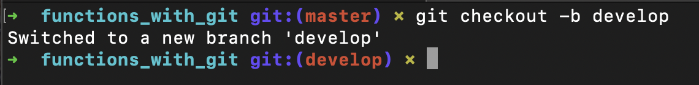
```

2. Add the following to `functions_with_git.Rmd`:
```{r eval=FALSE}
number1 <- 1
number2 <- 2
number3 <- 3
```

```{r, echo=FALSE, fig.cap="Starting the file", out.width = '50%'}
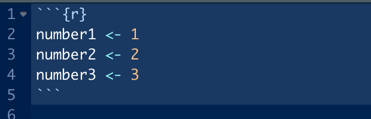
```

3. Add and commit your changes. These changes have **only** been committed on the develop branch -- the master branch has not been affected.

<div class="emphasis">
When you move between branches, RStudio will automatically update to display the state of the current branch. If you now switch to master, the changes you have just made will not be displayed in the editor. Then when moving back to develop, they will appear again.
</div>

**Feature branch**

We want to work on a new feature, but we don't want to do it on develop where our changes might break something. We're going to make another branch to work on it safely.

1. Create a new new feature branch - `git checkout -b feature/more_numbers` - notice we are branching off of the develop branch, so our new branch will be the same as develop.

```{r, echo=FALSE, fig.cap="Another branch", out.width = '50%'}
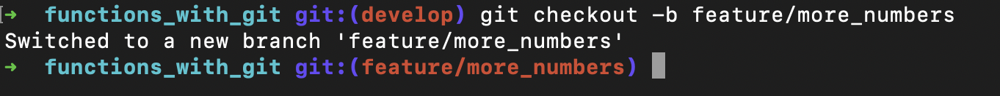
```

2. Add some more numbers:
```{r eval=FALSE}
number4 <- 4
number5 <- 5
```

```{r, echo=FALSE, fig.cap="More numbers", out.width = '50%'}
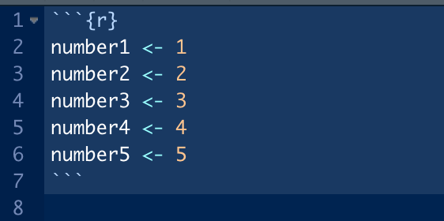
```

3. Add and commit the changes

**Merging**

Now that our feature is complete we can add it to our develop branch. 

1. We want to make sure our change won't cause any problems before we add it to develop, so we first check on our feature branch. While still on the feature branch we merge develop into it using `git merge develop`.
2. At this point you should see a message saying "already up to date". That's because there haven't been any changes to develop since we branched off it, but we still needed to make sure!

```{r, echo=FALSE, fig.cap="Up to date!", out.width = '50%'}
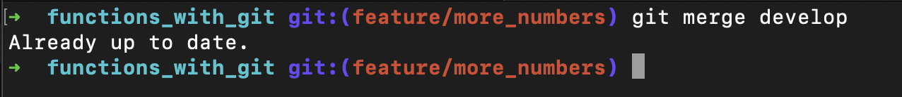
```

3. Switch back to the develop branch with `git checkout develop`
4. Merge our feature branch in with `git merge feature/more_numbers`. You should see a message like the one below showing that your merge has "fast-forwarded" the develop branch.

```{r, echo=FALSE, fig.cap="Success!", out.width = '50%'}
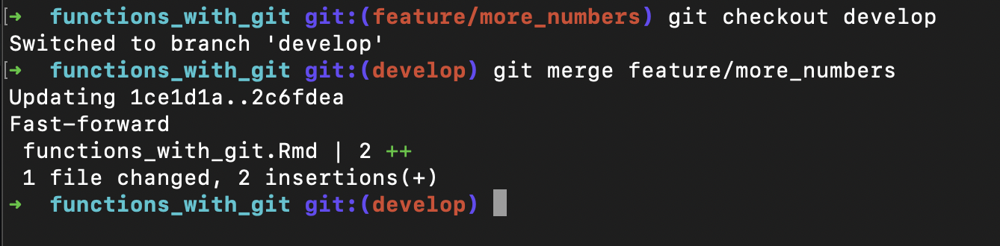
```

<div class="emphasis">
**This is a bit more theoretical, and not essential to understand!**

<h2>Types of Merging</h2>

Git handles merges in different ways, depending on what's happened to the files it's working with. Each commit is time-stamped and this information is used in figuring out how to process a merge.

The most common (and easiest to work with) is the **fast-forward**. This happens in situations like ours above where we merge a branch into another which has had no new commits since the branch was created from it. In our example we committed to develop, created our branch, worked on it and then merged it back in, but _didn't do anything on develop between creating and merging_. Git knows that all of the commits made on the branch are newer than anything on develop, so merging _fast-forwards_ develop to include the newer commits. This is also what happens every time you `git pull` your classnotes, since you're not committing anything locally while the instructors are frequently making changes.

The second type of merge you may see is the **recursive** merge. We would have seen a recursive merge earlier if we had made a commit on develop between creating and merging the branch, _assuming the commits didn't affect the same lines of code_. Git is able to look at the timestamps of the commits, figure out which order changes were made in and reconstruct how the files should look. If commits _do_ affect the same lines we get a merge conflict, which we'll look at next.
</div>

5. Delete your feature branch with `git branch -d feature/more_numbers`. Tidying up in this way helps keep our code manageable, but **be careful**! Just like certain other CLI commands (I'm looking at you, `rm -rf`) it's possible to do some serious damage here, like accidentally deleting your master branch.

```{r, echo=FALSE, fig.cap="Our branch has gone...", out.width = '50%'}
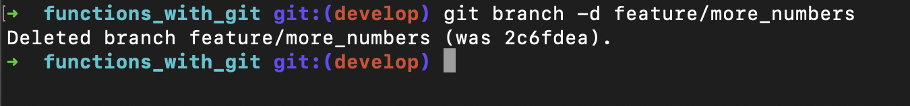
```

**Merging with Conflicts**

So far we haven't had any issues with branching and merging, so you may be wondering why we're bothering? Up to this point we haven't given an accurate representation of what working with Git is like. Out in the real world it's likely that there will be more than one person working on a project, each with their own branch(es). Let's manufacture a situation where two people's work might conflict.

1. Ensure you're on the develop branch - `git checkout develop`
2. We're going to add some functions so that we can do something a bit more interesting with our numbers. Create a branch to let us total them up with `git checkout -b feature/sum`
3. In RStudio add the `sum()` function, passing it our numbers

```{r, echo=FALSE, fig.cap="Getting the total", out.width = '50%'}
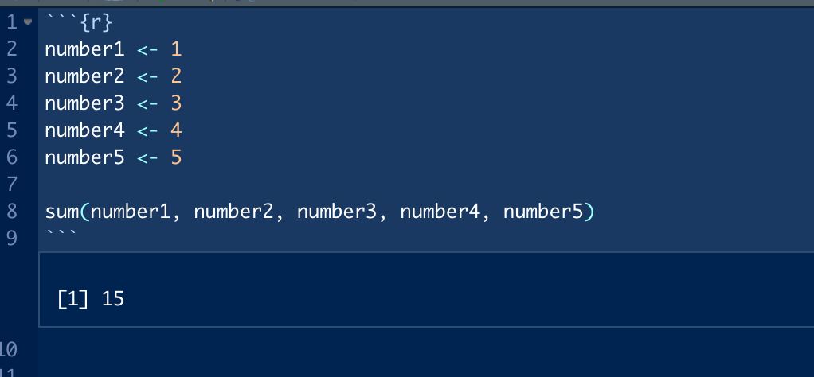
```

4. Commit your changes
5. Switch back to the develop branch so we can make another branch -- **don't merge yet**
6. We've decided that adding stuff up is a bit boring, let's find the product instead. Make a branch called `feature/product`
7. Write an equivalent line using `prod()` rather than `sum()`, then commit your changes

```{r, echo=FALSE, fig.cap="Getting the product instead", out.width = '50%'}
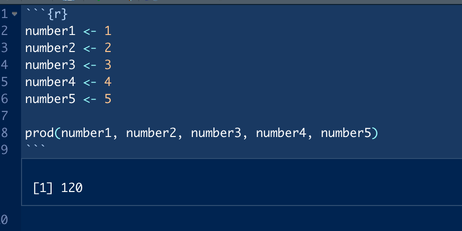
```

8. Merge your `feature/product` branch in the same way as you did with your previous branch. You shouldn't encounter any problems. Remember to delete the branch!

```{r, echo=FALSE, fig.cap="Successful merging", out.width = '50%'}
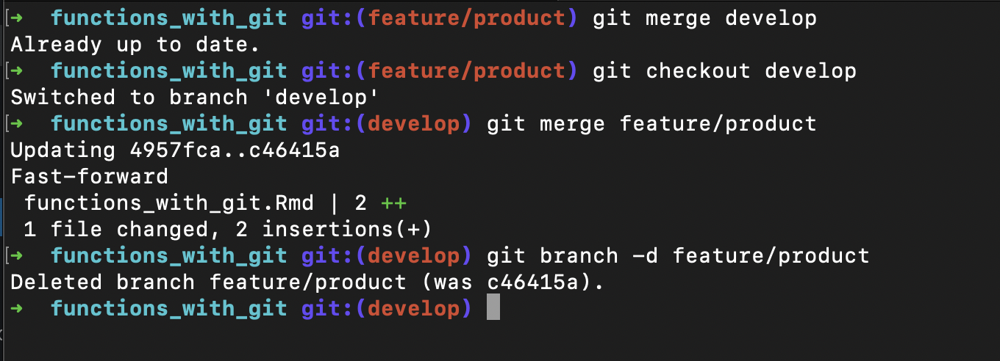
```

9. Now switch back to `feature/sum`
10. Merge develop into your branch. Having problems?

```{r, echo=FALSE, fig.cap="Uh oh...", out.width = '50%'}
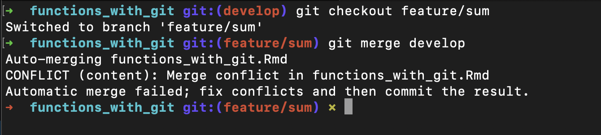
```

We've had our first **merge conflict**. This has come about because Git doesn't know which version of the code to use, since they have come from different branches. Note that this is only a problem because we've touched the same line; if all `feature/product` had done was add new code we wouldn't have a problem.

11. We now have to decide which version we want to use. If you switch back to RStudio you'll see some interesting new additions to the code:

```{r, echo=FALSE, fig.cap="RStudio isn't too happy", out.width = '50%'}
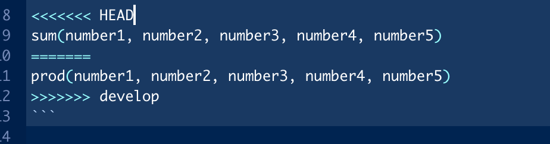
```

The most obvious issue is that all of our code is now present, but we've also got some stuff we didn't write. The two lines beginning with angle brackets (`<` and `>`) denote the start and end respectively of the parts of the file which are causing the conflict. The line with the equals symbols (`=`) shows where one version ends and the other starts.

You'll also see the words `HEAD` and `develop` after the brackets: those indicate which branch each bit of code has come from. `HEAD` is the branch your are **currently on**, in this case `feature/sum`. The other indicates the thing we are trying to merge in, which is our `develop` branch here. This will usually be the name of a branch, but may also be a commit number.

To decide which bit we want to keep we need to manually edit the file to remove the unwanted code. We don't have to completely remove one block or the other; in fact, it's quite common to keep parts of each block. The important bits to remove are the added symbols though: leaving them in will cause errors, assuming Git even let's you try to commit it. Note that it's important to test your code to make sure you didn't accidentally break something!

<div class="emphasis">
This is actually a fairly clunky way of doing things. There are some programs, such as the text editor Atom which is installed on your laptops, which have tools built in to manage conflict resolution.
</div>

12. Commit the merged changes. Typically these commits have a message like "fix merge conflicts".
13. Switch to develop and merge our fix branch.

```{r, echo=FALSE, fig.cap="Fixed!", out.width = '50%'}
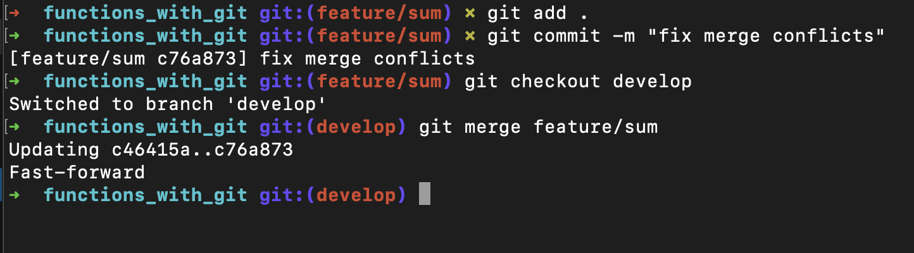
```

14. Repeat the process to merge develop into master.

Now our file is ready to be released to the world! 

<div class="emphasis">
Note that we don't delete the develop branch when we merge it into master. That's because we'll still need it when we start work on the next version.
</div>

<div class="emphasis">
The process of merging and handling conflicts can also be done on Github, so long as the branches involved have all been pushed to the remote repository. Many people prefer working in this way as there are tools available to request reviews from collaborators, make references to logged issues and provide better documentation. See the link below for more information.
</div>

Keeping track of where all the branches have come from and gone to can be quite confusing, but Github has a tool available to help in the form of the **network graph**. It shows all the branches and highlights at which point they were created and merged, and can be hovered over to show branch names and commit messages.

```{r, echo=FALSE, fig.cap="Network graph for the course notes", out.width = '100%'}
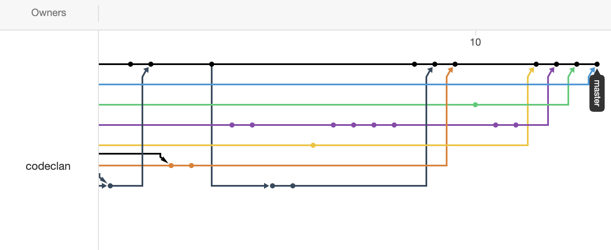
```

# Conclusion

You have now followed a work-flow that enabled you to simultaneously have multiple people working on the same project using branches, ensuring that you always have two stable versions of the code (on the master and develop) branch. This means that at any point in time during development you always have a working application.

# Additional Resources

* [Merging on Github using pull requests](https://help.github.com/en/articles/about-pull-requests)