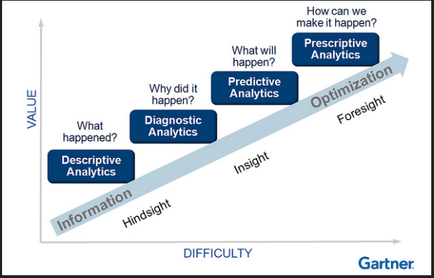
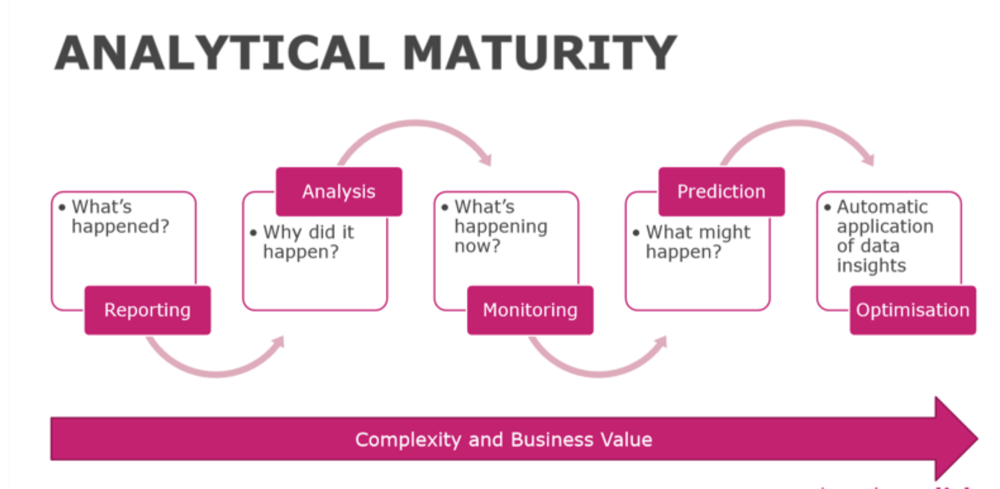
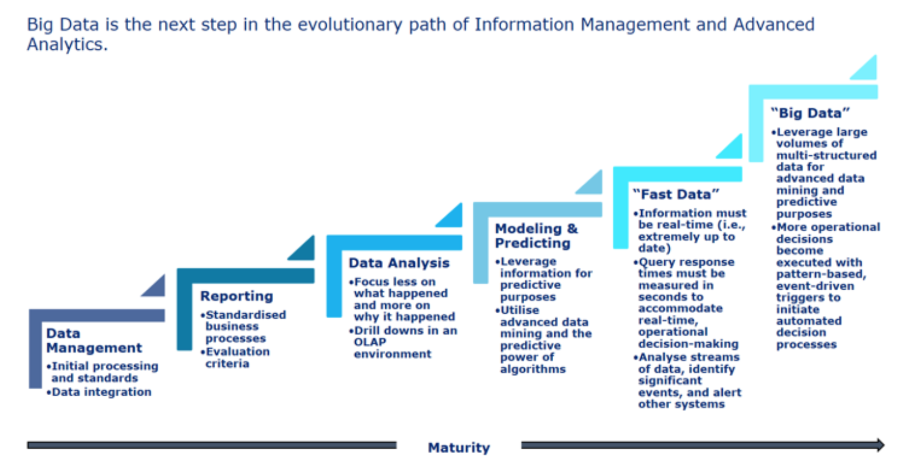
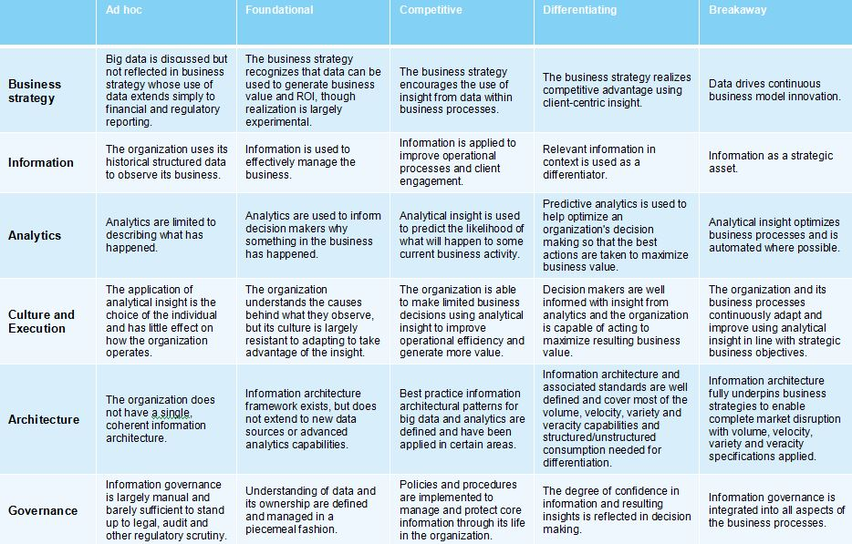
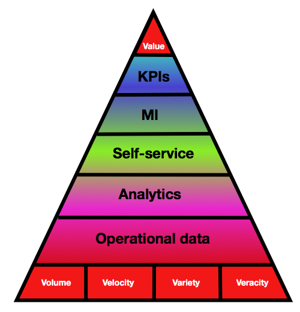

  
```{r setup, include=FALSE}
knitr::opts_chunk$set(echo = TRUE, fig.align = 'center')
```

# Learning Objectives<br>

* Know the definition of descriptive analytics
* Understand why reporting is critical to a business
* Know the different types of report and who uses them

**Duration - 20 mins**<br>

In this lesson we're going to discuss what we mean by descriptive analytics and where it sits in the Data Science maturity model. We'll look at different maturity models, discuss how businesses use reports, data and information.

# Maturity models and descriptive analytics

Maturity models are popular as they help companies to identify how advanced they are, allowing capability gaps to be spotted and addressed. The Gartner Analytics maturity model has been very popular over the last few years and splits the evolution of analytics into four broad parts:

* Descriptive Analytics - **what** happened?
* Diagnostic Analytics - **why** did it happen?
* Predictive Analytics - **what** will happen?
* Prescriptive Analytics - **how** can we make it happen?

So Descriptive Analytics focuses on what has happened. This generally involves looking at historical data and aggregating or summarising it, to provide a view of what was going on, at either a point in time, or over a period. This summarised view is normally in the form of either single numbers (metrics) or graphs, which show patterns. We shall discuss metrics in much more detail in the next lesson. 

```{r, echo=FALSE, fig.cap="Gartner Analytics Maturity Model", out.width = '100%'}

```

There are many other similar models to Gartner's out there.

```{r, echo=FALSE, fig.cap="Nice simple maturity model", out.width = '100%'}

```

This one is even simpler and implies that each stage leads into the next.

```{r, echo=FALSE, fig.cap="Deloitte Maturity Model", out.width = '100%'}

```

The Deloitte model adds a few more stages, but it is essentially the same. One thing they all agree on is that descriptive analytics or reporting focuses on what has happened.

In reality it isn't really a maturity ladder, as companies really should be carrying out activities in all these areas. Since most companies, if they do any analysis at all, never do anything other than Reporting, its generally considered an earlier step in the maturity of an organisation.

Another model here from IBM, reviews the organisation maturity across a number of different areas:

```{r, echo=FALSE, fig.cap="IBM Big Data Maturity Model", out.width = '100%'}

```

<blockquote class='task'>
**Task - 5 mins** 

Have a look at each of the previous maturity models.
Discuss amongst yourselves which do you prefer?
And why?

<details>
<summary>**Answer**</summary>
There isn't a right answer. However many people prefer IBM's as it is clearer what stage of maturity you are at and this can be different across different departments, or for different capabilities.
<br>

</details>
</blockquote>

# Information requirements across a business

## Data in levels of the business

Depending what level you are at within a business affects what level of information you look at or need. A rough summary of who needs what is given below:

```{r, echo=FALSE, fig.cap="Operational Data Requirements", out.width = '60%'}

```

From the top down:

1. top of the organisation - the key metrics (**KPIs**) are monitored to show progress and drive the business forward 
2. layer of **management information** (MI) to understand the business at a more detailed level
3. layer of **self-service analytics** whereby every single employee acts as an armchair analyst understanding their own area of the business in detail
4. below this sits **true analytics**, consisting of predictive models and machine learning 
5. all these sit on top of the widest base of **operational data** (4 Vs).

To deliver organisational **value** and provide an effective **data-driven business** all the intermediate elements should be in place. 

## Reporting at different levels

* KPIs and MI layers (layer 1 & 2) are generally **explanatory** reports - that means that the information is fixed. 
* Self-service layer (layer 3) should be **exploratory** reports - where the user is able to drill down into the detail and find out what is going on.

Most visualisation tools enable the creation of both explanatory and exploratory reports.

**Audience is key** when developing any type of report, the key is to understand **who it will be used by** and how it will be used and design the report accordingly. Don't expect the CEO to be happy to twiddle with sliders or dials. They will want the key information that they need to look at every day, clearly laid out in front of them. 

# Recap

What are generally accepted as the four key types of analytics?
<details>
<summary>**Answer**</summary>

* Descriptive Analytics
* Diagnostic Analytics
* Predictive Analytics
* Prescriptive Analytics
<br>
</details>

Why type of report would a CEO want to be shown?
<details>
<summary>**Answer**</summary>
An explanatory report
</details>

Who's responsibility is it to look at reports within an organisation?
<details>
<summary>**Answer**</summary>
Everyone's, though what they look at might differ depending on their role.
</details>

<hr>

# Additional resources

* [Storytelling with Data](http://www.storytellingwithdata.com)
* [Data stories podcast](https://datastori.es)
* [IBM Big Data & Analytics Maturity Model](https://www.ibm.com/developerworks/community/blogs/bigdataanalytics/entry/big_data_analytics_maturity_model?lang=en)


