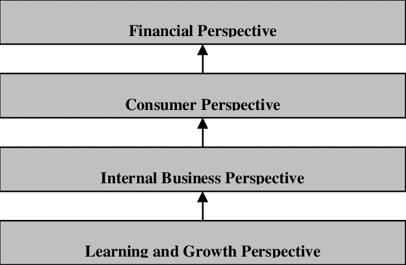
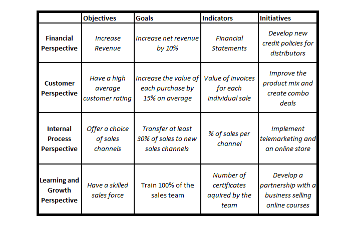
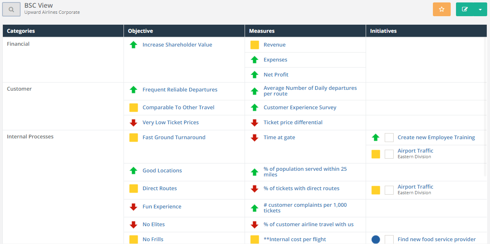

  
```{r setup, include=FALSE}
knitr::opts_chunk$set(echo = TRUE, fig.align = 'center')
```

# Learning Objectives<br>

* Know how a balanced scorecard is composed
* Be able to create a balanced scorecard

**Duration - 30 mins**<br>

In this lesson we'll consider reporting, the audiences and how the reports should be constructed. We shall focus on the creation of a balanced scorecard to cover these areas.


# Balanced scorecards

We are now going to look at a specific report type - a balanced scorecard. These scorecards are a popular strategic management tool, or reporting framework, as they ensure that a business focuses on both short and long term goals, the **balanced** approach. By doing this, short-term financial objectives do not outweigh the longer-term non-financial objectives.

The advantages for a business in using a balanced scorecard approach is that they ensure that progress is aligned to strategy, they can measure and monitor that progress and then prioritise activities more easily.

A top-down approach is taken to develop a balanced scorecard. Once the mission or vision of the business is clarified the next step is to identify the strategic objectives. 

## Perspectives

```{r, echo=FALSE, out.width = '60%'}

```

A balanced scorecard contains 4 key perspectives:

* **Financial:** Financial performance - are you doing well by your shareholders?
* **Customer:** Customer satisfaction - do your customers like your products and services?
* **Internal Processes:** Business efficiency - can you efficiently deliver what your customers want?
* **Organisational Capacity/Learning and growth:** Knowledge and innovation - can you continue to improve and create value?

The perspectives are **not independent** and the **ordering matters** with each building on each other. 

If you train your employees and build a culture of information sharing (Learning and Growth) ... they’ll make your company run more smoothly (Internal Business Processes) ... a better running business takes better care of its customers (Customer) ... and happy customers buy more of what you’re selling (Financial).

### Elements of perspectives

Each perspective consists of :

* **Goal:** a concise outcome to be reached within a specific timeframe
* **Strategic objective:** measurable step you take to achieve a goal
* **Measures (or KPIs):** how do I know I'm achieving the objective?
* **Initiatives:** what actions am I taking to accomplish the objective?


Below is a hypothetical strategy map for a brewery showing the strategic objectives aligned to the perspectives:

```{r, echo=FALSE, fig.cap="Strategic map for a craft brewery", out.width = '100%'}

```

#### Strategic objectives 

Strategic objectives should...

* Begin with a **verb** (such as improve, increase, reduce) 
* Be **endless** (going to care about them for a while, not just a one-off event) 
* Be **measurable** (no use caring about something don't have any data for)
* Be **actionable**  (no use caring about something won't be able to affect the outcome)


#### KPIs
* identify the KPIs that support the strategic objectives. 
* each strategic objective has one or two KPIs but no more (if too many KPIs are monitored, then they probably aren't really 'key') 
* careful not to identify a KPI just because it is already monitored or the data access is simple. Make sure they really support the strategic objective

#### Initiatives
* the actions or projects that will be undertaken to drive progress on the strategic objectives 
* are measured by the KPIs 
* is not expected to have an initiative for every KPI 

Often in companies incentives are financially biased. By using this framework it is also easier to develop incentives that link across all the perspectives. For example, in the brewery example above, incentives could be given for undertaking training courses.

### Example
Here is an example of the balanced scorecard for a hypothetical airline:

```{r, echo=FALSE, fig.cap="A strategy map", out.width = '100%'}

```

# A balanced scorecard for CodeClan

<blockquote class='task'>
**Task - 15 mins** 

We are now going to practice what we have just learnt by jointly creating a hypothetical balanced scorecard for CodeClan. 

You have been here for a few weeks, so you should be familiar enough with CodeClan as a business to be able to make some sensible guesses around strategically important areas.

* Split into 4 groups and each group take one of the perspectives.
* For your perspective, identify the strategic objectives, ensuring they begin with a verb and are endless, measurable and actionable.
* For each objective identified, use your newly acquired KPI defining skills to define one or two KPIs, remembering to create clear definitions, SMART targets, identify data sources and owners.
* Finally, if you feel there are initiatives that should be identified, document these against each KPI.

</blockquote>

# Recap

What are some of the advantages of using the balanced scorecard framework?
<details>
<summary>**Answer**</summary>

* They ensure that progress is aligned to strategy
* They can measure and monitor that progress
* Allow easier prioritisation
<br>
</details>

What is the first step in defining a balanced scorecard?
<details>
<summary>**Answer**</summary>
Identify the business goals or strategic objectives
</details>

What is the purpose of the Internal Process perspective?
<details>
<summary>**Answer**</summary>
It ensures that you can efficiently deliver what your customers want
</details>

# More resources

* [An overview](https://balancedscorecards.com/balanced-scorecard/#learn-overview)
* [Bernard Marr](https://www.bernardmarr.com/default.asp?contentID=968)
* [A nice clear video](https://youtu.be/OZtNk__7Qyg)


